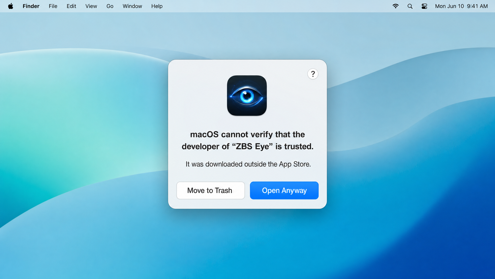

<div align="center">


# ZBS Eye

**Eternal memory for your Mac.** Continuously records what happens on your computer — and lets you
find any moment in seconds. 100% local, no cloud, no account.

> 👁 **One Eye to remember them all.**
> It sees every screen. It hears every sound. It keeps everything.
> And it tells no one — because all of it stays with you.

</div>

---

## What it is

ZBS Eye quietly keeps an "eternal memory" of your work at the computer:

- **Screen** → accessibility text (accurate and battery-friendly) + OCR where AX is unavailable, frames in HEIC.
- **Audio** → system audio (calls, meetings, video) and microphone → on-device transcription.
  **Meetings-only by default**: audio is captured only while a call is detected (a meeting app is
  using the mic), the engine is fully off otherwise — saving disk. Switch to always / off, or force
  it on/off from the menu bar.
- **Search** → hybrid full-text + semantic (cross-lingual: search in one language, find another),
  a scrubbable timeline, frames served as images.
- **Access for AI agents** → a local REST + MCP surface so LLMs/agents can work with your memory.

Everything stays on the device. No egress, no subscription, no account.

## Why

The "personal computer memory" category was orphaned: the leader was acquired by a big corporation, and
the nearest alternatives moved to a subscription ($25–50/mo) plus a mandatory cloud. ZBS Eye is a light,
native alternative that **never goes to the cloud** — your activity history is too personal to hand off.

| | ZBS Eye | proprietary alternatives |
|---|---|---|
| Cloud / account | ✅ not required | ❌ mandatory |
| Subscription | ✅ free | ❌ $25–50/mo |
| Accumulated memory | ✅ yours, local | ❌ behind a paywall |
| Stack | ✅ native Swift/SwiftUI | ❌ web wrapper (Electron/Tauri) |

## Features

- 🎥 **Screen capture** — AX text + OCR, HEIC, perceptual-hash dedup, adaptive per-app (AX where it works,
  OCR where it doesn't).
- 🎙️ **Audio + transcription** — system + microphone, VAD, on-device speech. **Meetings-only by
  default** (auto-detected on-device) — records during calls, off otherwise to save disk; always / off
  modes + a menu-bar force on/off.
- 🔍 **Hybrid search** — FTS5 + multilingual-e5 (384-dim) via RRF; cross-lingual.
- 🕰️ **Timeline** — scrub through time, frame + text + app/URL, a player.
- 🔌 **REST + MCP** — a local API (127.0.0.1, Bearer token) for agents; MCP over stdio.
- ♾️ **Storage** — forever by default; **move to an external SSD** in one click;
  **iCloud auto-backup** (a compressed snapshot, without uploading the live database); size tracking.
- 📥 **Import previous history** — bring your accumulated history (text + metadata) over.
- 📝 **Automations** — daily summary to a file/Obsidian; export.
- 🔒 **Privacy** — pause per app, delete by time range, all local.
- 📊 **Usage stats** — an on-device breakdown of the last 7 days: where the time actually went (browsers
  split by **real site**, not lumped as one app), active minutes/day, context switches, busiest hour.
  Front-and-center on the Daily Insights screen.
- 🧭 **Daily Insights** — a daily local-LLM read of your activity (2–3 concrete observations), on-device.
- 🛠️ **Self-repair** — something broke? Describe it and Eye hands **your own AI agent** a ready-to-run
  fix prompt (it reads the public source and fixes it), or opens a pre-filled GitHub issue. No dead ends.
  Reachable from a **main-window button**, the **menu bar**, and Settings; agents can also pull live state
  over MCP (`get_diagnostics`).

## Install

<div align="center">

</div>

**ZBS Eye is not in the Mac App Store — and can't be.** Reading other apps' screens (cross-app
Accessibility) and a "record everything" profile don't fit the App Sandbox the App Store requires. So
macOS may show the dialog above on first launch. **It's expected and safe — click "Open Anyway"**
(it's outside the App Store, not malware). Want certainty? **Ask your own agent to read the source and
do a security review first** — it's all here, nothing to hide.

**Release — notarized Developer ID (double-click to launch, no "Open Anyway"):**

1. Build it: `bash scripts/build-notarized.sh` (needs a "Developer ID Application" certificate +
   a notarytool profile — one-time setup in [`docs/NOTARIZE.md`](docs/NOTARIZE.md)).
2. Unzip `dist/ZBSEye-notarized-*.zip` into `/Applications` and launch with a **double-click**
   (Gatekeeper passes it, even offline — the ticket is stapled).
3. Grant **Screen Recording** + **Accessibility** (optionally Microphone) once. The notarized signature
   is stable: rebuilds do NOT reset permissions.

**Dev build without a paid account (self-signed):** `bash scripts/make-signing-cert.sh` (once) →
`bash scripts/build-release.sh` → unzip into `/Applications` → launch → **System Settings → Privacy &
Security → "Open Anyway"**. Downside: changing the signature sometimes resets TCC permissions (notarization removes this).

**Full product description** — [`docs/ABOUT.md`](docs/ABOUT.md). Build details — [`BUILD.md`](BUILD.md).
Architecture and contributor/agent guide — [`AGENTS.md`](AGENTS.md). Distribution — [`docs/NOTARIZE.md`](docs/NOTARIZE.md).

## Privacy

- Everything on the device. The server listens only on `127.0.0.1`; everything except `/health` requires
  a Bearer token (in the Keychain). No outbound traffic.
- The iCloud backup (optional, on by default if iCloud is present) goes out as a **compressed snapshot** —
  the live database stays local (you must not put a live SQLite file in iCloud Drive — corruption).
- A password or sensitive conversation captured by accident can be wiped by time range or by app.

## Tech

Swift 6 (strict concurrency), SwiftUI, macOS 15+ · GRDB (DatabasePool + WAL) + FTS5 + sqlite-vec ·
ScreenCaptureKit · Accessibility API · Vision OCR · SFSpeech · multilingual-e5 (swift-embeddings) ·
FlyingFox (REST) · MCP swift-sdk · Hardened Runtime without App Sandbox.

## Status

Working: capture (screen + audio), hybrid search, timeline, REST + MCP, import of previous history,
retention (forever by default), relocatable storage, iCloud backup, size tracking, daily summary,
export, "Ask" (RAG over a local LLM — model picker from LM Studio/Ollama). Distribution — **notarized
Developer ID** (`scripts/build-notarized.sh`). Deferred: a test target (XCTest).

## License

Private project `zbs-gg`. © 2026.

---

<div align="center">

```
                              -==++=::.
                               :=##%###+=:
                                 .:+#@%%%#=:
                :-==++++++=---===:..:-#@@%%*:
             :+*#*+++++===+*####*++=:.:-#@##*:
           -*#+=====------==++*#%%***=:.:=%*+=
         .*#=-==---::.. .:--===++*@%++:   :*=--
        .*#--+::-.          :=--+++%%-.    .- .
        +%=-+:--              -=:*=+@*  :
        ##:+=:=                =:=*-%%:
        ##:+-.=                =:=*-%#.  .
     .  +@=-+:=-              --:+==%+
        .#%==+:-=.          .--:==-##.  .
         .*%+-==----:.  .::----=-+#*.
           -*#+====--------====+#*- .
             :+***+++====+++*##+:
                :-==++**++==-:
```

**`Z B S   E Y E`** — _it sees everything. it remembers everything. and it all stays with you._ 👁

</div>
