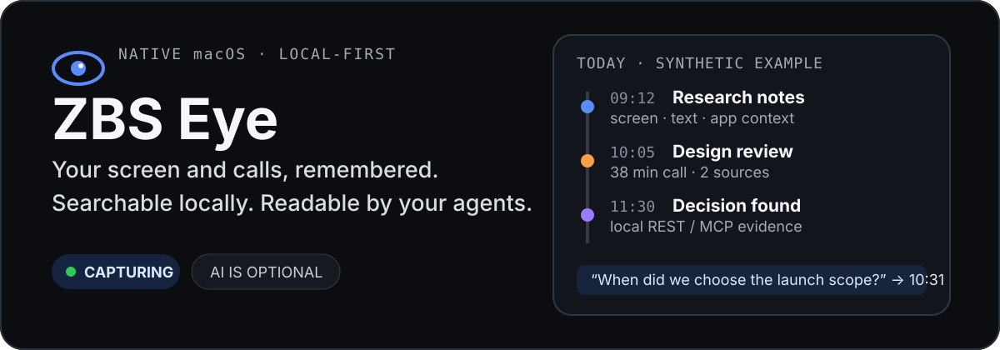
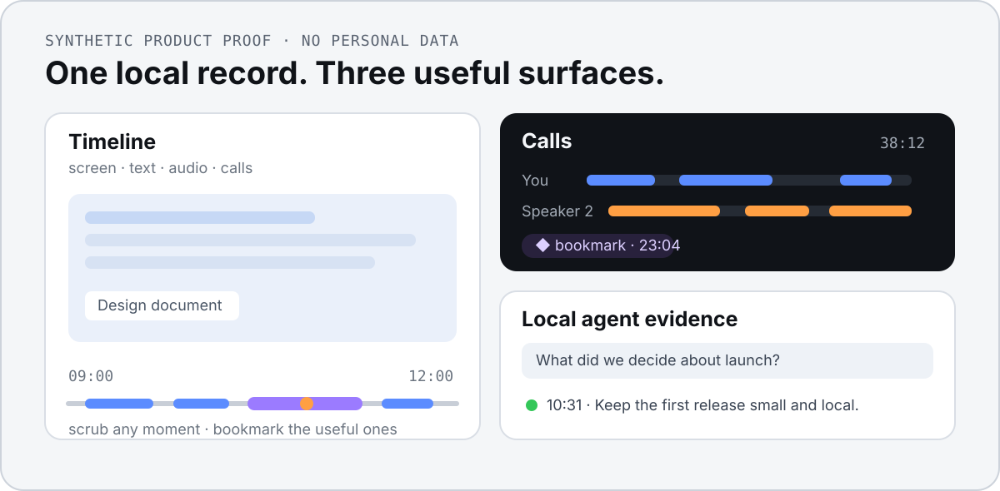

<p align="center">
  
</p>

<p align="center">
  <strong>macOS 15+</strong> · Swift 6 · local capture and index · optional AI · MIT
</p>

<p align="center">
  <a href="https://github.com/zbs-gg/eye/releases/latest"><strong>Download current stable release</strong></a>
  ·
  <a href="./BUILD.md">Build from source</a>
  ·
  <a href="./docs/ABOUT.md">Product details</a>
</p>

ZBS Eye is a tiny native recorder for people who want a searchable memory of their Mac without sending
their life to somebody else's cloud. It quietly captures screen moments, accessible text, OCR fallback,
microphone and optional system audio. Everything is indexed locally and can be explored in the Timeline,
opened as a call, searched in Ask, or read by your own agent over localhost.

> **Release status:** this README documents the upcoming 0.5.1 source on `main`. The download link continues
> to serve the stable 0.4.5 build until the installed 0.5.1 browser-call qualification is complete.

<p align="center">
  
</p>

The example above is synthetic. No personal history, real meeting, URL, transcript, or participant name is
stored in this repository.

## One job, done quietly

Eye records useful evidence and gives it back. It is not a CRM, a calendar manager, or a meeting bot.

- **Timeline** combines screen frames, extracted text, app context, audio density, call spans, and bookmarks
  in one scrubbable view.
- **Calls** keeps meetings out of the all-day activity stream. Microphone and system audio remain separate;
  a bookmark schedules a checkpoint transcript without interrupting the recording.
- **Search** combines FTS5 with local multilingual semantic retrieval, so a query in one language can find
  evidence written in another.
- **REST and MCP** let local agents retrieve bounded, typed evidence instead of scraping the UI. The server
  binds to `127.0.0.1`; everything except `/health` requires a Keychain-backed Bearer token.
- **Storage stays yours.** Fresh installs use a 5 GB media budget. You can choose another cap, keep media
  forever, move the data root to an external SSD, or create consistent compressed backups.

Screen capture is adaptive: Accessibility text is the cheap first path, while Vision OCR handles apps whose
UI trees are empty. Images use HEIC and perceptual-hash deduplication. Static screens do not become thousands
of duplicate files.

## Calls without a visible bot

Manual Start, Bookmark, and End work with any call app. In the qualified Chromium path, Eye can also begin
automatically without an extension or AppleScript. CoreAudio first proves that the browser owns current
input and output activity; a bounded Accessibility pass then requires a trusted HTTPS origin and the real
site-specific Leave or End control. A calendar page, podcast, voice message, look-alike domain, or microphone
alone is not enough.

| Browser and service | 0.5.1 candidate status |
| --- | --- |
| Chrome, Dia, or Edge × Meet, Zoom Web, or Teams Web | Implemented and fixture-qualified; live-qualified pairs will be named at release |
| Safari or another browser | Manual Start only |

Detection is local. Its call context retains the normalized trusted service host and an opaque fingerprint
hash, but not the full URL or path, meeting code, window title, or participant names; detector diagnostics
log neither private form. The ordinary Timeline capture still records visible screen content and may locally
retain browser URL, title, and text.

If Eye is wrong, **Not a call** permanently stops and deletes that automatically detected call, then
suppresses only its current session fingerprint. Separately, after a normal automatic end, **Undo** is
available for 15 seconds without splitting the recording. Normal ending uses a 30-second grace.

Optional Whisper Large V3 Turbo can produce a whole-call transcript after the call. Optional local
diarization creates anonymous per-call speaker lanes; you may name or correct them for that call. Eye does
not keep a reusable voiceprint and does not show a live transcript.

## Local capture; AI only when you choose it

Recording, indexing, Timeline, Calls, search, REST, and MCP do not require an AI provider. AI starts off.
On qualified Apple Silicon hardware, one click can download the pinned ZBS Eye Local model. You may instead
connect a local server, signed-in CLI, or cloud API provider.

That choice changes only generation features such as Ask and Daily Insights. Before any non-local provider
receives a prompt excerpt, Eye names the recipient and asks for scoped consent. Raw recordings, the database,
and storage never become provider uploads. API credentials live in the macOS data-protection Keychain.

## Install

1. Open the [current stable release](https://github.com/zbs-gg/eye/releases/latest), download the notarized ZIP,
   move **ZBS Eye.app** to `/Applications`, and launch it.
2. Grant Screen Recording and Accessibility. Microphone is optional; system audio has its own switch.
3. Press **Start**. Open Timeline and change windows once to see the first moments appear.

ZBS Eye is distributed outside the Mac App Store because cross-app Accessibility and continuous capture are
incompatible with the App Sandbox. Release artifacts use Developer ID, Hardened Runtime, Apple notarization,
and a stapled ticket. Exact artifact verification is documented in [docs/NOTARIZE.md](./docs/NOTARIZE.md).
Maintainers must use the exact ZIP and matching `.manifest.json` path printed by the script, never select a
release asset by wildcard, and run `scripts/verify-release-artifact.sh` before installation or publication.

The app pauses on lock, display sleep, and system sleep. It resumes only after macOS reports a real unlocked
console session; `loginwindow` and screen-saver shells are rejected again at the final write boundary.

## Give your agent read-only memory

The installed binary can serve MCP over stdio:

```bash
"/Applications/ZBS Eye.app/Contents/MacOS/ZBS Eye" --mcp-read-only
```

Use that command in Codex, Claude Code, Claude Desktop, or another MCP client. Read-only mode exposes Timeline,
search, calls, bookmarks, source health, and paginated transcript evidence. Frame-image access and the global
capture toggle require the separate `--mcp-full` mode. For localhost integrations, inspect `GET /health`,
then use the authenticated REST surface described by the app's **MCP & AI Tools** settings.

## Build and review

```bash
xcodegen generate
xcodebuild -project ZBSEye.xcodeproj -scheme ZBSEye -configuration Debug build
```

The codebase is Swift 6 with strict concurrency, SwiftUI, ScreenCaptureKit, Vision, GRDB/SQLite, sqlite-vec,
whisper.cpp, FluidAudio, FlyingFox, and the Swift MCP SDK. Start with [AGENTS.md](./AGENTS.md) for architecture,
data-safety invariants, and review risks; use [BUILD.md](./BUILD.md) for the complete build path.

Privacy and data-loss review matter more here than feature count. Capture has one writer, every live
data-root path is resolved through `StorageLocation`, live SQLite is never copied directly, and the HTTP
surface is localhost-only with authentication. iCloud snapshots and user exports are intentional
out-of-root exceptions.

## License

[MIT](./LICENSE) © 2026 zbs-gg.
