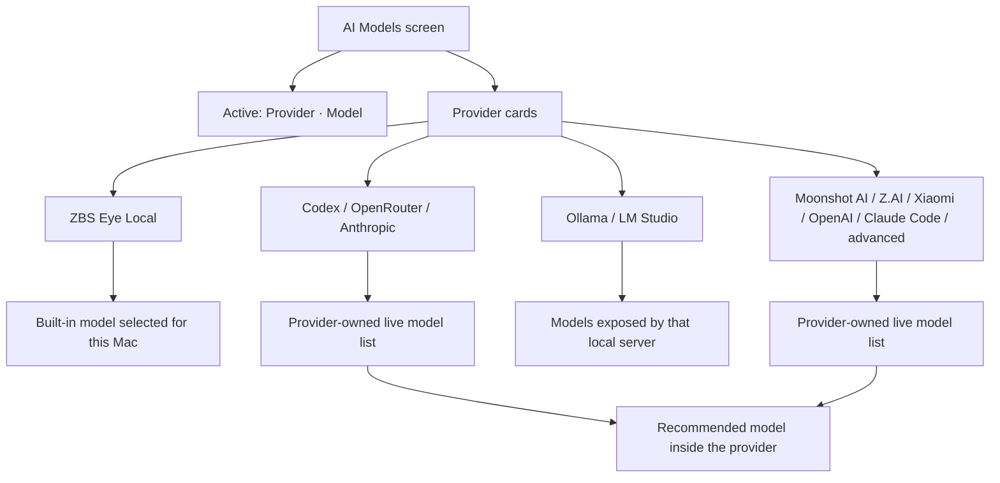
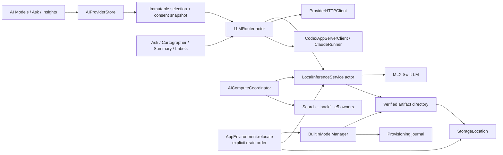
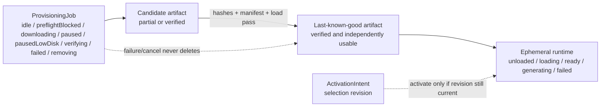
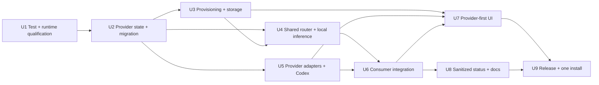

# Built-in Local AI Provider - Plan

## Goal Capsule

- **Objective:** Make Ask, Daily Insights, summaries, and generated activity labels work from a fresh ZBS Eye install through a one-click built-in local AI provider, while preserving real provider choice.
- **Product authority:** This Product Contract owns the user-facing scope. Existing local-first, explicit-egress, recording-reliability, and honest-state invariants remain authoritative.
- **Authority hierarchy:** Product Contract R1-R29 and AE1-AE10 define behavior; KTD1-KTD12 define the implementation guardrails; the repository invariants in `AGENTS.md` remain binding when they are stricter.
- **Execution profile:** Deep, cross-cutting feature work. Dependency edges are integration/Done gates; independently testable work may overlap only after the shared contract it consumes is green. Each unit must finish its tests and evidence before a dependent unit can claim completion.
- **Stop conditions:** Stop rather than weaken the product if the pinned model/runtime license changes, an asset checksum does not match, Codex cannot be proven tool-free and filesystem-free, recording reliability regresses, the 2 GiB capture reserve cannot be preserved, or a declared hardware tier misses its quality/resource gate.
- **Tail ownership:** The executor owns implementation, tests, docs, staging-app dogfood, adversarial review, release packaging, and the final installed-app smoke test. A failed gate routes back to the owning unit; it does not become a release note caveat.
- **Delivery constraint:** Do not replace the installed app with intermediate builds. Install once only after implementation, verification, and review are green together.

---

## Product Contract

### Summary

ZBS Eye will add a built-in local AI provider as the headline and default path on the AI Models screen.
The screen remains provider-first: each provider owns its model choices and recommendation, while one global `Provider · Model` pair powers every existing AI feature.

### Problem Frame

ZBS Eye currently describes Ask and Daily Insights as local-first, but a fresh install has no generative model.
The user must install another application, find and load a model, start its server, connect ZBS Eye, and select that model before Ask can answer.

The bundled multilingual-e5 model supports semantic retrieval only; it does not generate answers or insights.
This leaves the product's most legible AI value behind setup work that belongs to a power-user workflow.

The existing AI Models screen already centralizes one active provider and model, cloud consent, and the provider-management surface.
The new work should extend that product shape instead of creating a second AI configuration system.

### Key Decisions

- **Built-in local AI is the default, not a lock-in.** A new user gets the shortest private path, while external and user-managed providers remain available on the same screen.
- **Provider is the parent entity.** A provider card owns connection state, its available models, and its recommended model; models never appear beside providers as peer objects.
- **One active pair powers the product.** Ask, Daily Insights, summaries, and generated labels use one global `Provider · Model` selection in this release.
- **Provision after an explicit click.** The normal app install stays separate from the generative-model download; `Download & enable` starts a visible, manageable one-time setup.
- **Recommendations guide without restricting choice.** Anthropic and OpenRouter recommend the current Claude Haiku model for frequent cloud processing, while every provider still exposes its other supported models.
- **Provider breadth uses progressive disclosure.** ZBS Eye Local, Codex, OpenRouter, and Anthropic are visible immediately; Moonshot AI, Z.AI, Xiaomi, OpenAI, Claude Code, and advanced connections live under More.
- **Local servers remain distinct providers.** Ollama and LM Studio retain separate, obvious connection actions instead of becoming a generic undifferentiated localhost option.



### Actors

- A1. **Fresh-install user:** Wants private Ask and Insights without knowing about model runtimes, API keys, or local servers.
- A2. **Choice-oriented user:** Has a Codex, OpenRouter, Anthropic, Moonshot AI, Z.AI, Xiaomi, OpenAI, or Claude Code setup and wants to choose the provider and model deliberately.
- A3. **Local-AI power user:** Already runs Ollama, LM Studio, or another localhost-compatible server and expects ZBS Eye to preserve that workflow.

### Requirements

**Built-in local provider**

- R1. AI Models presents `ZBS Eye Local` as the headline provider and the default path for a user who has not configured AI processing.
- R2. One `Download & enable` action starts built-in model provisioning without requiring another application, account, API key, or server.
- R3. Before provisioning, ZBS Eye shows the download size, expected local storage use, and whether the current Mac passes the supported-hardware and free-space checks.
- R4. Provisioning exposes progress and supports cancel, retry, and resume across app restarts without reporting the model as ready early.
- R5. Successful completion verifies the downloaded asset, activates `ZBS Eye Local`, and makes the existing AI features usable without another model-selection step.
- R6. After provisioning, built-in inference works offline and sends no history excerpts away from the Mac.
- R7. AI Models shows the installed local model's state, version, storage use, and actions to remove or reinstall it.
- R8. A failed replacement or reinstall leaves any previously verified working local model available until a replacement is also verified.
- R9. Detecting an installed local model never overrides a user's existing active provider or a deliberate off state; only the explicit `Download & enable` or later selection action may activate it.

**Provider and model choice**

- R10. Every provider card owns its authentication or connection state, available-model list, selected model, and, when an authoritative suitable candidate is available, one visibly marked recommendation.
- R11. The screen exposes one authoritative `Active: Provider · Model` control rather than separate active selectors on provider cards.
- R12. `ZBS Eye Local`, Codex, OpenRouter, and Anthropic appear in the primary provider surface.
- R13. Moonshot AI with Kimi, Z.AI with GLM, Xiaomi with MiMo, OpenAI, Claude Code, and advanced connections appear under More as provider-level choices.
- R14. OpenRouter may expose Claude, Kimi, GLM, MiMo, and other models inside its own model list without promoting those models to provider-level cards.
- R15. Anthropic and OpenRouter mark the current Claude Haiku model as recommended while allowing the user to choose any supported model they expose.
- R16. Other providers may recommend their own suitable model, but a recommendation never activates or replaces a model without the user's selection.
- R17. Ollama and LM Studio have separate connection buttons and separate provider-owned model lists; custom localhost remains an advanced path.
- R18. Existing provider configurations and the currently active pair survive upgrade without triggering a built-in model download or silent provider switch.
- R19. If a previously selected model disappears from a provider's live list, ZBS Eye reports that state and asks for a new choice instead of silently crossing to another model or provider.

**Privacy and consent**

- R20. Capture, recordings, the index, and storage remain local regardless of the active AI provider.
- R21. Opening AI Models, discovering provider models, or connecting an account never sends history excerpts for generation.
- R22. Before a cloud model becomes active, ZBS Eye names the real egress recipient and obtains explicit consent; cancelling preserves the previously active pair.
- R23. Cloud-backed Daily Insights never generates merely because the screen opened; generation still requires the existing explicit user action and consent.
- R24. Partial, unverified, or incompatible local model assets are never activated or used for history processing.

**Reliability and product truth**

- R25. Model download, loading, inference, failure, removal, and provider-auth states are represented honestly and never imply that Ask or Insights are ready when they are not.
- R26. Resource pressure or local-model failure must not stop, pause, or corrupt recording; the AI feature fails separately with an actionable state.
- R27. The built-in model must produce useful Ask and Daily Insights output in English and Russian on every Mac configuration declared supported for this feature.
- R28. New user-facing copy follows the repository's existing localization coverage and accessibility conventions.
- R29. Product documentation and release copy change from “bring your own local AI” as the default story to “built-in local AI, with provider choice,” while describing cloud processing as an explicit opt-in.

### Key Flows

- F1. **Enable built-in local AI**
  - **Trigger:** A1 opens AI Models with no active provider.
  - **Actors:** A1.
  - **Steps:** The screen leads with ZBS Eye Local; the user chooses `Download & enable`; preflight runs; progress remains visible and resumable; verification completes; ZBS Eye Local becomes active.
  - **Outcome:** Ask and local Daily Insights work without external software or another model-selection step.
  - **Covered by:** R1-R9, R24-R27.

- F2. **Connect and choose a cloud provider**
  - **Trigger:** A2 chooses a primary provider or opens More.
  - **Actors:** A2.
  - **Steps:** The user connects the provider; its card loads its own models and recommendation; the user selects a model; ZBS Eye names the egress recipient and requests consent; the global active pair changes only after confirmation.
  - **Outcome:** The chosen provider and model power all current AI features without weakening capture and storage privacy.
  - **Covered by:** R10-R16, R20-R23.

- F3. **Connect an existing local server**
  - **Trigger:** A3 chooses Ollama or LM Studio.
  - **Actors:** A3.
  - **Steps:** ZBS Eye connects to that provider, reads the models it currently exposes, shows a provider-local recommendation where available, and lets the user activate one model through the global control.
  - **Outcome:** Existing local workflows remain first-class alternatives to ZBS Eye Local.
  - **Covered by:** R10-R11, R17, R20-R21.

- F4. **Upgrade without changing the active provider**
  - **Trigger:** An existing user installs the release containing this feature.
  - **Actors:** A2, A3.
  - **Steps:** ZBS Eye restores the prior provider configuration and active pair; the new built-in provider is visible but does not download or activate itself.
  - **Outcome:** Existing users gain the option without a behavior or egress surprise.
  - **Covered by:** R9, R18, R20-R23.

- F5. **Recover from local-model failure**
  - **Trigger:** Download, verification, loading, inference, removal, or replacement fails.
  - **Actors:** A1.
  - **Steps:** The failed state is isolated from recording; the screen preserves any last verified asset; the user can retry, resume, remove, or choose another provider.
  - **Outcome:** No false-ready state, damaged working model, or lost recording.
  - **Covered by:** R3-R8, R24-R26.

### Acceptance Examples

- AE1. **Covers R1-R6.** Given a fresh install with no AI provider, when the user chooses `Download & enable` and provisioning succeeds, then ZBS Eye Local becomes active and the next Ask request can answer without LM Studio, Ollama, an account, or another selection.
- AE2. **Covers R3-R5, R24-R26.** Given insufficient disk or an unsupported Mac, when the user tries to enable ZBS Eye Local, then provisioning does not start, the screen explains the blocker, recording continues, and other provider choices remain available.
- AE3. **Covers R4-R5, R24-R26.** Given an interrupted download, when the app reopens, then the user can resume or cancel it and no partial asset appears as ready.
- AE4. **Covers R9, R18.** Given an existing OpenRouter or Ollama selection, when the app upgrades, then that exact active pair remains selected and ZBS Eye Local does not download or activate automatically.
- AE5. **Covers R10-R16.** Given connected OpenRouter models, when Claude Haiku is marked recommended but the user chooses Kimi, then OpenRouter · Kimi becomes the active pair and the recommendation remains guidance only.
- AE6. **Covers R10, R13-R15.** Given a direct Moonshot AI connection, when its models load, then Kimi appears inside the Moonshot AI card rather than as a peer provider beside Moonshot AI or OpenRouter.
- AE7. **Covers R19.** Given an active cloud model that disappears from its provider catalog, when the provider refreshes, then ZBS Eye asks the user to choose another model and does not silently activate the recommendation.
- AE8. **Covers R20-R23.** Given an active local model, when the user selects a cloud model but cancels the consent prompt, then the local pair remains active and no history excerpt is sent.
- AE9. **Covers R7-R8, R24-R26.** Given a working built-in model, when reinstalling or replacing it fails verification, then the old verified model remains usable and recording is unaffected.
- AE10. **Covers R17.** Given both Ollama and LM Studio are installed, when the user opens AI Models, then each has its own connection action and model list rather than a shared local-server card.

### Success Criteria

- A fresh user can start built-in provisioning with one intentional action and obtain a successful Ask answer after completion without installing or configuring another AI product.
- After the initial download, built-in Ask and Daily Insights work without network access.
- The screen always makes the active provider and model identifiable as one pair.
- Every recommended model appears inside its provider and remains optional.
- No cloud history egress occurs before explicit provider and model activation consent.
- Capture and recording remain reliable throughout provisioning and inference failures.
- Existing provider users upgrade without a silent download, activation change, or new egress.

### Scope Boundaries

**In scope**

- The ZBS Eye Local provider and its complete user-visible provisioning and management lifecycle.
- Provider-first AI Models hierarchy, recommendations, global active-pair control, and honest states.
- Primary provider presentation, direct providers under More, and separate Ollama and LM Studio actions.
- Provider-owned live model lists for new and existing providers.
- Existing Ask, Daily Insights, summaries, and generated-label consumers using the active pair.
- Privacy gates, compatibility behavior, migration behavior, documentation, packaging, and release support needed to ship the feature.

**Deferred for later**

- Different active models per feature.
- A per-question model override inside Ask.
- A user-facing library of multiple downloadable built-in models; planning may use hardware-specific artifacts behind the single ZBS Eye Local product choice.
- Silent background model downloads or automatic replacement of a working built-in model.
- Ranking every provider model or building a general model marketplace.

### Dependencies / Assumptions

- A redistributable local model and inference runtime can meet the supported-Mac resource envelope, English/Russian quality bar, and no-egress promise.
- The built-in model can be downloaded and verified through a distribution path compatible with Developer ID notarization and the project's licensing obligations.
- Codex exposes a supported connection or invocation surface suitable for this provider contract; planning must not rely on private or brittle account data.
- OpenRouter, Anthropic, Moonshot AI, Z.AI, Xiaomi, and OpenAI expose authentication and model-discovery paths that can be represented honestly in provider cards.
- The existing single active-provider contract remains the source of truth for every AI consumer.
- The repository has no XCTest target today, so planning must define verification coverage rather than assume an existing unit-test suite.

### Resolved Planning Questions

- The runtime, model tiers, supported envelope, and redistribution checks are fixed by KTD1-KTD2.
- Codex authentication and generation use the official Codex App Server boundary in KTD8; unsafe CLI fallback is explicitly prohibited.
- Provider-specific transports and direct-provider endpoints are fixed by KTD7.
- Asset placement, crash-safe provisioning, relocation, and backup behavior are fixed by KTD3-KTD4.
- Automated, live, resource, language-quality, and installed-app coverage are fixed by KTD11 and the Verification Contract.
- No launch-blocking planning question remains. Changes to these decisions require editing this canonical plan before implementation continues.

### Sources / Research

- `ZBSEyeApp/Views/AIModels/AIModelsView.swift` — current single active-model control and provider-management hierarchy.
- `ZBSEyeApp/Connections/AIProvider.swift` and `ZBSEyeApp/Connections/AIProviderStore.swift` — current provider vocabulary, persisted selection, local discovery, and consent behavior.
- `ZBSEyeApp/State/AskStore.swift` and `ZBSEyeApp/State/CartographerStore.swift` — current model readiness and local/cloud generation gates.
- `ZBSEyeApp/Search/EmbeddingService.swift` — existing embedding-model lifecycle, distinct from generative inference.
- `scripts/build-release.sh` and `scripts/build-notarized.sh` — current e5-only model packaging.
- `docs/superpowers/specs/2026-07-03-runtime-footprint-design.md` — measured resource posture and the requirement to preserve a lightweight recorder.
- [Claude models overview](https://platform.claude.com/docs/en/about-claude/models/overview) — current Claude family and Haiku positioning.
- [OpenRouter model catalog](https://openrouter.ai/docs/guides/overview/models), [Kimi models API](https://platform.kimi.ai/docs/api/list-models), [Z.AI model overview](https://docs.z.ai/guides/overview/overview), and [Xiaomi MiMo API](https://mimo.mi.com/docs/en-US/api/chat/openai-api) — provider-owned live model families and discovery surfaces.

---

## Planning Contract

### Product Contract Preservation

Requirements R1-R29, Flows F1-F5, Acceptance Examples AE1-AE10, success criteria, and scope boundaries above are preserved from `ce-brainstorm`. Planning resolves the former questions and adds implementation detail without changing the confirmed provider-first product behavior.

### Key Technical Decisions

#### KTD1. Native MLX runtime with one qualified artifact behind one product provider

- Add `mlx-swift-lm` at exact version `3.31.4` in `project.yml`; do not use a floating package range.
- `ZBS Eye Local` remains one provider in the UI. The selected product artifact is `mlx-community/Qwen3.5-4B-4bit`, revision `0e7ffd5c629ef7719d4cbc04069232580bfa9d9c`, total download `3,061,129,077` bytes, weight SHA-256 `5fb9acd0246866381cf8c5c354c6db1019f6498eec4ccb4f5edcc71ffeacb2db`, and tokenizer SHA-256 `87a7830d63fcf43bf241c3c5242e96e62dd3fdc29224ca26fed8ea333db72de4`.
- This decision supersedes the initial 1.7B/2B split after the locked product probes: Qwen3.5 4B passed the earlier `local-ai-v5` qualification at 72/72 variants and 24/24 stable cases. The immutable `local-ai-v6` expansion exposed a production prompt-channel regression (13/64 stable cases, 25% parser acceptance). The non-qualifying `local-ai-v7` bounded preflight then proved the separated channel but exposed a 60-token Label truncation and Summary restatement of non-citable coverage metadata. V8 corrected those defects, but its bounded preflight passed 7/8 stable cases with 91.6667% parser acceptance because two English Label attempts emitted bare argument JSON instead of native tool events. The shipping candidate is `local-ai-v9`: the same 64 unique English/Russian cases, strict parser, prompts, and thresholds, with an exact decoder-forced Qwen native prefix and purpose-specific tool schemas. Qwen3 1.7B, Qwen3.5 2B, and Qwen3 4B remain audit-only qualification candidates and are not product-downloadable.
- The upstream Qwen artifact is Apache-2.0; `mlx-swift-lm` and `mlx-swift` are MIT; `swift-transformers` is Apache-2.0. Checked-in notices must name the exact revisions and license URLs. Model assets are downloaded after explicit user action and are not embedded in the app bundle.
- Built-in inference is initially available only on the physically qualified `Mac16,5` / Apple M4 Max / 64 GiB configuration. Other Apple Silicon configurations are not yet qualified; Intel Macs are unsupported. Every external provider remains usable.
- Load the verified local directory through MLX `ModelConfiguration(directory:)` with model and tokenizer resolution pinned to that same directory; the runtime never performs its own untracked Hub download.
- The values above identify the weight anchors, not the complete downloadable inventory. U1 checks in a complete per-artifact file manifest covering every safetensors shard/index, config, tokenizer/tokenizer-config, chat template, generation config, and other load-required sidecar. Every entry carries an allowlisted relative path, immutable revision URL, exact byte length, SHA-256, required/optional role, and the artifact carries an aggregate manifest fingerprint. A network-disabled local-directory load is the completeness proof.

**Why:** MLX gives a native Swift/Metal path, cancellation, explicit cache controls, and local-directory loading. Foundation Models cannot be the default because its OS, Apple Intelligence, model-availability, and Russian-language envelope do not satisfy R27. A llama.cpp bridge adds a second C ABI/process lifecycle without a product benefit for these artifacts.

#### KTD2. A declared, measured resource and quality envelope

- Use an 8192 total-token ceiling for the qualified Qwen3.5 4B artifact unless physical-device evidence justifies a later manifest change. Budget after chat templating: input + maximum output + template overhead + safety margin must fit the ceiling. Use non-thinking generation.
- Serialize built-in generations. Foreground Ask has priority over scheduled/background work; queued background work yields and can be cancelled.
- Required release measurements on each declared tier:
  - both 2K and full-ceiling English/Russian prompts are measured; cold and warm first-token p50/p95 are reported, with p95 at 2K at most 5 seconds on the qualified physical configuration;
  - at the 8192-token ceiling, cold p95 is at most 15 seconds and warm p95 is at most 10 seconds;
  - sustained decode is at least 12 tokens/second;
  - cancellation stops generation within 1 second;
  - 50 sequential generations grow retained memory by at most 100 MiB;
  - idle unload releases at least 90% of model-attributable memory within 10 seconds;
  - incremental peak memory is at most 5.5 GiB for the Qwen3.5 4B artifact;
  - a fixture set of at least 30 English and 30 Russian cases passes the Ask/Insight rubric defined in Verification Contract.
- A configuration is not declared supported until that exact physical configuration passes. The initial matrix therefore contains only the tested `Mac16,5` / Apple M4 Max / 64 GiB machine. Do not extrapolate M1, 16 GiB, or any other Apple Silicon support from it.
- Recording, audio, DB writes, and retention behavior must remain within the existing runtime-footprint baselines while download and inference run.
- U1 records an AI-off same-machine baseline under a fixed workload, then every AI phase reports capture trigger/completion/coalescing/failure counts, capture-cycle p50/p95/p99, ingest p95/p99, DB errors, audio queue high-water/drop count, embed-queue growth, CPU, `phys_footprint`, and MLX active/cache/peak memory. Release requires zero new capture failures, audio drops, or DB errors; no unexplained active-mode gap longer than two 3-second ticks; and capture/ingest p95 no more than 10% over the calibrated baseline.
- Tune wired memory at 2K and the tier ceiling. Each generation owns one cancellation-safe `WiredMemoryTicket`; admission is bounded by measured weights + KV cache + prefill workspace, `GPU.maxRecommendedWorkingSetBytes`, and an explicit unified-memory headroom guard independent of the disk reserve. Serious memory pressure cancels background work; critical pressure cancels all generation, drops containers, and clears the MLX cache.
- Check in a versioned benchmark protocol before measuring: immutable prompts/contexts/rubrics, production chat templates and parser versions, non-thinking parameters (`temperature 0.2`, `topP 0.95`, feature output caps), deterministic production seed derivation from prompt-version + consumer + normalized request fingerprint, locked perturbation seeds for robustness, warm-up, cold/warm definitions, no-retry policy, and nearest-rank percentile aggregation. The current product-quality contract is `local-ai-v9`: 64 unique cases (32 English, 32 Russian), evenly split across Ask, Daily Insights, Day Summary, and Activity Label, each run with three freshly derived deterministic V9 seeds. V9 preserves the strict native-call parser and semantic thresholds while locking the exact decoder-forced Qwen prefix and purpose-specific schemas; the 8-case/24-attempt bounded preflight remains diagnostic only and never substitutes for release qualification. Use at least 20 cold and 30 warm balanced-language samples per context size for the final performance report; quality runs report every locked attempt rather than selecting the best output.

#### KTD3. Manifest-driven, resumable, crash-safe provisioning

- A checked-in `BuiltInModelManifest` is the only authority for product model ID, display name, revision, per-file URLs/sizes/hashes/roles, license, minimum memory, and artifact version.
- Do not flatten replacement and readiness into one enum. Persist three orthogonal durable records: `ArtifactInventory(lastKnownGood, candidate)`, `ProvisioningJob(idle, preflightBlocked, downloading, paused, pausedLowDisk, verifying, failed, removing)`, and `ActivationIntent(selectionRevision, activateIfStillCurrent)`. Keep `RuntimeState(unloaded, loading, ready, generating, failed)` ephemeral. UI/API status is a deterministic projection of all four, so a working v1 remains ready while v2 downloads or fails.
- Download every file into an artifact-specific staging directory. Resume only when the stored URL, revision, ETag/validator, expected length, and manifest fingerprint still match. Otherwise discard the stale partial and restart.
- Verify byte length and SHA-256 before an atomic directory promotion. Write the verified manifest last. `installed` means bytes are verified; `ready` means the runtime has loaded them successfully.
- Cancellation removes the active partial download and journal entry but never the last verified artifact. Interruption preserves resumable bytes. Retry is idempotent.
- Replacement downloads side-by-side. Activation happens only after replacement verification and a successful load; failure leaves the prior verified artifact selectable.
- Completion may activate `ZBS Eye Local` only when the provisioning intent still owns activation. If the user changed provider, model, or deliberate-off state during download, completion records the install but does not steal the active pair.
- Accept HTTPS only. Revalidate every redirect against an explicit public asset-host allowlist; reject loopback/private/link-local destinations and never forward cookies, authorization, or referrer headers. Send `Accept-Encoding: identity`; require exact status, length, validator, and `Content-Range` semantics. A server ignoring Range restarts at byte zero.
- Abort before writing `expectedLength + 1`, hash in bounded utility-priority chunks, and recheck capacity throughout download, hashing, and replacement. Pause at `2 GiB capture reserve + 512 MiB safety`; if the recorder reserve is still threatened, reclaim unverified staging before the existing emergency retention path can prune history. Never load a multi-gigabyte file into one `Data` value.
- Flush and `fsync` staged files and their parent before promotion. Manifest filenames are literal allowlisted relative paths; reject absolute paths, `..`, normalization collisions, symlinks, hard links, and special files. Use mode `0700` directories/`0600` files and resolved-descendant checks. Reverify length/hash on first load after launch, after relocation, and after metadata change.

#### KTD4. StorageLocation owns assets; capture reserve and relocation remain inviolate

- Add generative model URLs to `StorageLocation`; no component hard-codes `Application Support/ZBS Eye`. Model services are constructed only after the GUI's existing anti-split-brain root guard resolves the configured root; helpers never create/fallback a root for model inspection.
- Store assets below the relocatable data root under a distinct versioned directory, separate from the bundled/retrieval e5 cache. Existing SQLite-only backups exclude both generative weights and provisioning metadata; restore therefore derives `notInstalled` unless a verified asset exists at the resolved current root and never claims a missing model is installed.
- Preflight free space must cover the final artifact, the largest possible staging/replacement copy, the existing 2 GiB capture reserve, and an additional 512 MiB safety margin. Never invoke retention pruning to make room for a model.
- Extend the existing `AppEnvironment.relocate` / `StorageRelocator` flow as one explicit ordered relocation transaction, not a generic maintenance framework. While `relocationInProgress` blocks new capture/audio toggles and managed-root mutators, `AppEnvironment` directly calls and awaits named drain methods for capture, audio, ingest, inference, downloads, vector backfill, retention, import, backup, automations/audit writes, and REST/MCP mutators before copy/verify/flip. Retain every actor/task handle needed for acknowledgements; remove the current fixed sleep once concrete drains exist.
- Target preflight includes DB, media, installed model, resumable partials, metadata, and reserve. Immutable verified model files may pre-copy at utility priority before capture pauses; under the exclusive lease, verify the source fingerprint did not change, copy/verify remaining metadata and journaled partial tails, then flip. Copy without following links, verify installed destination hashes and partial fingerprint/length/validator, report all asset bytes, and prove no handle remains on the old root.
- An unavailable external volume is an unavailable model/data-root state, never permission to create a second legacy-root model install.
- Remove deletes only the selected generative artifact after generation is drained; it cannot touch e5, database, capture media, or a working replacement until the state change is committed.

#### KTD5. One process-wide inference owner and one router

- U2 defines immutable `ProviderSelectionSnapshot`, `SelectionRevision`, `AuthorizationEpoch`, `LLMRequest/Response`, and `LLMAdapter` boundaries. `AppEnvironment` creates exactly one `LocalInferenceService` actor and one `LLMRouter` actor and injects them into Ask, Cartographer, daily summary, and generated-label services. The router accepts snapshots and never depends on the `@MainActor` observable store. Remove the current per-consumer `LLMClient()` ownership.
- A generation request snapshots provider ID, model ID, configuration revision, and consumer at enqueue time. Changing the active pair affects only future requests. A result whose snapshot no longer matches the consumer's current request is discarded rather than painted under the new model identity.
- `LocalInferenceService` owns load, warm state, queueing, streaming, cancellation, timeout, idle unload, memory-pressure unload, and `Memory.clearCache`. Its actor is the control plane; one retained worker task performs tokens off `MainActor`. Dropping all `ModelContainer` references is part of unload.
- A process-wide `AIComputeCoordinator` always excludes background backfill-e5 from MLX and applies a measured per-tier policy to foreground query-e5. The fail-safe/default policy is exclusive: query retrieval finishes and releases/unloads e5 before generation, and semantic searches arriving while MLX owns the lease use FTS-only fallback. U1 may enable query coexistence for a tier only when simultaneous e5+MLX passes every KTD2 memory/capture gate and improves end-to-end search; the shipped manifest records that policy. `VectorBackfill.suspendAndDrain()` acknowledges zero in-flight work, then `resume()` restarts it. Retain every e5 owner and backfill task in `AppEnvironment`.
- Prevent forbidden second-process overlap: MCP hybrid search proxies to the GUI when available and uses FTS-only direct-DB fallback when it is absent. Verification asserts backfill-e5 never overlaps MLX and query-e5 follows the qualified tier policy.
- Priority is Ask -> explicit Insight/manual summary -> scheduled summary -> labels. Higher-priority arrival cooperatively cancels an active lower-priority job and receives a drained acknowledgement within one second. Bound/coalesce queues: one pending request per interactive consumer, one scheduled summary, and a fixed-size label backlog deduplicated by content fingerprint. Discard stale work before tokenization. A worker that will not drain marks the runtime unhealthy and unloads; a second generation never starts beside it.
- Screen recording, audio, ingestion, REST, and the DB writer never pause for generation.
- Daily Summary and Insights use deterministic context budgeting/compaction before the selected artifact's total-token ceiling. A too-large request fails before runtime allocation rather than inducing memory pressure.

#### KTD6. Additive persistence and authoritative catalog semantics

- Provider IDs are stable strings; add new cases without changing existing raw values. Unknown future IDs decode into preserved configuration rather than deleting the rest of the settings.
- Replace synthesized `Codable` for `AIProviderSettings` with a versioned custom decoder using `decodeIfPresent` defaults. Add fixtures for 0.2.0, 0.2.1, corrupt-but-recoverable optional fields, and current schema. A decode failure must not collapse valid active provider/model/consent state to empty settings.
- Replace the legacy provider-level consent boolean with a versioned, scoped grant containing provider ID, recipient disclosure, enabled consumer set, and policy revision. Migrate a true legacy boolean into a `legacy-manual-v1` grant covering only the cloud consumers that already shipped under that consent; it never authorizes newly added automatic labels. The active pair and existing manual/scheduled behavior remain usable, while labels show `Consent update required` and stay local-disabled until the user expands the scope.
- Separate `ProviderAvailability` from selected identity and catalog authority: reachability/auth state, catalog state (`notLoaded`, `authoritative`, `unavailable`, `unsupported`), and selected model are independent.
- A live authoritative catalog that no longer contains the selected model marks it unavailable. It never writes `list[0]`, a recommendation, or a cross-provider fallback into selection.
- Discovery may populate a catalog and recommendation but never activates anything. Existing local-server auto-detection becomes status-only.
- The global active pair may be explicit `none`. Upgrade migration preserves `none`, every endpoint/key, model choice, and consent decision; it never starts a download.

#### KTD7. Provider descriptors and protocol dialects, not model/provider conflation

- Add provider descriptors for ZBS Eye Local, Codex, OpenRouter, Anthropic, Kimi (Moonshot AI), Z.AI, Xiaomi, OpenAI, Claude Code, Ollama, LM Studio, and custom localhost.
- Direct provider base URLs are fixed and host-pinned in code, not user-editable:
  - Moonshot AI / Kimi: `https://api.moonshot.ai/v1`
  - Z.AI: `https://api.z.ai/api/paas/v4`
  - Xiaomi MiMo: `https://api.xiaomimimo.com/v1`
- OpenAI-compatible transport carries explicit dialect metadata for token-limit field, temperature support, auth/header rules, model-list parsing, and error parsing. Do not infer request semantics from one special-case provider enum.
- Anthropic keeps its native Messages and Models APIs. Ollama, LM Studio, and custom localhost keep separate descriptors and endpoints.
- Catalog authority follows each provider's documented surface: Anthropic paginates its native `GET /v1/models`; OpenRouter uses its metadata-rich `GET /api/v1/models`; Kimi uses `GET https://api.moonshot.ai/v1/models`. Z.AI and Xiaomi MiMo currently expose documented model matrices/request enums but no documented live list endpoint, so those cards start with curated `Suggested, not yet verified` candidates and must not label them live-authoritative unless an authenticated endpoint probe is separately proven and versioned.
- MiMo's OpenAI-compatible endpoint accepts either `api-key` or Bearer authentication; ZBS Eye standardizes on Bearer so secrets never need provider-specific duplication. Kimi, Z.AI, OpenRouter, and OpenAI also use Bearer. Anthropic remains `x-api-key` plus `anthropic-version`.
- Immediately before credentials are attached and a request dispatches, revalidate scheme, exact host, provider, active-pair revision, authorization epoch, and current scoped consent. Authenticated/model requests reject every 3xx, use ephemeral cookie/cache-free sessions, cap request/response bytes, normalize remote errors without returning raw bodies, and use bounded retry/backoff for automatic consumers.
- Custom localhost accepts loopback destinations only and revalidates the connected peer; it cannot redirect or resolve into a non-loopback recipient.
- A provider recommendation is shown only when an exact candidate exists in an authoritative live catalog. With no authoritative catalog, curated candidates are labelled `Suggested, not yet verified` and cannot satisfy R15 by pretending to be live.
- Haiku recommendation IDs are catalog-driven so a provider-side rename does not silently select a stale hard-coded ID. The recommendation is guidance only.

#### KTD8. Codex uses its official App Server; subprocess adapters are generation-only

- Start with an exact tested Codex CLI allowlist containing `0.136.0`; integrate the official experimental App Server JSON-RPC surface for `account/read`, `account/login/start`, `model/list`, thread creation, and turn execution. Newer versions remain unavailable until their protocol/tool-surface fixtures pass and an app release expands the allowlist.
- Do not execute the unsigned npm JavaScript wrapper. For Codex 0.136.0 on Apple Silicon, resolve the package's native `codex-darwin-arm64` binary, require canonical regular-file ownership/mode, and match the release-pinned SHA-256 allowlist (initial native hash `2c056bf3bd3a0ba04cdaa6d1db84c81974e6785f5fd72deaa2a3fcdcfb573d10`) before any account or prompt operation. A path/version/hash mismatch is unavailable, not a warning.
- Start ephemeral threads with `environments: []`, no workspace roots, no MCP servers, no apps/plugins/web search, a strict output schema, and explicit config overrides. Do not scrape Codex auth files, browser cookies, Keychain entries, or private account state.
- Run the App Server over stdio with a dedicated ZBS Eye-owned `CODEX_HOME` at mode `0700` containing only generated minimal config. Require OS-keyring-only credential storage with no file/auto fallback; login/disconnect only through official account APIs. Disable notify, MCP, plugins, apps, web, memories, shell, analytics, and environment inheritance. Any `auth.json`, prompt-bearing session/state file, unexpected child process, unrecognized isolation setting, or failed capability handshake makes the provider unavailable.
- Treat any command, file, shell, patch, image, web, MCP, or tool event as a security failure: cancel the turn, discard its output, and mark the adapter unavailable until the user retries. Pin protocol fixtures to 0.136.0 and prove the model-facing surface contains no I/O tools before enabling it.
- Do not fall back to `codex exec --sandbox read-only`: read-only still exposes the filesystem and violates the provider contract.
- Claude Code remains an advanced subprocess provider with an exact tested minimum/version policy. Require `claude auth status --json` to report `apiProvider: firstParty`; Bedrock, Vertex, Foundry, and other routed backends remain unavailable until each has a distinct real-recipient consent contract. Launch from a trusted empty directory with `--safe-mode`, `--no-session-persistence`, `--disable-slash-commands`, `--no-chrome`, `--strict-mcp-config`, `--tools ""`, a minimal settings source, prompt on stdin, bounded stream JSON, and a minimal environment allowlist that removes API keys, routing variables, and customization variables. Do not use a login shell for discovery. Reject hook/tool/file events, bound stdout/stderr bytes, create a dedicated process group, and kill the full group on cancel/timeout.
- Before Claude account or prompt operations, resolve the Mach-O real path and verify `codesign --strict` semantics in-process: Developer ID chain, identifier `com.anthropic.claude-code`, Team ID `Q6L2SF6YDW`, canonical regular-file ownership/mode, and the version/hash allowlist. A self-reported version alone never establishes executable identity.
- If either CLI cannot prove these boundaries on the installed version, its card shows `Upgrade required` or `Unavailable`; it never runs with weaker isolation.

#### KTD9. One active pair means one explicit egress contract

The confirmed Product Contract makes the active pair global, including automatic generated labels. Preserve that behavior with an explicit consumer/egress matrix:

| Consumer | Local provider | Cloud/CLI provider | Trigger and consent |
|---|---|---|---|
| Ask | Local snippets only | History snippets sent to named provider | User submits; cloud activation consent |
| Daily Insights | Local day context | Day context sent to named provider | Existing explicit Generate action; cloud activation consent |
| Manual/scheduled summary | Local summary context | Summary context sent to named provider | Manual/schedule trigger; cloud activation consent names both |
| Generated activity labels | Local block context | Block context sent to named provider | Automatic after activation; cloud activation consent explicitly names background labels |

- Connecting/authenticating and listing models use no history excerpts.
- Cloud activation presents the actual recipient and all enabled consumers above. For broker providers, consent names both the broker and its downstream routing policy: OpenRouter requests either pin and record an upstream operator or disclose that OpenRouter may choose/change that operator; provenance records broker plus resolved upstream when the response exposes it. Cancelling leaves the previous pair and egress behavior unchanged.
- The scoped grant is checked again immediately before dispatch. Disconnect, deactivation, consent revocation, or provider/model change increments `AuthorizationEpoch`, cancels queued/in-flight work best-effort, prevents stale retry/persistence, and requires new consent when recipient or consumer scope changes.
- Generated artifacts and audit metadata store provider ID, model ID, local/cloud execution, and generation timestamp. Copy must never say `generated locally` for a cloud or CLI provider.
- A provider/model switch does not retroactively rewrite provenance. `BlockLabelService` cache identity includes provider, model, artifact/prompt version, and content fingerprint.

#### KTD10. AI setup remains GUI-only; no new REST/MCP AI contract

- Provision, cancel, remove, authenticate, consent, activate, and AI-state inspection remain on the human-facing AI Models screen in this release. The validated Product Contract contains no agent actor or AI-status requirement, so do not add a new REST endpoint, OpenAPI schema, MCP tool, or externally stable AI DTO.
- Existing authenticated REST/MCP diagnostics keep their current behavior and receive only normal release/version maintenance. U4 may change MCP's internal hybrid-search execution to prevent e5/MLX overlap, but the public search/tool contract stays compatible.
- Helpers and MCP never launch a model, download an asset, authenticate a provider, or run a CLI on their own. A future agent status/mutation surface requires its own Product Contract and approval semantics.

#### KTD11. Tests are a feature dependency, not tail work

- Add a macOS XCTest target generated by XcodeGen. Unit-test pure manifests, migrations, state reduction, router snapshots, prompt budgeting, catalog semantics, protocol payloads, redaction, and provenance.
- Network and subprocess code depend on injected URLSession/process transports. Fixtures cover partial downloads, validators, range responses, hash mismatch, provider errors, Codex event violations, timeouts, and cancellation without live credentials.
- Runtime, language quality, memory, capture-isolation, offline, relocation, and installed-app behavior remain live/evaluation gates with machine-readable reports under a gitignored results directory.
- No test sends production history to a cloud provider. Live cloud smoke tests use synthetic fixtures and opt-in environment variables only.

#### KTD12. Versioned release and exactly one final install

- Ship as `0.3.0` build `4`; update every user-visible/API version constant together.
- The release bundle continues to contain e5 only. Generative weights remain post-install assets.
- Build and dogfood from DerivedData/staging paths. Do not copy any intermediate app into `/Applications`.
- After all automated gates, live dogfood, adversarial review, license notices, release archive verification, and an equivalent launch-from-staging smoke pass, transactionally replace `/Applications/ZBS Eye.app` once with that exact signed build and run the installed-app-only smoke. If that final smoke fails, stop, preserve evidence, and do not install another candidate automatically; completion remains blocked rather than violating the one-install constraint.

### High-Level Technical Design



Provisioning uses orthogonal reducer-driven state; UI renders a projection and sends intents rather than inferring readiness from file existence. This is what lets the last-known-good artifact stay usable while a candidate downloads or fails:



Provider selection and generation follow a commit boundary:

1. Discovery/auth updates provider availability and catalog only.
2. Choosing a model inside a provider card updates that provider's persisted inactive preference only. It creates no egress and never changes the active pair.
3. The global `Active` control is the sole commit affordance. Choosing `Provider · preferred model` there creates a pending pair; for cloud/CLI choices, a consent draft names the recipient and every enabled consumer.
4. Confirmation atomically commits the pending pair, selection revision, authorization epoch, and consent revision. Cancellation commits nothing, preserves inactive provider preferences, and returns keyboard/VoiceOver focus to the global `Active` control.
5. Each generation snapshots that revision. The router selects exactly one adapter and records provenance.
6. Consumers accept output only if their request identity is still current.

### Interaction State Matrices

The built-in card renders a projection of the orthogonal state rather than treating the job enum as the whole product state:

| Last-known-good / candidate / job / runtime | Readiness shown | Actions and result |
|---|---|---|
| No verified asset / no job / unloaded | Ask and Insights unavailable | Primary `Download & enable`; preflight precedes mutation. |
| No verified asset / downloading or paused | Unavailable; determinate progress or paused reason | `Pause/Resume` and `Cancel`; cancel removes only partial bytes and leaves active pair unchanged. |
| No verified asset / `pausedLowDisk` | Unavailable; required/free bytes shown | Resume disabled until preflight passes; `Cancel` reclaims staging. |
| Verified v1 / no candidate / unloaded or loading | Temporarily loading, not false-ready | `Cancel load` where safe, then `Retry load`; model preference remains. |
| Verified v1 / no candidate / ready or generating | Usable | `Reinstall` starts a candidate; `Remove` requires destructive confirmation. |
| Verified v1 / v2 downloading, paused, verifying, or failed | v1 remains explicitly usable; candidate has separate status | Job actions target v2 only. Retry resumes/restarts v2; discard removes v2 only. |
| Verified asset / runtime failed | Asset installed but AI unavailable | `Retry load`; `Reinstall` creates a candidate without deleting the verified asset. |
| Active local pair / removal confirmed | Unavailable after drain | Cancel jobs/generation, remove the chosen artifact, commit active pair to `none`; never pick another provider automatically. |
| Any state / user changes active pair during provisioning | New pair governs future requests | Provisioning may finish installing, but activation intent is stale and cannot steal focus or selection. |

Provider cards use these interaction rules independently of model identity:

| Provider state | Selection / activation | Visible action |
|---|---|---|
| Disconnected | Preserve inactive preference and active identity; dispatch unavailable | `Connect`; local servers use `Connect`/`Retry`, cloud uses auth/key action. |
| Connecting | Preserve all selection; no commit | `Cancel connection`; progress is named. |
| Authentication cancelled | Previous active pair and preference unchanged | Return focus to `Connect`; no error toast masquerading as failure. |
| Authentication failed or expired | Active identity stays visible but unavailable; no dispatch | Normalized reason, `Reconnect`, and `Disconnect`. |
| Catalog loading with healthy auth/reachability | Last authoritative selection remains usable; refresh never clears it | Named loading status and `Cancel/Retry refresh`. |
| Catalog empty or unavailable | Preserve selected ID; hide verified recommendation | `Retry`; advanced local providers may offer an explicit manual model ID without claiming catalog authority. |
| Authoritative catalog contains preference | Pending pair may be committed through global `Active` | Provider-local preferred model plus optional verified recommendation. |
| Authoritative catalog omits preference | Show the missing ID as unavailable; block new dispatch/activation | `Choose another model`; never preselect first/recommended model. |

Accessibility is behavioral, not a final inspection checkbox:

- Determinate download progress exposes transferred and total bytes; verification/loading expose named indeterminate busy states.
- Pause, low-disk, failure, verified, ready, and consent-required transitions announce once without repeatedly stealing focus.
- Consent and destructive-removal dialogs receive focus and return it to their invoking control on confirm/cancel.
- Card refreshes preserve logical keyboard position; every action works without a pointer; largest supported text size cannot hide or truncate controls needed to recover.

### Assumptions and Constraints

- macOS 15+ and Apple Silicon remain the primary distribution platform; external providers preserve useful behavior on unsupported Intel hardware.
- The current one-active-pair product model stays authoritative; per-feature and per-request overrides are deferred.
- The default provider is a recommended path, not an automatic network or disk mutation. Fresh installs still require the explicit `Download & enable` click.
- Model asset hosting remains pinned to immutable Hugging Face revisions for this release. A mirror/CDN requires identical hashes, license metadata, and an updated manifest before use.
- The existing no-App-Sandbox, Hardened Runtime, stable-signature, Keychain, localhost-auth, single-writer, FTS, and `StorageLocation` invariants remain unchanged.
- The app may not have Developer ID credentials during local execution. Notarization is verified only when credentials exist; the required final local install uses the stable `ZBS Eye Dev` release path without claiming notarization.
- Provider catalogs and recommendation names are time-varying external data. The app reports catalog authority honestly and never converts a stale recommendation into a selection.

### Sequencing and Dependencies



- U1 is a spike with a hard exit: compile the exact runtime pin, load complete fixture/real manifests, prove cancellation/unload and compute-policy APIs, establish the test target/benchmark protocol, and run provisional EN/RU product-quality probes before U2 or product architecture depends on either artifact. At least one tier must qualify for execution to continue; failed tiers stay disabled.
- U3 follows U2 because its activation intent and journal persist selection/authorization revisions. U3 adds explicit provisioner/download drain-resume methods and model-copy logic to the existing relocation flow; U4 wires runtime/e5 drains into `AppEnvironment.relocate` and owns the full ordered-barrier proof.
- U5 proceeds in two explicit checkpoints after U2: **A**, the shared/existing-provider adapter boundary needed for vertical-slice dogfood; **B**, new direct providers plus Codex/Claude hardening. Once U4 and U5-A are green, local consumer/UI work in U6/U7 may start while U5-B continues; U5, U6, and U7 must all be complete before U9.
- U6 is the behavioral integration point. U7 does not fake UI around unimplemented state.
- U9 owns the tail and final installation; earlier units may build staging apps but cannot touch `/Applications`.

### System-Wide Impact

- **Data lifecycle:** A new multi-gigabyte, replaceable asset class joins relocatable storage but not backups. Provisioning and relocation require a shared maintenance barrier.
- **Concurrency:** A single long-lived inference actor replaces independent clients and must coexist with capture, audio, the GRDB writer, e5, and background automations under Swift 6 strict isolation.
- **Privacy:** Cloud/CLI activation expands possible egress to automatic labels; consent and provenance must tell the truth for every consumer.
- **Persistence:** Provider settings become a forward-compatible versioned schema. Migration mistakes can silently alter egress, so fixtures are release gates.
- **Security:** Codex/Claude subprocesses become untrusted adapters. Their tool surface, working directory, environment, output, timeout, and redaction require fail-closed tests.
- **Performance:** Built-in generation competes for unified memory and Metal. Backfill yields; recording never does.
- **Release:** The app archive stays small, but the release now depends on immutable remote artifact availability, license notices, post-install download QA, and an installed-app offline smoke.

### Risks and Mitigations

| Risk | Mitigation / release gate |
|---|---|
| MLX or model repository changes after planning | Exact runtime version, immutable model revisions, byte counts, hashes, license audit; stop on drift. |
| An untested Mac configuration thrashes and harms recording | Exact physical-configuration gate; untested configurations remain disabled. |
| Download/replacement leaves false-ready or corrupt state | Journaled reducer, validators, hashes, atomic promotion, last-known-good preservation, fault-injection tests. |
| Relocation splits DB/media/model roots | `StorageLocation` only, one maintenance barrier, copy/verify/flip, no legacy fallback. |
| Old settings decode failure resets consent or selection | Versioned custom decoder plus old-version fixtures and byte-for-byte semantic migration assertions. |
| Provider removes selected model | Separate identity/catalog state; unavailable marker; no auto-selection. |
| Cloud background label egress surprises user | Consent names automatic labels and recipient before activation; cancel preserves prior pair. |
| Codex/Claude prompt injection reaches tools/files | No-environment/tool-free invocation, event allowlist, hard cancel on tool events, synthetic adversarial fixtures. |
| Daily context exceeds model budget | Deterministic compaction and token budget before allocation, language-specific prompt fixtures. |
| Installed app loses TCC/Keychain state during iteration | Staging-only development and exactly one stable-signed final install. |

### Documentation and Operational Notes

- Update `README.md`, `docs/ABOUT.md`, `ROADMAP.md`, `BUILD.md`, `docs/NOTARIZE.md`, `CHANGELOG.md`, API documentation, and release notes to distinguish bundled e5 retrieval from post-install generative AI.
- Add `docs/LOCAL_AI.md` with supported hardware, asset sizes, offline behavior, removal, relocation, backup exclusion, provider consent, troubleshooting, and exact third-party notices.
- Keep a checked-in quality rubric and synthetic EN/RU fixtures. Store benchmark output outside git, but include the command, machine fingerprint, app/runtime/model versions, and pass/fail summary in the release evidence.
- Log state transitions and sanitized provider failure categories by subsystem. Never log prompts, history text, credentials, auth URLs containing secrets, or absolute model paths.
- A model manifest update is release work: new immutable revision, hashes, license review, quality/resource rerun, side-by-side replacement test, and explicit user action. It is not a server-side silent switch.

---

## Implementation Units

### U1. Establish the test target and qualify the pinned local runtime

- **Goal:** Prove the selected dependency and model-loading lifecycle in this repository before building product behavior on it.
- **Requirements:** R3, R6, R26-R28; KTD1-KTD2, KTD11.
- **Dependencies:** None.
- **Files:** `project.yml`; new `ZBSEyeTests/`; new `scripts/verify-local-ai.sh`; new `ZBSEyeApp/Connections/BuiltInModelManifest.swift`; new `docs/evals/local-ai-v1.json`; new `docs/evals/fixtures/`; new `docs/LOCAL_AI.md`.
- **Approach:** Add the XCTest target and exact MLX package pin. Check in the complete immutable per-file product manifest and aggregate fingerprint while retaining rejected candidate inventories for auditability. Add tiny injected fixtures so ordinary tests never download gigabytes. Build a runtime harness that loads a verified local directory, applies the intended prompt/parser/generation path, streams, cancels, owns/relinquishes a wired-memory ticket, tests exclusive and query-coexist compute policies, drops all container references, clears MLX cache, and records the versioned KTD2 baseline/phase metrics. Run a provisional locked set of at least 12 English + 12 Russian Ask/Insight/label/no-evidence cases on the exact qualified physical configuration before U2. Record license provenance before enabling download URLs.
- **Test scenarios:** Complete required-file inventory; manifest fingerprint stability; benchmark-protocol fingerprint/reproducibility; exact `Mac16,5` / 64 GiB hardware resolution; other Apple Silicon and Intel unsupported/not-yet-qualified states; invalid/missing/extra/symlinked/hard-linked file rejection; network-disabled local-directory load; artifact token budget; deterministic non-thinking generation; provisional EN/RU product quality; exclusive vs query-e5 coexistence; 2K/full-context cold and warm prefill with sample counts; cancellation; unload; absence of implicit network access.
- **Verification:** `xcodegen generate`; Debug build; focused XCTest suite; `scripts/verify-local-ai.sh --runtime-smoke --fixture`; dependency resolution proves MLX `3.31.4` exactly; AI-off baseline and provisional quality/performance reports exist. Provisional go/no-go is >=80% overall, >=75% in each language and consumer category, zero unsupported answer on no-evidence cases, and no parser-safety failure; final U6/U9 thresholds remain stricter.
- **Done when:** Both tiny-fixture lifecycles and the exact-package build are green, every enabled tier's real manifest passes a network-disabled load plus provisional EN/RU/latency/memory gates on the physical qualification device, the compute policy is evidence-backed, baseline instrumentation is reproducible, and neither product code nor tests ask MLX/Hugging Face to download implicitly.

### U2. Make provider state, migration, and catalogs lossless

- **Goal:** Create a provider-first source of truth that preserves old configuration and cannot silently change selection.
- **Requirements:** R9-R19, R21-R22, R25; AE4-AE8; KTD6-KTD7.
- **Dependencies:** U1.
- **Files:** `ZBSEyeApp/Connections/AIProvider.swift`; `ZBSEyeApp/Connections/AIProviderStore.swift`; `ZBSEyeApp/Connections/LLMClient.swift`; `ZBSEyeApp/Automations/AutomationModels.swift`; new shared request/adapter value types under `ZBSEyeApp/Connections/`; migration fixtures in `ZBSEyeTests/Fixtures/`.
- **Approach:** Introduce stable provider descriptors/protocol dialects and the immutable selection/request/adapter contracts consumed by U3-U5. Version the settings payload and scoped consent, implement tolerant custom decoding, separate availability/catalog/selection, and remove every `first model`/detection auto-activation path. Preserve unknown future provider configuration. Make activation a single transactional intent with selection revision/authorization epoch and a scoped-consent draft.
- **Test scenarios:** 0.2.0/0.2.1/current settings migration; missing `processingDisabledByUser`; legacy consent preserves previously shipped consumers but cannot authorize labels; label scope becomes consent-update-required with zero background-label dispatch; corrupt optional field; unknown provider ID; explicit none; selected missing model; empty/unparseable/unauthorized catalog; local-server detection; recommendation absent/present; cancel cloud consent; endpoint change invalidates availability without deleting selection.
- **Verification:** Focused provider/migration XCTest suite plus a before/after semantic snapshot for every legacy fixture.
- **Done when:** No supported old payload loses endpoint, model, active pair, off state, or consent, and no discovery/catalog path writes selection.

### U3. Implement built-in model provisioning and storage lifecycle

- **Goal:** Deliver the one-click, honest, resumable, last-known-good asset lifecycle.
- **Requirements:** R1-R9, R24-R26; F1, F5; AE1-AE3, AE9; KTD3-KTD4.
- **Dependencies:** U2.
- **Files:** new `ZBSEyeApp/Connections/BuiltInModelManager.swift`; new `ZBSEyeApp/Connections/BuiltInDownloadClient.swift`; `ZBSEyeApp/Data/StorageLocation.swift`; `ZBSEyeApp/Data/StorageRelocation.swift`; `ZBSEyeApp/Data/BackupManager.swift`; `ZBSEyeApp/State/StorageSettingsStore.swift`; `ZBSEyeApp/App/AppEnvironment.swift`; provisioning tests and URLSession fixtures.
- **Approach:** Implement orthogonal inventory/job/intent reducers and journal, disk/hardware preflight, hardened resumable transport, bounded streamed hash verification, atomic promotion, last-known-good replacement, remove/reinstall, resolved-root guarding, and explicit provisioner/download drain-resume plus asset-copy steps in the existing relocation orchestration. Keep activation intent revisioned so completion cannot override later user intent. Expose immutable state projections to UI; U4 wires runtime/e5 drains before full relocation is complete.
- **Test scenarios:** Fresh success; insufficient space formula and `pausedLowDisk`; capacity shrinks mid-transfer; staging reclaimed before emergency retention; unsupported hardware; 10/50/90% interruption and restart; matching/mismatched ETag; ignored/overlapping/short Range; wrong length/hash; chunked overrun; compressed response; redirects to cross-host/loopback/private IP; path traversal/symlink/hard-link/special file; cancel vs interruption; retry idempotence; user switches provider mid-download; v1 stays ready while v2 fails; crash around fsync/promote/manifest; remove during queued load; external volume disappears; unavailable configured root without fallback; pre-copy plus exclusive relocation with partial and installed assets; no old-root handles; backup excludes both weights and provisioning metadata.
- **Verification:** Focused XCTest/fault-injection suite; scratch-root integration test; staged real download with checksum; provisioner/download drain-resume and model-copy tests; recording/DB continuity probe during download.
- **Done when:** Only verified artifacts become installed, the prior verified artifact remains independently usable through every replacement failure, the disk reserve/pruning order is preserved, and the model services expose explicit acknowledged relocation drains ready for U4's integration.

### U4. Add the shared router and resource-safe local inference actor

- **Goal:** Make one built-in runtime safely serve every AI consumer without competing with recording.
- **Requirements:** R5-R6, R24-R27; F1, F5; KTD2, KTD5.
- **Dependencies:** U2, U3.
- **Files:** new `ZBSEyeApp/Connections/LLMRouter.swift`; new `ZBSEyeApp/Connections/LocalInferenceService.swift`; new `ZBSEyeApp/Connections/AIComputeCoordinator.swift`; `ZBSEyeApp/App/AppEnvironment.swift`; `ZBSEyeApp/Search/EmbeddingService.swift`; `ZBSEyeApp/Search/SearchService.swift`; `ZBSEyeApp/Search/VectorBackfill.swift`; `ZBSEyeApp/MCP/ZBSEyeMCPServer.swift`; router/runtime tests.
- **Approach:** Centralize adapters behind the U2 request/stream interface. Snapshot selection/authorization, run one cancellable token worker, enforce bounded priority/coalescing, implement timeouts/cancel/stale-result rejection, and coordinate mutually exclusive e5/MLX leases plus idle/memory-pressure unload. Retain backfill/e5 handles, add their explicit drain-resume calls to `AppEnvironment.relocate`, and make dependencies Sendable-safe. Proxy MCP hybrid search to GUI or use FTS-only fallback when absent.
- **Test scenarios:** One process-wide owner; backfill never overlaps MLX; query-e5 follows exclusive/coexist tier policy; query lease then generation; MCP GUI proxy/absent fallback; simultaneous Ask/background labels; priority preemption; queue cap/coalescing; stuck cancellation makes runtime unhealthy; switch/revoke mid-stream; stale result; runtime load failure; serious/critical memory pressure; wired-memory admission; idle unload; acknowledged backfill drain/resume; tier token ceiling rejected before allocation; full relocation barrier; recording actor remains active.
- **Verification:** Swift 6 clean build; focused router/concurrency tests; thread/task sanitizer where compatible; runtime harness metrics at 2K/full ceiling; live capture + audio + repeated generation soak; full relocation rehearsal proving each named drain acknowledgement in order; runtime inspection proves no backfill+MLX overlap and query-e5 matches the qualified manifest policy.
- **Done when:** Every generation crosses the router, local generations serialize/preempt/cancel correctly, e5 and second-process search obey the compute lease, the explicit relocation transaction drains every named service, and capture/audio/ingest never wait on MLX work.

### U5. Add provider adapters, direct catalogs, and safe Codex/Claude connections

- **Goal:** Preserve real provider choice without confusing provider and model identities or weakening privacy.
- **Requirements:** R10-R19, R21-R23, R25; F2-F4; AE4-AE8, AE10; KTD7-KTD9.
- **Dependencies:** U2.
- **Files:** `ZBSEyeApp/Connections/AIProvider.swift`; `ZBSEyeApp/Connections/AIProviderStore.swift`; `ZBSEyeApp/Connections/LLMClient.swift`; `ZBSEyeApp/Connections/CodexAppServerClient.swift`; `ZBSEyeApp/Connections/ClaudeCodeAdapter.swift`; adapter fixtures/tests.
- **Approach:** Checkpoint A moves current adapters onto the U2 contract without changing selection and proves the vertical-slice boundary. Checkpoint B adds Moonshot, Z.AI, Xiaomi, and explicit provider dialects, implements live catalogs/recommendations, builds the fail-closed Codex App Server adapter, and replaces the unsafe legacy Claude CLI path with the signed, exact-version `ClaudeCodeAdapter`. Store secrets only through the current data-protection Keychain path.
- **Test scenarios:** Exact request URL/headers/body for every dialect; authenticated 3xx/credential canary; localhost DNS/redirect escape; 401/403/429/5xx/timeout/oversized or malformed model list/error echo; recommendation only in authoritative catalog; Codex missing/unallowlisted/current CLI; capability mismatch; dedicated `CODEX_HOME`; hostile real-user config with MCP/plugin/notify canaries; login cancelled; empty environments; no prompt-bearing state/auth file; model list; streamed turn; unexpected tool/file/shell/child event; malformed JSON-RPC; process timeout/group kill/output flood; Claude first-party vs routed auth; malicious `CLAUDE.md`/hooks/settings/plugins/env routing; Claude tool/event rejection; logs redact keys and prompts.
- **Verification:** Adapter XCTest fixtures; synthetic live catalog probes behind opt-in env vars; Codex 0.136.0 no-environment smoke with synthetic prompt; process inspection proves no orphan.
- **Done when:** Every provider is a parent with its own catalog, the active pair never changes through discovery, and CLI adapters fail closed whenever generation-only isolation is not proven.

### U6. Route every existing AI consumer and preserve provenance

- **Goal:** Make the active pair truly global across Ask, Insights, summaries, and labels, with truthful egress and output identity.
- **Requirements:** R5-R6, R11, R20-R27; F1-F5; AE1, AE5, AE7-AE9; KTD5, KTD9.
- **Dependencies:** U4, U5.
- **Files:** `ZBSEyeApp/State/AskStore.swift`; `ZBSEyeApp/State/CartographerStore.swift`; `ZBSEyeApp/State/SceneStore.swift`; `ZBSEyeApp/Automations/CartographerService.swift`; `ZBSEyeApp/Automations/DailySummaryService.swift`; `ZBSEyeApp/Automations/BlockLabelService.swift`; `ZBSEyeApp/Automations/AutomationModels.swift`; consumer tests/fixtures.
- **Approach:** Inject `LLMRouter`, remove private clients, standardize consumer request metadata, add deterministic context budgets, and make prompts/output parsers English/Russian-aware. Store provider/model/locality/prompt-version provenance. Expand label cache identity and reject stale results after selection changes.
- **Test scenarios:** All four consumers on local and synthetic cloud adapters; offline local generation; no generation on screen open; explicit Insight trigger; scheduled summary; automatic label consent; legacy manual consumers continue while labels require expanded scope and produce zero background dispatch; broker/upstream provenance; revoke-before-dispatch and switch mid-generation; stale retry cannot persist; unavailable selected model; EN/RU prompt/output fixtures; tier-specific oversized day compaction; malformed output; accurate provenance and local/cloud copy.
- **Verification:** Consumer XCTest suites; at least 30 EN + 30 RU rubric fixtures; offline staging-app Ask/Insights; synthetic cloud egress capture proves only intended context reaches the named adapter.
- **Done when:** No consumer bypasses the router, all generated data is attributable, and local operation remains network-dark after asset installation.

### U7. Ship the provider-first AI Models experience and honest states

- **Goal:** Implement the confirmed screen hierarchy and complete built-in/provider lifecycle without collapsing providers and models.
- **Requirements:** R1-R19, R22-R25, R28; F1-F5; AE1-AE10.
- **Dependencies:** U3, U5, U6.
- **Files:** `ZBSEyeApp/Views/AIModels/AIModelsView.swift`; `ZBSEyeApp/Views/Connections/ConnectionsView.swift`; `ZBSEyeApp/Views/Ask/AskView.swift`; `ZBSEyeApp/Views/Cartographer/CartographerView.swift`; onboarding/settings entry points; `ZBSEyeApp/Resources/Localizable.xcstrings`; UI/state tests.
- **Approach:** Implement the Interaction State Matrices as the single UI reducer/view-model contract. Lead with ZBS Eye Local and one `Download & enable` action; project orthogonal last-known-good/candidate/job/runtime state so v1 remains visibly usable during v2 work; show size, preflight, progress, low-disk pause, resume/cancel/retry, version/bytes, remove/reinstall, and failure truth. Model choice inside a provider persists an inactive preference; only the global `Active` control commits a pending pair and consent. Present primary providers and More exactly as specified, keep Ollama/LM Studio distinct, and add recipient/broker-aware scoped consent plus targeted label-scope expansion without disabling legacy-authorized manual consumers.
- **Test scenarios:** Every row of both state matrices; fresh install; existing upgrade with manual cloud behavior preserved and label-scope expansion offered; no active pair; v1 ready while v2 downloads/fails; downloading/restarting/paused-low-disk/verifying/loading/ready/failed; unsupported/low disk; mid-download provider switch; primary vs More; provider connection/auth/catalog states; recommendation/missing model; separate local servers; pending-pair confirm/cancel/revoke/expand; broker routing disclosure; Dynamic Type, keyboard, VoiceOver announcements/focus, English/Russian localization.
- **Verification:** SwiftUI previews/reducer tests for every matrix row; localization validation; staged-app manual walkthrough of F1-F5; standard/largest-text screenshots; keyboard-only walkthrough; VoiceOver progress/busy/transition announcements and dialog focus-return checks.
- **Done when:** The screen cannot visually represent a model as a peer provider, every state maps to actual backend state, and all AE1-AE10 walkthroughs pass.

### U8. Update release contracts and product/operational documentation

- **Goal:** Keep existing REST/MCP contracts compatible while making the built-in-local-AI release story and support boundary durable.
- **Requirements:** R20-R21, R25, R29; KTD9-KTD10.
- **Dependencies:** U6.
- **Files:** `ZBSEyeApp/Server/ZBSEyeHTTPServer.swift`; `ZBSEyeApp/MCP/ZBSEyeMCPServer.swift`; `README.md`; `docs/ABOUT.md`; `ROADMAP.md`; `BUILD.md`; `docs/NOTARIZE.md`; `CHANGELOG.md`; `docs/LOCAL_AI.md`; API compatibility tests.
- **Approach:** Update existing OpenAPI/MCP/release version text without adding AI endpoints or tools, document the GUI-only setup/consent boundary, and rewrite built-in-vs-external provider copy. Add support, troubleshooting, asset/license, backup/relocation, offline, and egress documentation.
- **Test scenarios:** Existing REST/MCP schemas and auth remain compatible; no new AI endpoint/tool appears; endpoint auth remains required except `/health`; docs version/product terms, support matrix, consent scope, and backup behavior are consistent.
- **Verification:** Existing REST battery, MCP stdio battery, auth/schema regression, documentation link/version scan.
- **Done when:** Existing agent/API consumers see no AI-contract expansion or regression, and documentation no longer tells users they must bring LM Studio as the default path.

### U9. Release, adversarially verify, and install once

- **Goal:** Produce the 0.3.0 build 4 release, prove the whole contract, and replace the installed app exactly once.
- **Requirements:** R1-R29; F1-F5; AE1-AE10; KTD11-KTD12.
- **Dependencies:** U7, U8.
- **Files:** `project.yml`; `ZBSEyeApp/App/AppEnvironment.swift`; `ZBSEyeApp/MCP/ZBSEyeMCPServer.swift`; API version constants; release scripts/docs; generated release artifact only.
- **Approach:** Update versions, run the full verification matrix, build the stable-signed release into staging, perform code/security/product review and dogfood without touching `/Applications`, fix all release-blocking findings, archive evidence, then replace the installed app once and execute the post-install smoke.
- **Test scenarios:** Fresh data-root onboarding; upgrade fixture preserving active provider; real built-in download/resume/hash/load/offline Ask/Insight; local server; synthetic cloud consent; capture during download/inference; restart; relocation; remove/reinstall; existing REST/MCP compatibility and version; no network during offline generation; stable signature/TCC/Keychain preservation.
- **Verification:** Every command and gate in Verification Contract; `codesign --verify --deep --strict`; archive contents/license scan; final installed `/health`, REST auth, MCP, recording, Ask, and Insights smoke.
- **Done when:** Reviews have no unresolved release blocker, the release archive is reproducible and signed, `/Applications/ZBS Eye.app` was replaced once with that exact artifact, and the installed smoke is green.

---

## Verification Contract

### Automated gates

Run from the repository root with a clean derived-data/staging directory:

```bash
xcodegen generate
xcodebuild -project ZBSEye.xcodeproj -scheme ZBSEye -configuration Debug build
xcodebuild -project ZBSEye.xcodeproj -scheme ZBSEye -configuration Debug test
bash scripts/verify.sh
bash scripts/verify-local-ai.sh --all-fixtures
```

- Build must be free of Swift 6 isolation errors and new warnings in changed code.
- XCTest must include manifest/provisioning/migration/catalog/router/consumer/adapter/redaction suites described in U1-U8.
- `verify.sh` retains all existing REST/MCP/database/security checks.
- `verify-local-ai.sh` verifies exact dependency resolution, manifest hashes/bytes/licenses, no implicit runtime network path, localization keys, version consistency, and synthetic EN/RU fixture reports.
- Run Thread Sanitizer or an equivalent focused concurrency stress harness on the router/provisioner where MLX/Metal compatibility permits; document any unavailable sanitizer and compensate with the actor stress suite.

### Live staging-app gates

- Use a throwaway `StorageLocation` root and a staging app outside `/Applications`.
- Download the real artifact, interrupt at approximately 10%, 50%, and 90%, restart, resume, verify hashes, load, generate, unload, remove, and reinstall.
- Exercise low-disk pause and shrinking-capacity behavior; prove unverified staging is reclaimed before history retention and the capture reserve is never consumed by model work.
- Disconnect network after installation; Ask and Daily Insights must work and the network capture must show no egress.
- Keep screen and audio recording active through download, verification, cold/warm load, full-context prefill, 50 generations, priority cancellation, memory pressure, and unload. Compare the KTD2 metrics to the AI-off baseline and reconcile DB/media counts.
- Exercise relocation with a verified model and with a resumable partial; verify pre-copy/ordered-drain/copy/verify/flip, every named service's acknowledgement, byte reporting, no split root, and no old-root handle. Verify backup archives exclude weights and provisioning metadata.
- Exercise Ollama and LM Studio separately. Cloud live checks are optional/credential-gated and use synthetic text only; protocol fixtures are mandatory regardless.
- Run every F1-F5 and AE1-AE10 flow in English and the materially different copy/states in Russian.

### Quality and performance gates

- Evaluate at least 30 English and 30 Russian synthetic/history-like cases spanning factual Ask, multi-event synthesis, uncertainty/no-evidence, Daily Insight structure, and concise labels.
- Pass criteria: at least 90% rubric pass overall and at least 85% in each language and category; zero invented quotes/URLs; zero answer when the supplied context contains no support; output parsers accept at least 95% without repair.
- Meet every cold/warm latency, full-context prefill, decode, cancellation, retained-memory, unload, wired-memory admission, and peak-memory threshold in KTD2 on the oldest/slowest physical device of each declared tier. Record machine model, chip, memory, macOS, build, MLX version, model revision, and raw measurements independently per artifact.
- The recorder's existing steady-state target remains approximately 300 MiB before model load. Measure unload with both MLX active/cache counters and process `phys_footprint`; enforce KTD2's exact capture/ingest/audio/DB thresholds, prove backfill-e5 never overlaps MLX, and prove query-e5 behavior matches the per-tier policy qualified in U1.

### Security and privacy gates

- Verify no cloud/CLI request occurs before atomic consent commit and model activation.
- Migrate a legacy cloud-consent fixture and prove only consumers covered by `legacy-manual-v1` continue; automatic labels and any changed recipient/consumer scope dispatch nothing until explicit scope expansion.
- Capture adapter traffic and prove model discovery sends no history and each consumer sends only its budgeted context to the named recipient.
- Test authenticated redirects, loopback/private destination escapes, oversized response/error echo, authorization-epoch revocation races, and OpenRouter broker/upstream disclosure/provenance.
- Launch Codex/Claude beside hostile user configuration, hooks, plugins, MCP/notify canaries, routing variables, tool/file events, child-process attempts, and output floods; no canary may run or load, and every disallowed event cancels/discards output and kills the process group.
- Verify the dedicated Codex home has no `auth.json` or prompt-bearing persistent state; fake/symlinked/mode-invalid/hash-mismatched Codex binaries, invalid Claude signatures/Team IDs/hashes, and unallowlisted versions all fail before account or prompt operations.
- Search logs, REST/MCP responses, diagnostics, exported summaries, and crash-safe journals for secrets, prompts, absolute model paths, and account identifiers.
- Re-run localhost auth/path-traversal/API regression; `/health` remains the only unauthenticated route.

### Release and installation gates

```bash
bash scripts/build-release.sh
codesign --verify --deep --strict "build/ZBS Eye.app"
spctl --assess --type execute --verbose=4 "build/ZBS Eye.app" || true
```

- Confirm `0.3.0`/`4` consistently in bundle metadata, MCP, REST/OpenAPI, About, and release docs.
- Confirm the archive contains e5 and license notices but no generative weights, partial assets, credentials, logs, or benchmark history.
- Run structured `ce-code-review` plus the repository `eye-review-loop` checklist against the full diff. All P0/P1 and release-blocking P2 findings must be resolved and gates rerun.
- Only then replace `/Applications/ZBS Eye.app` once using the exact verified artifact. Preserve a timestamped copy of the prior installed app outside `/Applications` for rollback without counting as an intermediate install.
- Post-install: launch, preserve TCC/Keychain state, verify `/health` version/capture, authenticated REST, MCP stdio, offline Ask/Insight, provider selection, and recording continuity.

---

## Definition of Done

### Global completion

- Product Contract R1-R29 is implemented and Acceptance Examples AE1-AE10 pass in the real staging app.
- Every KTD is implemented as written or the canonical plan was explicitly revised before code diverged.
- U1-U9 meet their unit-specific done criteria and verification evidence exists.
- All declared hardware tiers meet the language-quality, latency, memory, cancellation, and recording-isolation gates. Unsupported/unverified tiers are not advertised.
- Upgrade migration preserves existing active/off state, provider configuration, and model selection without download or new egress; `legacy-manual-v1` continues only the consumers it historically covered, while automatic labels and changed recipient/scope remain blocked until explicit expansion.
- Built-in inference works offline after one explicit provision action; cloud/CLI egress is named, consented, minimized, and attributable.
- Provider/model hierarchy is provider-first everywhere, with one global active pair and no silent fallback or recommendation activation.
- Provisioning, replacement, removal, restart, relocation, and backup behavior are crash-safe; orthogonal state preserves a usable last-known-good asset while a candidate changes, and model work cannot consume the disk or unified-memory headroom reserved for recording.
- Automated tests, staging dogfood, REST/MCP battery, security review, resource soak, release build, signing verification, and installed-app smoke are green.
- Documentation, localization, accessibility, version strings, license notices, and troubleshooting match shipped behavior.
- Experimental/dead-end code, debug flags, temporary assets, benchmark downloads, unused adapters, and obsolete copy are removed from the final diff.
- User-owned pre-existing worktree changes remain untouched.
- `/Applications/ZBS Eye.app` is replaced exactly once, after every prior gate, with the verified `0.3.0` build `4` artifact.

### Unit completion map

- **U1:** Exact MLX pin and manifests compile; tiny-fixture runtime lifecycle and test target are green.
- **U2:** Legacy settings migrate losslessly; discovery/catalog/recommendation never mutates selection.
- **U3:** Asset lifecycle is resumable, verified, atomic, relocatable, reserve-safe, and last-known-good preserving.
- **U4:** All generation crosses one router/runtime owner; cancellation, priority, unload, and recorder isolation pass.
- **U5:** Direct providers and safe CLI adapters pass protocol, catalog, auth, redaction, and fail-closed tests.
- **U6:** Ask, Insights, summaries, and labels share the pair, budget context, handle EN/RU, and persist truthful provenance.
- **U7:** The confirmed provider-first UI and every lifecycle/consent/accessibility state pass walkthroughs.
- **U8:** Existing REST/MCP contracts remain compatible with no new AI surface; docs tell the shipped truth.
- **U9:** Full review/release gates pass and the one final installed-app smoke is green.

---

## Appendix

### Runtime and model research breadcrumbs

- [mlx-swift-lm 3.31.4 release](https://github.com/ml-explore/mlx-swift-lm/releases/tag/3.31.4) and [Package.swift](https://github.com/ml-explore/mlx-swift-lm/blob/3.31.4/Package.swift) — exact runtime pin and macOS/Swift platform envelope.
- [MLX Swift LM usage](https://github.com/ml-explore/mlx-swift-lm/blob/main/Libraries/MLXLMCommon/Documentation.docc/using.md), [evaluation/cancellation source](https://github.com/ml-explore/mlx-swift-lm/blob/3.31.4/Libraries/MLXLMCommon/Evaluate.swift), and [MLX memory controls](https://github.com/ml-explore/mlx-swift/blob/0.31.4/Source/MLX/Memory.swift) — local-directory loading, streaming cancellation, and cache management.
- [Qwen3.5-4B-4bit](https://huggingface.co/mlx-community/Qwen3.5-4B-4bit/tree/0e7ffd5c629ef7719d4cbc04069232580bfa9d9c) — pinned product artifact revision. The rejected 1.7B/2B/4B candidates remain encoded in `BuiltInModelManifest.qualificationCandidates` for reproducibility.
- [Codex App Server README](https://github.com/openai/codex/blob/main/codex-rs/app-server/README.md) — official account, model-list, thread, turn, and event protocol used by KTD8.
- [Anthropic Models API](https://platform.claude.com/docs/en/api/models/list), [OpenRouter Models API](https://openrouter.ai/docs/api/api-reference/models/get-models), [Kimi API](https://platform.kimi.ai/docs/api/overview), [Z.AI API](https://docs.z.ai/api-reference/introduction), and [MiMo OpenAI-compatible API](https://mimo.mi.com/docs/en-US/api/chat/openai-api) — provider discovery/transport contracts.

### Traceability summary

| Product area | Requirements | Flows / examples | Owning units |
|---|---|---|---|
| Built-in provisioning | R1-R9, R24-R27 | F1, F5; AE1-AE3, AE9 | U1, U3, U4, U7, U9 |
| Provider-first choice | R10-R19 | F2-F4; AE4-AE7, AE10 | U2, U5, U7 |
| Privacy and consent | R20-R24 | F2-F4; AE8 | U2, U5, U6, U8, U9 |
| Reliability and truth | R25-R29 | F1-F5; AE1-AE10 | U1-U9 |
