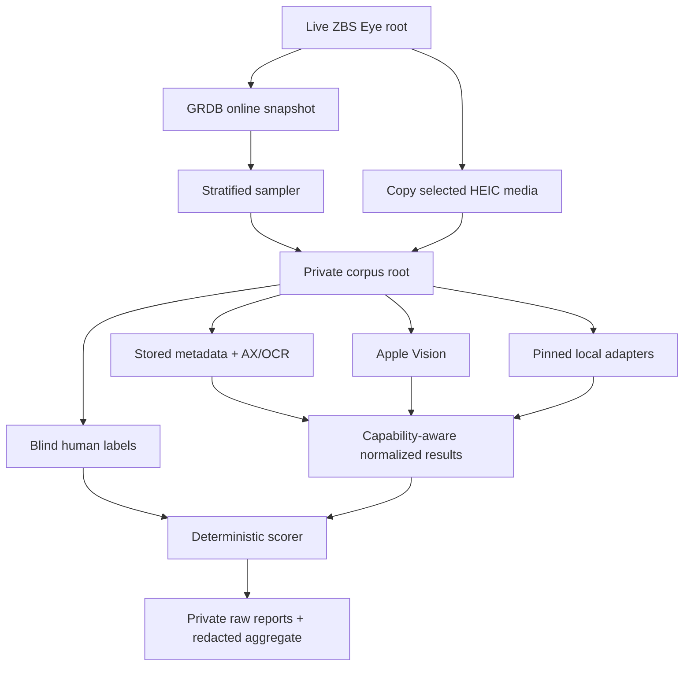
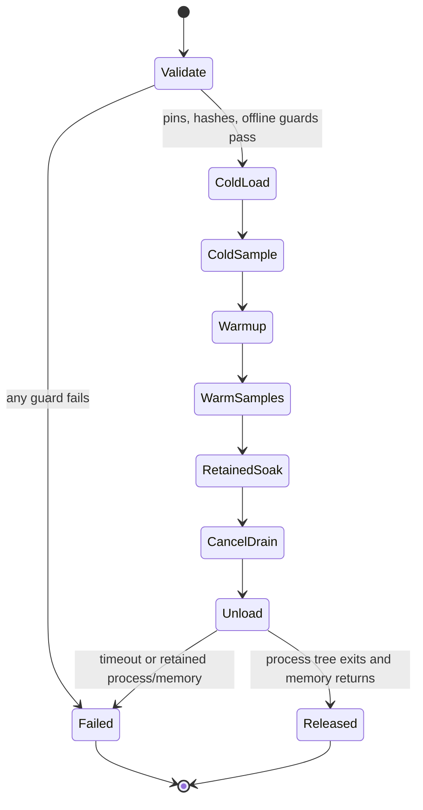
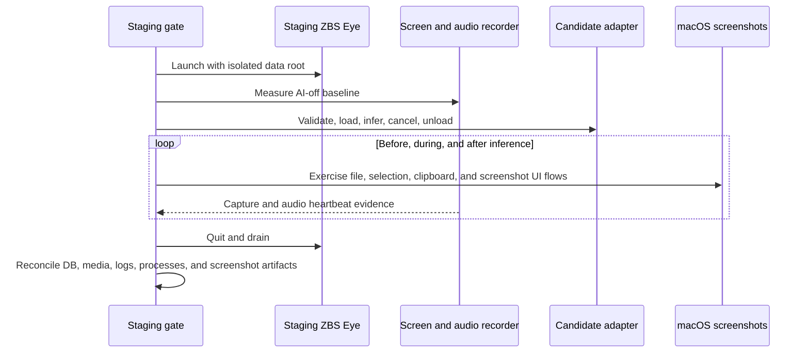

# Screen Understanding Evaluation - Plan

## Goal Capsule

- **Objective:** Build and run a reproducible local-only evaluation that determines whether ZBS Eye should enrich selected timeline frames with Apple Vision, a micro-VLM, a screen parser, or no additional model.
- **Product authority:** The tiny-recorder principle and the user's confirmed no-cloud/no-large-VLM boundary outrank raw caption quality.
- **Execution profile:** Test-first benchmark tooling, private local corpus, human ground truth, pinned offline artifacts, and separate quality and product-footprint lanes.
- **Stop conditions:** Stop on any outbound network access, live-history mutation, private artifact entering git, capture/audio regression, native screenshot regression, or benchmark result that cannot be traced to a pinned runtime and dataset revision.
- **Tail ownership:** This plan ends with an evidence-backed recommendation and reproducible reports. Installing the winning method in ZBS Eye is follow-up work.

---

## Product Contract

### Summary

ZBS Eye will evaluate screen understanding as optional asynchronous enrichment, not as part of capture and not as the Ask model. The benchmark will compare the production metadata/AX/OCR baseline, Apple Vision, several micro-models, a temporal micro-model, and OmniParser using real private history from this Mac. Human annotations are the only quality oracle; cloud and large VLMs are absent from every runner and protocol.

### Problem Frame

The timeline currently knows the active application, window, browser URL, Accessibility text, and adaptive Vision OCR. This is often enough for text-heavy native applications, but it can miss the semantic meaning of canvas, image, video, game, and sparse Electron screens. Sending screenshots to a large VLM would increase latency, memory, cost, and privacy exposure, contradicting the product's promise to remain tiny and local.

The choice cannot be made from parameter count or generic benchmarks. ZBS Eye needs evidence from its own stored frames, the production capture envelope, and the user's machine. A candidate is useful only if it adds grounded timeline facts while releasing memory promptly and leaving screen capture, microphone, system audio, and macOS screenshots unaffected.

### Requirements

**Private corpus and ground truth**

- R1. Dataset preparation must create a one-way isolated corpus from a GRDB online snapshot and copied historical media without mutating the live database or media tree.
- R2. Private frames, labels, raw outputs, captions, source timestamps, and absolute source paths must remain under a gitignored benchmark root and never leave the Mac.
- R3. Human labels must be created before candidate outputs are revealed and must capture required facts, important visible text, forbidden inferences, meaningful changes, ambiguity, and abstention.
- R4. The qualification corpus must contain approximately 200 single-frame cases and 100 temporal pairs, stratified by application class, language, text density, visual content, display, and change type.
- R18. Admission-rate and storage projections must use a separate locked naturalistic chronological trace of at least one active day rather than the difficulty-balanced quality corpus.

**Comparison matrix**

- R5. The zero-download baselines must include stored application/window/URL metadata, production AX/OCR, Apple `VNClassifyImageRequest`, and deterministic hybrids of those signals.
- R6. The single-frame model matrix must include Florence-2-base, SmolVLM-256M-Instruct, LFM2-VL-450M, and Apple FastVLM-0.5B as a research-only reference.
- R7. The temporal matrix must include SmolVLM2-256M-Video-Instruct on coherent `BEFORE`/`AFTER` pairs with hard `NO_CHANGE` negatives.
- R8. The structured-screen matrix must include OmniParser v2 while preserving its region/icon output instead of presenting it as a free-form captioner.
- R9. Cloud adapters, remote inference, and large VLMs must be structurally prohibited by protocol validation and runner tests.

**Fair quality and footprint measurement**

- R10. Every method must preserve raw output and emit a capability-aware normalized result containing only fields it genuinely supports: summary, atomic facts, visible text, labels, regions, change facts, confidence or abstention, errors, and runtime metadata.
- R11. Quality must be reported per stratum and capability using atomic fact precision/recall, hallucination rate and severity, critical text/entity recall, normalized OCR error, scene/action usefulness, change precision/recall, and abstention correctness.
- R12. Official-checkpoint quality and product-footprint runtime must remain separate result lanes and must not be collapsed into a single model score.
- R13. Product-footprint runs must measure the complete process tree: artifact/runtime size, cold load and first result, warm latency, p50/p95, CPU, peak physical footprint, retained growth, unload latency/release fraction, and energy or thermal data where observation is stable.
- R14. Admission policies must be evaluated as products: baseline only, always enrich, AX/OCR-insufficient, meaningful pixel change, scene boundary, and an idle/budgeted hybrid.
- R19. Product qualification must pre-register a cold p95 of at most 10 seconds, warm end-to-end p95 of at most 3 seconds, at most 2 GiB incremental peak physical footprint, at most 100 MiB retained growth, and at least 90% memory release within 10 seconds.
- R20. A downloaded model may become quality-qualified only if its own shipping-runtime output beats the best zero-download baseline by at least 10 percentage points on grounded usefulness in a predeclared weak stratum and 3 points overall, while critical-text recall drops by no more than 2 points and severity-weighted hallucination rises by no more than 1 point; underpowered or overlapping results are inconclusive, not wins.

**Coexistence and decision**

- R15. Each product-feasible finalist must pass three bracketed AI-off/candidate/AI-off staging repetitions with real ScreenCaptureKit, AX/OCR, GRDB ingest, all four microphone/system-audio combinations, and native macOS screenshot flows before it can be recommended.
- R16. Failures, timeouts, malformed output, OOM, sleep/wake, display change, storage loss, cancellation, or adapter crashes must skip enrichment and leave recording uninterrupted.
- R17. The final recommendation must present quality-qualified, footprint-qualified, coexistence-qualified, and legally distributable sets separately; `baseline + Vision` with no downloaded model is a valid winner.
- R21. Public artifacts must pass an allowlisted declassification transform and may contain only aggregate metrics, approved method/stratum names, licensing facts, and protocol/corpus/report hashes—never frames, captions, labels, case IDs, timestamps, paths, raw errors, or undersized strata.
- R22. Private corpora and raw results must use owner-only permissions, remain excluded from Git, Spotlight, cloud sync, and automatic backup, and be purged 30 days after the final decision unless the operator explicitly moves them to a declared encrypted archive.

### Key Flows

- F1. Prepare and label the private corpus
  - **Trigger:** The operator supplies an explicit ZBS Eye source root and a separate benchmark root.
  - **Steps:** Create a consistent database snapshot, select stratified cases, copy only referenced HEIC media, preserve the separate locked naturalistic active-day trace, remove unsafe cases, label without model output, adjudicate ambiguity, and lock hashes and splits.
  - **Outcome:** A private versioned corpus with no live paths in its portable manifest.
  - **Covered by:** R1-R4, R18.
- F2. Run the offline comparison
  - **Trigger:** Pinned model artifacts and isolated runtimes already exist locally.
  - **Steps:** Validate offline state and hashes, execute each capability lane serially, preserve raw results, normalize supported fields, score against blind labels, replay admission policies on the locked naturalistic trace, enforce the pre-registered product envelope, and write atomic reports.
  - **Outcome:** Reproducible per-method and per-stratum quality and resource evidence.
  - **Covered by:** R5-R14, R18-R19.
- F3. Qualify coexistence
  - **Trigger:** A method is both useful and feasible in the product-footprint lane.
  - **Steps:** Establish an AI-off staging baseline, repeat real capture/audio/screenshot workloads through load/inference/unload, reconcile DB/media, and compare regressions.
  - **Outcome:** A fail-closed physical report that cannot be confused with the existing synthetic writer gate.
  - **Covered by:** R15-R16.
- F4. Select the product strategy
  - **Trigger:** Quality, footprint, coexistence, and licensing reports are complete.
  - **Steps:** Build a Pareto table, compare admission policies, identify methods clearing every applicable gate, and record whether no model wins.
  - **Outcome:** A bounded recommendation for a later product-integration plan.
  - **Covered by:** R17.

### Acceptance Examples

- AE1. Given a live database with active WAL writes, when corpus preparation runs, then it reads from an online snapshot, copies selected immutable media, and leaves live row/media counts unchanged.
- AE2. Given a screenshot containing a visible OpenRouter keychain error, when a candidate adds unsupported intent or invents a successful connection, then the forbidden inference is scored as a hallucination even if the sentence sounds plausible.
- AE3. Given two frames from different displays or unrelated scenes, when temporal pairing runs, then the pair is rejected rather than scored as a meaningful change.
- AE4. Given a candidate crash during enrichment, when the staging recorder remains active, then screen/audio ingestion continues and the adapter process is drained without a retry loop.
- AE5. Given strong quality from a method that retains memory or breaks `Command-Shift-3/4/5`, when the final Pareto table is produced, then that method is excluded from the product-qualified set.

### Success Criteria

- The locked test split contains at least 60 single-frame cases and 30 temporal pairs that were never used for prompt, adapter, or admission-policy tuning; each decision-critical primary stratum has at least 15 cases, otherwise its conclusion is explicitly inconclusive.
- Every matrix entry produces either a complete auditable report or an explicit unsupported/failed result; silent skips are failures.
- All runs prove offline execution, pinned artifact identity, deterministic decoding where supported, zero retries, and atomic report writes.
- Quality reports expose per-stratum failures rather than only macro averages.
- A concealed 15% duplicate-label subset reaches at least 90% fact-level agreement and 0.80 decision-level agreement before candidate output is scored; otherwise affected comparisons remain inconclusive.
- A finalist returns close to the AI-off physical-footprint baseline after unload and meets thresholds defined before the qualification run.
- The staging gate records zero DB mismatches, capture failures, audio drops, and native screenshot failures; steady-state capture/ingest p95 regresses by at most 10% and no active gap exceeds 6 seconds.
- The product-footprint lane meets R19 on the exact qualified machine, or the method is excluded from the product-qualified set.

### Scope Boundaries

**In scope**

- Private dataset extraction, human labeling, protocol locking, adapters, scoring, performance measurement, admission-policy replay, staging coexistence, and recommendation reporting.
- Research evaluation of FastVLM under Apple AMLR terms.
- Synthetic public fixtures sufficient to test the harness without private history or model weights.

**Outside this plan**

- Shipping any model, adding model-download UI, changing AI provider settings, generating production captions, or writing enrichment into the production database.
- Cloud vision, remote APIs, large VLMs, model-as-judge scoring, or uploading private frames and captions.
- Claiming support for Macs other than the exact machine envelope recorded by the physical benchmark.

### Deferred to Follow-Up Work

- Product integration for the winning method and admission policy.
- Distribution-license approval for research-only or reciprocal-license candidates.
- User-facing controls for screen enrichment and storage of generated timeline facts.
- README and landing-page rewrites after public aggregate benchmark results are available.

---

## Planning Contract

### Key Technical Decisions

- KTD1. **Extend the existing eval discipline.** Reuse versioned protocols, fixture hashes, offline physical-gate evidence, no-retry execution, atomic JSON reports, and explicit limitations from `docs/evals/` and `scripts/verify-local-ai.sh`.
- KTD2. **Snapshot through a side-effect-free source seam.** Use an explicit already-resolved source root, a read-only/query-only connection with no migrations, checkpoints, bookmark refresh, directory creation, or fallback, then create the online snapshot used for every selection query.
- KTD3. **Use stored AX/OCR as the historical baseline.** Production OCR ran on the live pre-HEIC image and cannot be reconstructed exactly from stored compressed frames.
- KTD4. **Publish the private corpus atomically.** Build under an owner-only sibling staging directory on local non-sync storage, verify database/media/provenance hashes, then atomically rename; failure removes only staging and never overwrites a sealed corpus.
- KTD5. **Use capability-aware comparison.** Apple Vision labels, OmniParser regions, captions, and temporal changes are scored on separate supported axes rather than coerced into one output or rank.
- KTD6. **Separate architecture quality from product runtime.** The official-checkpoint lane uses canonical precision and processing; the product-footprint lane uses the best feasible Apple Silicon runtime or quantization.
- KTD7. **Isolate model stacks behind JSONL subprocess adapters.** Conflicting Python, ONNX, Core ML, and MLX environments remain outside the application target and cannot widen the shipping dependency graph.
- KTD8. **Treat admission as part of the candidate.** The winning result is a method plus a bounded scheduling policy, not the model with the highest caption score.
- KTD9. **Keep inference off the capture hot path.** All enrichment is preemptible, serial, and replayed asynchronously; capture and ingest win every resource conflict.
- KTD10. **Keep FastVLM research-only.** The benchmark may study it, but its Apple AMLR license excludes product development and it cannot enter the distributable set without separate permission.
- KTD11. **Let no-model win.** A deterministic `metadata + AX + OCR + Vision` hybrid advances if micro-model quality does not justify its footprint or risk.
- KTD12. **Use two corpora for two questions.** The stratified labeled corpus measures usefulness and failure quality; a locked contiguous-day trace measures natural invocation rate, resource demand, and projected storage.
- KTD13. **Sandbox every third-party runtime before private access.** A subprocess environment is not a security boundary: the adapter and all descendants require host-enforced network denial, least-privilege filesystem access, a stripped environment, and malicious canary tests before any private case is opened.
- KTD14. **Declassify public results by schema.** Public benchmark material is generated from an aggregate allowlist rather than hand-redacted prose; the private corpus and raw reports never become publication inputs directly.
- KTD15. **Qualify the actual product runtime.** Canonical checkpoint quality explains architecture potential, but only the exact Apple Silicon runtime and quantization used for footprint testing can enter the product-qualified set.

### High-Level Technical Design

#### Corpus and scoring data flow



The sampler treats image-bearing captures, weak/no-text frames, and context-only AX changes as distinct strata. VLMs are never penalized for context-only records with no pixels. Temporal pairs require the same display, coherent app/scene, a bounded gap, and explicit no-change negatives. The sampler opens and verifies selected media before copying so retention, relocation, or volume loss cannot silently substitute a different file after the database snapshot is taken.

#### Adapter measurement lifecycle



Cross-runtime measurements use total process-tree physical footprint and CPU as the shared comparison. Runtime-specific telemetry may supplement but never replace the common metrics. Model order is counterbalanced, thermal state is recorded, and energy remains informational until a stable non-privileged measurement is available.

#### Physical coexistence sequence



The automated path verifies non-empty output from `/usr/sbin/screencapture`; the qualification checklist separately includes manual `Command-Shift-3`, `Command-Shift-4`, `Command-Shift-4` with clipboard modifier, and `Command-Shift-5` because CLI capture does not prove global hotkey routing.

### Output Structure

```text
tools/screen-understanding-bench/
  README.md
  adapters/
  schemas/
  synthetic-fixtures/
scripts/verify-screen-understanding.sh
docs/evals/screen-understanding-v1.json
docs/SCREEN_UNDERSTANDING_EVAL.md
ZBSEyeTests/ScreenUnderstanding*.swift
build/screen-understanding-dataset/    # private, gitignored
build/screen-understanding-results/    # private, gitignored
```

### Assumptions

- The first qualification targets the current Apple Silicon Mac only; its exact model, memory, OS, SDK, Xcode, source revision, runtime revisions, and thermal/power state are recorded in every physical report.
- The operator will label approximately 200 single frames and 100 temporal pairs in two passes; at least 60 frames and 30 pairs stay blind until all prompts and policies are frozen. A concealed 15% duplicate subset measures intra-rater stability. A separate contiguous active-day trace remains unlabeled except where it intersects the labeled corpus.
- English is the common generation language because several candidates are English-only; Russian and mixed-script text preservation are scored separately from caption fluency.
- Energy is reported when a stable facility is available but does not gate the first decision. CPU, process-tree footprint, unload, and coexistence remain hard gates.
- The benchmark can add observation hooks to staging-only code paths if external DB/log/process evidence cannot prove a metric. Such hooks must remain inert in normal builds.

### Sequencing

1. Lock protocol, privacy policy, output schema, and synthetic fixtures.
2. Produce and blind-label the private corpus before model outputs are generated.
3. Provision pinned runtimes and weights into a private sealed model root, then prove every adapter sandbox and offline boundary on synthetic malicious fixtures before private access.
4. Run official-checkpoint quality and freeze the quality-qualified set using pre-registered R20 and sample-sufficiency gates.
5. Re-score each feasible Apple Silicon runtime/quantization on the locked test split, then run product-footprint and admission-policy replay only for quality-relevant candidates.
6. Run physical staging coexistence only for product-feasible finalists.
7. Publish the redacted decision matrix and keep raw evidence private.

### Risks and Dependencies

- **Private-history leakage:** Raw captions can reveal more than images. Mitigation: private roots, git-path rejection, opaque case IDs, redacted aggregate export, and no automatic backup of benchmark artifacts.
- **Runtime unfairness:** Preprocessing, precision, or startup semantics can dominate results. Mitigation: separate lanes, preserve canonical processing, record every transform, and include original-resolution plus fixed-long-edge sensitivity runs.
- **Thermal/order contamination:** Sequential models can bias later measurements. Mitigation: counterbalanced order, cooldown, recorded thermal/power state, repeated p50/p95 runs, and clean child exit.
- **Human-label leakage:** Seeing model output can bias ground truth. Mitigation: label first, delayed adjudication, locked split, and explicit ambiguous/unjudgeable cases.
- **Unsupported Mac paths:** Several official releases document Python/CUDA but no native Swift runtime. Mitigation: record unsupported product-footprint status instead of substituting an unverified conversion.
- **Licensing:** FastVLM, OmniParser components, and LFM2 carry non-uniform terms. Mitigation: report benchmark eligibility and redistribution eligibility independently.
- **False coexistence proof:** Unhosted XCTest does not exercise capture hardware. Mitigation: keep synthetic writer and real staging gates separate and label reports honestly.
- **Executable supply chain:** Pinned identity does not make repository code or serialized weights safe. Mitigation: hash every executable dependency, prohibit arbitrary remote-code loading and unsafe pickle-style deserialization, prefer declarative weight formats, and require reviewed vendored exceptions before private access.
- **Public-result leakage:** Hand-redaction can retain captions, paths, identifiers, timestamps, or rare strata. Mitigation: generate public output only through an allowlisted aggregate schema tested with seeded secrets and path-like fixtures.

---

## Implementation Units

### U1. Lock the screen-eval protocol

- **Goal:** Define the immutable benchmark identity, matrix, corpus policy, normalized output capabilities, metrics, runtime lanes, sampling counts, and promotion gates.
- **Requirements:** R3-R14, R17, R19-R22.
- **Dependencies:** None.
- **Files:** `docs/evals/screen-understanding-v1.json`, `ZBSEyeTests/ScreenUnderstandingEvalProtocol.swift`, `ZBSEyeTests/ScreenUnderstandingEvalProtocolTests.swift`, `tools/screen-understanding-bench/schemas/`.
- **Approach:** Mirror `LocalAIPerformanceProtocol` and `LocalAIEvalProtocolTests`; lock revisions, file hashes, offline/no-retry behavior, prompt/task variants, preprocessing disclosure, capability flags, p50/p95 aggregation, R19/R20 promotion gates, minimum decision-cell sizes, runtime-quality tolerances, and report limitations. The protocol validator rejects cloud/large adapters and unpinned artifacts.
- **Execution note:** Start with failing protocol tests for missing hashes, forbidden adapters, mixed quality/footprint scores, and unlocked splits.
- **Patterns to follow:** `docs/evals/local-ai-performance-v1.json`, `ZBSEyeTests/LocalAIPerformanceProtocol.swift`, `ZBSEyeTests/LocalAIEvalProtocolTests.swift`.
- **Test scenarios:**
  - Decode the committed protocol and accept the complete expected method/capability matrix.
  - Reject a cloud endpoint, large-VLM identifier, retry count above zero, missing revision/hash/license, or writable live-root path.
  - Reject a report that merges official-checkpoint and product-footprint scores.
  - Reject temporal capability for a method that declares only single-image input.
  - Reject quality qualification when the exact product runtime was not scored, R20 is missed, a decision-critical cell is underpowered, or human-label reliability is below its floor.
- **Verification:** Fixture tests pass without model weights or private data, and the protocol hash is stable across repeated runs.

### U2. Prepare and lock the private corpus

- **Goal:** Create a safe one-way dataset workflow from real ZBS Eye history and a human-label contract that cannot leak candidate output into ground truth.
- **Requirements:** R1-R4, R18.
- **Dependencies:** U1.
- **Files:** `ZBSEyeTests/ScreenUnderstandingDatasetSupport.swift`, `ZBSEyeTests/ScreenUnderstandingDatasetPreparationTests.swift`, `ZBSEyeTests/ScreenUnderstandingDatasetPolicyTests.swift`, `tools/screen-understanding-bench/schemas/labels.schema.json`, `tools/screen-understanding-bench/synthetic-fixtures/`.
- **Approach:** Resolve the source root once without `StorageLocation` side effects, open it read-only/query-only, and create an online snapshot without migrations or checkpoints. Select only from that snapshot, securely open each selected regular in-root HEIC before streaming and hashing it, and invalidate the entire export on a missing, replaced, truncated, symlinked, or identity-changing file. Build in an owner-only sibling staging directory on local non-sync storage, then atomically seal it after reconciliation. Apply Git, Spotlight, cloud-sync, and automatic-backup exclusions before data copy and verify them after sealing. Cap repeated apps/time blocks for the labeled corpus; separately preserve one naturalistic active-day trace with production cadence, dedup/context-only records, scenes, displays, and AX/OCR prevalence. Record the default 30-day post-decision purge deadline and permit retention only by explicit move to a declared encrypted archive.
- **Execution note:** Prove source/output separation and zero live-row/media changes before allowing the first real corpus export.
- **Patterns to follow:** `ZBSEyeApp/Data/BackupManager.swift`, `ZBSEyeApp/Data/StorageManager.swift`, `ZBSEyeApp/Search/DayActivityRepository.swift`, `ZBSEyeApp/Search/SceneService.swift`.
- **Test scenarios:**
  - Covers AE1. Run a controlled concurrent writer during snapshot/export and prove every source delta belongs to that writer while the exporter changes no row, schema, media file, configuration, checkpoint state, or directory.
  - Reject identical, ancestor, or descendant source/output roots after canonicalization; reject case-insensitive prefix tricks, symlinks, non-gitignored output, CloudDocs/network destinations, absolute manifest paths, traversal outside media root, and unavailable configured volume.
  - Race retention deletion and external-volume disconnect after selection; any missing or changed media invalidates the export without resampling.
  - Cancel at snapshot, selection, media-copy, labeling-state, and seal phases; remove only staging and preserve any existing sealed corpus.
  - Keep context-only AX changes in a baseline-only stratum and exclude them from image-model denominators.
  - Reject cross-display, cross-scene, reversed-time, excessive-gap, and missing-image temporal pairs.
  - Freeze tune/validation/test hashes and reject label edits after the locked split is sealed without a protocol revision.
  - Verify owner-only permissions and Git/Spotlight/sync/backup exclusions; purge only the sealed benchmark root selected by the operator and never the live history root.
- **Verification:** Synthetic dataset preparation is deterministic; the private manifest contains only opaque IDs and hashes; live counts and media hashes are unchanged.

### U3. Implement local adapter isolation

- **Goal:** Run every method through a pinned local adapter without adding model runtimes to the shipping application.
- **Requirements:** R5-R10, R16.
- **Dependencies:** U1-U2.
- **Files:** `tools/screen-understanding-bench/adapters/`, `tools/screen-understanding-bench/sandbox/`, `tools/screen-understanding-bench/README.md`, `ZBSEyeTests/ScreenUnderstandingVisionAdapter.swift`, `ZBSEyeTests/ScreenUnderstandingAdapterContractTests.swift`.
- **Approach:** Define a versioned JSONL handshake for case input, capability declaration, raw output, normalized output, errors, timings, and clean shutdown. Provision every pinned runtime and checkpoint into an explicit private model root before private execution; record source revision, license, hashes, and the complete executable dependency inventory, then seal the root. Prohibit arbitrary remote-code loading and unsafe pickle-style deserialization; unavoidable repository code must be vendored, reviewed, hash-locked, and recorded as an exception. Run the stored baseline and `VNClassifyImageRequest` natively; run Florence, SmolVLM, LFM2-VL, FastVLM, SmolVLM2, and OmniParser in separate pinned subprocess environments. Launch each third-party adapter and all descendants under a host-enforced sandbox with DNS/TCP/UDP/proxy/localhost denial, an ephemeral home/cache, a minimal environment, read-only access only to the current case and sealed model/runtime roots, and write access only to an owner-only per-run result directory. Explicitly deny the live Eye root, unrelated cases, Keychain helpers, browser profiles, SSH/Git/cloud credentials, deadlines, retries, and retained child processes.
- **Execution note:** Implement malformed-output, timeout, crash, cancellation, filesystem-escape, and malicious network-canary tests before any model-backed adapter is allowed to open private data. If the qualification Mac cannot prove an inherited OS-enforced boundary for the full descendant tree, record the adapter as security-unsupported and do not run it on the corpus.
- **Patterns to follow:** `ZBSEyeApp/Connections/ProcessProviderConnection.swift`, `ZBSEyeApp/Connections/BuiltInModelVerifier.swift`, `ZBSEyeTests/LocalAIPhysicalGateEnvironment.swift`.
- **Test scenarios:**
  - Complete handshake, one single-frame case, one temporal case, explicit unsupported capability, and clean exit using synthetic adapters.
  - Reject network-enabled state, floating model revision, hash mismatch, unexpected child process, duplicate case ID, malformed JSON, empty required field, and output after cancellation.
  - A synthetic malicious adapter must fail DNS, direct-IP, proxy, and localhost connections and must be unable to read live history, unrelated cases, browser/SSH/cloud credentials, or write outside its result root.
  - Reject missing executable-dependency hashes, remote-code loading, unsafe serialized weights, an unsealed model root, or an unreviewed vendored-code exception.
  - Covers AE4. Kill an adapter mid-case and verify the controller drains its process tree and records a failure without retry.
  - Verify Apple Vision emits labels/confidence only and OmniParser emits structured regions without fabricated captions.
  - Verify FastVLM is marked research-reference and cannot enter the distributable candidate set.
- **Verification:** All contract/error tests run without weights; each real adapter either passes an offline smoke test or reports unsupported with evidence.

### U4. Add deterministic human-grounded scoring

- **Goal:** Score supported capabilities against blind human labels without a model judge or a misleading single ranking.
- **Requirements:** R3, R10-R12, R17.
- **Dependencies:** U1-U3.
- **Files:** `ZBSEyeTests/ScreenUnderstandingScoring.swift`, `ZBSEyeTests/ScreenUnderstandingScoringTests.swift`, `tools/screen-understanding-bench/schemas/report.schema.json`.
- **Approach:** Before inference, lock required/forbidden fact IDs, critical text/entities, usefulness, meaningful changes, `NO_CHANGE`, ambiguity, and abstention. After inference, a model-identity-blind human maps each atomic candidate claim to a locked fact ID or to unsupported/ambiguous; the deterministic scorer aggregates only those sealed mappings. Preserve raw outputs privately for audit. Measure concealed duplicate-label reliability before revealing method identity, adjudicate disagreements, and make affected comparisons inconclusive below the agreement floor. Report only sufficiently powered primary strata with macro summaries and confidence intervals; never publish intersection cells small enough to identify a case.
- **Execution note:** Build the scorer from adversarial synthetic fixtures before exposing any private labels or model output.
- **Patterns to follow:** `ZBSEyeTests/LocalAIQualityGateV9Tests.swift`, `docs/evals/local-ai-v9.json`.
- **Test scenarios:**
  - Exact and normalized matches for punctuation, case, Unicode, and Russian/English critical text.
  - Covers AE2. Plausible but forbidden intent counts as a hallucination with configured severity.
  - Correct abstention on ambiguous cases is rewarded; confident claims on unjudgeable cases are not silently accepted.
  - Semantically equivalent paraphrases map to the same locked fact ID, while unsupported claims remain hallucinations regardless of wording.
  - Concealed duplicates below the fact-level or decision-level agreement floor block qualification for affected capabilities.
  - Covers AE3. Invalid temporal pairs never reach the delta scorer.
  - Macro results remain unchanged when one common app contributes many duplicate-like cases.
- **Verification:** Fixed synthetic labels produce stable scores across repeated runs and no scorer path invokes a model or network.

### U5. Run quality, footprint, and admission-policy lanes

- **Goal:** Produce reproducible quality reports for every supported method, resource reports for quality-relevant candidates, and determine the cheapest useful admission policy.
- **Requirements:** R11-R14, R16-R20.
- **Dependencies:** U1-U4.
- **Files:** `ZBSEyeTests/ScreenUnderstandingBenchmarkTests.swift`, `ZBSEyeTests/ScreenUnderstandingPerformanceProtocol.swift`, `ZBSEyeTests/ScreenUnderstandingPerformanceProtocolTests.swift`, `scripts/verify-screen-understanding.sh`, `docs/SCREEN_UNDERSTANDING_EVAL.md`.
- **Approach:** Run quality at official checkpoint/precision with canonical processing, then run the exact feasible Mac runtime/quantization over the locked test split through the same human-grounded scorer. A product runtime cannot inherit quality from its canonical checkpoint: it must meet R20 independently and may lose at most 2 points of usefulness or critical-text recall and add at most 1 point of severity-weighted hallucination versus its canonical arm. Only then run product-footprint. Each runtime arm uses at least 20 fresh-process cold samples, 30 warm samples, a 50-inference retained soak, and three counterbalanced blocks over identical case IDs. Measure end-to-end time from HEIC read through normalization, CPU core-seconds, complete descendant-process footprint, runtime-specific accelerator memory when observable, and physical footprint at peak plus 1/10/60 seconds after unload. Record system pressure, swap/compressor, thermal state, power source, and Low Power Mode. Use the labeled corpus for useful-event recall and the naturalistic trace for inferences/hour, resource/hour, and storage projections.
- **Execution note:** Run one bounded probe per adapter before the full matrix; a failed probe is recorded, not retried or hidden.
- **Patterns to follow:** `scripts/verify-local-ai.sh`, `docs/evals/local-ai-performance-v1.json`, `ZBSEyeTests/MLXRuntimeQualificationTests.swift`.
- **Test scenarios:**
  - Script rejects missing explicit dataset/model roots, dirty qualification source, downloads, retries, multiple physical modes, or a skipped expected XCTest.
  - Cold/warm definitions, unreported warmup, nearest-rank p50/p95, process-tree peak, retained growth, unload release fraction, and timeouts are locked by tests.
  - Original-resolution and fixed-long-edge sensitivity arms remain separately labeled.
  - Counterbalanced model order produces the same case set and records cooldown, thermal state, system pressure, swap/compressor, power source, and Low Power Mode.
  - R19 thresholds are fixed before any candidate probe and cannot be edited without a protocol revision.
  - R20 and minimum sample-size gates are fixed before outputs; missed or underpowered comparisons are inconclusive rather than promoted by judgment.
  - The exact runtime/quantization used for footprint testing must carry its own locked-split quality report and stay within canonical-degradation tolerances.
  - Admission replay includes baseline-only, always, AX/OCR-insufficient, meaningful-change, scene-boundary, and idle/budgeted policies without changing labels.
  - The stratified quality corpus cannot produce workload/hour or storage/hour claims; those fields require the locked naturalistic trace.
- **Verification:** Every method has a quality/reference result; quality-relevant candidates also have a product-footprint result, while methods not advanced after quality are recorded as explicitly quality-disqualified rather than unsupported. Reports are atomic and tied to protocol, corpus, source, model, and runtime hashes.

### U6. Qualify real recorder and screenshot coexistence

- **Goal:** Prove finalists coexist with the installed-style staging recorder and macOS screenshot/audio behavior.
- **Requirements:** R15-R17.
- **Dependencies:** U5.
- **Files:** `ZBSEyeTests/ScreenUnderstandingStagingReport.swift`, `ZBSEyeTests/ScreenUnderstandingStagingReportTests.swift`, `scripts/verify-screen-understanding.sh`, `docs/SCREEN_UNDERSTANDING_EVAL.md`; add a staging-build-only explicit root seam in `ZBSEyeApp/Data/StorageLocation.swift`, and modify `ZBSEyeApp/App/AppEnvironment.swift` or `ZBSEyeApp/State/RecordingStore.swift` only if staging-only observation cannot be obtained externally.
- **Approach:** Launch a signed staging app through a staging-build-only explicit data-root override supplied by the gate. Before bootstrap, reject a missing, production-equal, ancestor, descendant, symlinked, or non-empty root and prove the production defaults domain remains unchanged. Run three matched AI-off/candidate/AI-off steady-state blocks per finalist against the same scripted screen workload. Exercise four independent audio states: off/off, mic-only, system-only, and both, with a fixed local audio stimulus so queues, VAD, and transcription are active rather than silent. Keep e5/backfill identically inactive or run matched inactive/active arms. Run cancellation, memory pressure, sleep/wake, display change, OOM, storage loss, and adapter crash as separate recovery blocks so they cannot contaminate steady-state p95. Reconcile DB/media/log/process evidence and exercise automated plus manual native screenshot flows before, during, and after inference.
- **Execution note:** Treat this as a physical opt-in gate; never claim release qualification from the unhosted synthetic coexistence test.
- **Patterns to follow:** `ZBSEyeTests/LocalAIRecorderCoexistenceGateTests.swift`, `docs/LOCAL_AI.md`, `ZBSEyeApp/Audio/SystemAudioCaptureLifecycle.swift`, `docs/bugs/2026-07-11-orphaned-coreaudio-tap.md`.
- **Test scenarios:**
  - Three bracketed AI-off/candidate/AI-off repetitions reconcile screen/audio rows, media files, capture completions/failures/coalescing, ingest p95, audio queues/drops, active gaps, and process footprint under an identical screen workload.
  - Test off/off, mic-only, system-only, and both with fixed local audio; restore the user's prior mode after every run.
  - Covers AE5. Exercise `Command-Shift-3`, `Command-Shift-4` selection, clipboard variant, and `Command-Shift-5`; failure excludes the candidate.
  - Adapter timeout, OOM, crash, volume disconnect, app quit, and cancellation leave capture/ingest running and cleanly drain the adapter.
  - Sleep/wake and display change do not reuse stale capture content or orphan audio/model processes.
  - Missing or unsafe staging-root overrides fail before `StorageLocation` creates or opens anything; production preferences and live rows/media remain byte-for-byte unchanged.
- **Verification:** Each finalist has a signed staging report with explicit limitations, zero reconciliation/screenshot failures, acceptable regression thresholds, and no retained child process or model memory after unload.

### U7. Produce the decision record

- **Goal:** Turn raw evidence into a redacted recommendation that preserves the tiny-product boundary and clearly separates future work.
- **Requirements:** R17, R21-R22.
- **Dependencies:** U4-U6.
- **Files:** `docs/evals/screen-understanding-v1-qualification.md`, `docs/SCREEN_UNDERSTANDING_EVAL.md`, `tools/screen-understanding-bench/schemas/public-report.schema.json`, `ZBSEyeTests/ScreenUnderstandingPublicReportTests.swift`.
- **Approach:** Generate public aggregate quality, footprint, coexistence, and licensing tables only through an allowlisted declassification transform. Permit numeric aggregates, approved method/stratum enums, licensing facts, and protocol/corpus/report hashes; reject all case-level text, IDs, timestamps, paths, labels, captions, raw errors, undersized strata, and seeded secret/path canaries. Identify the Pareto set, the recommended admission policy, disqualified candidates and reasons, unresolved limitations, and whether baseline plus Vision wins. Keep full raw reports in the private result root and record their hashes only.
- **Test expectation:** Seed private fixtures with secret-like strings, absolute paths, timestamps, raw errors, captions, and tiny strata; prove the public transform rejects or aggregates every forbidden field before documentation is written.
- **Verification:** A reviewer can trace every recommendation to protocol/corpus/report hashes, and the document does not imply production integration or redistribute restricted artifacts.

---

## Verification Contract

| Gate | Applies to | Done signal |
|---|---|---|
| `scripts/verify-screen-understanding.sh --fixtures` | U1-U5 | Protocol, privacy, dataset, adapter, scorer, performance, and script tests pass without private data or weights. |
| `scripts/verify-screen-understanding.sh --prepare-dataset` | U2 | Private corpus reconciles against its snapshot, contains no source paths, and leaves live history unchanged. |
| `scripts/verify-screen-understanding.sh --quality-matrix` | U3-U5 | Every method produces a pinned offline report or explicit unsupported result; actual product runtimes satisfy R20 and sample/reliability gates independently. |
| `scripts/verify-screen-understanding.sh --performance-matrix` | U3, U5 | Product-feasible adapters complete locked 20-cold/30-warm/50-soak/cancel/unload evidence and R19 thresholds with no hidden retries. |
| `scripts/verify-screen-understanding.sh --staging-coexistence` | U6 | Three signed bracketed staging repetitions pass real capture, four audio states, reconciliation, process cleanup, regression thresholds, and screenshot checks. |
| `scripts/verify.sh` | All code units | Generated Debug app builds with pinned packages and ordinary deterministic tests remain green. |
| Repository privacy audit | U2-U7 | Git contains only protocol, code, synthetic fixtures, allowlisted aggregate results, and hashes; no private frame/label/raw-output/model artifact is tracked, and seeded secret/path fixtures cannot cross the declassification transform. |

Physical model gates use pre-downloaded sealed model roots, `HF_HUB_OFFLINE=1`, `TRANSFORMERS_OFFLINE=1`, an OS-enforced descendant-process network/filesystem sandbox, Release configuration, a clean source revision, and zero retries. Offline flags are advisory only; the malicious DNS/direct-IP/proxy/localhost and filesystem-escape canaries are the qualification evidence. A physical gate that cannot prove one of these conditions fails rather than downgrading to a non-qualifying success.

---

## Definition of Done

- U1-U7 are implemented and their cited deterministic tests pass.
- The 200-frame/100-pair private corpus is versioned, stratified, blind-labeled, reconciled, and absent from git.
- A separate locked active-day trace supports natural invocation-rate, resource/hour, and storage projections without borrowing prevalence from the quality corpus.
- All required methods are evaluated or carry an explicit evidence-backed unsupported result.
- Quality and footprint lanes remain independent, with per-stratum results and no model judge or large/cloud VLM.
- The exact product runtime/quantization is scored independently, clears R20, and does not inherit quality from an official checkpoint.
- Decision-critical cells meet pre-registered sample-size and human-label reliability floors or are explicitly inconclusive.
- At least one strategy reaches the final decision table; `no additional model` is accepted if none clears the gates.
- Every recommended product candidate has passed real staging coexistence with independent mic/system-audio states and native macOS screenshots.
- Every recommended product candidate meets the pre-registered R19 latency and footprint envelope; steady-state staging blocks meet the capture/ingest regression and active-gap limits.
- The qualification record states licensing status separately from technical performance and keeps FastVLM research-only.
- Full private reports remain local; the checked-in decision record is aggregate, redacted, and hash-traceable.
- Every third-party runtime passes the inherited OS sandbox and malicious network/filesystem canaries before it sees private data; pinned-but-unreviewed executable code and unsafe serialized weights are rejected.
- Private corpus/results stay owner-only and outside Git, Spotlight, sync, and backup, then are purged on the recorded deadline unless explicitly archived encrypted.
- Public results are generated only by the allowlisted declassification transform and contain no personal corpus material or case-level derivatives.
- Normal ZBS Eye capture, data-path, single-writer, no-egress, Swift 6 concurrency, build, and release invariants remain intact.
- Abandoned adapters, temporary conversions, unpinned environments, dead-end instrumentation, and downloaded artifacts outside the declared private roots are removed before completion.

---

## Appendix

### Sources and Research

**Repository anchors**

- `ZBSEyeApp/Capture/FramePipeline.swift` — production ScreenCaptureKit, dedup, HEIC, and Vision OCR behavior.
- `ZBSEyeApp/Capture/CaptureCoordinator.swift` — metadata/AX/adaptive-OCR baseline and context-only capture behavior.
- `ZBSEyeApp/Search/DayActivityRepository.swift` and `ZBSEyeApp/Search/SceneService.swift` — chronological reads, scene grouping, representative sampling, and heuristic no-LLM summaries.
- `ZBSEyeTests/LocalAIEvalProtocolTests.swift`, `ZBSEyeTests/LocalAIPhysicalGateEnvironment.swift`, and `docs/evals/local-ai-performance-v1.json` — immutable protocol, provenance, and performance-gate patterns.
- `ZBSEyeTests/LocalAIRecorderCoexistenceGateTests.swift` and `docs/LOCAL_AI.md` — baseline-vs-inference reconciliation and the explicit boundary between synthetic and physical coexistence.
- `docs/superpowers/specs/2026-07-03-runtime-footprint-design.md` — measured IOSurface/model-residency costs and the async/unload posture.
- `docs/bugs/2026-07-11-orphaned-coreaudio-tap.md` — evidence-first system-audio diagnosis and teardown cautions.

**Primary external sources**

- [Apple VNClassifyImageRequest](https://developer.apple.com/documentation/vision/vnclassifyimagerequest)
- [Microsoft Florence-2-base](https://huggingface.co/microsoft/Florence-2-base)
- [Hugging Face SmolVLM-256M-Instruct](https://huggingface.co/HuggingFaceTB/SmolVLM-256M-Instruct)
- [Liquid AI LFM2-VL-450M](https://huggingface.co/LiquidAI/LFM2-VL-450M)
- [Apple FastVLM](https://github.com/apple/ml-fastvlm) and [model license](https://github.com/apple/ml-fastvlm/blob/main/LICENSE_MODEL)
- [Hugging Face SmolVLM2-256M-Video-Instruct](https://huggingface.co/HuggingFaceTB/SmolVLM2-256M-Video-Instruct)
- [Microsoft OmniParser](https://github.com/microsoft/OmniParser)
