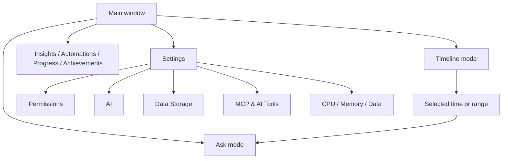
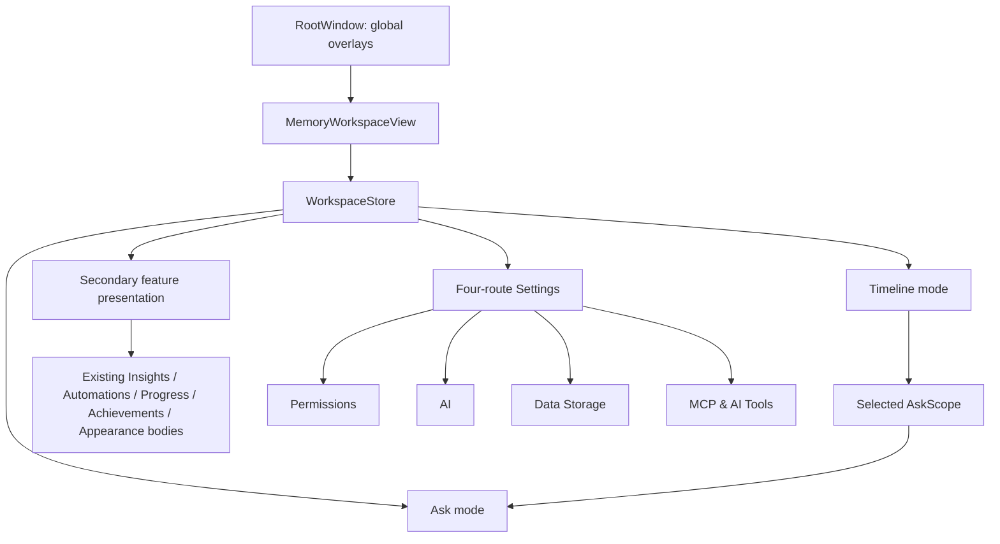
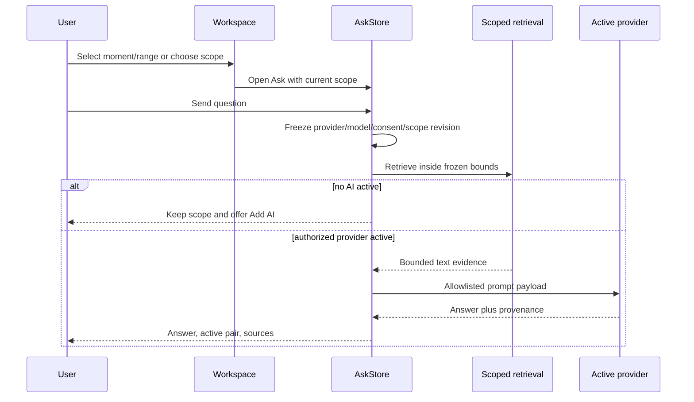
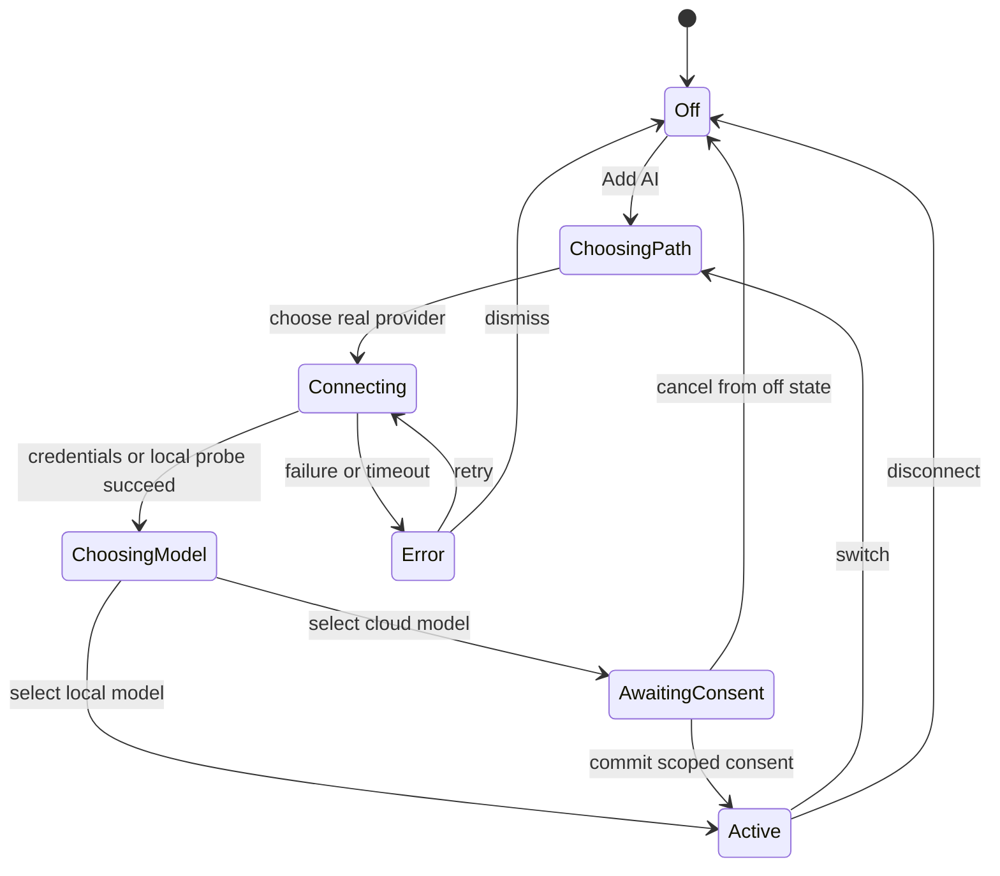
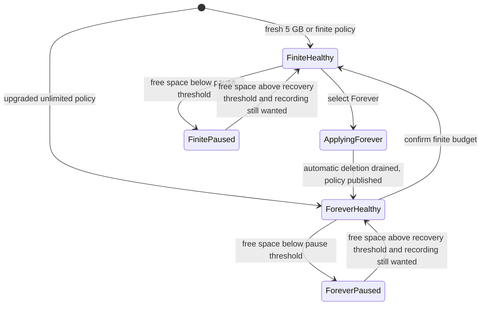

# Tiny Timeline-first Product Surface - Plan

## Goal Capsule

- **Objective:** Turn ZBS Eye into a small, release-ready macOS utility centered on one interactive Timeline with contextual Ask, while retaining the product's useful and delightful capabilities without exposing them as an administration dashboard.
- **Authority hierarchy:** The Product Contract defines behavior and scope; the Planning Contract defines implementation boundaries; repo invariants in `AGENTS.md` govern data safety, concurrency, security, signing, and storage paths; a conflict stops execution for review rather than being guessed through.
- **Supersession:** This contract supersedes the headline/default-local-AI product behavior and standalone AI Models screen in `docs/plans/2026-07-10-001-feat-built-in-local-ai-provider-plan.md`. The implemented provider infrastructure remains reusable where it supports this contract.
- **Execution profile:** Protect retention and low-disk behavior first, add contract-level tests before UI replacement, reuse existing provider and feature implementations, and install only one stable-signed release candidate at the verification tail.
- **Stop conditions:** Stop if work would silently shorten an existing retention policy, allow raw media egress, activate AI without explicit action, remove an existing capability without a reachable replacement, change the stable signing/TCC identity mid-run, or require product behavior outside R1-R40.
- **Tail ownership:** The implementing run owns code, tests, localization, release build, stable installed-app smoke, review fixes, and cleanup of abandoned approaches. README, landing, screen-understanding evaluation, and post-release optimization remain follow-up work.

---

## Product Contract

### Summary

ZBS Eye will become a Timeline-first application with two working modes, Timeline and Ask, in one main window.
Settings will expose only Permissions, AI, Data Storage, and MCP & AI Tools, followed by one honest resource-usage line.
Generative AI remains off until the user explicitly installs or connects it.
The implementation reuses the existing recorder, retrieval, provider, MCP, and reward systems, adding only the state and safety boundaries needed to make that compact surface truthful and releasable.

### Problem Frame

The current application presents eleven peer destinations and repeats setup across AI Models, Connections, Settings, Ask, Daily Insights, Automations, Progress, and Appearance.
The capabilities are useful, but the navigation makes a tiny recorder feel like a suite of loosely connected administration tools.

AI setup is the clearest failure of that shape.
The screen combines an active selection, a built-in-model hero, provider grids, local-server discovery, model catalogs, authentication, and consent controls.
An automatically discovered local server can appear easier to select than an unconnected cloud provider, while connection failures leave the user inside a large technical surface.

The product's core value is simpler: Eye quietly records, the user moves through memory in time, and either the in-app Ask mode or an external agent can answer from that memory.
Settings should contain only decisions Eye cannot safely make for the user.

### Key Decisions

- **Timeline is the product, not one destination among many.** The main window is organized around captured time, search, selection, and Ask about the selected context.
- **Capabilities stay; navigation weight goes.** Insights, Automations, Progress, Achievements, and Appearance remain accessible from the main experience but stop competing as permanent sidebar destinations.
- **The achievement art is preserved.** The existing badge gallery, unlock presentation, shimmer, tiers, and reward character remain intact; only its entry point changes.
- **Settings has four top-level choices.** Permissions, AI, Data Storage, and MCP & AI Tools are the complete primary settings surface.
- **AI is optional.** A fresh install records, indexes, searches, and presents Timeline without downloading a generative model, requiring an account, or running generative inference in the background.
- **Provider and model remain distinct.** The user chooses a provider path, connects a provider, then chooses from that provider's models with an optional recommendation.
- **Retention is one understandable policy.** A single Keep Media slider replaces independent time and size controls.
- **Low disk never silently sacrifices history.** Finite policies prune only when their selected media budget is exceeded; critically low free space pauses capture for every policy. Forever never triggers automatic history deletion.
- **Tiny is observable.** Settings shows current CPU, memory, and stored-data use in one compact line rather than a diagnostics dashboard.

### Actors

- A1. **Owner:** Installs Eye, wants it to record quietly, browses their own Timeline, and expects the application to remain lightweight and understandable.
- A2. **In-app question asker:** Uses Ask against a selected day, time, range, or moment and chooses whether to add AI when it is first needed.
- A3. **External agent user:** Connects Codex, Claude, Cursor, or another MCP-capable harness to search and read the memory Eye collected.
- A4. **AI choice-oriented user:** Chooses a one-click local model, an existing coding-assistant account, an API provider, or a user-managed local server without losing track of the active provider and model.

### Requirements

**Main product surface**

- R1. The main window presents Timeline and Ask as two modes of one memory workspace rather than separate sidebar products.
- R2. Timeline remains fully usable without generative AI and supports captured-history search, time navigation, moment selection, playback, and inspection.
- R3. Ask uses the selected Timeline context when one exists and otherwise lets the user choose the time scope before sending a question.
- R4. Activities become a Timeline representation or filter rather than a permanent top-level destination.
- R5. Insights, Automations, Progress, and Achievements remain directly reachable from the main workspace without permanent sidebar entries.
- R6. Appearance rewards remain reachable from the rewards or overflow path without becoming a primary Settings category.
- R7. The existing achievement gallery and unlock visuals retain their current visual treatment and behavior.
- R8. Recording state stays visible and controllable from the main window in every mode.

**Compact Settings**

- R9. Settings presents exactly four primary rows: Permissions, AI, Data Storage, and MCP & AI Tools.
- R10. Each row shows one current-state summary and opens a focused detail surface rather than expanding every control in the main Settings view.
- R11. Permissions owns Screen Recording, Accessibility, Microphone, Speech Recognition, audio capture behavior, and an independent system-audio toggle.
- R12. Data Storage owns the current location, used and free space, the Keep Media policy, relocation, and destructive storage actions behind clear secondary affordances.
- R13. Backup, history import, browser-history import, language override, launch troubleshooting, diagnostics, support, and repair remain available only where still necessary, but do not render as primary Settings cards.
- R14. Local API examples and raw bearer-token management do not compete with the MCP setup in the primary product surface.
- R15. Settings shows current CPU, memory, and total stored-data use in one low-frequency, glanceable line whose own measurement does not materially increase the footprint.
- R16. Privacy copy states that capture and storage remain local and that any cloud processing is an explicit opt-in tied to the selected provider.

**Optional AI**

- R17. A fresh install has no active generative provider and downloads no generative model automatically.
- R18. Opening Ask without an active provider shows a small contextual Add AI action and never redirects the user to a standalone AI Models screen.
- R19. AI setup is also reachable from the AI row in Settings and uses the same flow as contextual setup from Ask.
- R20. AI setup first offers three paths: On this Mac, Account or Code, and API Provider.
- R21. On this Mac offers the one-click built-in local model, Ollama, LM Studio, and an advanced compatible local endpoint without treating any of them as the default.
- R22. Account or Code may offer OpenAI via Codex, Claude Code, GLM Code, Kimi Code, and Qwen Code when the corresponding supported connection is available.
- R23. API Provider may offer OpenRouter, Anthropic, Groq, xAI/Grok, GLM, Kimi, Qwen, OpenAI, and a custom OpenAI-compatible endpoint.
- R24. The provider list shows providers as peer entities; a connected provider then owns its available models and recommended model.
- R25. One active `Provider · Model` pair powers in-app generative features, and the active pair remains visible from Ask and Settings without a global provider card wall.
- R26. Connecting, loading, selecting, consenting, retrying, and disconnecting expose finite honest states with actionable errors; no connection action may spin indefinitely without a timeout and result.
- R27. Activating a cloud-backed model requires explicit consent naming the recipient of history excerpts, while cancelling preserves the previous off or active state.
- R28. Removing or disconnecting AI leaves capture, Timeline, stored data, and non-generative search working normally.

**Data retention**

- R29. Data Storage exposes one discrete Keep Media slider with `5 GB`, `10 GB`, `20 GB`, `50 GB`, and `Forever` positions.
- R30. The active local-storage default maps to `5 GB` without deleting data merely because the redesigned UI appears.
- R31. A finite position disables time-based deletion and removes the oldest captured frames and audio only when recorded media exceeds the selected budget.
- R32. Forever disables scheduled and emergency automatic history deletion and warns that unlimited media can increase disk usage.
- R33. Critically low free space pauses screen and audio capture for every policy, preserves existing history, reports the pause honestly, and resumes only after the disk guard is healthy.
- R34. Legacy retention values migrate conservatively so the new policy never shortens retention during normalization.
- R35. The slider budget covers captured frames and audio; the index and models are shown in storage totals but are not silently counted as captured-media quota.

**MCP and release truth**

- R36. MCP & AI Tools shows whether the local MCP path is ready and provides copy-ready setup for supported agent harnesses without requiring the user to understand the REST API.
- R37. The setup explains that the harness reads the same local memory and identifies the installed application path it will invoke.
- R38. The primary MCP flow does not reveal a bearer token because the stdio connection does not require one.
- R39. Existing local REST access remains available for compatibility but moves to an advanced or developer path.
- R40. The release candidate is verified as an installed, consistently signed app with working capture, Timeline, AI off-state, at least one connected AI path, MCP retrieval, retention policy, and system-audio opt-out.

### Key Flows

- F1. **Use Eye without AI**
  - **Trigger:** A1 opens a fresh install after granting capture permissions.
  - **Actors:** A1.
  - **Steps:** Eye records; Timeline fills; the user searches, scrubs, selects, and inspects moments; no generative setup interrupts the flow.
  - **Outcome:** The core product is useful without an account or generative model.
  - **Covered by:** R1-R2, R8, R17, R28.

- F2. **Ask about selected time**
  - **Trigger:** A2 selects time in Timeline and switches to Ask.
  - **Actors:** A2.
  - **Steps:** Ask carries the selected context; if AI is off, the user chooses Add AI or dismisses setup; after connection, the question runs against the chosen scope.
  - **Outcome:** Ask extends Timeline instead of becoming a separate configuration journey.
  - **Covered by:** R1, R3, R18-R28.

- F3. **Configure only what matters**
  - **Trigger:** A1 opens Settings.
  - **Actors:** A1.
  - **Steps:** The user sees four rows and the resource line; a row opens one focused detail; rare support and migration tools stay out of the primary hierarchy.
  - **Outcome:** Settings remains understandable at a glance without deleting real capabilities.
  - **Covered by:** R9-R16.

- F4. **Choose Keep Media**
  - **Trigger:** A1 opens Data Storage and changes the slider.
  - **Actors:** A1.
  - **Steps:** Eye explains the chosen finite budget or Forever; the new policy persists conservatively; pruning follows only the selected policy; low disk pauses capture instead of deleting beyond it.
  - **Outcome:** The user can predict when Eye may delete captured media.
  - **Covered by:** R29-R35.

- F5. **Connect an external agent**
  - **Trigger:** A3 opens MCP & AI Tools.
  - **Actors:** A3.
  - **Steps:** Eye shows readiness and a copy action for the chosen harness; the user adds the configuration; the harness searches and reads the local memory.
  - **Outcome:** An agent can answer questions from Eye without turning the app into a developer console.
  - **Covered by:** R36-R39.

- F6. **Open a delightful secondary capability**
  - **Trigger:** A1 chooses Achievements, Insights, Automations, Progress, or Appearance from the main workspace.
  - **Actors:** A1.
  - **Steps:** Eye presents the existing focused capability without adding another permanent navigation layer; closing it returns to the same Timeline context.
  - **Outcome:** Richness remains without dashboard sprawl.
  - **Covered by:** R5-R7.

### Acceptance Examples

- AE1. **Covers R1-R2, R17.** Given a fresh install with no generative provider, when the user records for five minutes, then Timeline becomes searchable and scrubbable without downloading or configuring a generative model.
- AE2. **Covers R3, R18-R20.** Given selected Timeline context and AI off, when the user opens Ask, then Eye preserves that context and offers one dismissible Add AI action rather than navigating to AI Models.
- AE3. **Covers R20-R25.** Given the user chooses API Provider and connects OpenRouter, when models load, then the models and recommendation appear inside OpenRouter and the chosen result is displayed as `OpenRouter · Model`.
- AE4. **Covers R26-R28.** Given a Codex sign-in, API-key save, model-load, or local-server connection fails or times out, then Eye stops the busy state, shows the actual failed stage with retry guidance, and leaves Timeline and recording usable.
- AE5. **Covers R9-R16.** Given Settings is opened at the minimum supported window size, then the four primary rows and CPU, memory, and data line are visible without a wall of service cards.
- AE6. **Covers R11.** Given Microphone is enabled and System Audio is disabled, when a meeting is detected, then Eye may capture the microphone but does not capture playback or other participants through system audio.
- AE7. **Covers R29-R31, R34.** Given the existing persisted 5 GB local policy, when the redesigned app first opens, then the slider shows 5 GB and no migration immediately deletes media.
- AE8. **Covers R32-R33.** Given Forever is selected and free space becomes critical, when the disk guard fires, then capture pauses, no automatic retention task deletes old history, and the UI explains how to resume.
- AE9. **Covers R31, R33.** Given 10 GB is selected and captured media exceeds 10 GB while free space remains healthy, when scheduled retention runs, then only the oldest captured media is pruned to the selected budget.
- AE10. **Covers R36-R38.** Given the app is installed in the expected location, when a user copies the Codex or Claude MCP setup, then the harness starts the local MCP server and can retrieve a known Timeline result without a bearer-token step.
- AE11. **Covers R5-R7.** Given the user opens Achievements from the main workspace, then the existing gallery, badge art, unlock state, shimmer, and reward details render unchanged and closing it returns to the prior Timeline context.
- AE12. **Covers R40.** Given the signed release candidate is installed, when the release smoke path runs, then capture coexists with macOS screenshots, System Audio can be disabled, Timeline records and retrieves a known moment, AI off remains valid, one AI path answers, and MCP retrieves the same memory.

### Success Criteria

- A new user reaches a working Timeline after permissions without encountering AI setup.
- The main product no longer presents eleven peer navigation destinations or standalone AI Models and Connections screens.
- Settings communicates its complete primary hierarchy in four rows plus one resource line.
- AI setup always makes provider, model, active state, consent, and failure stage understandable.
- No generative model is downloaded or activated without an explicit user action.
- `Forever` is selectable and never permits automatic history deletion.
- Disabling System Audio prevents system-audio capture without disabling microphone capture.
- Achievements retain their current visual quality and remain easy to find.
- A supported external agent can search and read collected memory through a copy-ready MCP setup.
- The installed release candidate preserves recording, macOS screenshot coexistence, Keychain access, and stable TCC permissions.

### Scope Boundaries

**In scope**

- Main-window navigation and presentation restructuring around Timeline and Ask.
- Contextual entry points for existing secondary capabilities.
- Compact four-row Settings with focused detail surfaces and live footprint line.
- Optional AI setup and active provider-model presentation using existing provider infrastructure.
- Keep Media slider, conservative retention migration, and pause-only low-disk behavior.
- Separate System Audio control inside Permissions.
- MCP setup consolidated into the compact product surface.
- Automated and installed-app verification needed to ship the redesigned surface safely.

**Deferred to follow-up work**

- README, landing page, screenshots, and launch copy rewritten around the shipped Timeline-first product.
- Screen-understanding and micro-VLM evaluation described by `docs/plans/2026-07-13-001-feat-screen-understanding-eval-plan.md`.
- Further optimization work driven by measured resource regressions after the new resource line exists.

**Outside this product's identity**

- A provider marketplace, model leaderboard, or permanent AI administration console.
- A large VLM or generative model installed or kept resident by default.
- Cloud capture storage, mandatory account creation, silent history egress, or a subscription control plane.
- Separate dashboard products for insights, progress, automation, and connections.
- Destructive low-disk self-healing that overrides the user's selected retention promise.

### Dependencies / Assumptions

- The existing Timeline, provider store, built-in model lifecycle, MCP server, retention manager, audio settings, rewards, and achievement surfaces are reusable behind the new hierarchy.
- Existing provider integrations may require correctness fixes before they satisfy the finite-state and installed-app acceptance examples.
- Lightweight search and indexing may continue without a generative provider; this contract changes generative AI defaults, not the established local retrieval pipeline.
- Rare controls removed from the primary Settings hierarchy remain reachable through focused detail, Help, or an advanced path when removing them would strand an existing capability.
- Developer ID signing and the data-protection Keychain remain prerequisites for trustworthy installed-app verification.

### Sources / Research

- `ZBSEyeApp/App/AppEnvironment.swift` and `ZBSEyeApp/Views/RootWindow.swift` — current eleven-destination navigation and view routing.
- `ZBSEyeApp/Views/Timeline/TimelineView.swift` and `ZBSEyeApp/Views/Ask/AskView.swift` — existing Timeline and separate Ask flows.
- `ZBSEyeApp/Views/Settings/SettingsView.swift` — current long Settings surface, retention controls, System Audio toggle, and local API duplication.
- `ZBSEyeApp/Views/AIModels/ProviderFirstAIModelsScreen.swift` and `ZBSEyeApp/Views/AIModels/AIModelsPresentation.swift` — current provider wall and provider grouping.
- `ZBSEyeApp/Views/Connections/ConnectionsView.swift` — existing copy-ready REST and MCP material.
- `ZBSEyeApp/Views/Achievements/AchievementsView.swift` — achievement gallery and badge rendering to preserve.
- `ZBSEyeApp/State/StorageSettingsStore.swift` and `ZBSEyeApp/Data/RetentionManager.swift` — current dual retention policy and deletion behavior.
- `ZBSEyeApp/State/AudioSettingsStore.swift` — independent System Audio setting.
- `docs/plans/2026-07-10-001-feat-built-in-local-ai-provider-plan.md` — provider infrastructure origin whose default/headline product behavior is superseded here.
- `docs/plans/2026-07-13-001-feat-screen-understanding-eval-plan.md` — separate optional screen-understanding evaluation boundary.

---

## Planning Contract

**Product Contract preservation:** changed: Summary only — the confirmed plan-time implementation posture was embedded; R1-R40, A1-A4, F1-F6, AE1-AE12, success criteria, and scope boundaries are unchanged.

### Key Technical Decisions

- KTD1. **One workspace state replaces destination routing.** Introduce a small workspace state for Timeline/Ask mode, Timeline representation, presented secondary feature, Settings route, and contextual AI setup. `RootWindow` remains the owner of global achievement and milestone overlays so the redesign does not regress unlock presentation.
- KTD2. **The workspace owns one immutable Ask time scope.** Create the workspace-state contract with `AskScope` before either UI mode depends on it. Timeline publishes selection events; Ask captures the current value per send. An explicit range wins; a selected cursor becomes a bounded moment; no selection opens the scope affordance with Today as the initial choice rather than silently searching all history. Navigation, retention, or later selection changes cannot broaden an in-flight request.
- KTD3. **Secondary capabilities are presentations, not deleted products.** Activities becomes a Timeline representation. Insights, Automations, Progress, Achievements, and Appearance open from the workspace overflow or rewards path and return to the previous Timeline context. Existing feature bodies and achievement visuals are reused rather than redesigned.
- KTD4. **AI setup is one shared projection of a provider-owned setup session.** Replace the provider wall with one `AISetupView` opened from Ask or Settings. A setup-session identity in the provider layer owns probes, auth waits, catalog loads, and cancellation; dismissal cancels only ephemeral work started by that session, never another entry point, an active provider, a completed Keychain write, or a durable built-in download. `AIProviderStore`, its selection revision, provider-owned catalogs, Keychain path, built-in lifecycle, and stale-intent protections remain authoritative.
- KTD5. **Consent is consumer-scoped and payload-allowlisted.** Contextual setup from Ask authorizes Ask only. Background consumers require separate named opt-ins in AI Settings. Cloud requests may contain the question, bounded text/transcript excerpts, timestamps, and source labels; raw frames, audio bytes, media paths, and unrestricted history are outside the request boundary. Recipient disclosure includes the broker/upstream relationship when known.
- KTD6. **A provider is visible as supported only when its path is real.** The release surface may show Codex, Claude Code, OpenRouter, Anthropic, existing OpenAI-compatible providers, the built-in model, Ollama, LM Studio, and custom endpoints only where credential/probe/catalog/timeout/error behavior exists. Missing GLM/Kimi/Qwen Code and Groq/xAI/Qwen API adapters are follow-up work, not placeholder cards.
- KTD7. **Keep Media is a closed policy with fail-closed migration.** Model `5 GB`, `10 GB`, `20 GB`, `50 GB`, and `Forever` as one policy. Only a positively identified empty fresh profile starts at 5 GB. Upgrade resolution waits for `StorageLocation`, database, and media inventory; missing/corrupt evidence, unavailable roots, or unreconciled byte accounting become Forever with deletion admission closed. A versioned receipt persists the raw legacy snapshot and chosen policy before legacy keys are retired. Existing finite values normalize only upward.
- KTD8. **Automatic deletion has crash-safe revocable admission.** Every finite batch carries a policy revision validated at transaction admission and before commit. Selecting Forever first persists a pending Forever intent and new revision, closes admission, drains/cancels active automatic work, then publishes the final policy; startup completes any pending revocation before retention can schedule. Finite pruning uses a deterministic global order across frames/audio and re-reads the head after each batch. Orphan/vector hygiene remains separate and coordinates with ingest/relocation ownership.
- KTD9. **Low disk pauses; it never changes the retention promise.** Remove emergency history pruning from the disk guard. A hysteretic healthy/paused state stops screen admission and already-running microphone/system-audio legs, preserves the user's recording intent, exposes the pause in the workspace and menu bar, and resumes only after free space recovers and the user still wants recording.
- KTD10. **Settings uses four routes plus low-frequency footprint sampling.** Each primary row owns its focused detail and deep links. Rare tools remain nested under the relevant detail or Help/Advanced. CPU and physical memory are sampled only while Settings is visible at a low cadence; data size comes from the existing storage totals.
- KTD11. **MCP readiness is proven from the canonical installed identity.** MCP setup generates copy-ready Codex and Claude configurations from the resolved signed application path and validates executable identity plus data-root availability. One bounded self-test per executable identity/data root closes stdin, caps output, terminates the process group on deadline, proves read-only initialization/retrieval without migrations, and caches only that exact result. REST/token material remains under Advanced; existing MCP tools are not expanded in this release.
- KTD12. **Installed-app verification is a single artifact-identified tail.** Unit and integration tests run against the generated project without repeatedly installing ad-hoc builds. Only after those gates pass does the release pipeline create one stapled candidate, record version/build/signature/designated requirement, install that exact artifact, and smoke controlled synthetic clean/upgrade roots before touching the user's live profile.

### High-Level Technical Design

#### Workspace and capability topology

#### Scoped Ask data flow

#### Optional AI lifecycle

#### Retention and disk-safety lifecycle

Finite scheduled retention and low-disk admission are independent: exceeding a selected media budget may prune oldest media, while critically low free space pauses capture without invoking retention.

### Sequencing and Delivery Boundaries

1. Lock retention migration, automatic-deletion admission, and low-disk/audio stop behavior before changing their UI.
2. Add scoped Ask and provider consent contracts before replacing navigation, so the new surface projects tested state rather than view-owned behavior.
3. Replace the workspace and Settings shells while reusing existing feature bodies and global reward overlays.
4. Extract MCP readiness and footprint sampling, then run localization and full integration gates.
5. Build, notarize, install, and smoke one release candidate only after automated gates are green.

### Resolved During Planning

- New installs use 5 GB; upgrades preserve any prior more-generous or unlimited policy until the user explicitly chooses a finite tier.
- A moment-scoped Ask uses a bounded window around the selected cursor; exact bounds remain a named constant validated by retrieval tests rather than a user-facing preference.
- Contextual Add AI grants only the consumer the user is invoking. Automatic insights, summaries, or labels require separate consent.
- Unsupported provider names are omitted until they have real adapters and contract tests.
- Cloud AI receives allowlisted text evidence only. Cloud vision is outside this release.
- MCP primary setup is oriented around local memory retrieval; existing recording-control tooling is neither promoted nor expanded here.

### Research Grounding

- `ZBSEyeApp/Search/SearchModels.swift` and `ZBSEyeApp/Search/SearchService.swift` already provide shared `from`/`to` filters across FTS and semantic retrieval; scoped Ask should extend that seam instead of adding a second search path.
- `ZBSEyeApp/Connections/AIProviderStore.swift` already separates discovery, catalog state, active selection, consent, and stale activation intent; the redesign should project those contracts rather than duplicate them in SwiftUI state.
- `ZBSEyeApp/Data/RetentionManager.swift` already reconciles database rows, media files, vectors, and checkpoints, but its time-pruning, frame-first ordering, and emergency low-disk entry need correction behind a policy boundary.
- `ZBSEyeApp/State/AudioSettingsStore.swift` already has independent microphone/system-audio intent; low-disk and Permissions UI should call the existing synchronization path rather than invent another audio owner.
- `ZBSEyeApp/Views/Achievements/AchievementsView.swift` and the overlays owned by `ZBSEyeApp/Views/RootWindow.swift` are visual behavior to preserve, not redesign targets.
- `docs/solutions/architecture-patterns/privacy-safe-frontier-vlm-evaluation.md` and `CONCEPTS.md` keep provider AI separate from shipping screen understanding and reserve frontier models for evaluation; that boundary rules out raw-media egress and runtime coupling.

### System-Wide Impact

- **Data lifecycle:** Retention migration changes persisted preference semantics but not the database schema or storage root. Every transition must remain monotonic toward equal or longer retention until the user confirms a finite policy.
- **Capture lifecycle:** Disk state now coordinates screen, microphone, and system audio. A manual Stop during a low-disk pause clears future auto-resume intent.
- **Search and prompts:** Ask gains time filters, but Timeline search, REST, and MCP retain their existing filter contracts. Provider payloads become consumer-scoped without changing local capture/index storage.
- **Provider/auth:** Keychain storage, process adapters, model catalogs, selection revisions, and provenance remain shared infrastructure. UI dismissal cancels ephemeral probes/auth/catalog work; built-in downloads remain explicit long-lived jobs with their own pause/cancel state.
- **Agent surface:** The primary MCP path remains stdio, local, tokenless, and backed by the same `StorageLocation`. Codex and Claude copy paths must reach the installed binary and retrieve the same known Timeline record.
- **Release/TCC:** Repeated ad-hoc installs are prohibited during development. Stable Developer ID signing is the final verification surface for Screen Recording, Accessibility, screenshots, Keychain ACLs, and System Audio behavior.

### Risks and Mitigations

| Risk | Mitigation |
|---|---|
| A finite-to-Forever race deletes more history after the UI says Forever | Revisioned automatic-deletion admission; cancellation checks between batches; publish Forever only after drain; deterministic race test. |
| Migration turns an upgrade into an immediate destructive prune | Fresh/upgrade distinction, upward-only normalization, current-use guard, no first-pass deletion, isolated UserDefaults fixtures. |
| Low disk pauses screen but leaves audio running | One disk-guard transition calls the shared audio synchronization path; lifecycle tests cover active microphone and system-audio legs. |
| Ask silently searches outside the selected time | Immutable scope snapshot converted once to `SearchFilters`; database tests assert zero results outside bounds. |
| Contextual AI setup authorizes background egress | Consumer-scoped consent, request-time authorization revision, network-spy tests, and explicit Settings opt-ins. |
| View dismissal leaves an endless spinner or late activation | Finite timeouts, cancel ownership, stale-intent revision checks, and retryable terminal states. |
| Tiny UI strands backup/import/repair or reward features | Explicit destination map, direct deep links, recoverable long-running task state, and integration smoke from every old entry point. |
| MCP snippet targets the wrong app or root | Resolve the executable, validate the shared data root, run a bounded stdio self-test, and show a finite not-ready reason. |
| UI rewrite destabilizes capture/TCC or macOS screenshots | Keep capture internals untouched, delay installation until automated gates pass, and smoke one stable-signed candidate. |
| Footprint measurement becomes its own footprint regression | Injected low-frequency sampler active only while Settings is visible; include idle and Settings-open resource observations in release smoke. |

---

## Implementation Units

### U1. Define Keep Media policy and lossless upgrade normalization

- **Goal:** Replace dual day/size preferences with one closed Keep Media policy without shortening an existing user's retention.
- **Requirements:** R29-R30, R34-R35; F4; AE7.
- **Dependencies:** None.
- **Files:** Create `ZBSEyeApp/Data/KeepMediaPolicy.swift`; modify `ZBSEyeApp/State/StorageSettingsStore.swift`, `ZBSEyeApp/Data/RetentionManager.swift`, `ZBSEyeApp/App/AppEnvironment.swift`, and `project.yml`; create `ZBSEyeTests/KeepMediaPolicyMigrationTests.swift`.
- **Approach:** Make policy normalization pure, versioned, and fail closed. Resolve `StorageLocation`, database presence, and a reconciled frame/audio media inventory before classifying the profile. Only a positively empty new profile receives 5 GB; missing/corrupt/contradictory upgrade evidence, unavailable roots, or uncertain byte accounting become Forever with deletion admission closed. Persist a migration receipt containing the raw legacy snapshot, inventory evidence, and chosen policy before clearing legacy day state. Prevent normalization itself from invoking retention.
- **Execution note:** Start with isolated failing migration tables because this unit changes a data-loss boundary.
- **Patterns to follow:** `StorageSettingsStore` isolated `UserDefaults` handling; tolerant provider settings migrations in `AIProviderPersistenceTests.swift`; `StorageLocation` as the sole data-root resolver.
- **Test scenarios:**
  1. Covers AE7. A persisted 5 GB with no day limit loads as 5 GB, writes no different value, never opens the media tree for deletion, and remains stable after reinitialization.
  2. A genuinely fresh profile with no prior onboarding/policy marker initializes to 5 GB and does not run retention during initialization.
  3. An existing populated database with missing/reset defaults, a relocated but unavailable root, corrupt preference values, or contradictory onboarding evidence fails closed to Forever and admits no automatic deletion.
  4. An upgraded profile with an existing unlimited policy remains Forever; a days-only legacy policy normalizes to Forever before the old day key is cleared.
  5. Unsupported finite caps normalize upward: 7 GB becomes 10 GB, 21 GB becomes 50 GB, and 51/100 GB become Forever rather than a smaller cap.
  6. NULL/stale byte metadata, missing referenced files, extra orphan files, capture writes during inventory, or unreconciled database/filesystem totals select Forever rather than authorizing a prune.
  7. If current captured media already exceeds a candidate normalized tier, migration chooses the next non-destructive tier or Forever and does not enqueue a first-pass prune.
  8. Write failure or restart before/after each receipt/policy/legacy-key boundary can only retain longer; initialization resumes idempotently from the receipt.
- **Verification:** Every legacy fixture has one deterministic policy result; the receipt makes restart/rollback auditable; no migration path changes a history row, media file, FTS row, vector, or `StorageLocation`.

### U2. Make retention and low-disk behavior match the storage promise

- **Goal:** Enforce finite media budgets safely, make Forever revoke automatic deletion, and make low disk pause all capture without deleting history.
- **Requirements:** R31-R33, R35; F4; AE6, AE8-AE9.
- **Dependencies:** U1.
- **Files:** Modify `ZBSEyeApp/Data/RetentionManager.swift`, `ZBSEyeApp/App/AppEnvironment.swift`, `ZBSEyeApp/State/RecordingStore.swift`, `ZBSEyeApp/State/AudioSettingsStore.swift`, `ZBSEyeApp/Views/MenuBar/MenuBarContent.swift`, and `project.yml`; create `ZBSEyeApp/Data/AutomaticRetentionAdmission.swift`, `ZBSEyeApp/State/LowDiskGuard.swift`, `ZBSEyeTests/RetentionManagerTests.swift`, `ZBSEyeTests/AutomaticRetentionAdmissionTests.swift`, `ZBSEyeTests/LowDiskGuardTests.swift`, and `ZBSEyeTests/RecordingStoreLowDiskTests.swift`; extend `ZBSEyeTests/SystemAudioCaptureLifecycleTests.swift`.
- **Approach:** Separate user-history retention from orphan/vector hygiene and manual privacy deletion. Finite policy work receives a revisioned permit validated when each batch transaction enters and before it commits. Victims use one stable global order (timestamp, media kind, row ID), and the head is re-read after every batch. Persist pending Forever intent before awaiting drain; startup resolves it before scheduling. Coordinate automatic work with ingest and relocation barriers. Hygiene treats committed rows as authoritative and removes only proven non-in-flight unreferenced media or vectors whose base rows are absent. Remove emergency `pruneUntilFree` admission from the disk guard. Model low disk with separate pause/recovery thresholds and synchronize active audio legs on every transition.
- **Execution note:** Implement the automatic-deletion race and low-disk audio lifecycle test-first before removing the current emergency path.
- **Patterns to follow:** `DatabaseWriterMaintenanceGate` suspend/drain acknowledgements; batch cancellation checks in `RetentionManager`; existing `RecordingStore.syncAudio()` ownership; throwaway database patterns used by database tests.
- **Test scenarios:**
  1. Covers AE9. With healthy free space and 10 GB selected, mixed frame/audio media above 10 GB is deleted strictly by oldest timestamp across both tables until within budget; rows, media files, FTS cascades, and vectors remain reconciled.
  2. Covers AE8. With Forever selected, scheduled retention and low-disk evaluation admit no history deletion, while safe orphan/vector hygiene cannot delete referenced history.
  3. Equal-timestamp frame/audio rows, variable byte sizes, and a concurrent backdated import produce the exact precomputed victim ID set; no newer record is deleted while an older candidate remains.
  4. Forever injected before batch admission, after admission, before commit, and after commit yields either zero deletion or exactly the already-authorized committed batch; no later batch commits after Forever is published.
  5. A crash/restart before and after every pending-Forever transition step completes revocation on startup before any scheduled work can run.
  6. A pre-commit database failure deletes no row or file; a post-commit physical-file failure pauses further automatic work and leaves a reconcilable orphan instead of blindly retrying or restoring rows.
  7. Hygiene raced against delayed ingest, cancellation, and relocation preserves every referenced/in-flight media file; relocation closes and drains retention before snapshot/copy.
  8. Moving Forever to a finite tier below current media requires an explicit confirmation result; cancellation leaves Forever and admits no work.
  9. Crossing the pause threshold stops screen admission plus already-running microphone and system-audio capture, exposes low-disk paused state, and invokes no deletion callback.
  10. Free space bouncing around the pause threshold does not repeatedly stop/start capture; only the higher recovery threshold resumes when `wantsRecording` remains true, while manual Stop prevents that resume.
  11. Covers AE6. Disabling System Audio while microphone capture is enabled stops only the system leg before, during, and after a low-disk pause/recovery cycle.
- **Verification:** Repository search finds no low-disk route to automatic history deletion; an exact pre/post ledger compares IDs, timestamps, paths, bytes, dependent text/transcription rows, FTS coverage, vectors, and media inventory rather than aggregate counts alone.

### U3. Carry Timeline context into bounded Ask retrieval

- **Goal:** Make Ask answer from the selected Timeline context and retain that context across AI setup, navigation, cancellation, and source return.
- **Requirements:** R1-R3, R18, R25-R28; F2; AE2, AE4.
- **Dependencies:** None; integrate with U5 after both are complete.
- **Files:** Create `ZBSEyeApp/Search/AskScope.swift`, `ZBSEyeApp/State/WorkspaceStore.swift`, and `ZBSEyeTests/AskDatabaseRetrievalTests.swift`; modify `ZBSEyeApp/State/TimelineStore.swift`, `ZBSEyeApp/State/AskStore.swift`, `ZBSEyeApp/Search/AskService.swift`, `ZBSEyeApp/Search/AskDatabaseRetrieval.swift`, `ZBSEyeApp/Search/SearchModels.swift`, `ZBSEyeApp/Views/Timeline/TimelineView.swift`, `ZBSEyeApp/Views/Ask/AskView.swift`, `ZBSEyeTests/AskStoreTests.swift`, `ZBSEyeTests/AskServiceTests.swift`, and `project.yml`.
- **Approach:** Represent all/day/moment/range with one Sendable value and one conversion to the existing `SearchFilters.from/to` seam. Establish `WorkspaceStore` here as the sole scope owner; Timeline publishes selection events and Ask captures a value. Preserve source compatibility for existing test doubles and evaluation harnesses through scoped overloads that default legacy callers to all-history. `AskStore` freezes scope, provider selection, authorization revision, and request identity at send time. Opening Add AI retains the draft question and scope. A cited source returns to its exact Timeline moment.
- **Patterns to follow:** Generation/request identity guards in `AskStore`; provider-selection snapshots and provenance checks in `AskService`; existing unified FTS/vector filtering in `SearchService`.
- **Test scenarios:**
  1. Covers AE2. A selected Timeline range opens Ask with that range visible; dismissing Add AI or returning from setup retains the range and draft.
  2. A selected cursor produces a bounded moment filter; a chosen day uses local calendar day boundaries; an explicit range preserves its endpoints; no selection starts with Today and lets the user choose another scope.
  3. Exact lower/upper boundaries reach both FTS and semantic retrieval, and records one millisecond outside either bound never appear.
  4. Changing Timeline selection after Send does not mutate the in-flight request scope or its citations.
  5. If retention removes every bounded source before retrieval completes, Ask reports context unavailable/no evidence and never broadens to all history.
  6. Provider change, cancellation, and stale completion cannot attach an answer to the wrong scope; Retry uses the visible current scope intentionally.
  7. Selecting an answer citation returns to Timeline at the cited moment while the prior Ask scope remains available when switching back.
- **Verification:** Scoped retrieval tests prove bounds at the database seam; Ask state tests prove frozen identity and retained context; existing all-history callers remain source-compatible.

### U4. Replace the provider wall with one optional AI setup flow

- **Goal:** Make AI off a complete state and provide one compact, honest provider/model setup from Ask and Settings.
- **Requirements:** R16-R28; F1-F2; AE1-AE4.
- **Dependencies:** U3 for contextual setup preservation.
- **Files:** Create `ZBSEyeApp/Views/AISetup/AISetupView.swift`, `ZBSEyeApp/Views/AISetup/AISetupPresentation.swift`, and `ZBSEyeTests/AISetupPresentationTests.swift`; modify `ZBSEyeApp/Views/AIModels/AIModelsPresentation.swift`, `ZBSEyeApp/Connections/AIProvider.swift`, `ZBSEyeApp/Connections/AIProviderStore.swift`, `ZBSEyeApp/State/AskStore.swift`, `ZBSEyeApp/Views/Ask/AskView.swift`, `ZBSEyeApp/Views/Cartographer/CartographerView.swift`, `ZBSEyeApp/Views/Automations/AutomationsView.swift`, `ZBSEyeTests/AIModelsPresentationTests.swift`, `ZBSEyeTests/AIProviderContractTests.swift`, `ZBSEyeTests/AIProviderPersistenceTests.swift`, `ZBSEyeTests/AIProviderProcessStoreTests.swift`, and `project.yml`; retire `ZBSEyeApp/Views/AIModels/ProviderFirstAIModelsScreen.swift` and `ZBSEyeApp/Views/AIModels/AIModelsView.swift` after all routes migrate.
- **Approach:** Define pure three-path grouping from provider capabilities, then render one provider at a time with its owned models and optional recommendation. Keep local discovery non-activating. A provider-owned setup-session identity gives probes, auth waits, Keychain/catalog transitions, timeout, cancellation, and late-completion checks one authority across Ask and Settings. Dismissal cancels only ephemeral work started by that session; built-in download remains a separate durable job. Activation commits provider, model, and consumer-scoped consent atomically. Contextual Ask consent enables Ask only and checks the allowlisted text payload again at dispatch.
- **Execution note:** Add provider-state and cancellation tests before replacing view routes; do not debug auth by installing intermediate signatures.
- **Patterns to follow:** `AIProviderStore` selection revisions and authorization epochs; `AIModelsPresentation.prepareScreen()` local-only discovery; data-protection `KeychainStore`; `ProcessProviderConnectionTests` timeout/shutdown ownership.
- **Test scenarios:**
  1. Covers AE1. Fresh settings render AI Off, start no model download, perform no cloud/network request, and leave Timeline/search/recording available.
  2. Covers AE3. Selecting API Provider → OpenRouter shows OpenRouter-owned models and recommendation only after a successful connection; activation displays `OpenRouter · Model`.
  3. On this Mac lists built-in, Ollama, LM Studio, and compatible local endpoint without auto-selecting a discovered server or beginning generation on screen open.
  4. Account or Code shows only supported working adapters; unsupported provider names never appear as inert or fake cards.
  5. Covers AE4. Codex sign-in, API-key save, catalog load, and local probe each end in success, timeout, cancelled, or actionable error; Retry starts a new revision and no spinner survives its deadline.
  6. Cancelling cloud consent restores the prior active/off state. Ask-origin consent grants only Ask; a network spy observes no raw image/audio/path bytes and zero background-consumer dispatch.
  7. Dismissing setup cancels ephemeral probes/auth/catalog work. A late completion cannot activate a provider or overwrite consent. An explicit built-in download continues with visible progress until Pause/Cancel.
  8. Concurrent Ask/Settings setup sessions do not cancel or overwrite each other; dismissal after a successful Keychain write preserves the credential but cannot activate without the still-current activation intent.
  9. Disconnecting the active provider returns AI to Off without changing capture, local search, stored data, or Timeline context.
- **Verification:** Existing provider persistence/process/HTTP suites stay green; new presentation tests prove grouping and no auto-activation; transport probes prove exact consent and payload boundaries.

### U5. Build the Timeline-first workspace and preserve delightful features

- **Goal:** Replace eleven peer destinations with one Timeline/Ask workspace while keeping Activities and secondary capabilities reachable and visually intact.
- **Requirements:** R1-R8; F1, F6; AE1, AE11.
- **Dependencies:** U3 for shared scope; U4 for contextual AI setup.
- **Files:** Create `ZBSEyeApp/Views/Workspace/MemoryWorkspaceView.swift`, `ZBSEyeApp/Views/Workspace/WorkspaceHeader.swift`, and `ZBSEyeTests/WorkspaceNavigationTests.swift`; modify the U3-created `ZBSEyeApp/State/WorkspaceStore.swift`, `ZBSEyeApp/App/AppEnvironment.swift`, `ZBSEyeApp/Views/RootWindow.swift`, `ZBSEyeApp/Views/Sidebar/SidebarView.swift`, `ZBSEyeApp/Views/Timeline/TimelineView.swift`, `ZBSEyeApp/Views/Activities/ActivitiesView.swift`, `ZBSEyeApp/Views/Ask/AskView.swift`, `ZBSEyeApp/Views/MenuBar/MenuBarContent.swift`, secondary feature entry points, and `project.yml`.
- **Approach:** Make the main window host a compact workspace state rather than a destination enum. Put recording status/control in the shared header so it remains visible in Timeline, Ask, and secondary presentations. Convert Activities into a Timeline representation with callback-based moment opening. Present Insights, Automations, Progress, Achievements, and Appearance through a single overflow/rewards route in focused navigation containers. Keep global achievement/milestone overlays at `RootWindow`.
- **Patterns to follow:** `RootWindow` global overlays; `TimelineStore` cursor/live state; existing focused feature bodies and `NavigationStack` titles; callback routing in reusable SwiftUI content rather than global destination mutation.
- **Test scenarios:**
  1. Covers AE1. A fresh AI-off user records, searches, scrubs, selects, plays, and inspects Timeline without any setup redirect.
  2. Timeline→Ask→Timeline preserves cursor/range, zoom, search results, and the last cited moment; secondary sheets return to the same state after dismissal.
  3. Activities opens as a Timeline representation and opening an activity selects its moment without creating another top-level destination.
  4. Recording state/control remains visible in Timeline, Ask, AI setup, low-disk paused state, and after returning from a secondary feature.
  5. Covers AE11. Achievements retain badge art, tiers, shimmer, unlock state, reward details, and global unlock overlay behavior; closing returns to the prior Timeline context.
  6. Insights, Automations, Progress, Appearance, and the Settings root each have one reachable workspace-owned route with no orphaned `.selectedSection` assignment. Repair and permission/low-disk deep-link routing are verified in U6.
  7. The minimum supported window size keeps the two primary modes and recording state usable without recreating a permanent sidebar.
- **Verification:** Navigation tests cover every route and return path; repository search finds no user-facing route to retired AI Models/Connections destinations; visual smoke confirms achievement rendering is unchanged.

### U6. Split Settings into four focused routes and add an honest footprint line

- **Goal:** Make Settings understandable at a glance while preserving system-audio control, storage operations, privacy, repair, and other necessary capabilities in focused locations.
- **Requirements:** R9-R16, R29-R35; F3-F4; AE5-AE8.
- **Dependencies:** U1-U2 for storage behavior; U4 for shared AI setup.
- **Files:** Create `ZBSEyeApp/Views/Settings/SettingsRoute.swift`, `ZBSEyeApp/Views/Settings/PermissionsSettingsView.swift`, `ZBSEyeApp/Views/Settings/AISettingsView.swift`, `ZBSEyeApp/Views/Settings/DataStorageSettingsView.swift`, `ZBSEyeApp/Views/Settings/MCPToolsSettingsView.swift`, `ZBSEyeApp/State/ResourceUsageStore.swift`, `ZBSEyeApp/System/ResourceUsageSampler.swift`, `ZBSEyeTests/SettingsPresentationTests.swift`, and `ZBSEyeTests/ResourceUsageSamplerTests.swift`; modify `ZBSEyeApp/Views/Settings/SettingsView.swift`, `ZBSEyeApp/State/StorageSettingsStore.swift`, `ZBSEyeApp/State/AudioSettingsStore.swift`, deep-link callers, and `project.yml`.
- **Approach:** Render exactly four `SettingsRoute` rows and one resource line. Permissions owns permission status, audio mode, System Audio, privacy exclusions, and restart guidance. AI embeds U4. Data Storage owns location, totals, Keep Media, relocation, delete/export, backup/import, and low-disk recovery. MCP & AI Tools initially hosts the existing MCP content behind the new route; U7 replaces that content with readiness and copy presentation. REST remains Advanced. Language, launch-at-login, diagnostics, support, and repair live in focused secondary/Help affordances. Long-running relocation/import/export/backup state stays store-owned across dismissal. Sample CPU/physical footprint roughly every five seconds only while Settings is visible; reuse storage totals rather than walking data on every render.
- **Patterns to follow:** Paste-like `NavigationStack` rows and focused detail surfaces; current Settings task ownership for relocation/backup; physical-footprint measurement in `LocalAIRecorderCoexistenceGateTests`; injectable clock/sampler patterns in store tests.
- **Test scenarios:**
  1. Covers AE5. `SettingsRoute.allCases` contains exactly Permissions, AI, Data Storage, and MCP & AI Tools, and the root at minimum window size shows those rows plus one CPU/RAM/data line.
  2. Covers AE6. System Audio can be disabled independently of microphone capture, persists through restart, and calls the shared audio synchronization path immediately.
  3. Low-disk, missing permission, Add AI, repair, and MCP entry links open their intended focused route; no link opens the retired monolithic cards.
  4. Backup, import, export, relocation, delete, language, launch, diagnostics, and support remain reachable without becoming additional primary rows.
  5. Dismissing Settings does not cancel a confirmed relocation/import/export/backup job; reopening shows recoverable progress and terminal result.
  6. The footprint sampler starts once on appearance, coalesces redraws, samples no faster than its cadence, stops on disappearance, and formats unavailable CPU/RAM truthfully.
  7. Settings-open sampling stays below an explicit small observation budget during smoke and data totals match the current storage root after relocation.
- **Verification:** Pure presentation tests lock the four-row hierarchy; sampler tests prove cadence/lifecycle; focused Settings smoke reaches every preserved capability and exercises independent System Audio.

### U7. Make MCP setup copy-ready and truthfully ready

- **Goal:** Let Codex and Claude connect to the installed local memory through one non-technical, tokenless setup surface.
- **Requirements:** R14, R36-R39; F5; AE10.
- **Dependencies:** U6 provides the focused MCP Settings route and host view.
- **Files:** Create `ZBSEyeApp/Connections/MCPSetupPresentation.swift`, `ZBSEyeApp/Connections/MCPReadinessService.swift`, and `ZBSEyeTests/MCPSetupPresentationTests.swift`; modify `ZBSEyeApp/Views/Connections/ConnectionsView.swift`, `ZBSEyeApp/Views/Settings/MCPToolsSettingsView.swift`, `ZBSEyeTests/MCPHistorySearchRoutingTests.swift`, and `project.yml`.
- **Approach:** Resolve and validate the canonical installed bundle identity rather than assuming the current development path. Generate escaped Codex command and Claude JSON from one presentation builder. Readiness reports finite states for missing/identity-mismatched app, unavailable shared data root, initialization failure, retrieval failure, and ready. Cache one attempt only for the exact executable identity/data-root pair. The bounded subprocess closes stdin, caps output, initializes MCP without migrations, lists the existing tools, retrieves through an existing read-only memory-retrieval contract, then terminates its process group with a hard fallback deadline. It must not add a diagnostic tool or other public MCP behavior. The main surface describes memory retrieval and omits REST credentials; REST/token controls remain Advanced.
- **Execution note:** Characterize the current MCP initialization and GUI-proxy/fallback path before adding the readiness wrapper.
- **Patterns to follow:** `ZBSEyeMCPServer.runStdio()` read-only database opening; `MCPHistorySearchCoordinator` GUI/fallback tests; `StorageLocation` root resolution; current JSON snippets in `ConnectionsView`.
- **Test scenarios:**
  1. Covers AE10. With an installed path containing spaces, Codex command and Claude JSON launch the same executable with `--mcp`, contain no bearer token, and decode/escape correctly.
  2. Missing executable, unexpected designated requirement/Team ID, unavailable relocated root, initialization timeout, capped-output overflow, and retrieval failure each produce one finite not-ready state with a corrective action.
  3. A successful self-test initializes read-only without migrations, lists expected existing memory tools, retrieves a known Timeline result through an existing retrieval contract, uses the active `StorageLocation`, closes its pipes, and terminates without a child/zombie process.
  4. REST server unavailable does not by itself mark stdio MCP unavailable; stale harness configuration after an app update/relocation asks for a harness restart rather than silently claiming ready.
  5. Existing search routing still prefers the running GUI path where appropriate and falls back to the read-only database without migrations or writes.
- **Verification:** Presentation fixtures cover Codex and Claude; the self-test proves an installed executable can read the same memory; token scanning finds no credential in primary MCP copy.

### U8. Integrate, localize, and verify one release candidate

- **Goal:** Prove the compact product as an installed, stable-signed application without regressing capture, screenshots, permissions, AI, MCP, storage, audio, or rewards.
- **Requirements:** R1-R40; F1-F6; AE1-AE12.
- **Dependencies:** U1-U7.
- **Files:** Modify `ZBSEyeApp/Resources/Localizable.xcstrings`, `project.yml`, `BUILD.md`, `docs/NOTARIZE.md`, and release verification support under `scripts/` only where the shipped gate needs durable automation; extend `ZBSEyeTests/ReleaseConfigurationTests.swift` and relevant integration tests.
- **Approach:** Remove retired route strings and localize the workspace, four Settings rows, AI states, consent disclosures, Keep Media states, low-disk pause, resource line, and MCP readiness. Run the unhosted test target and Debug build first. Then use the established Developer ID/notarization pipeline to create one candidate, record its version/build/hash/signature/designated requirement after stapling, and install that exact artifact in the canonical location. Exercise synthetic clean and populated upgrade roots before any live-profile smoke, preserving the previous app and live data root. Record observed CPU/RAM/data values as regression evidence, not product promises.
- **Execution note:** This unit is packaging and installed-app verification; prefer one controlled release smoke over repeated development installs that churn TCC or Keychain ACLs.
- **Patterns to follow:** `scripts/build-notarized.sh`, `docs/NOTARIZE.md`, `ReleaseConfigurationTests`, existing local-AI fixture verification, stable-signature guidance in `AGENTS.md`.
- **Test scenarios:**
  1. Covers AE12. The exact recorded stapled candidate is the installed binary; its signature/designated requirement matches the expected stable identity, it coexists with the macOS screenshot shortcut while screen capture continues, and TCC permissions survive relaunch.
  2. Covers AE1-AE2. A clean profile grants permissions, records a known moment, searches/scrubs it, opens scoped Ask with AI off, dismisses Add AI, and loses no context.
  3. Covers AE3-AE4. One supported cloud/account path reaches an answer with correct provider/model/recipient provenance; one forced auth/key/catalog timeout terminates honestly and leaves recording usable.
  4. Covers AE6. Microphone-only capture records/transcribes the local speaker while disabled System Audio produces no system-audio segment.
  5. Covers AE7-AE9. Upgrade fixtures preserve policy, finite over-budget pruning removes only globally oldest media, Forever plus low disk pauses all capture without deletion, and recovery obeys hysteresis/manual Stop.
  6. Covers AE10. Codex and Claude setup payloads initialize the installed MCP server and retrieve the same known Timeline result without a bearer token.
  7. Covers AE11. Achievements and unlock overlays render with existing visual treatment and return to the preserved Timeline context.
  8. Settings shows exactly four rows and an honest CPU/RAM/data line; idle and Settings-open observations show no unexpected sustained sampler or generative workload.
- **Verification:** All focused and full automated gates pass, notarization and staple succeed, artifact identity proves the smoked binary is the final candidate, synthetic clean/upgrade profiles pass before live smoke, no secrets/private corpus enter artifacts, and no abandoned prototype route remains in the diff.

---

## Verification Contract

| Gate | Command / method | Required outcome | Units |
|---|---|---|---|
| Project generation | `xcodegen generate` | The project regenerates without warnings about missing sources or duplicate memberships. | U1-U8 |
| Focused unhosted suites | `xcodebuild -project ZBSEye.xcodeproj -scheme ZBSEyeUnitTests -configuration Debug -parallel-testing-enabled NO test` | All policy, retention, Ask, provider, workspace, Settings, sampler, MCP, release configuration, and existing regression suites pass without launching an ad-hoc app. | U1-U8 |
| Debug compile/sign check | `bash scripts/verify.sh` | Swift 6 strict-concurrency Debug build succeeds and the produced app passes the script's sign/bundle checks. | U3-U8 |
| Existing provider fixtures | `bash scripts/verify-local-ai.sh --all-fixtures` | Existing provider, consent, routing, lifecycle, and local-AI fixture contracts remain green without downloading model weights. | U4, U8 |
| Static scope audit | Search retired routes, `emergencyPrune`, `pruneUntilFree`, primary bearer-token copy, unsupported provider placeholders, and raw-media provider payload paths | No user-facing retired destination or low-disk deletion entry remains; primary MCP copy is tokenless; unsupported providers are absent; cloud payloads are allowlisted text only. | U2, U4-U7 |
| Data-safety integration | Throwaway database/media fixtures for upgrade normalization, mixed-media pruning, crash/restart during Forever transition, ingest/relocation races, and orphan/vector reconciliation | Migration never shortens retention or deletes on initialization; the receipt recovers every interrupted boundary; finite pruning's exact victim ledger is globally ordered; Forever admits no automatic history deletion. | U1-U2 |
| Scoped retrieval integration | Seed records just inside/outside day, moment, and range bounds, then exercise Ask database retrieval and citations | Only in-scope evidence reaches generation and each citation returns to its exact Timeline moment. | U3, U5 |
| Provider/egress integration | Use transport/process fakes for success, cancellation, timeout, late completion, consent revocation, and payload inspection | Every operation reaches a finite state; no stale activation or answer wins; no request occurs before scoped consent; no raw media/path bytes leave the app. | U4 |
| MCP installed-path self-test | Run generated Codex and Claude setup against the installed candidate and retrieve a known Timeline record | Both harness shapes initialize stdio MCP from the same `StorageLocation`, return the known record, and require no bearer token. | U7-U8 |
| Release build | `bash scripts/build-notarized.sh` followed by the script's notarization/staple validation | Developer ID archive, export, notarization, and stapling complete with the configured `zbseye-notary` profile and no private evaluation artifacts/secrets in the bundle. | U8 |
| Stable installed-app smoke | Install the recorded final stapled candidate in `/Applications`, verify its identity, then execute AE1-AE12 on controlled synthetic clean and populated upgrade roots before a live-profile smoke | The smoked binary matches the recorded artifact; capture and macOS screenshots coexist; TCC/Keychain persist; Timeline/Ask/AI/MCP/retention/audio/rewards/settings all match the Product Contract. | U8 |

Release verification must not use the user's personal corpus as a published fixture. Any seeded memory used by automated or documented smoke checks is synthetic. The stable installed-app smoke may inspect the user's local app state interactively, but no screenshots, database contents, prompts, credentials, or results are copied into the repository or release archive.

### Operational and Rollback Notes

- Preserve the current installed app and data root until the new candidate passes automated gates. Do not change `StorageLocation`, copy the live SQLite files directly, or reset TCC/Keychain as part of this redesign.
- A UI rollback may restore the prior shell only while retaining the new non-destructive storage policy and migration receipt. After migration, installing an older binary that can reactivate day-based or emergency deletion is not a safe rollback path.
- If provider setup remains unreliable for every supported path, ship AI Off and the core Timeline only after removing broken connection entry points; do not claim an unusable provider as supported.
- If stable signing/notarization is unavailable, the work is buildable but not release-complete. A self-signed package is not an acceptable substitute for AE12.
- Any unexpected victim ID, reconciliation mismatch, or migration uncertainty stops release immediately. Preserve the previous installed app, current data root, migration receipt, and integrity ledger for investigation; deleted history cannot be recreated by rollback.
- README, landing, and launch assets update only after the installed product surface is verified; they must describe the shipped UI, not the plan.

---

## Definition of Done

### Global Completion

- The application opens into a Timeline/Ask workspace with no permanent eleven-item navigation or standalone AI Models/Connections destinations.
- Settings contains exactly four primary rows and one low-frequency CPU/RAM/data line; every necessary old capability has an intentional reachable home.
- AI Off is a fully working state. No generative download, activation, cloud request, or background consumer begins without explicit user action and matching scoped consent.
- Timeline selection reaches bounded Ask retrieval and survives AI setup, mode switching, citations, cancellation, and errors.
- New profiles default to 5 GB; upgrade normalization never shortens retention; finite pruning is globally oldest-first; Forever and low disk never invoke automatic history deletion.
- Screen, microphone, and System Audio respond coherently to low disk, manual Stop, recovery, and the independent System Audio toggle.
- Codex and Claude receive copy-ready tokenless MCP setup that proves access to the installed app's same local memory.
- Achievement gallery, rewards, shimmer, tiers, unlock overlays, and return-to-Timeline behavior remain intact.
- The full unhosted test suite, Debug verification, provider fixture suite, notarized release build, and clean/upgrade installed-app smoke pass.
- The final diff contains no secrets, personal corpus, dead routes, placeholder provider cards, abandoned prototypes, or experimental code from rejected approaches.

### Per-Unit Completion

| Unit | Done signal |
|---|---|
| U1 | One persisted Keep Media policy round-trips; fresh/upgrade fixtures prove upward-only, deletion-free normalization. |
| U2 | No low-disk deletion call path remains; revocation/global-order/reconciliation/audio lifecycle tests pass. |
| U3 | All/day/moment/range scopes reach database filters exactly and frozen request/citation state is proven. |
| U4 | One shared setup renders only working providers, all connection paths terminate finitely, and consent/payload tests prove least privilege. |
| U5 | Workspace route tests cover Timeline, Ask, Activities, secondary features, deep links, and preserved overlays without retired global routing. |
| U6 | Four-row Settings, independent System Audio, preserved rare tools, long-job continuity, and sampler cadence are tested and visually verified. |
| U7 | Codex/Claude payloads, readiness failures, installed-path self-test, and existing MCP search routing pass without primary bearer-token exposure. |
| U8 | Localization is complete, all automated gates pass, one notarized candidate is installed, and AE1-AE12 pass on clean and upgrade states. |
