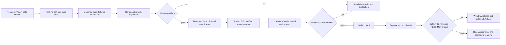

# Timeline Scene Hotfix and v0.4.3 Release - Plan

## Goal Capsule

Ship ZBS Eye v0.4.3 as a narrow hotfix on top of the public v0.4.2 release. Port the Timeline Scene-detail behavior proven in commit `3730bb3` onto current `origin/main`, prevent any future clean-but-stale release, publish an exact notarized artifact, and install that same public artifact without changing the user's data root or stable macOS identity.

Authority order:

1. Preserve user history, storage location, Keychain access, and TCC grants.
2. Preserve all v0.4.2 product behavior already on `origin/main` except the scoped Timeline Scene-detail behavior defined by R1-R7.
3. Preserve the Timeline acceptance behavior from `3730bb3`, not its stale file state.
4. Follow the current release contract in `scripts/build-notarized.sh`, `docs/NOTARIZE.md`, and Apple's notarization requirements.

Execution profile: Standard plan, high-risk release tail. The implementation may be developed and reviewed on a hotfix branch, but the public candidate must be rebuilt after merge from a clean worktree whose `HEAD` exactly matches freshly fetched `origin/main`.

Stop immediately if the release source is stale or dirty, version identity regresses, signing identity changes, notarization is not accepted, published hashes differ, the data root changes, or macOS asks for permissions that the installed v0.4.2 already held. With Keep Forever, a history-count decrease also stops the release; with finite retention, require selected-record continuity and no unexpected wholesale loss. Do not repair an unrelated failure by expanding this hotfix.

Tail ownership extends through implementation, tests, review, merge, notarization, draft-release verification, publication, installation, live smoke testing, rollback readiness, and the durable release-provenance note.

## Product Contract

### Summary

v0.4.3 keeps the full v0.4.2 product and changes two things: Timeline always presents the Scene that belongs to the visible moment, and the release pipeline refuses stale or ambiguous source. The release also corrects its version to `0.4.3 (8)` and aligns release documentation with exact manifest-backed artifacts.

### Problem Frame

The current Timeline detail panel loads a Scene from the free-running cursor rather than the frame actually visible in `store.current`. Timestamp-only grouping is ambiguous when multiple displays capture different apps at the same time. During loading or a late asynchronous response, the panel can show raw text or a Scene from another moment.

The behavior was fixed in `3730bb3`, but that commit sits on a branch 22 commits behind `origin/main` and still declares `0.3.0 (4)`. Building that clean branch produced a valid notarized artifact from obsolete product code. The existing release script protects signing and artifact identity, but it does not detect untracked files, refresh and pin the GitHub main revision, or reject version/build regression.

### Actors

- A1. Timeline user — scrubs, plays, searches, and inspects captured moments.
- A2. Release operator — reviews, notarizes, publishes, installs, and can withdraw a bad release.
- A3. macOS trust boundary — Gatekeeper, Developer ID, notarization, Keychain, and TCC permissions.
- A4. GitHub release surface — tag, draft/public release state, exact ZIP, and matching manifest.

### Key Flows

- F1. Visible-moment details — a selected frame immediately yields a one-moment Scene card; a matching grouped Scene may replace it after loading; extracted text remains available on demand.
- F2. Hotfix integration — the behavior of `3730bb3` is recreated against current `origin/main`, reviewed, tested, and merged without importing the stale branch state.
- F3. Candidate qualification — exact-main provenance, clean status, monotonic version, tests, signing, notarization, stapling, Gatekeeper, manifest, and notary evidence all pass before any public release exists.
- F4. Publication — exact assets are attached to a draft release targeting the manifest revision, downloaded and reverified, then made public.
- F5. Installation — only the manifest-verified release bundle replaces `/Applications/ZBS Eye.app`; data stays in place; the installed app is verified through its UI and agent surfaces.

### Requirements

#### Timeline correctness

- R1. The detail panel must follow the exact frame visible in `store.current`, not the free-running timeline cursor.
- R2. Scene lookup must use capture identity so simultaneous captures from different displays cannot resolve to the wrong app session.
- R3. Every visible frame must immediately render a stable one-moment Scene card while grouped Scene lookup is unavailable or in flight.
- R4. A grouped Scene may replace the fallback only when it belongs to the still-visible frame; cancelled, late, foreign, and out-of-range results must be ignored.
- R5. A compatible next frame inside the already loaded Scene may reuse that Scene without another lookup.
- R6. Raw AX/OCR text must remain selectable and available through an `Extracted text` disclosure for every captured frame.
- R7. English and Russian UI must distinguish `1 moment` from plural moment counts and localize the extracted-text label.

#### Release provenance and identity

- R8. Implementation must start from current `origin/main`; `3730bb3` is a behavioral reference and must not be merged or cherry-picked wholesale.
- R9. The release preflight must fail on tracked, staged, or non-ignored untracked changes before XcodeGen, archive, signing, or notarization runs.
- R10. The public candidate revision must exactly equal freshly fetched `origin/main`; a clean descendant, divergent branch, stale remote-tracking ref, or unavailable remote check must fail closed.
- R11. App and test targets must agree on `0.4.3 (8)`, which must be strictly newer than the latest fetched release tag's version and build; an existing `v0.4.3` tag must block reuse.
- R12. Release-provenance tests must exercise the preflight in isolated Git fixtures instead of relying only on script string assertions.
- R13. The candidate must preserve the current Developer ID team, Hardened Runtime, entitlements, designated requirement, notarization, stapling, Gatekeeper, and exact manifest-backed artifact contract.
- R14. The successful Apple submission ID and notarization log must be retained and reviewed even when notarization reports Accepted; the public manifest must bind the Accepted status, submission ID, and a digest of the reviewed log to the candidate.

#### Publication and installation

- R15. Publication must use exact artifact names from one manifest; wildcard selection is forbidden for upload, download, verification, and installation.
- R16. Before publication, the draft target must equal the manifest `sourceRevision`; publication creates `v0.4.3`, after which the real tag and public assets must be reverified against that same revision and manifest.
- R17. Installation must replace only `/Applications/ZBS Eye.app`; it must not relocate, migrate, copy, prune, or delete the database, media, local model, or storage root.
- R18. The candidate designated requirement must equal the installed stable identity before replacement, and no development or ad-hoc build may be launched during qualification.
- R19. The installed app must report `0.4.3 (8)`, reopen the same data root with prior history intact, append a new moment, preserve existing permissions, and expose the same version through REST and MCP.
- R20. The prior v0.4.2 app bundle must remain recoverable until post-install smoke testing passes; any failed smoke test withdraws the immutable v0.4.3 release and restores the prior bundle without relocating, migrating, pruning, deleting, or restoring the shared user store.
- R21. Once v0.4.3 becomes public, its tag, assets, version, and build are immutable; a corrected candidate after withdrawal must become v0.4.4 (9) or later.

### Acceptance Examples

- AE1. When a ChatGPT frame is visible, the right panel immediately shows a one-moment Scene card rather than an unstructured OCR dump; opening `Extracted text` reveals the captured text.
- AE2. When two displays produce different apps at the same timestamp, selecting either frame resolves by its capture ID and never reuses the other display's Scene.
- AE3. When `sceneStore` becomes ready after the frame is already visible, the same frame retries grouping and upgrades its fallback card.
- AE4. When frame B becomes visible before frame A's lookup finishes, A's late result cannot replace B's fallback or grouped Scene.
- AE5. When any non-ignored untracked source file exists, the release stops before XcodeGen or Apple submission.
- AE6. When local `origin/main` is stale or the candidate is not the freshly fetched GitHub main commit, the release stops even if the worktree is otherwise clean and correctly signed.
- AE7. When the project still declares `0.4.2 (7)` or reuses a lower/equal version or build, the release stops before archive creation.
- AE8. When a draft asset is downloaded, its ZIP hash, executable hash, source revision, version, build, Team ID, CDHash, and designated requirement match the manifest before the release becomes public.
- AE9. After installation, the data root and retention policy are unchanged, selected pre-release records remain readable, a new moment can be captured, `/health` and MCP report v0.4.3, and no previously granted permission is requested again.
- AE10. If any post-install check fails, v0.4.2 is restored and the immutable v0.4.3 release is withdrawn; normal moments captured during smoke remain readable in the shared store, and the repair ships under a newer version/build.

### Success Criteria

- All six Timeline state regressions and all release-preflight fixture cases pass in the unhosted test target.
- The unsigned full build and fixture-only local-AI regression suite pass without launching a second app identity.
- GitHub publishes v0.4.3 with one exact notarized ZIP and its matching manifest, both targeting the merged main revision.
- `/Applications/ZBS Eye.app` runs v0.4.3 under the same designated requirement and uses the same data root and history.
- Timeline dogfood proves fallback, grouped Scene replacement, extracted text, multi-frame scrubbing, and stale-result safety.

### Scope Boundaries

Included:

- The Timeline Scene-detail correctness port and its test seam.
- Release provenance, version, signing/notary evidence, exact-asset publication, installation, and rollback guards.
- A narrow v0.4.3 changelog entry, corrected release instructions, and a durable solution note after the release succeeds.

Already present because v0.4.3 starts from v0.4.2:

- The tiny Timeline-first workspace, four focused Settings destinations, optional AI setup, one-click local AI, cloud/provider choices, 5 GB media default, Keep Media Forever, independent microphone/system-audio controls, and MCP setup.

Excluded from this release:

- New providers, models, AI setup redesign, VLM integration, micro-model evaluation, or benchmark publication.
- Further Settings, achievements, Timeline layout, landing-page, or broad README redesign beyond correcting release instructions.
- New capture, ScreenCaptureKit, screenshot-performance, TCC, permission-prompt, Keychain, storage, retention, relocation, database, or audio behavior.
- Warning cleanup, unrelated refactors, changes from other worktrees, and the stale branch's old product or release files.

### Dependencies

- GitHub `origin/main` and release tags must be reachable and current.
- The release Mac must have the expected Developer ID Application identity and working `zbseye-notary` profile.
- Apple notarization and GitHub Releases must be available for the release tail.
- The installed v0.4.2 bundle and current data root must be available for identity comparison, continuity checks, and rollback.

### Sources and Research

- `3730bb3` — behavioral reference for exact-capture Scene lookup, fallback presentation, stale-result rejection, localization, and tests.
- `ZBSEyeApp/Views/Timeline/TimelineView.swift` — current cursor-keyed detail behavior on main.
- `ZBSEyeApp/Search/SceneService.swift` and `ZBSEyeApp/State/SceneStore.swift` — current timestamp-only Scene lookup.
- `scripts/build-notarized.sh` and `ZBSEyeTests/ReleaseConfigurationTests.swift` — existing release gates and remaining provenance gap.
- `docs/NOTARIZE.md`, `BUILD.md`, and `README.md` — current build/install contract and obsolete wildcard instruction.
- `CHANGELOG.md` and tags `v0.4.0` through `v0.4.2` — monotonic build sequence 5, 6, 7.
- GitHub release `v0.4.2` — public baseline `0.4.2 (7)` at revision `33ed79ea01e122856fe5059860618c040104b4a1`.
- [Apple: Notarizing macOS software before distribution](https://developer.apple.com/documentation/security/notarizing-macos-software-before-distribution) — Developer ID, Hardened Runtime, secure timestamp, notarization, stapling, and distribution checks.
- [Apple: Customizing the notarization workflow](https://developer.apple.com/documentation/security/customizing-the-notarization-workflow) — retain the submission ID, inspect the notary log, and staple the app before creating the final ZIP.

## Planning Contract

### Key Technical Decisions

- KTD1. Recreate the Timeline behavior in a fresh hotfix branch from `origin/main`. Reject wholesale cherry-pick or merge because the reference branch predates 22 mainline commits that contain the tiny-product reset, storage safety, provider/settings work, and current release hardening.
- KTD2. Separate Scene models and Timeline presentation state into pure Swift files included in the unhosted test target. This keeps async frame-matching behavior testable without launching the shipping app or manufacturing another `gg.zbs.eye` identity.
- KTD3. Use exact capture ID at the repository/service boundary and use time plus app/bundle compatibility only to decide whether an already loaded Scene can be reused for the next visible frame. Timestamp containment alone cannot distinguish simultaneous displays.
- KTD4. Make the Scene card structurally stable: a one-moment fallback always exists, a verified grouped Scene may replace it, and raw text remains a secondary disclosure. This removes the inconsistent card-versus-text panel without hiding captured evidence.
- KTD5. Put release provenance in an executable preflight with isolated Git fixture tests. Static string assertions remain useful for signing-contract invariants, but they cannot prove that stale, dirty, or regressed candidates actually fail.
- KTD6. Require exact equality with freshly fetched `origin/main` for the notarized public candidate. Allowing a branch merely ahead of main is useful for private candidate builds but leaves an unpublished-commit escape hatch; ordinary unsigned verification is sufficient before merge.
- KTD7. Keep GitHub release state draft until exact assets survive a clean re-download and manifest verification. Publication is an identity transition, not an upload convenience.
- KTD8. Treat the Apple notary submission ID and successful log as release evidence, and bind their status and digest into the manifest. `Accepted` without candidate-linked diagnostics is insufficient for a reproducible release audit.
- KTD9. Install by application-bundle replacement only, with v0.4.2 retained temporarily. Verification must prove this hotfix adds no schema migration; normal captures may remain in the shared store, so application rollback is sufficient and safer than copying or restoring a live SQLite database.
- KTD10. Make a published release immutable. A failed post-public smoke withdraws v0.4.3 and advances the repair to v0.4.4 (9) or later rather than replacing assets behind the existing tag.

### High-Level Technical Design

The diagram fixes the sequence and stop conditions. Exact implementation details may follow existing repository patterns as long as the requirements and verification gates remain observable.

### Implementation Constraints

- Use repo-relative source paths and current-main types; do not overwrite main files with stale versions from `3730bb3`.
- Run release provenance before XcodeGen so untracked files cannot enter the generated project.
- Make preflight logic deterministic and fixtureable without contacting production remotes during unit tests; production release mode must refresh the real remote and fail on network ambiguity.
- Keep tests unhosted and signing-disabled. Do not launch Debug, ad-hoc, or self-signed builds during this release.
- Do not mutate the live database for qualification. Pre/post history and data-root checks are read-only; pause capture and quit the app before replacement.
- Do not commit `dist/`, notary credentials, submission archives, raw logs containing secrets, or local diagnostic artifacts.
- Build output and release evidence must name one exact version/build/source revision. Wildcards cannot choose a candidate.

### Sequencing

U1 establishes the product behavior and regression contract. U2 adds the release safety that prevents a repeat of this incident. U3 assigns the new release identity and aligns public documentation. U4 qualifies and lands the code. U5 creates and publishes the exact artifact from merged main. U6 installs and dogfoods it. U7 records the durable lesson only after the release outcome is known.

### System-Wide Impact

- Timeline: Scene lookup changes from timestamp to exact capture identity; right-panel async state becomes tied to the visible frame.
- Activities: the shared Scene card accepts a presentation model so the fallback and grouped forms render consistently.
- Build/release: remote provenance and version monotonicity become blocking contracts before the expensive signing path.
- Distribution: draft/public state, tag target, assets, manifest, notarization evidence, and installed bundle become one traceable identity chain.
- User state: there is no schema, data-root, storage, retention, Keychain, or capture change; installation touches only the application bundle.

### Risks and Mitigations

- Stale-file overwrite — port behavior symbol by symbol against main and review the final diff for unrelated regressions.
- Multi-display ambiguity — select grouped sessions by capture ID and retain explicit same-timestamp cross-app coverage.
- Async UI race — bind completion to visible frame ID and reject cancelled or late results after the awaited lookup.
- False release cleanliness — inspect full porcelain status, including untracked files, before generated files exist.
- Stale remote state — refresh main and tags during production preflight; any fetch failure blocks release.
- Brittle release tests — execute the preflight in temporary Git repositories and keep static tests only for signing text contracts.
- Partial public release — use a draft, exact filenames, re-download verification, and an explicit publish transition.
- Permission churn — preserve designated requirement, never run a second signed identity, and stop on any unexpected TCC prompt.
- Data loss or split root — record the resolved root and representative counts, replace only the app, and require counts not to decrease.
- Failed upgrade — retain v0.4.2 until smoke passes; withdraw immutable v0.4.3, restore the old bundle without restoring the shared store, and use a newer version/build for any repair.

## Implementation Units

### U1. Port visible-frame Scene details onto current main

Goal: satisfy F1 and R1-R7 without importing stale branch state.

Requirements: R1, R2, R3, R4, R5, R6, R7; AE1, AE2, AE3, AE4.

Files:

- `ZBSEyeApp/Search/SceneModels.swift`
- `ZBSEyeApp/Search/SceneService.swift`
- `ZBSEyeApp/State/SceneStore.swift`
- `ZBSEyeApp/Views/Timeline/TimelineSceneDetailState.swift`
- `ZBSEyeApp/Views/Timeline/TimelineView.swift`
- `ZBSEyeApp/Views/Activities/ActivitiesView.swift`
- `ZBSEyeApp/Resources/Localizable.xcstrings`
- `ZBSEyeTests/TimelineSceneDetailStateTests.swift`
- `project.yml`

Approach:

- Extract `ActivityScene` into a test-visible model file while preserving current-main consumers.
- Change Scene lookup to accept the visible `FrameDetail` and select the session containing its capture ID.
- Introduce pure presentation state keyed by frame ID and Scene-store readiness.
- Render the fallback and grouped forms through the same Scene card; move raw captured text into a disclosure.
- Port the six reference tests first, then adapt production files until they pass against current main.

Test scenarios:

- Same frame reloads when SceneStore becomes available.
- Fallback card exists before grouped lookup finishes.
- Foreign or out-of-range Scene cannot replace the fallback.
- Compatible next frame reuses its grouped Scene.
- Same timestamp from another app/display does not reuse the Scene.
- Late result for a previous frame cannot replace the current card.
- Singular/plural labels and Russian translations are present.

Verification: the unhosted test target passes and a diff against main contains only the intended Timeline/Scene integration changes.

Dependencies: none.

### U2. Add behavioral release-provenance preflight

Goal: satisfy R9-R14 and prevent clean-but-stale or version-regressed notarized builds.

Requirements: R9, R10, R11, R12, R13, R14; AE5, AE6, AE7.

Files:

- `scripts/release-preflight.sh`
- `scripts/build-notarized.sh`
- `ZBSEyeTests/ReleaseConfigurationTests.swift`
- `docs/NOTARIZE.md`

Approach:

- Run a dedicated preflight before generated or build output exists.
- In production release mode, refresh `origin/main` and tags, require exact main equality, require empty full status, and compare both target identities with the latest release baseline.
- Keep the signing, entitlements, manifest, stapling, and Gatekeeper checks already present on main.
- Capture the notary submission result, require Accepted, retain the submission ID, and review the returned log.
- Exercise preflight behavior in temporary Git repositories; keep existing string assertions for static signing invariants.

Test scenarios:

- Valid exact-main `0.4.3 (8)` candidate passes.
- Modified tracked, staged, and non-ignored untracked files fail.
- Local remote-tracking state that was not refreshed fails closed.
- Branch behind, ahead of, or divergent from refreshed main fails public-release mode.
- Missing remote, fetch failure, missing baseline tag, and pre-existing candidate tag fail closed.
- Equal/lower marketing version or build fails; app/test target disagreement fails.
- Signing-contract tests still prove Developer ID team, entitlements, Hardened Runtime, designated requirement, manifest, stapling, and Gatekeeper requirements.

Verification: executable fixture tests prove both the passing path and every fail-closed path before `build-notarized.sh` can archive.

Dependencies: none.

### U3. Assign v0.4.3 identity and align release documentation

Goal: give the hotfix one unambiguous version/build and correct exact-artifact instructions.

Requirements: R11, R15.

Files:

- `project.yml`
- `CHANGELOG.md`
- `README.md`
- `docs/NOTARIZE.md`
- `ZBSEyeTests/ReleaseConfigurationTests.swift`

Approach:

- Set both app and test target to `0.4.3 (8)`.
- Add a narrow changelog entry for visible-moment Scene correctness and stale-release prevention.
- Replace the obsolete wildcard install example with the exact ZIP plus manifest workflow.
- Keep broader README and landing-page work outside this release.

Test scenarios:

- Generated app and test target expose the same version/build.
- Release configuration test expects `0.4.3 (8)`.
- Changelog and install docs name only scoped changes and exact assets.

Verification: the generated release metadata, test expectations, changelog, and documentation agree on v0.4.3.

Dependencies: U1, U2.

### U4. Qualify, review, and land the hotfix

Goal: merge a minimal, fully verified diff before any notarized public candidate is created.

Requirements: R8-R14.

Files: all files changed by U1-U3.

Approach:

- Run the unsigned compile, unhosted tests, fixture-only local-AI regressions, localization validation, and release-preflight fixtures.
- Review the diff specifically for stale-main overwrites, Swift 6 isolation, release fail-closed behavior, and any unexpected data/signing change.
- Open and review the hotfix PR, resolve blocking feedback, and merge it before the release worktree is refreshed.
- Re-run the release preflight from the merged exact-main revision; any new main commit invalidates the qualification and requires a fresh run.

Test scenarios:

- All repo gates pass from a clean hotfix branch.
- Final PR diff contains no VLM/eval, provider/settings, storage, database, capture, audio, or unrelated warning changes.
- Merged revision equals refreshed `origin/main` before release packaging begins.

Verification: the reviewed implementation is merged, the clean release worktree resolves to that merge revision, and no differently signed app was launched.

Dependencies: U1, U2, U3.

### U5. Build, notarize, verify, and publish the exact candidate

Goal: satisfy F3-F4 and R13-R16 with one traceable artifact identity.

Requirements: R13, R14, R15, R16; AE8.

Files:

- `scripts/release-preflight.sh`
- `scripts/build-notarized.sh`
- `docs/NOTARIZE.md`
- Generated `dist/ZBSEye-0.4.3-8-<source>-notarized.zip`
- Generated matching manifest and retained notary evidence

Approach:

- Re-run exact-main preflight immediately before the Developer ID archive.
- Build, sign, notarize, review the successful log, staple, pass Gatekeeper, and emit exact hashes, submission ID, Accepted status, reviewed-log digest, and signing identity in the manifest.
- Confirm `v0.4.3` does not exist, then create a draft release targeting the manifest source revision and attach only that ZIP and manifest.
- Download draft assets into a clean location and reverify every manifest field and artifact hash before publishing.
- Publish only when the draft target, downloaded assets, and manifest agree; publication creates `v0.4.3`, which must immediately resolve to the same source revision.
- Download the public assets into a second clean location and bind the exact verified public ZIP to U6.

Test scenarios:

- Candidate carries the expected Team ID, Hardened Runtime, entitlements, stable designated requirement, stapled ticket, and Gatekeeper acceptance.
- Manifest source revision equals merged main and release target.
- Draft download reproduces ZIP and executable hashes exactly.
- Publication creates the tag at the manifest revision, and public re-download reproduces the same bytes.
- A pre-publication mismatch leaves the release draft and blocks publication. A post-public re-download mismatch withdraws immutable v0.4.3, blocks installation, and requires any repair to use v0.4.4 (9) or later.

Verification: GitHub shows a non-prerelease v0.4.3 release with the exact ZIP and manifest at the merged main revision, and public re-download matches the qualified bytes.

Dependencies: U4.

### U6. Install and dogfood the public v0.4.3 artifact

Goal: satisfy F5 and R17-R21 on the user's Mac without changing storage topology or permission identity.

Requirements: R17, R18, R19, R20, R21; AE9, AE10.

Files: `/Applications/ZBS Eye.app` is an operational target, not a repository change.

Approach:

- Record the installed version, designated requirement, resolved data root, retention policy, permission state, representative history counts, and selected historical record IDs read-only.
- Compare U5's verified candidate designated requirement with the installed v0.4.2 requirement and stop before replacement on any difference.
- Stop recording, quit Eye cleanly, retain the v0.4.2 bundle temporarily, and replace only the application bundle with the manifest-verified public bytes.
- Launch the installed app normally and verify identity, history continuity, capture, Timeline Scene behavior, REST, MCP, and existing permissions.
- Install only from U5's fresh post-public re-download, never the local build or draft copy.
- If a gate fails, withdraw immutable v0.4.3, preserve diagnostics, restore v0.4.2, keep normal smoke-test captures in the shared store, and assign any repair a newer version/build.

Test scenarios:

- Installed Info.plist, `/health`, and MCP report `0.4.3 (8)`.
- Data root and retention policy are identical; selected pre-release records remain searchable and there is no wholesale count loss. Strict count non-decrease applies only when Keep Forever is active.
- A new moment appends successfully and shows fallback then matching grouped Scene with extracted text available.
- Screen Recording, Accessibility, and previously granted audio permissions do not prompt again.
- Gatekeeper and designated requirement still match the qualified public candidate.

Verification: the user can run v0.4.3 from `/Applications`, inspect old and new history through Timeline and MCP, and v0.4.2 remains available only until this smoke passes.

Dependencies: U5.

### U7. Compound the stale-release provenance lesson

Goal: make the incident and guard reusable for future releases after v0.4.3 proves the solution.

Requirements: R9-R16.

Files:

- `docs/solutions/release-engineering/clean-does-not-mean-current.md`

Approach:

- Record the failure mode: a clean, notarizable branch can still be obsolete, and tracked-diff checks miss untracked sources.
- Document the exact-main, full-status, monotonic-version, manifest, draft-verification, and installed-artifact identity chain.
- Cite the successful v0.4.3 evidence without including credentials, private paths, raw personal data, or local diagnostics.

Test scenarios: the note contains the problem, root cause, guard, verification evidence, rollback rule, and when the pattern applies.

Verification: a future release operator can understand why each gate exists without replaying this incident.

Dependencies: U6.

## Verification Contract

### Pre-merge gates

- `xcodegen generate` completes from `project.yml`.
- `bash scripts/verify.sh` completes the unsigned strict-concurrency Debug build.
- `xcodebuild -project ZBSEye.xcodeproj -scheme ZBSEyeUnitTests -configuration Debug test` passes all unhosted tests, including Timeline and release-preflight fixtures.
- `bash scripts/verify-local-ai.sh --all-fixtures` passes without model downloads or a hosted app.
- Localization catalog parsing and required Russian keys pass.
- Diff review confirms only scoped files and no data/schema/signing identity drift.

### Release gates

- Production preflight refreshes main/tags and proves empty full status, exact main revision, absent candidate tag, and monotonic `0.4.3 (8)` identity before archive work.
- `bash scripts/build-notarized.sh` succeeds with the expected Developer ID identity, provisioned entitlements, Hardened Runtime, secure timestamp, accepted notarization, reviewed notary log, stapled ticket, Gatekeeper acceptance, exact ZIP, and manifest.
- Manifest ZIP/executable hashes, source revision, Team ID, CDHash, designated requirement, version, build, entitlement flags, Accepted notary status, Apple submission ID, and reviewed-log digest match the candidate.
- Draft-release tag/target and exact assets match the manifest after a clean authenticated re-download.
- Public re-download matches the same bytes before the release is treated as complete.

### Installed-product gates

- `/Applications/ZBS Eye.app` passes codesign, stapler, Gatekeeper, version/build, and designated-requirement checks.
- Read-only diagnostics show the same storage root and retention policy. Counts do not decrease under Keep Forever; with finite retention, selected records remain and there is no unexpected wholesale loss.
- `/health`, MCP initialization/diagnostics, and MCP history search work against existing data and report v0.4.3.
- Live capture appends a moment; Timeline Scene fallback/grouping/extracted-text behavior passes; no previously granted TCC permission prompts again.
- The normal macOS screenshot flow remains responsive during the smoke test; any regression is a release blocker but is not repaired by expanding v0.4.3.

## Definition of Done

- R1-R21 and AE1-AE10 are satisfied with observable evidence.
- U1-U7 meet their verification clauses in dependency order.
- The public v0.4.3 tag, release target, ZIP, manifest, candidate-linked notary evidence, installed bundle, REST version, and MCP version trace to one merged source revision.
- The installed app uses the pre-existing data root and stable designated requirement, prior history is present, a new moment is captured, and no existing permission is requested again.
- Any failed publication or installation path has been rolled back without relocation, migration, pruning, deletion, or database restoration; normal smoke-test captures remain valid shared data.
- v0.4.2 remains recoverable until smoke testing passes, then temporary app-only rollback material is removed safely.
- The diff contains no dead-end experiments, stale copied files, generated project output, credentials, private corpus data, local diagnostics, or unrelated changes.
- Release instructions no longer use wildcard artifact selection, and the durable provenance lesson is recorded after successful dogfood.
