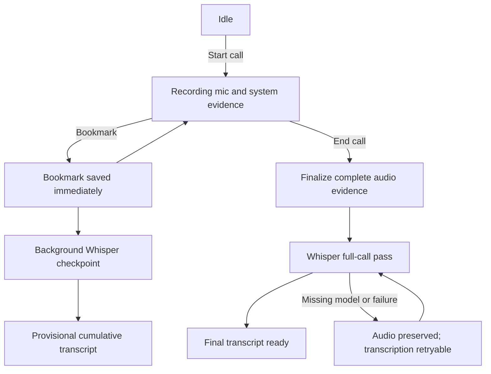
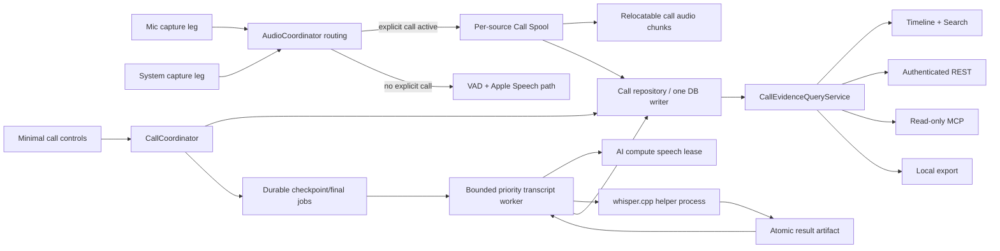
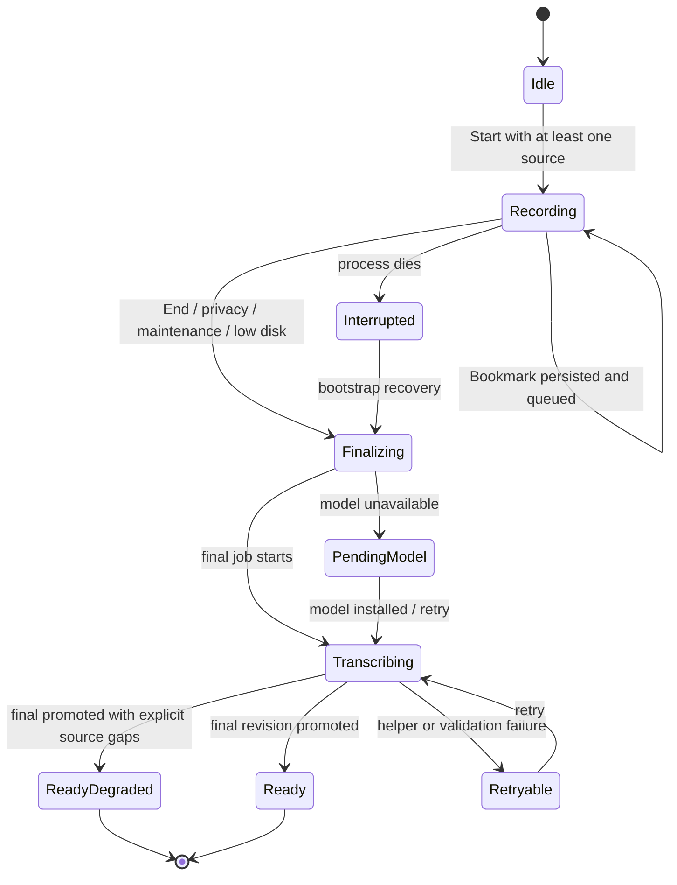
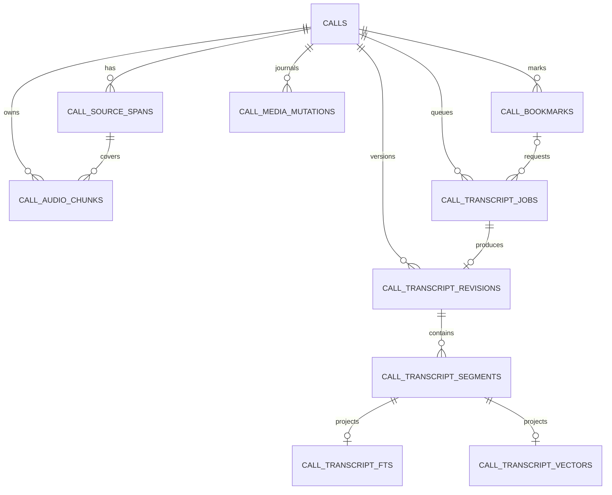

# Call Recording with Whisper Bookmarks - Plan

## Goal Capsule

- **Objective:** Let a person record a local computer call as durable mic and system-audio evidence, request useful transcript checkpoints without interrupting capture, and receive one authoritative Whisper transcript after the call.
- **Product authority:** The user-confirmed Product Contract in this brainstorm, constrained by ZBS Eye's identity as a tiny local recorder and evidence surface rather than a meeting workspace.
- **Open blockers:** None. Runtime packaging, durable representation, recovery, storage lifecycle, and integration with existing audio capture are resolved below.

---

## Product Contract

### Summary

ZBS Eye will record a call locally, preserve its microphone and system-audio sources, and transcribe it with Whisper large-v3-turbo after the call. A bookmark requests an intermediate transcript of the newly recorded interval with 45 seconds of preceding context while the primary recording continues without a pause, restart, or split.

### Problem Frame

Eye already captures microphone and system audio, transcribes short speech segments, and exposes evidence through Timeline, REST, and MCP. Those segments do not form a durable call: there is no shared call boundary, bookmark, transcript revision, or final whole-call pass.

The desired replacement for the relevant part of Krisp is narrower than a meeting product. Eye should preserve the call and make it retrievable; it should not become the place where maps, notes, tasks, coaching, or CRM workflows are created.

### Key Decisions

- **Whisper-only transcription:** Use Whisper large-v3-turbo for bookmark checkpoints and the final whole-call transcript; do not show or compute a live transcript. `(session-settled: user-directed — chosen over Voxtral streaming and a live transcript view: final quality matters more than live text.)`
- **Uninterrupted evidence:** A bookmark never pauses, restarts, or divides the primary recording. `(session-settled: user-directed — chosen over stopping or rotating capture at a bookmark: a transcription request must not create an evidence gap.)`
- **Contextual checkpoint window:** Each bookmark transcribes the new interval since the previous bookmark, or the call start for the first bookmark, plus 45 seconds of preceding audio context. `(session-settled: user-directed — chosen over retranscribing the whole call-so-far or using a context-free interval: the checkpoint stays economical without losing boundary context.)`
- **One canonical final transcript:** Ending the call triggers a full Whisper pass whose result becomes authoritative; checkpoint text is a replaceable draft while bookmark timestamps remain durable.
- **Source attribution before diarization:** The first version distinguishes `me` from `system` using the two capture sources; it does not claim to distinguish multiple remote speakers sharing the system track. `(session-settled: user-approved — chosen over adding a separate diarization system to v1: honest source attribution keeps the first release small.)`
- **Recorder, not meeting workspace:** Eye stores and serves evidence; maps, summaries, project routing, and other interpretation belong to external consumers. `(session-settled: user-directed — chosen over building AIOS or CRM behavior inside Eye: Eye should remain tiny and do one job well.)`
- **No mandatory model payload:** Recording works without Whisper installed; Eye offers a one-click local installation and leaves pending audio available until transcription can run. `(session-settled: user-directed — chosen over installing local AI by default: the base application must stay small.)`
- **Local computer capture only:** This feature records the call already playing on the Mac; it does not replace Handy or join meetings as a remote bot. `(session-settled: user-directed — chosen over absorbing Handy or a VDS meeting bot: those remain separate products.)`

### Actors

- A1. **Person on the Mac** starts or ends a recording, adds bookmarks, and later reviews or retrieves the evidence.
- A2. **ZBS Eye recorder** owns uninterrupted capture, durable call state, transcript jobs, and honest source health.
- A3. **Local agent client** reads completed and provisional call evidence through Eye's authenticated local surfaces.

### Requirements

**Call capture**

- R1. A person can explicitly start and end a call recording in Eye without Eye joining or controlling the meeting application.
- R2. One call groups its start, end, microphone evidence, system-audio evidence, bookmarks, and transcript state under one durable identity.
- R3. Microphone and system audio remain separately attributable and time-aligned within the call whenever both sources are enabled and available.
- R4. Disabling system-audio recording remains supported; a mic-only call must state that the system source was disabled or unavailable rather than implying complete capture.
- R5. Bookmark processing, model loading, transcription, indexing, and agent reads must never pause or restart active audio capture.
- R6. Existing recording modes and meeting detection remain functional; the explicit call flow is the acceptance floor rather than a replacement for all existing triggers.

**Bookmark checkpoints**

- R7. Pressing Bookmark during an active call durably records the bookmark time immediately, even when a previous checkpoint is still processing.
- R8. The first bookmark covers the call start through the bookmark, while each later bookmark covers the new interval since the previous bookmark with 45 seconds of preceding context.
- R9. Whisper processes checkpoint work in the background and preserves every bookmark when requests arrive faster than transcription completes.
- R10. Overlap used for context must not produce duplicated text in the cumulative checkpoint transcript.
- R11. A checkpoint transcript chronologically merges available `me` and `system` speech and is visibly and programmatically marked provisional until the final whole-call pass succeeds.

**Call completion and recovery**

- R12. Ending a call finalizes the uninterrupted source recording before starting the authoritative whole-call Whisper pass.
- R13. The final transcript becomes preferred only after it covers and chronologically interleaves the complete available `me` and `system` speech without deleting bookmark timestamps.
- R14. If Whisper is missing, busy, interrupted, or fails, Eye preserves the audio and bookmarks and exposes an honest pending or failed state that can be retried.
- R15. A quit, crash, or restart must not turn an already persisted call into an apparently successful but incomplete transcript.
- R16. Source attribution in v1 is limited to `me` and `system`; individual remote-speaker names or identities must not be inferred from the system track.

**Local evidence and product surface**

- R17. Call audio, bookmarks, transcript state, status, and source availability remain local and are exportable as ordinary local artifacts.
- R18. Authenticated REST and MCP clients can retrieve a call span, its bookmarks, source evidence, transcript status, and preferred final transcript without scraping the UI.
- R19. Timeline and search can lead a person or agent from matching call text to the relevant call and bookmark evidence.
- R20. Call artifacts obey Eye's configured storage location and retention policy, including the `Forever` setting.
- R21. The call UI contains only recording controls, bookmark feedback, processing status, and completed evidence; it contains no live transcript or meeting-workspace surface.
- R22. Whisper compute is demand-loaded for checkpoint or completion work and released when idle so the recorder's steady-state footprint remains the product priority.

### Call Lifecycle



The Bookmark path returns to Recording immediately; its transcript work is downstream and cannot own the capture lifecycle.

### Key Flows

- F1. **Record a local call**
  - **Trigger:** A1 starts a call recording.
  - **Actors:** A1, A2
  - **Steps:** Eye opens one durable call span, starts each enabled source, and reports which sources are actually recording.
  - **Outcome:** The call accumulates local evidence under one identity until A1 ends it.
  - **Covered by:** R1-R6
- F2. **Create a transcript checkpoint**
  - **Trigger:** A1 presses Bookmark during an active call.
  - **Actors:** A1, A2
  - **Steps:** Eye persists the timestamp, acknowledges it immediately, prepares the new interval with its context overlap, and queues Whisper work without changing capture state.
  - **Outcome:** A provisional transcript becomes available while the original call recording remains continuous.
  - **Covered by:** R5, R7-R11
- F3. **Finish and reconcile a call**
  - **Trigger:** A1 ends the call.
  - **Actors:** A1, A2
  - **Steps:** Eye closes the source evidence, runs Whisper over the complete available call, and promotes that transcript as preferred.
  - **Outcome:** The call has one final transcript plus durable bookmark provenance.
  - **Covered by:** R12-R16
- F4. **Retrieve call evidence**
  - **Trigger:** A1 or A3 searches for or opens a recorded call.
  - **Actors:** A1, A2, A3
  - **Steps:** Eye returns the call interval, source availability, bookmarks, transcript state, preferred text, and links to local evidence.
  - **Outcome:** A person or agent can use the evidence without Eye becoming the downstream workspace.
  - **Covered by:** R17-R21

### Acceptance Examples

- AE1. **Bookmark does not interrupt capture**
  - **Covers:** R5, R7-R9
  - **Given:** Both audio sources are recording and Whisper is idle.
  - **When:** The person presses Bookmark.
  - **Then:** Eye saves the timestamp immediately and starts background checkpoint processing without stopping, restarting, or creating a gap in either source.
- AE2. **Bookmarks outpace Whisper**
  - **Covers:** R7-R11
  - **Given:** A checkpoint transcript is still processing.
  - **When:** The person adds another bookmark.
  - **Then:** The second timestamp is preserved, its interval is eventually processed, and context overlap does not duplicate the cumulative text.
- AE3. **End call during checkpoint processing**
  - **Covers:** R12-R15
  - **Given:** A checkpoint is still processing when the person ends the call.
  - **When:** Eye finalizes the recording.
  - **Then:** The full-call Whisper pass eventually becomes preferred and no completed source audio is discarded because the earlier job was in flight.
- AE4. **System audio is disabled**
  - **Covers:** R3, R4, R16
  - **Given:** The person has disabled system-audio recording.
  - **When:** A call is recorded and transcribed.
  - **Then:** Eye preserves the microphone track, labels the absent system source honestly, and does not present `system` speech or remote-speaker attribution.
- AE5. **Whisper is unavailable**
  - **Covers:** R14, R15, R17, R20
  - **Given:** Whisper is not installed or the process fails.
  - **When:** A bookmark is added or the call ends.
  - **Then:** Recording and evidence persistence succeed, transcription remains pending or failed with a retry path, and no cloud fallback occurs silently.
- AE6. **Agent retrieves a finished call**
  - **Covers:** R18, R19
  - **Given:** A call has a final transcript and bookmarks.
  - **When:** An authenticated local agent searches matching text and requests the call.
  - **Then:** Eye returns the preferred final transcript together with call timing, bookmarks, source status, and evidence references.

### Success Criteria

- Adding bookmarks produces zero capture stop/start transitions and zero bookmark-caused gaps in persisted audio.
- Every accepted bookmark remains discoverable and reaches a terminal transcript state without blocking recording.
- Every ended call either has one preferred full-call transcript or an honest retryable state with its source audio intact.
- A local agent can answer when a relevant statement occurred and retrieve the supporting call evidence through Eye's authenticated surfaces.
- Idle and active-recording resource use remain bounded by Eye's tiny-recorder principle; Whisper is not resident or computing without queued work.

### Scope Boundaries

**Deferred for later**

- Automatic browser-call detection, calendar pre-arming, and calendar-driven recording schedules.
- Diarization of multiple remote speakers inside the system-audio source.
- Additional transcription engines, cloud speech providers, or live streaming transcription.

**Outside this product's identity**

- Live transcript presentation, call maps, generated meeting notes, coaching, tasks, CRM records, project routing, and document editing.
- Replacing Handy's dictation interaction or operating a bot that joins Zoom, Meet, or other calls remotely.
- AIOS orchestration or interpretation inside the Eye repository.

### Dependencies and Assumptions

- Whisper large-v3-turbo can be distributed or installed locally under terms compatible with this free, non-commercial application.
- A supported Mac has enough temporary compute and disk capacity to process a checkpoint or completed call without compromising active capture.
- Existing storage relocation, retention, and authenticated localhost boundaries remain authoritative for the new artifacts.
- If the system-audio source contains several remote people, v1 can only label the combined source as `system`.

### Outstanding Questions

**Resolve Before Planning:** None.

**Deferred to Planning:**

- Select the local Whisper runtime, model packaging, one-click installation, qualification, and unload policy.
- Design a consistent audio checkpoint source that Whisper can read while the primary recorder continues writing.
- Define durable call, bookmark, transcript status, replacement, coverage, and recovery representation without weakening Eye's one-writer and retention invariants.
- Reconcile explicit call controls with the existing meeting-only detector and independent audio-leg restart behavior.
- Define overlap reconciliation and final-transcript promotion so retries remain idempotent.
- Extend REST, MCP, search, Timeline, and export surfaces with the smallest coherent call evidence contract.

### Sources and Research

- `docs/ideation/2026-07-15-live-call-evidence-ideation.html` establishes the evidence-recorder boundary and identifies the current missing call envelope.
- `ZBSEyeApp/Audio/AudioCoordinator.swift`, `ZBSEyeApp/Audio/AudioPipeline.swift`, and `ZBSEyeApp/Audio/TranscriptionBackend.swift` show two current source rails and final per-file Apple Speech transcription.
- `ZBSEyeApp/Data/ZBSEyeDatabase.swift` shows independent audio segments and transcripts without a durable call or bookmark relationship.
- `ZBSEyeApp/Server/ZBSEyeHTTPServer.swift` and `ZBSEyeApp/MCP/ZBSEyeMCPServer.swift` provide the existing authenticated local evidence surfaces.
- [anarlog](https://github.com/fastrepl/anarlog) validates separating capture from batch transcription and local-file output. Its current desktop flow starts batch work after capture stops and rejects batch transcription for an active session, so bookmark-triggered transcription during uninterrupted capture is net new for Eye: [capture-to-batch flow](https://github.com/fastrepl/anarlog/blob/main/apps/desktop/src/stt/useStartListening.ts), [active-session guard](https://github.com/fastrepl/anarlog/blob/main/apps/desktop/src/store/zustand/listener/general.ts), and [recorder flush/finalization](https://github.com/fastrepl/anarlog/blob/main/crates/listener-core/src/actors/recorder/disk.rs).

---

## Planning Contract

### Plan depth and preservation

- **Depth:** Deep. This work crosses real-time audio capture, persistent evidence, background ML compute, recovery, retention, relocation, search, authenticated APIs, MCP, and native UI.
- **Product Contract preservation:** The Product Contract above is carried forward unchanged. The sections below resolve its planning-owned questions; they do not add live transcription, call intelligence, calendar automation, cloud processing, or remote-speaker diarization.
- **Execution boundary:** Implement the recorder/evidence capability only. Existing generic screen recording, meeting detection, Apple Speech transcription, and MCP recording control remain available outside an explicit Call Envelope.

### Included in this implementation

- One explicit active Call Envelope with separate `me` and `system` source spans.
- A per-source rolling Call Spool that preserves all captured samples independently of bookmarks.
- Durable bookmarks, immutable checkpoint coverage, bounded Whisper jobs (Bookmark order until End; final priority after End), provisional revisions, one preferred final revision, recovery, retries, and honest degraded states.
- Optional one-click installation of the full `whisper.cpp` large-v3-turbo model; no bundled model and no cloud fallback.
- Minimal call controls and status in the existing recorder surface.
- Call-aware Timeline, search, export, authenticated REST, and read-only MCP retrieval.
- Whole-envelope retention and Erase Call behavior, exact privacy-range redaction, storage-cap accounting, relocation safety, and physical long-call release gates.

### Explicitly excluded

- Live transcript UI or streaming STT, Voxtral, summaries, maps, notes, tasks, coaching, CRM, and AIOS behavior.
- Calendar-driven or browser-driven auto-start, meeting bots, and Handy replacement behavior.
- Multi-speaker diarization inside `system`, speaker naming, cloud speech providers, or a silently selected alternative model.
- Shipping a quantized model before a separate accuracy/size qualification establishes that it meets the full model's acceptance floor.

### Requirement trace convention

Every implementation unit cites the Product Contract requirements, flows, and acceptance examples it realizes. Product IDs remain authoritative: `R*` for requirements, `F*` for flows, and `AE*` for acceptance examples.

## Key Technical Decisions

### KTD1. A rolling Call Spool is the canonical recording path during an explicit call

The current `AudioPipeline` and `VADSegmenter` cannot provide exact bookmark coverage: silence is discarded, an active tail exists only in memory, `flushFinal()` closes the logical segment, and both capture engines currently use bounded `AsyncStream.bufferingNewest(64)`. Calling `flushFinal()` on Bookmark would make transcription own the capture lifecycle and could produce the gap forbidden by R5 and AE1.

During an explicit call, every delivered `AudioFrame` therefore goes to a dedicated per-source rolling spool before downstream transcription work. The spool stores append-readable mono 16 kHz signed PCM16LE in short fixed-policy chunks selected only by time/size limits; per-epoch metadata records capture format, spool format, start sample, and wall-clock anchor. Headerless frame-aligned PCM makes a flushed byte prefix independently readable before the active chunk closes and lets crash recovery truncate only an incomplete final sample frame. User-facing export may encode managed copies later, outside capture. A bookmark never rotates a chunk, stops a leg, resets VAD, encodes audio on the capture-consumer path, or writes transcript data synchronously. The Call Envelope is one logical recording even though its durable representation contains internal chunks.

The existing VAD + Apple Speech path remains unchanged when no explicit call is active. While a Call Envelope is active, the call spool/Whisper path is canonical and legacy call-frame audio/transcript ingestion is suppressed to avoid duplicate evidence and duplicate search results.

### KTD2. Source watermarks make Bookmark immediate without lying about coverage

Each capture engine assigns a monotonic ingress sequence and normalized monotonic host timestamp before attempting to yield a frame into `AsyncStream`. On Bookmark, the Call Coordinator snapshots each enabled engine's latest accepted ingress sequence and persists those source targets with the Bookmark and an unclaimable `preparing` job in one transaction. The source spools then drain toward those exact targets within a bounded window. A dropped/missing target becomes an explicit gap; neither live execution nor recovery infers the cut from wall-clock time alone. Once each source has returned its greatest durable byte/sample watermark or an explicit gap through the persisted target, one transaction freezes the job input and changes it from `preparing` to claimable `pending` or budgeted `deferred_capacity`.

If a source is late, dead, disabled, or restarting, the checkpoint uses the greatest durable watermark reached, records the missing tail as a gap, and may finish as `ready_degraded`; it never waits forever or claims complete coverage. The immutable job input records logical coverage and the exact per-source durable watermarks. Context audio may extend up to 45 seconds before the logical interval, but transcript segments committed to the revision are trimmed to the logical interval.

Mic `AVAudioTime` and system `CMSampleBuffer` timing are normalized onto the same monotonic host clock before buffering. Every source epoch persists piecewise host-time/sample-position anchors so resampling and device drift do not collapse into wall-clock `Date` guesses. Absolute segment time is derived from that mapping. The 120-minute known-signal qualification must hold p95 cross-source skew at or below 100 ms and maximum skew at or below 200 ms after initial epoch-offset calibration; a new device/format begins a new calibrated epoch or records the source unavailable.

### KTD3. One Call Coordinator serializes user intent and lifecycle races

`CallCoordinator` owns the single explicit-call state machine and serializes Start, Bookmark, End, privacy pause, maintenance, source restarts, and recovery. One call may be active. Repeated Start while active is idempotent; End while idle creates no empty call. Start succeeds only when at least one enabled source can actually record. A mic-only or system-only call is valid and labeled honestly; a zero-source start is refused.

An explicit call is independent of global screen recording and pins audio intent across `MeetingDetector` edges. Meeting detection continues to drive the legacy audio path only when no explicit call is active; it neither creates nor ends Call Envelopes in this version. Privacy pause, maintenance, low-disk protection, and user End override pinned call intent.

A Bookmark accepted before the transition to `finalizing` belongs to the call; later Bookmark commands are rejected. End freezes source watermarks, finalizes all spool chunks, and creates exactly one deterministic final job for the call's current media generation. A late checkpoint may complete after End, but it can never replace a preferred final revision.

### KTD4. Whisper runs in an isolated helper process and the GUI remains the only database writer

Pin the official `whisper.cpp` runtime at release `v1.9.1` in a small local Swift package backed by the release XCFramework and a recorded SwiftPM checksum. The app's existing binary gains an internal helper mode for one immutable transcript-job manifest. The helper loads the model, reads bounded audio windows, runs Whisper sequentially, and atomically writes a result artifact; it never opens or mutates Eye's database. The GUI validates the result and performs all database writes through the existing persistence boundary.

Process isolation gives the required unload policy: helper exit returns idle Whisper RSS to zero and contains native-runtime crashes. Checkpoint jobs execute FIFO with at most one Whisper helper until End gives the final job priority after the active helper. At most 32 checkpoint jobs per call and 64 globally are claimable; additional accepted Bookmarks remain durable in `deferred_capacity` and automatically advance to `pending` in order as capacity returns. Low-disk or maintenance state suspends claims without dropping Bookmarks. `AIComputeCoordinator` gains a speech-compute lease so Whisper does not compete with local generation or embedding backfill; capture and spooling never wait on this lease.

Use the full `ggml-large-v3-turbo.bin` for v1. Pin immutable provenance and verify exact metadata before promotion:

- upstream model revision: `98aa99a`
- expected bytes: `1,624,555,275`
- SHA-256: `1fc70f774d38eb169993ac391eea357ef47c88757ef72ee5943879b7e8e2bc69`
- license: MIT

The installer reuses the repository's established download/verification mechanics without reusing generative-provider activation. Extract a neutral manifest-driven managed-asset transport and verifier from the existing `BuiltInDownloadClient`/`BuiltInModelVerifier`, then use those same security-sensitive redirect, resume, size, and checksum rules for both generative and speech assets. Whisper keeps its own manifest/store/runtime state, initialization smoke test, and atomic promotion. Missing or invalid model state leaves audio and jobs retryable.

### KTD5. Transcripts are immutable revisions; preference and indexing change atomically

Checkpoint and final jobs create immutable transcript revisions. Each checkpoint first stores an immutable result for its own logical interval. `CallTranscriptProjection` then materializes the cumulative provisional frontier in Bookmark order from all interval results, carrying explicit gaps for unresolved intervals. When an earlier failed interval later succeeds, the projection deterministically rebases downstream cumulative text and atomically switches preferred provisional/indexing; no out-of-order retry can regress coverage. Each segment carries source (`me` or `system`), absolute start/end times, text, language, ordinal, model/runtime provenance, and coverage. For long calls the helper processes bounded sequential windows per source, uses timestamped overlap, reconciles duplicated boundary text deterministically, and then merges the two sources chronologically. The job manifest references immutable chunk IDs and bounded byte ranges directly; Eye does not copy decoded audio into per-job window files. Only one capped atomic transcript-result artifact (maximum 32 MiB; maximum 64 MiB total helper scratch) exists for the active helper. The GUI never materializes an entire multi-hour call.

Normal search and semantic retrieval index only the preferred projection: the latest ready cumulative provisional frontier while no final exists, then the preferred final revision. Older interval/provisional revisions remain directly retrievable for Bookmark provenance but do not emit duplicate search hits. Final promotion is one database transaction that verifies expected source watermarks and revision readiness, switches preference and FTS, and enqueues the final revision's vectors. Semantic reads join vectors to the current preferred revision, so stale provisional vectors are excluded and retrieval is lexical-only until final vectors commit. A checkpoint finishing later cannot overwrite the final.

End gives the deterministic final job priority immediately after any currently running helper; it jumps ahead of unstarted checkpoint jobs. Once the final promotes, remaining checkpoint jobs become terminal `satisfied_by_final` and each Bookmark resolves its logical interval from final segments. The scheduling gate begins only when the model is verified, low-disk and maintenance claim suspension is clear, and the speech-compute lease is available: start the final helper within 10 seconds of that eligibility point when no helper is active, or within 10 seconds of the currently active helper's exit once those conditions hold. On the supported release Mac the full-call pass must sustain real-time factor at or below 0.5 in the 120-minute gate; otherwise this runtime/model combination does not ship.

### KTD6. Retention evicts whole calls; explicit privacy ranges redact only the selected evidence

Age/size retention and explicit Erase Call operate on a whole Call Envelope so they never leave an accidentally partial retained record. An explicit user-selected privacy/time-range deletion has different semantics: it preserves evidence outside the selected range, removes fully covered PCM chunks, rewrites only boundary chunks into durable prefix/suffix artifacts, records a `redacted` source gap, and removes Bookmarks inside the range.

Every destructive media change runs through a durable `call_media_mutations` journal and a call generation. Eye takes an exclusive call-mutation lease, increments/tombstones the generation, cancels/drains the helper, stages frame-aligned replacements in the same managed root, verifies and fsyncs them, then commits one database transaction that swaps chunk references, inserts gaps, removes affected Bookmarks, and invalidates every transcript/job/preferred/FTS/vector projection. Only after that transaction does it delete superseded files and mark cleanup complete; user-visible deletion completes after cleanup. Helper results carry the generation and are rejected if it changed. Bootstrap replays staged, committed, and cleanup-pending journal states idempotently. A new deterministic final pass rebuilds only remaining audio when Whisper is available; until then the call is visibly redacted/pending and exposes no stale transcript.

All call media, spool manifests, and the speech model resolve through `StorageLocation`. Call evidence bytes count toward the configured evidence cap. The optional 1.62 GB speech model is displayed as a separate managed-AI total and requires its own free-space reserve; installing or removing it never triggers call eviction. Relocation is refused while a call is active; once capture and transcript work are drained, relocation copies and verifies call media, spool state, and `ai/speech/v1` assets before flipping roots. The existing anti-split-brain behavior remains authoritative.

### KTD7. REST and MCP share a read model and expose evidence, not workspace actions

Introduce a shared `CallEvidenceQueryService` that owns pagination, preferred/provisional selection, evidence references, source-gap projection, and search-to-call resolution. Timeline, REST, and MCP use this same read model so a human and agent see the same call state. Evidence references are typed identifiers resolved behind authenticated endpoints; absolute paths are never returned.

New call-specific agent capability is read-only: list/search calls, retrieve a Call Envelope, paginate transcript segments, and obtain bounded evidence references. Existing generic recording controls are not removed in this feature, but no new agent action starts, bookmarks, ends, retries, deletes, or installs a model. REST authenticates with the existing Bearer token. Stdio MCP has no Bearer handshake: its authorization boundary is the data-owning macOS account's ability to launch the signed Eye binary through an explicitly configured parent harness. Direct mode always resolves the database from `StorageLocation`, accepts no caller-supplied database/root, and opens it in enforced read-only mode when the GUI is absent.

## High-Level Technical Design

These diagrams define boundaries and sequencing, not concrete Swift signatures.

### Component and data flow



### Call lifecycle and honest terminal states



`ReadyDegraded` is successful processing of all durable available audio with explicit gaps; it is never a claim that unavailable samples were captured.

### Bookmark, End, and late-job ordering

```mermaid
sequenceDiagram
  actor Person
  participant CC as CallCoordinator
  participant DB as Call repository
  participant Mic as Mic spool
  participant Sys as System spool
  participant Q as Transcript worker
  participant W as Whisper helper

  Person->>CC: Bookmark
  CC->>DB: Transaction: bookmark + preparing job
  DB-->>CC: Durable acknowledgement
  CC-->>Person: Bookmark saved
  par bounded watermark barriers
    CC->>Mic: Drain through bookmark time
    CC->>Sys: Drain through bookmark time
  end
  Mic-->>CC: durable watermark / gap
  Sys-->>CC: durable watermark / gap
  CC->>DB: Freeze coverage and publish pending
  Q->>W: Run checkpoint manifest
  Person->>CC: End Call
  CC->>Mic: Freeze and finalize
  CC->>Sys: Freeze and finalize
  CC->>DB: Idempotent final job
  Q->>W: Run final next after active helper
  W-->>Q: Atomic transcript artifact
  Q->>DB: Validate and atomically promote final
  Note over DB: Unstarted checkpoints become satisfied_by_final; late results cannot replace final
```

### Durable call graph



### Minimal interaction contract

Call controls are a compact, visually distinct strip beside the global recorder status; they are not another settings page and never replace or ambiguously reuse the global Stop control. The global recorder remains the baseline Timeline control. When no explicit call is active, the strip shows `Record Call`. While a call is active, only that strip changes to `Bookmark` plus `End Call`. Ending a call never stops global screen recording, and stopping global screen recording does not silently end an active Call Envelope.

| Durable/UI state | Available action and feedback | Exit rule |
|---|---|---|
| `idle` | `Record Call`; show enabled source intent | Start accepted only with at least one actual source |
| `starting` | Disable duplicate actions; report mic/system startup individually | Enter `recording`, or return to `idle` with zero-source/error reason |
| `recording` | `Bookmark` and `End Call`; duration and actual source health | Bookmark stays enabled until `finalizing`; End freezes source input |
| `finalizing` | Disable Bookmark, End, and new Start; show `Finishing recording…` | Once durable chunks and the deterministic final job exist, controls return to `idle` |
| ended call: `pending`/`running` | A new call may start; old-call progress lives in Timeline/detail | Worker reaches ready/degraded/retryable |
| ended call: missing model | Call Detail shows `Install Whisper`; Settings owns the same model lifecycle | Verified model resumes the durable job |
| ended call: `retryable` | Call Detail shows `Retry Transcription`, disabled while queued/running | Retry creates no duplicate job/revision |
| ended call: `ready`/`ready_degraded` | Call Detail shows `Final` plus source completeness | Terminal evidence remains retrievable/exportable |

Each accepted Bookmark immediately appears as a timestamped marker with its own `queued`, `processing`, `ready`, `degraded`, or `retryable` state. The compact strip only acknowledges `Bookmark saved` and the queued count; detailed per-bookmark progress stays in Timeline/Call Detail. Search results and Timeline selections sourced from a checkpoint explicitly say `Provisional` and carry processing/retry/degraded status; final promotion atomically switches them to `Final`.

Start, Bookmark, End, Install Whisper, and Retry Transcription must work with Full Keyboard Access and menu commands. VoiceOver exposes action, lifecycle, duration, and per-source health; durable Bookmark acknowledgement and failures are announced; status never depends on color alone; asynchronous updates preserve focus; Reduce Motion is respected. Exact shortcuts are chosen only after auditing existing global-recording and Timeline commands.

## Durable Data Contract

Add one additive GRDB migration after the current `v6_embed_queue`. The migration is schema-only and must be safe on an existing store-forever database; expensive transcription/vector backfill runs asynchronously after launch.

| Table / projection | Durable responsibility | Required integrity |
|---|---|---|
| `calls` | Call identity, start/end, lifecycle, interruption/degraded flags, media generation, preferred revision | At most one active explicit call; generation changes on destructive mutation; final preference points to a ready revision of the same call |
| `call_source_spans` | `me`/`system` epochs, sample rate, availability and gap bounds | Monotonic non-overlapping epochs per source; device/format changes create a new span |
| `call_audio_chunks` | Fixed-policy chunk sequence, absolute coverage, relative media reference, bytes, finalized flag | Unique call/source/epoch/sequence; finalized chunks immutable |
| `call_bookmarks` | Accepted time, per-source ingress targets, logical interval, context interval, status | Unique order per call; immutable accepted timestamp/targets |
| `call_transcript_jobs` | Checkpoint/final kind, deterministic identity, media generation, frozen source watermarks, priority/state (`preparing`, `deferred_capacity`, `pending`, `running`, `satisfied_by_final`, terminal), attempts/error | One final identity per `(call_id, media_generation)`; only bounded `pending` is claimable; final outranks unstarted checkpoints; deferred jobs advance FIFO; stale generations cannot commit |
| `call_transcript_revisions` | Immutable checkpoint interval results, materialized provisional projections, final output, and runtime/model provenance | A job produces at most one interval/final result; projection revisions are deterministic materializations; only the current generation's ready final can promote transactionally |
| `call_transcript_segments` | Source-attributed absolute timed text | Belongs to one revision; chronological ordinal; bounded to logical coverage |
| `call_media_mutations` | Redaction/erase generation, staged files, reference-swap and cleanup state | Replayable idempotently; user-visible completion only after committed refs and old-file cleanup |
| call FTS/vector projections | Searchable preferred text only | Delete/update triggers remove stale preferred projections and embed queue entries |

Use integer milliseconds for persisted wall-clock interoperability and source-relative sample positions/watermarks for continuity checks. Do not infer continuity only from `Date` timestamps. Media rows store paths relative to the managed data root; typed evidence references resolve through database lookup plus a media-root containment check.

### Recovery protocol

On bootstrap, before accepting a new explicit call:

1. Validate any open spool manifest and finalized chunk hashes/lengths.
2. Discard only a physically incomplete trailing chunk; preserve every finalized prefix.
3. Close any call left `recording` at the greatest durable per-source watermark and mark it `interrupted` with explicit gaps.
4. Reconstruct `preparing` checkpoint coverage from the durable Bookmark and spool manifests, freeze it as complete or degraded, then move it to `pending` or `deferred_capacity` under the admission budget; reset `running` jobs without changing deterministic identities and republish only within the same budget.
5. Inventory result scratch by deterministic job ID, delete any artifact that has no matching active job or valid committed revision, and enforce the 32 MiB per-result / 64 MiB global scratch caps before retry.
6. Create the missing deterministic final job once for the current media generation when recoverable audio exists; otherwise expose the call as interrupted with no false transcript completion.
7. Resume jobs only after model verification and the speech-compute lease are available.

## Implementation Units

### U1. Add the durable Call Envelope schema, repository, and bootstrap recovery

- **Objective:** Establish one transactional source of truth for calls, sources, chunks, bookmarks, jobs, revisions, preferred projection, and crash recovery.
- **Depends on:** None.
- **Covers:** R2, R7, R12-R15, R17, R20; F1-F3; AE2, AE3, AE5.
- **Files to modify:**
  - `ZBSEyeApp/Data/ZBSEyeDatabase.swift`
  - `ZBSEyeApp/Data/Models.swift`
  - `ZBSEyeApp/Data/IngestService.swift`
  - `ZBSEyeApp/App/AppEnvironment.swift`
  - `project.yml`
- **Files to add:**
  - `ZBSEyeApp/Calls/CallModels.swift`
  - `ZBSEyeApp/Calls/CallRepository.swift`
  - `ZBSEyeApp/Calls/CallRecoveryService.swift`
  - `ZBSEyeTests/CallDatabaseTests.swift`
  - `ZBSEyeTests/CallRecoveryTests.swift`
- **Implementation details:**
  - Register the additive schema and FTS/vector cleanup triggers; update the known-migration downgrade guard.
  - Include per-source Bookmark ingress targets, media generations, `satisfied_by_final`, and the replayable `call_media_mutations` journal in the schema/constraints.
  - Keep database writes behind `CallRepository`/`IngestService`; helper and MCP processes never migrate or mutate.
  - Enforce deterministic job identities and idempotent final-job creation in database constraints plus repository transactions.
  - Persist Bookmark and its unclaimable `preparing` job in the same transaction before UI acknowledgement; publish it as `pending` only after source coverage is frozen.
  - Recover orphaned calls and jobs using the Recovery protocol above.
- **Test scenarios:**
  - Migrate a v6 fixture and a fresh database; all call tables, indexes, triggers, and downgrade metadata match.
  - Reject a preferred revision belonging to another call or not in a ready state.
  - Re-run Bookmark and End commands with the same idempotency key; exactly one bookmark/final job exists.
  - Simulate a crash with one incomplete trailing chunk and a `running` job; preserve finalized audio, close the call as interrupted, and reset the job to pending without duplicate revisions.
  - Replay each staged/reference-swapped/cleanup-pending media-mutation state; converge to one generation with no referenced-old or orphan-new files.
- **Observable verification:** Existing stores open without synchronous backfill; a recovered call is visibly interrupted/retryable and every finalized chunk reconciles to one durable row.

### U2. Introduce loss-aware per-source rolling spools and source continuity telemetry

- **Objective:** Persist uninterrupted, time-aligned call audio without making bookmarks or Whisper part of the real-time capture path.
- **Depends on:** U1.
- **Covers:** R2-R5, R7-R10, R12, R15-R17; F1-F3; AE1-AE4.
- **Files to modify:**
  - `ZBSEyeApp/Audio/AudioModels.swift`
  - `ZBSEyeApp/Audio/AudioCaptureEngine.swift`
  - `ZBSEyeApp/Audio/SystemAudioCaptureEngine.swift`
  - `ZBSEyeApp/Audio/AudioCoordinator.swift`
  - `ZBSEyeApp/Audio/AudioPipeline.swift`
  - `ZBSEyeApp/Data/StorageManager.swift`
  - `ZBSEyeApp/Data/StorageLocation.swift`
  - `project.yml`
- **Files to add:**
  - `ZBSEyeApp/Calls/CallSpool.swift`
  - `ZBSEyeApp/Calls/CallSpoolPolicy.swift`
  - `ZBSEyeApp/Calls/CallAudioWindowAssembler.swift`
  - `ZBSEyeTests/CallSpoolTests.swift`
  - `ZBSEyeTests/CallAudioWindowAssemblerTests.swift`
- **Implementation details:**
  - Assign ingress sequence plus normalized host time in each capture engine before `AsyncStream.yield`; carry them in `AudioFrame`. Route each explicit-call frame to a source actor that deterministically resamples to mono 16 kHz PCM16LE, preserves ingress/sample/host-time anchors, writes fixed-duration/size headerless chunks, advances a durable byte/sample watermark only after file flush plus metadata durability, and records capture/spool formats, source epochs, and gaps.
  - Make chunk boundaries independent of Bookmark. Window assembly reads immutable finalized chunks plus a frame-aligned bounded byte prefix of the active chunk without rotating the canonical spool; helper manifests carry format metadata rather than relying on a container header.
  - Inspect `AsyncStream.Continuation.YieldResult` for both engines and emit counters/gaps for dropped frames; never silently treat `.dropped` as continuous audio.
  - Keep encoding/file IO out of the real-time callback and bound the consumer queue using a policy proven by the physical gate.
  - Create spool/manifest/result files owner-only with no-follow semantics, verify regular-file containment after relocation, and never follow caller-controlled symlinks.
  - Suppress legacy VAD/audio ingestion only for frames owned by an explicit Call Envelope; ordinary recorder behavior remains unchanged otherwise.
- **Test scenarios:**
  - Feed deterministic mic/system samples across fixed chunk boundaries and reconstruct byte/sample-identical logical intervals.
  - Bookmark inside an active chunk; the spool remains open, sequences stay monotonic, and the immutable window ends at the requested watermark.
  - Restart a source with a new sample rate/device; create a new epoch and an explicit gap without changing call identity.
  - Force consumer overflow and a dead source; record loss telemetry and let the bounded watermark barrier produce degraded coverage rather than hanging.
  - Backlog frames immediately before Bookmark and crash before coverage freeze; persisted ingress targets make live/recovered cuts identical or explicitly gapped.
  - Run two known-signal sources for a simulated and physical 120 minutes; piecewise host-time mapping stays within p95 100 ms / max 200 ms cross-source skew.
  - Run legacy meeting/VAD input with no explicit call; existing segment behavior and search input remain unchanged.
- **Observable verification:** AE1 produces zero engine stop/start transitions, zero bookmark-driven chunk rotations, and no unreported sample loss; all unavoidable loss appears as source-gap evidence.

### U3. Implement the serialized Call Coordinator and minimal recording intent

- **Objective:** Give the user reliable Start, Bookmark, and End semantics while keeping call intent independent of screen recording and automatic meeting detection.
- **Depends on:** U1, U2.
- **Covers:** R1-R9, R12, R14-R16, R21; F1-F3; AE1-AE5.
- **Files to modify:**
  - `ZBSEyeApp/Audio/AudioCoordinator.swift`
  - `ZBSEyeApp/Audio/SystemAudioCaptureLifecycle.swift`
  - `ZBSEyeApp/App/AppEnvironment.swift`
  - `ZBSEyeApp/State/AudioSettingsStore.swift`
  - `ZBSEyeApp/Views/Components/RecordingStatusView.swift`
  - `project.yml`
- **Files to add:**
  - `ZBSEyeApp/Calls/CallCoordinator.swift`
  - `ZBSEyeApp/State/CallRecordingStore.swift`
  - `ZBSEyeTests/CallCoordinatorTests.swift`
- **Implementation details:**
  - Model `idle`, `starting`, `recording`, `finalizing`, `pendingTranscription`, and terminal states with serialized commands.
  - Start enabled source legs without requiring global screen capture; require the corresponding macOS permission only for each requested source.
  - Pin explicit audio intent across `MeetingDetector` transitions and source auto-restarts; detector events cannot create/end the Call Envelope.
  - Apply one-call, idempotent duplicate Start, zero-source refusal, Bookmark cutoff at `finalizing`, bounded watermark barrier, and idempotent End rules from KTD2/KTD3.
  - Surface per-source actual state (`recording`, `disabled`, `unavailable`, `gap`) rather than a single optimistic call light.
- **Test scenarios:**
  - Start mic-only while screen recording is off; record and end one honest mic-only call.
  - Refuse zero-source Start; repeated Start does not create a second call; End while idle creates nothing.
  - Add Bookmark and immediately End; the accepted checkpoint remains attached, one final job is created, and the coordinator reaches finalizing without deadlock.
  - Restart the system leg and toggle meeting detection during an explicit call; call identity persists and the source gap is recorded.
  - Trigger privacy pause, maintenance, and low-disk stop; each wins over call intent and produces an honest terminal state.
- **Observable verification:** A person can operate a call with three controls while global screen recording is off, and every visible state matches persisted source/lifecycle state after relaunch.

### U4. Package whisper.cpp and add the optional verified speech-model lifecycle

- **Objective:** Provide a reproducible, one-click local Whisper runtime/model without inflating the base app or silently using cloud compute.
- **Depends on:** U1.
- **Covers:** R5, R14, R17, R20, R22; F2-F3; AE5.
- **Files to modify:**
  - `project.yml`
  - `ZBSEyeApp/App/ZBSEyeMain.swift`
  - `ZBSEyeApp/App/AppEnvironment.swift`
  - `ZBSEyeApp/Connections/AIComputeCoordinator.swift`
  - `ZBSEyeApp/Connections/BuiltInDownloadClient.swift`
  - `ZBSEyeApp/Connections/BuiltInModelVerifier.swift`
  - `ZBSEyeApp/Data/StorageLocation.swift`
- **Files to add:**
  - `Packages/ZBSEyeWhisper/Package.swift`
  - `Packages/ZBSEyeWhisper/Sources/ZBSEyeWhisper/WhisperRunner.swift`
  - `ZBSEyeApp/Connections/ManagedAssetDownloadClient.swift`
  - `ZBSEyeApp/Connections/ManagedAssetVerifier.swift`
  - `ZBSEyeApp/Calls/WhisperModelManifest.swift`
  - `ZBSEyeApp/Calls/WhisperModelStore.swift`
  - `ZBSEyeApp/Calls/WhisperHelperCommand.swift`
  - `ZBSEyeTests/WhisperModelLifecycleTests.swift`
  - `ZBSEyeTests/WhisperHelperCommandTests.swift`
- **Implementation details:**
  - Pin runtime release/checksum and model revision/bytes/SHA/license from KTD4 in a manifest covered by tests.
  - Store speech assets below `StorageLocation` at a versioned `ai/speech/v1` path; do not reuse or activate the generative provider model.
  - Extract and reuse neutral managed-asset download/verification primitives for resumable `.partial` download, redirect/host policy, exact size/SHA validation, cancellation, and retry; keep Whisper smoke test, promotion, removal, and state speech-specific.
  - Add an internal one-job helper command whose only inputs are a validated manifest with call generation and managed relative chunk byte ranges; reject traversal, stale generation on GUI commit, unexpected model hashes, oversized result output, and output outside the job directory.
  - Extend `AIComputeCoordinator` with a mutually exclusive speech lease; the helper exits after one job even when more jobs wait.
- **Test scenarios:**
  - Resume an interrupted download and promote only after exact size/SHA and smoke validation.
  - Re-run the built-in generative-model download/verification battery through the extracted primitives so the refactor cannot weaken its existing redirect, resume, or checksum behavior.
  - Reject a wrong checksum, truncated model, untrusted manifest path, or helper result outside the managed root; preserve pending jobs and audio.
  - Queue speech while embedding/local generation owns compute; capture continues, speech waits, and the next eligible job runs after lease release.
  - Exit helper after success, cancellation, and native failure; GUI remains alive and idle helper/model RSS returns to zero.
- **Observable verification:** The signed app records calls with no model installed; one-click install produces a verified local model, and no network egress occurs during transcription.

### U5. Execute durable checkpoint/final jobs and promote one canonical transcript

- **Objective:** Turn frozen spool coverage into source-attributed provisional/final revisions with deterministic overlap reconciliation and idempotent recovery.
- **Depends on:** U1, U2, U4.
- **Covers:** R8-R16, R22; F2-F3; AE1-AE5.
- **Files to modify:**
  - `ZBSEyeApp/App/AppEnvironment.swift`
  - `ZBSEyeApp/Search/VectorBackfill.swift`
  - `project.yml`
- **Files to add:**
  - `ZBSEyeApp/Calls/CallTranscriptWorker.swift`
  - `ZBSEyeApp/Calls/TranscriptOverlapReconciler.swift`
  - `ZBSEyeApp/Calls/CallTranscriptProjection.swift`
  - `ZBSEyeTests/CallTranscriptWorkerTests.swift`
  - `ZBSEyeTests/TranscriptOverlapReconcilerTests.swift`
  - `ZBSEyeTests/CallFinalPromotionTests.swift`
- **Implementation details:**
  - Before End, claim checkpoint `pending` jobs FIFO and run one helper process; after End, claim the current-generation final ahead of every unstarted checkpoint once worker eligibility conditions hold. `preparing` and `deferred_capacity` jobs are never claimable. Preserve each Bookmark and immutable coverage when requests outpace compute, and automatically admit deferred jobs FIFO within the 32-per-call/64-global budget.
  - Build bounded sequential windows per source; include at most 45 seconds of prior context for checkpoints, trim committed segments to logical coverage, and reconcile timestamp/text overlap deterministically.
  - Persist each checkpoint's immutable interval result, then materialize/rebase the cumulative provisional frontier in Bookmark order; an earlier retry rebuilds downstream projection before switching preference.
  - Merge `me` and `system` segments by absolute time with deterministic source/order tie-breakers; never infer remote names.
  - Validate helper provenance, call generation, result schema/size, coverage bounds, model hash, and source mapping before committing an immutable revision.
  - On End, schedule the current-generation final ahead of every unstarted checkpoint after the active helper and within 10 seconds after model, disk/maintenance, and compute-lease eligibility is satisfied. Atomically promote final FTS/preference, mark remaining checkpoints `satisfied_by_final`, and prevent any later checkpoint or stale-generation result from becoming preferred.
  - Tag vectors by revision, exclude any vector not matching the current preferred revision, enqueue final vectors during promotion, and permit lexical-only retrieval until they commit.
- **Test scenarios:**
  - First and subsequent Bookmark fixtures produce the specified logical/context windows and no duplicate boundary phrase.
  - Complete a second checkpoint after a ready first checkpoint; the new provisional revision contains both logical intervals once, and normal search still finds text from the first interval.
  - Two bookmarks arrive faster than the helper; both run FIFO and remain independently retrievable.
  - Generate more than 32 Bookmarks in one call and more than 64 globally; every timestamp persists, excess jobs use no audio/result scratch, deferred jobs auto-advance FIFO, and capture/low-disk safeguards remain responsive.
  - End during a checkpoint; the final job runs exactly once and becomes preferred even if the checkpoint returns later.
  - Kill helper mid-window and restart Eye; job becomes retryable/pending, audio remains, retry creates one revision.
  - Fail checkpoint 1, complete checkpoint 2 with a gap, then retry checkpoint 1; cumulative projection rebases to include both intervals once and preferred search never regresses.
  - End with a deep checkpoint backlog; after all explicit worker-eligibility gates clear, final starts within the scheduling budget, remaining jobs terminate `satisfied_by_final`, and Bookmark interval reads resolve from final segments.
  - Promote final while vector backfill is delayed; lexical search uses final text, semantic search excludes stale provisional vectors, then admits only final vectors after commit.
  - Merge overlapping mic/system speech and source gaps; chronology is stable and completeness is marked degraded where appropriate.
  - Process a synthetic two-hour fixture in bounded windows; GUI memory does not scale with full decoded-call size.
- **Observable verification:** Every accepted bookmark and ended call reaches a truthful terminal job state; only one final revision is preferred and normal search contains no repeated overlap text.

### U10. Land the minimal end-to-end call UI for dogfood

- **Objective:** Let the user record, Bookmark, end, read, install/retry, and distinguish provisional/final call evidence immediately after the core capture/transcription path works, before search and agent integrations.
- **Depends on:** U3, U4, U5.
- **Covers:** R1, R4-R5, R7, R11, R14-R17, R20-R22; F1-F3; AE1-AE5.
- **Files to modify:**
  - `ZBSEyeApp/Views/Components/RecordingStatusView.swift`
  - `ZBSEyeApp/Views/Settings/SettingsView.swift`
  - `ZBSEyeApp/State/AudioSettingsStore.swift`
  - `ZBSEyeApp/App/AppEnvironment.swift`
  - `project.yml`
- **Files to add:**
  - `ZBSEyeApp/Calls/CallEvidenceQueryService.swift`
  - `ZBSEyeApp/Views/Calls/CallControlView.swift`
  - `ZBSEyeApp/Views/Calls/CallDetailView.swift`
  - `ZBSEyeApp/Views/Settings/WhisperModelSettingsView.swift`
  - `ZBSEyeTests/CallEvidenceQueryServiceTests.swift`
  - `ZBSEyeTests/CallPresentationStateTests.swift`
- **Implementation details:**
  - Implement the Minimal interaction contract as one distinct call strip; never overload the global recorder Stop action.
  - Read a single Call Envelope, per-Bookmark state, source gaps, and bounded transcript pages through `CallEvidenceQueryService`; U7 later extends the same service for search/Timeline navigation.
  - Put model install/remove and separate model disk footprint in compact settings; expose Install Whisper/Retry Transcription from Call Detail through the same underlying stores.
  - Preserve provisional/final labeling, per-Bookmark feedback, new-call availability after durable finalization, Full Keyboard Access, menu commands, VoiceOver, non-color status, stable focus, and Reduce Motion.
- **Test scenarios:**
  - Presentation fixtures cover idle, starting, zero-source failure, recording, rapid Bookmarks, finalizing, new call while old transcription is pending, missing model, retryable helper failure, degraded source, provisional, and ready final.
  - Exercise every state/action row plus keyboard/VoiceOver acknowledgement; End Call leaves the global recorder untouched.
  - Install/remove the model from Settings and from a missing-model call; both paths show one consistent lifecycle and never evict call evidence.
- **Observable verification:** With U1-U5 and U10 alone, a person can complete and inspect the core call workflow locally; REST/MCP/search are not required to dogfood transcription quality or capture continuity.

### U6. Make storage, privacy, retention, relocation, and export Call Envelope-safe

- **Objective:** Prevent stale, orphaned, or over-deleted call evidence across privacy redaction, eviction, external-volume movement, model storage, and export.
- **Depends on:** U1, U2, U3, U4, U5, U10.
- **Covers:** R5, R14-R17, R20, R22; F1-F4; AE3-AE5.
- **Files to modify:**
  - `ZBSEyeApp/Data/StorageLocation.swift`
  - `ZBSEyeApp/Data/StorageRelocation.swift`
  - `ZBSEyeApp/Data/StorageRelocationPolicy.swift`
  - `ZBSEyeApp/Data/RetentionManager.swift`
  - `ZBSEyeApp/Data/StorageManager.swift`
  - `ZBSEyeApp/Automations/ExportService.swift`
  - `ZBSEyeApp/App/AppEnvironment.swift`
  - `project.yml`
- **Files to add:**
  - `ZBSEyeApp/Calls/CallEvidenceDeletionService.swift`
  - `ZBSEyeApp/Calls/CallMediaMutationJournal.swift`
  - `ZBSEyeTests/CallRetentionTests.swift`
  - `ZBSEyeTests/CallMediaMutationRecoveryTests.swift`
  - `ZBSEyeTests/CallStorageRelocationTests.swift`
  - `ZBSEyeTests/CallExportTests.swift`
- **Implementation details:**
  - Centralize three explicit operations: whole-envelope erase, whole-envelope age/size eviction, and exact privacy-range redaction. Do not silently substitute whole-call erasure for a narrow user-selected range.
  - Coordinate redaction with Call Coordinator/spools: freeze any intersecting active call, flush through a durable watermark, remove or frame-align rewrite covered PCM chunks, insert redacted gaps, and prevent deleted bytes from being re-persisted.
  - In the reference-swap transaction, atomically invalidate all transcript revisions, jobs, preferred pointers, FTS/vector projections, and Bookmarks inside the redacted range; enqueue one deterministic final rebuild for the new `(call_id, media_generation)` over remaining audio and expose no stale transcript after the mutation commits.
  - Execute redaction through the mutation journal: generation tombstone and helper drain; stage/verify/fsync replacements; transactional reference swap plus transcript invalidation; post-commit old-file cleanup; bootstrap replay for every intermediate state.
  - Count call chunks and durable result artifacts in the evidence cap. Report the verified speech model separately; model install/removal never invokes evidence retention. `Forever` disables age pruning but not an explicit user-selected evidence byte cap.
  - Inventory helper result scratch by job ID, enforce the 32 MiB per-result/64 MiB global caps before materialization, and scavenge abandoned results on startup, retry, cancellation, successful commit, redaction, and whole-envelope erase.
  - Refuse relocation during an active call. Drain transcript worker/model downloads, copy and verify call directories plus all managed AI asset families, then flip `StorageLocation` once.
  - Export a stable manifest with call interval, source availability/gaps, bookmarks, preferred/provisional status, timed source-labeled transcript, and optional managed audio copies; never export absolute internal paths or stale result scratch files.
- **Test scenarios:**
  - Delete a range through the middle of an active/recovered call; preserve frame-exact audio outside it, remove covered Bookmarks/audio/text, insert explicit redacted gaps, remove all stale search text immediately, then rebuild one preferred final revision from only remaining audio.
  - Kill Eye/helper after each redaction transition; recovery never recommits a stale-generation helper result, never reports deletion complete with referenced old PCM, and converges without leaked selected bytes or lost outside bytes.
  - Evict for max bytes with `Forever`; delete whole oldest calls until below target and leave no vector/FTS/file orphans.
  - Install and remove the verified 1.62 GB model near the evidence-cap threshold; report its bytes separately and prove no Call Envelope is evicted.
  - Crash/retry helpers under `Forever`; orphan result scratch is reclaimed, live-job scratch reconciles exactly, and reported bytes match disk.
  - Unplug configured storage; anti-split-brain blocks a new call rather than writing a second store.
  - Attempt relocation during a call and job; reject. After drain, relocate, verify every call/model artifact, and resume reads from the new root.
  - Export a degraded mic-only call; manifest states missing system source and all evidence refs remain local/relative.
- **Observable verification:** Database/file reconciliation is exact after prune, redaction, delete, relocation, and export; no deleted range remains in audio/text/search, and evidence outside an explicit privacy range is preserved.

### U7. Add preferred call text to Search and Timeline through one read model

- **Objective:** Let humans and agents find a statement and navigate to its Call Envelope/bookmark without duplicate provisional/final hits.
- **Depends on:** U1, U5, U6, U10.
- **Covers:** R11, R13, R17-R21; F4; AE6.
- **Files to modify:**
  - `ZBSEyeApp/Search/SearchModels.swift`
  - `ZBSEyeApp/Search/SearchService.swift`
  - `ZBSEyeApp/Search/SearchSemanticPolicy.swift`
  - `ZBSEyeApp/Search/TimelineService.swift`
  - `ZBSEyeApp/Search/VectorBackfill.swift`
  - `ZBSEyeApp/Calls/CallEvidenceQueryService.swift`
  - `ZBSEyeApp/State/TimelineStore.swift`
  - `ZBSEyeApp/Views/Timeline/TimelineView.swift`
  - `ZBSEyeApp/Views/Timeline/TimelineSceneDetailState.swift`
  - `project.yml`
- **Files to add:**
  - `ZBSEyeTests/CallSearchTests.swift`
  - `ZBSEyeTests/CallTimelineTests.swift`
- **Implementation details:**
  - Add a first-class call result kind and route it to the call detail, never impersonating an existing audio capture ID.
  - Project only preferred text into search. Switch preferred pointer and FTS transactionally; enqueue revision-tagged vectors asynchronously and filter semantic reads to the current preferred revision.
  - Query calls, bookmarks, source spans/gaps, paginated timed segments, and evidence refs through one service used by UI/API/MCP.
  - Timeline displays one call span with Bookmark markers and honest `processing`, `retryable`, `ready`, or `degraded` state. It does not show a live transcript or workspace/editor controls.
- **Test scenarios:**
  - Search matching provisional text before final; receive one call hit. Promote final; stale provisional hit disappears and the same call resolves to final evidence.
  - Paginate a long transcript without loading all segments and preserve deterministic chronology across pages.
  - Open a call result and resolve its Call Envelope, logical coverage, associated Bookmark evidence, source status, and bounded evidence reference.
  - Delete/retain a call and verify both lexical/vector results disappear.
- **Observable verification:** The same query returns one call result in UI and read model, and navigation lands at supporting call/bookmark evidence with no transcript duplication.

### U8. Extend REST and MCP with read-only call evidence parity

- **Objective:** Make completed/provisional call evidence reliably accessible to local agent clients without UI scraping or expanding Eye into an agent-controlled meeting workspace.
- **Depends on:** U7.
- **Covers:** R17-R21; F4; AE6.
- **Files to modify:**
  - `ZBSEyeApp/Server/ZBSEyeAPIDTO.swift`
  - `ZBSEyeApp/Server/ZBSEyeHTTPServer.swift`
  - `ZBSEyeApp/MCP/ZBSEyeMCPServer.swift`
  - `ZBSEyeApp/MCP/MCPHistorySearchRouting.swift`
  - `ZBSEyeApp/Data/ZBSEyeDatabase.swift`
  - `docs/ABOUT.md`
  - `project.yml`
- **Files to add:**
  - `ZBSEyeApp/MCP/MCPCallEvidenceRouting.swift`
  - `ZBSEyeTests/CallAPITests.swift`
  - `ZBSEyeTests/MCPCallEvidenceRoutingTests.swift`
- **Implementation details:**
  - Provide paginated list/search calls, get envelope, list bookmarks, and read transcript segments with preferred/bookmark selectors through REST and matching MCP tools.
  - Return typed call/bookmark/evidence IDs, source health, coverage, revision status, and retryability; do not return absolute paths or claim unsupported speaker identity.
  - Require the existing Bearer boundary on every REST call endpoint and validate all bounds, pagination, IDs, and media lookup containment.
  - Add an explicit `ZBSEyeDatabase` read-only access mode using GRDB's read-only configuration and omitting write-only preparation pragmas. GUI-absent MCP uses that mode without migration, resolves only `StorageLocation`, and accepts no caller-supplied database/root. New call tools are read-only and reuse `CallEvidenceQueryService`; existing generic recording control remains unchanged.
- **Test scenarios:**
  - Compare REST and MCP projections for the same ready, pending, failed, degraded, and mic-only fixtures; semantic fields and pagination agree.
  - Run MCP with GUI absent against a migrated fixture; retrieve final transcript/bookmarks and prove a direct SQL write fails.
  - Attempt an alternate database/root argument in direct MCP mode; it is rejected. Document/test stdio authorization as owner-launched signed-binary capability, not Bearer authentication.
  - Reject missing/wrong Bearer, malformed IDs, oversized pages, path traversal, non-managed evidence refs, and unknown revision selectors.
  - Retrieve a long transcript through bounded pages and trace a search hit to exact call/bookmark evidence.
- **Observable verification:** A Bearer-authenticated REST client and an owner-launched read-only MCP client can answer when a statement occurred and cite the same Call Envelope/bookmark; invalid REST auth, alternate MCP roots, and path-forging clients receive no evidence.

### U9. Integrate, document, and qualify the release candidate

- **Objective:** Integrate the already-dogfooded call surface with Timeline/search/agents and qualify it against real call length, resource, privacy, recovery, and release conditions.
- **Depends on:** U6, U7, U8, U10.
- **Covers:** R1, R4-R5, R7, R11, R14-R22; F1-F4; AE1-AE6.
- **Files to modify:**
  - `ZBSEyeApp/Views/Timeline/TimelineView.swift`
  - `ZBSEyeApp/Views/Calls/CallDetailView.swift`
  - `README.md`
  - `BUILD.md`
  - `CONCEPTS.md`
  - `ROADMAP.md`
  - `project.yml`
- **Files to add:**
  - `scripts/verify-call-recording.sh`
- **Implementation details:**
  - Connect U10's existing Call Detail to U7 Timeline/search navigation and U8 evidence references without adding new controls or meeting-workspace content.
  - Document permissions, mic-only behavior, local-data/model locations, storage-cap/Forever behavior, REST/MCP contract, resource qualification, and the non-goals.
  - Enforce the call logging contract across capture, helper, recovery, REST/MCP, diagnostics, and verification: opaque IDs/stable codes only; no content, credentials, paths, manifests/arguments, or raw native/database errors.
  - Make the verification script fixture mode deterministic and physical mode explicitly opt-in so CI never triggers TCC prompts or captures user media.
- **Test scenarios:**
  - Re-run U10's presentation/accessibility matrix after Timeline/search/REST/MCP integration and prove the compact control hierarchy does not regress.
  - Physical 60- and 120-minute calls exercise both sources, repeated bookmarks, device change, helper failure/retry, End during checkpoint, and app relaunch.
  - Measure GUI RSS/CPU/disk growth during capture; helper peak/exit RSS; queue depth; source drops/gaps; final audio/database/file reconciliation.
  - Scan unified log, `server.log`, diagnostics, helper stderr, and the publishable report for seeded transcript/path/token markers; none may appear.
  - Repeat physical capture with system audio disabled and with screen recording globally off.
- **Observable verification:** The user can understand and operate the feature from one compact recorder surface, the base app works without the model, and all Release Gates below pass on the release Mac.

## System-Wide Impact

### Capture and state ownership

- `AudioCoordinator` remains the owner of mic/system leg lifecycle; `CallCoordinator` owns only explicit-call intent and logical evidence lifecycle.
- The spool is downstream of frame production but upstream of call transcription. Capture callbacks never await database, file encoding, model loading, indexing, REST, MCP, or UI work.
- Source auto-restart begins a new durable epoch. UI health, transcript completeness, and APIs derive from these spans rather than only `micRunning/systemRunning` booleans.

### Persistence and search

- The migration is additive; existing audio/transcription rows remain valid and are not rewritten into calls.
- Preferred call text gains its own FTS/vector projection and queue kind. It does not reuse `transcription_id`, preventing collisions and fake audio navigation.
- Final promotion, preferred pointer/FTS projection, stale provisional removal, and vector enqueue share one transaction. Semantic reads exclude non-preferred revision vectors until asynchronous final vectors commit; sqlite-vec orphan cleanup and deletion triggers receive explicit tests.

### Process and compute lifecycle

- The GUI writes job/result state. MCP and Whisper helper are schema-read-only/file-only respectively.
- One speech helper at a time and the compute lease bound memory/CPU contention. Capture is outside the lease and remains admissible even when inference is queued.
- The helper streams bounded PCM byte ranges directly from managed chunks; it never creates copied audio-window files. Its capped atomic result scratch is keyed by deterministic job ID, counted as evidence bytes, and scavenged through recovery, success, cancellation, erase, and redaction.

### Security and privacy

- No call/model egress. Runtime and model downloads use pinned HTTPS URLs; downloaded bytes require exact SHA verification before execution/use.
- REST remains localhost-only with Bearer auth except existing `/health`. Stdio MCP is authorized by the configured parent process running the signed Eye binary as the data-owning macOS account; it accepts no arbitrary root and exposes local persisted evidence with no new call mutation.
- Evidence IDs resolve through database lookup and media-root containment. API/MCP DTOs are explicit allowlists and never serialize filesystem paths, Keychain material, helper arguments, or raw internal errors.
- Privacy deletion coordinates in-memory and durable state. Whole-call retention/erase removes a unit; a narrow explicit range preserves outside PCM but invalidates all stale transcript/search state until the redacted call is rebuilt.
- Call logging contains only opaque call/job IDs, stable error codes, byte counts, and lifecycle states. It never logs audio/transcript content, Authorization/Keychain material, absolute paths, helper manifests/arguments, or raw native/database errors; unavoidable OSLog fields are private.

### Operational compatibility

- Existing databases migrate forward. The new binary retains its unknown-migration guard, but the current prior release cannot be retroactively made safe against this future schema. Before the call migration, create and verify a pre-migration backup; never launch an older binary against the upgraded store.
- Missing model never blocks capture, migration, search of existing evidence, or app launch.
- External storage unavailable behavior remains fail-closed to prevent split brain.
- Developer ID/notarized packaging must include and sign the wrapper/runtime correctly without changing the stable app identity that TCC trusts.

## Verification Contract

### Automated gates

- Generate the Xcode project and run the unhosted `ZBSEyeUnitTests` target with all new source/test files explicitly present in `project.yml`.
- Run `scripts/verify.sh`; add deterministic fixture coverage in `scripts/verify-call-recording.sh` for migration, spool reconstruction, job/recovery state, transcript reconciliation, preferred indexing, REST/MCP parity, retention, and relocation inventory.
- Validate the migration against a throwaway fresh DB and an upgraded v6 fixture, including FTS/vector triggers and unknown-migration downgrade behavior.
- Validate package/model manifests against pinned runtime release, artifact checksum, model revision, byte count, SHA-256, and license metadata.
- Require zero Swift concurrency warnings in the new capture/spool/coordinator/helper boundaries.

### Physical release gates

Run only against a clean, installed, stably signed release candidate; do not launch a differently signed DerivedData build over the installed app during permission testing.

1. **Continuity gate:** 60-minute and 120-minute mic+system calls with at least ten Bookmarks each produce zero Bookmark-caused engine stop/start transitions, zero Bookmark-driven chunk rotation, zero unreported dropped frames, and monotonic per-source coverage except explicit injected/reported gaps. A known dual-source signal stays within p95 100 ms / max 200 ms cross-source skew for each calibrated epoch.
2. **Race/recovery gate:** End during checkpoint, immediate quit after Bookmark, helper kill, app crash/relaunch, device/sample-rate switch, and unavailable system leg all reach an honest terminal/retryable state with no lost finalized chunk or duplicate job/revision.
3. **Transcript gate:** Each Bookmark uses its new logical interval plus exactly up to 45 seconds of prior context; committed cumulative text has no duplicate overlap phrase; out-of-order retry rebases the provisional frontier; after the model is verified, disk/maintenance suspension is clear, and the speech-compute lease is available, final starts within 10 seconds of eligibility/active-helper exit, sustains real-time factor <= 0.5 on the release Mac, and becomes the sole preferred projection while queued checkpoints resolve as `satisfied_by_final`.
4. **Resource gate:** GUI memory remains bounded as call length grows; audio queues and claimable checkpoint counts remain bounded; >32 per-call/>64 global Bookmarks defer without scratch or capture impact; result scratch stays <=32 MiB per job/64 MiB total; no Whisper model/helper RSS remains after helper exit; model loading/indexing does not pause either capture leg.
5. **Storage gate:** DB rows, media chunks, sizes, FTS/vector entries, and export manifest reconcile exactly before and after whole-call retention, journaled exact privacy-range redaction (including crash at every mutation state), model removal, and relocation. Model install/removal changes the separate managed-AI total and never evicts call evidence.
6. **Agent/security gate:** With GUI running and absent, Bearer-authenticated REST and owner-launched read-only MCP return equivalent bounded call evidence. Missing REST auth, alternate MCP roots, malformed IDs, oversized requests, traversal, unmanaged evidence refs, and attempted MCP writes fail closed. Log/diagnostic scans contain no call content, paths, credentials, manifests, or raw errors.
7. **Regression gate:** With no explicit call, existing screen recording, meeting detection, VAD/Apple Speech, Timeline, search, audio playback, retention, relocation, REST, and MCP behaviors pass their current verification battery.

Record physical-gate results as a non-personal fixture/report suitable for the open repository. Never commit the user's real call corpus, raw audio, transcripts, Keychain contents, absolute home paths, or model binary.

## Definition of Done

- R1-R22, F1-F4, and AE1-AE6 are each covered by at least one implementation unit and an automated or physical verification scenario.
- Bookmark acknowledgement is durable and immediate; capture continuity is independent of job backlog and model state.
- Every source discontinuity is represented as a durable gap/epoch and propagated to UI, export, REST, and MCP.
- End/recovery creates one deterministic final job per current media generation; one validated current-generation final revision becomes preferred atomically and cannot be overwritten by a late checkpoint or stale-generation result.
- Recording works with no Whisper model installed; model install is optional, verified, local, resumable, relocatable, and removable.
- Call evidence obeys the configured data root, evidence byte cap, Forever, whole-call retention, exact privacy-range redaction, anti-split-brain, export, and relocation invariants; managed model bytes are reported separately and cannot evict calls.
- Timeline/search lead to a first-class Call Envelope; normal retrieval does not duplicate provisional/final or overlap text.
- REST and MCP expose bounded read-only call evidence with equivalent semantics and explicitly different trust boundaries: Bearer-authenticated localhost REST and owner-launched signed-binary stdio MCP.
- The UI remains a compact recorder/evidence surface with no live transcript or meeting-workspace features.
- Automated gates, 60/120-minute physical gates, regression checks, release build, signing, and notarization all pass with a publishable non-personal verification report.

## Risks and Mitigations

| Risk | Consequence | Mitigation / release evidence |
|---|---|---|
| Bounded capture stream drops frames under disk or CPU pressure | Silent evidence gaps | Inspect `YieldResult`, source sequence/watermark accounting, explicit gap persistence, long-call/drop physical gate |
| Bookmark races frames still buffered before the spool | Truncated or shifted checkpoint | Pre-yield ingress sequence/host time, targets persisted with `preparing`, target-based barrier/recovery, explicit dropped-sequence gaps |
| Whisper inference steals resources from capture | Recorder gaps or UI instability | One helper, bounded priority queue with checkpoint FIFO before End and final priority after End, speech compute lease, capture outside lease, 60/120-minute CPU/RSS/continuity gate |
| Long calls require unbounded decode memory | Crash or swap storm | Fixed chunks and bounded sequential inference windows; assert GUI RSS does not scale with call duration |
| Overlap reconciliation drops/repeats speech | Misleading checkpoint text | Preserve raw immutable revision/provenance, timestamp trimming, deterministic text overlap tests, final full-call replacement |
| Crash leaves open chunks/jobs | Apparently complete but incomplete evidence | Finalized-prefix manifest recovery, discard only incomplete tail, explicit interrupted state, deterministic job identity |
| Device change hides missing audio | False completeness | New source epoch and explicit gap; degraded flag flows to every surface |
| Mic/system clocks drift over a long call | Misordered source attribution | Shared monotonic host clock, piecewise sample mapping per epoch, 120-minute p95/max skew gate |
| Checkpoint backlog starves final or exhausts resources | Hours of stale processing / low disk | Bounded claimable admission, deferred-capacity state, final priority after active helper, satisfied-by-final terminal state, scratch caps |
| Crash during privacy redaction or stale helper completion | Deleted audio remains or outside audio is lost | Generation-checked helper results, durable mutation journal, staged fsynced replacement, transactional reference swap, replay at every state |
| Privacy redaction leaves deleted speech in a revision or boundary chunk | Search/privacy leak | Frame-aligned PCM rewrite, immediate invalidation of every call revision/projection, explicit redacted gaps, deterministic final rebuild, DB/file/search reconciliation |
| Runtime/model supply-chain drift | Untrusted native/model payload | Pin release/checksums/revision/size/license, HTTPS, smoke test, signed/notarized package verification |
| Model size conflicts with tiny-app identity | Unexpected disk cost | Do not bundle/install by default; show exact 1.62 GB size; removable managed asset; no Q5 claim until eval |
| MCP/API leak local paths or unsupported speaker identity | Privacy breach or misleading evidence | Shared allowlisted DTO/read model, typed evidence refs, source labels only, auth/traversal/parity tests |
| Logs become a second unretained call corpus | Privacy deletion does not actually erase content | Opaque IDs/stable codes only, private OSLog fields, forbid content/paths/manifests/raw errors, synthetic diagnostic scan |
| New schema breaks old large databases | Launch regression/data risk | Additive fast migration, no synchronous transcription backfill, upgraded fixture, downgrade guard, backup/recovery verification |

## Rollout and Compatibility

- Ship schema and feature together; the feature is dormant until the user explicitly starts a Call Envelope.
- Preserve existing audio behavior for users who never start a call. Do not auto-convert historical independent audio segments into calls.
- Keep model absent by default. Pending jobs advertise the one-click install/retry path and remain durable across versions.
- Qualification order: deterministic fixtures -> installed-app short mic-only/both-source smoke -> race/recovery scenarios -> 60-minute call -> 120-minute call -> storage/retention/relocation -> notarized release candidate.
- If runtime/model qualification fails, hold the call feature from release rather than silently switching to cloud or shipping another engine. A separate plan may evaluate WhisperKit/Argmax or a quantized model.
- Rollback to the current prior release always restores the verified pre-migration backup before that older app is launched. The release gate must open the restored fixture with the prior binary. Never point the prior binary at the upgraded store and never attempt destructive down-migration in place.

## Documentation Deliverables

- Update `README.md` with the one-sentence call recorder capability and explicit non-goals.
- Update `BUILD.md` with the pinned wrapper/runtime, model acquisition, checksum verification, helper signing, and release qualification.
- Update `CONCEPTS.md` with the already chosen `Call Envelope`, `Bookmark Checkpoint`, `Preferred Final Transcript`, plus source span/gap semantics.
- Update `ROADMAP.md` to mark v1 boundaries and defer calendar automation, remote diarization, live STT, call intelligence, and alternative/quantized model evaluation.
- Update the OpenAPI document embedded in `ZBSEyeHTTPServer.swift`, `docs/ABOUT.md`, and MCP tool documentation with the shared read-only call evidence contract and examples using synthetic data.
- After implementation and real verification, run `ce-compound` to capture the durable solution for lossless bookmark snapshots, crash-safe transcript jobs, whole-call retention, and exact PCM privacy redaction.

## Resolved During Planning

- **Runtime:** official `whisper.cpp` `v1.9.1`, pinned XCFramework wrapper, isolated one-job helper process.
- **Model:** full large-v3-turbo, optional one-click install, exact immutable provenance/checksum, no bundled or silent cloud model.
- **Checkpoint source:** per-source rolling spool with fixed-policy chunks, source watermarks, bounded barriers, and explicit gaps; never VAD flush on Bookmark.
- **Durable representation:** additive Call Envelope/source/chunk/bookmark/job/revision/segment schema with immutable revisions and deterministic job identity.
- **Existing behavior:** explicit call pins its own audio intent; automatic meeting detection remains legacy-only and does not create/end calls.
- **Overlap/final preference:** bounded context windows, deterministic overlap reconciliation, transactional final promotion, preferred-only search projection.
- **Agent surface:** shared read-only query service with REST/MCP parity; no new call mutations.
- **Storage lifecycle:** whole-call retention/erase, exact privacy-range redaction with transcript invalidation, speech-model bytes outside the evidence cap, active-call relocation refusal, and post-drain copy/verify.

## Deferred Follow-Ups

- Calendar/browser pre-arming and automatic call detection.
- Multi-speaker diarization within the system track.
- Accuracy/size benchmark for quantized large-v3-turbo and other local speech runtimes.
- Live streaming transcription or any call-map/AIOS consumer, in a different product/repository plan.
