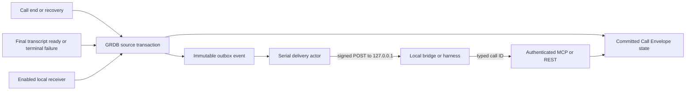
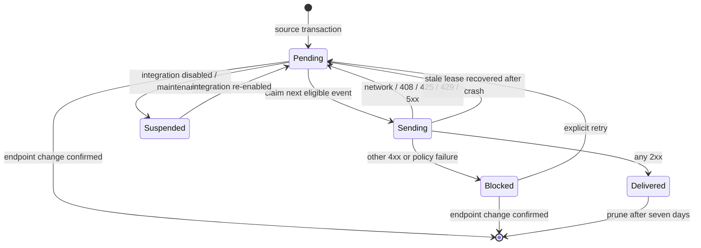

# Local Call Automation Webhook - Plan

## Goal Capsule

- **Objective:** Let an explicitly configured service on the same Mac react when a Call Envelope ends or its Preferred Final Transcript becomes ready or terminally fails, without polling Eye and without turning Eye into a meeting workspace.
- **Product authority:** The user's current request and the settled call-evidence boundary in `docs/plans/2026-07-16-001-feat-call-recording-whisper-bookmarks-plan.md`.
- **Open blockers:** None. Delivery semantics, privacy boundary, configuration ownership, recovery, and UI placement are resolved below.

---

## Product Contract

### Summary

ZBS Eye will offer one optional local webhook for completed-call lifecycle events. It is disabled by default, accepts only a loopback HTTP destination, signs a deliberately small payload, and retries from a durable outbox without delaying recording or transcription. The event is a hint: the receiving bridge or agent retrieves authoritative evidence through Eye's existing authenticated MCP or REST surface.

### Problem Frame

Call evidence is useful to an agent only after the agent learns that new evidence exists. Today a local consumer must poll Eye or rely on a person to start the downstream workflow. Eye needs an event boundary, but it must not absorb the downstream work: no direct Codex/Claude execution, meeting map, summary, CRM, project routing, or document generation belongs here.

### Key Decisions

- **One opt-in local webhook:** Configure a single on-Mac HTTP receiver and keep it disabled by default. `(session-settled: user-approved — chosen over requiring MCP/REST polling: the user wants an automation to start when Eye completes call work.)`
- **Loopback only:** Allow local delivery only; no cloud webhook or implicit external egress. `(session-settled: user-approved — chosen over a mandatory remote integration: Eye remains local-first and privacy-preserving.)`
- **Evidence hint, not interpretation:** Eye sends state and typed evidence identifiers; an external consumer decides whether to start an agent and what to build. `(session-settled: user-directed — chosen over maps, notes, CRM, or AIOS behavior inside Eye: Eye remains a tiny recorder and evidence surface.)`
- **No arbitrary command execution:** v1 does not launch shell commands, apps, Codex, Claude, or model CLIs. This avoids creating a local remote-code-execution surface and keeps receiver ownership explicit.
- **Durable at-least-once delivery:** Events live in a transactional outbox and may be delivered more than once after an ambiguous network/crash boundary. Stable event IDs let receivers deduplicate.
- **Human-owned configuration:** Only the native UI can enable or redirect the webhook and inspect delivery health. Agents receive events and fetch call evidence but cannot inspect or mutate webhook configuration.

### Actors

- A1. **Person on the Mac** enables the integration, provides a local receiver URL, copies its signing secret, tests it, and sees delivery health.
- A2. **ZBS Eye** commits call evidence, creates immutable lifecycle events, and delivers them independently of capture and Whisper work.
- A3. **Local bridge or agent harness** receives and verifies the hint, deduplicates by event ID, and fetches authoritative evidence through authenticated MCP or REST.

### Requirements

**Event contract**

- R1. Eye emits `call.ended` only after the Call Envelope end boundary and final transcript job are durably committed.
- R2. Eye emits `call.transcript.ready` only after a whole-call final revision becomes the Preferred Final Transcript, including honest degraded final results; checkpoint/provisional results never emit this event.
- R3. Eye emits `call.transcript.failed` only when the final transcript job reaches a durable terminal failure after its automatic retry policy; transient and checkpoint failures never emit it.
- R4. Crash recovery that durably closes an interrupted, nonempty Call Envelope and creates or observes its final job emits the same `call.ended` contract with an interrupted/degraded outcome. Recovery never emits for an empty call that is discarded without a final job.
- R5. Every real call lifecycle event has a stable unique ID across delivery retries, a schema version, type, occurrence time, typed Call Envelope Evidence Reference, source state, and only the minimum type-specific status fields. The synthetic test event has the same versioned envelope but omits the call subject and reference.
- R6. Payloads exclude transcript text, audio, screenshots, app/window/OCR content, local paths, meeting titles, API bearer tokens, signing secrets, and user-entered downstream data.

**Delivery and recovery**

- R7. Event creation occurs in the same GRDB transaction as its source call transition, so a crash cannot commit the evidence state while losing its event.
- R8. Webhook delivery is serial, at-least-once, ordered per call, and never awaited by recording, call finalization, or Whisper completion.
- R9. Pending delivery survives quit, crash, relaunch, and receiver downtime. A stale in-flight lease returns to pending on bootstrap.
- R10. Any 2xx response acknowledges delivery. Network errors plus HTTP 408, 425, 429, and 5xx retry with persistent capped exponential backoff; other 4xx become visible blocked failures until the person retries or changes configuration.
- R11. Disabling the integration suspends pending work immediately and creates no events for later call transitions. Re-enabling does not backfill calls that finished while disabled.
- R12. Changing the endpoint requires explicit confirmation. One database transaction discards every undelivered row bound to the previous receiver and stores the new canonical endpoint; no old event is delivered to the new receiver. Secret rotation is deferred in v1 so database and Keychain generations cannot split across a crash.
- R13. Delivered rows are pruned after seven days. Pending/blocked rows remain durable while their Call Envelope exists. The initial privacy-erasure transaction permanently suppresses every undelivered row for that call and dispatcher claims exclude erase-pending calls; final erasure cascades all remaining event rows, including acknowledged rows.
- R14. Storage relocation and shutdown suspend and drain the dispatcher before database snapshot/root flip; resume reclaims pending work from the selected data root.

**Security and native surface**

- R15. The endpoint validator accepts only `http://127.0.0.1:<explicit-port>/<path>`; a typed `localhost` is normalized to `127.0.0.1`. Userinfo, query, fragment, invalid/privileged ports, non-loopback IPs, alternate schemes, and encoded path traversal are rejected.
- R16. The HTTP client uses an ephemeral session with no redirects, cookies, cache, credential store, ambient authentication, or unbounded response; the endpoint is revalidated immediately before each send.
- R17. Eye signs the exact body with a data-protection Keychain secret and sends a delivery timestamp plus event ID in headers. A Keychain read error fails closed and never silently replaces the secret. The receiver contract requires constant-time HMAC comparison, a five-minute delivery-timestamp freshness window, and durable event-ID deduplication for the receiver's full operating lifetime unless the person explicitly purges it.
- R18. The existing Automations screen gets one compact, collapsed-by-default `After a call` card containing Enable, loopback URL, Test, Copy secret, and one delivery-status line; no new Settings route or history dashboard is added.
- R19. Test sends a synthetic `call.automation.test` payload with no call data, finishes within the configured timeout, and does not create a Call Envelope or durable call event.
- R20. No REST/MCP webhook-configuration or delivery-health surface and no agent mutation tool are added in v1. The receiver uses the event's typed ID with the existing authenticated call-evidence APIs.

### Key Flows

- F1. **Enable and verify local automation**
  - **Trigger:** A1 enables `After a call`, enters a receiver URL, and presses Test.
  - **Actors:** A1, A2, A3
  - **Outcome:** Eye validates loopback-only routing, creates or retrieves the signing secret, sends a synthetic signed event, and shows a finite result.
  - **Covered by:** R15-R20
- F2. **React when a call ends**
  - **Trigger:** A2 durably finalizes or recovers a Call Envelope.
  - **Actors:** A2, A3
  - **Outcome:** `call.ended` is queued transactionally and eventually delivered; A3 may fetch `call:<id>` while transcription continues.
  - **Covered by:** R1, R4-R14
- F3. **React when final transcript work settles**
  - **Trigger:** A2 commits the Preferred Final Transcript or terminally fails the final job.
  - **Actors:** A2, A3
  - **Outcome:** A3 receives `call.transcript.ready` or `call.transcript.failed` and retrieves the current evidence through MCP/REST.
  - **Covered by:** R2-R14, R20
- F4. **Recover delivery after interruption**
  - **Trigger:** The receiver or Eye stops while an event is pending/in-flight.
  - **Actors:** A2, A3
  - **Outcome:** Eye resumes the same event ID after relaunch; A3 accepts or deduplicates it without any call-evidence mutation.
  - **Covered by:** R7-R14

### Acceptance Examples

- AE1. **End does not wait for the receiver**
  - **Given:** The hook is enabled and its receiver is offline.
  - **When:** A1 ends a call.
  - **Then:** call finalization returns normally, the `call.ended` row is durable, Whisper proceeds, and delivery retries independently.
- AE2. **Preferred final transcript produces one semantic event**
  - **Given:** A call has checkpoints and a final Whisper job.
  - **When:** A checkpoint completes, a transient final attempt fails, and then the final revision is promoted.
  - **Then:** No checkpoint/transient event is sent and exactly one new `call.transcript.ready` event is queued.
- AE3. **Ambiguous acknowledgement is safe**
  - **Given:** A3 processed an event but Eye crashes before persisting the 2xx acknowledgement.
  - **When:** Eye restarts.
  - **Then:** The same event ID may arrive again and A3 can deduplicate it.
- AE4. **Terminal failure and later manual retry are distinct facts**
  - **Given:** A final transcript job exhausts automatic attempts.
  - **When:** Eye queues `call.transcript.failed`, then a later manual retry succeeds.
  - **Then:** The later `call.transcript.ready` has a distinct event ID while delivery retries of either fact retain their own stable ID.
- AE5. **Disabled means no backlog surprise**
  - **Given:** The integration is disabled.
  - **When:** A call ends and finishes transcription, then A1 enables the hook.
  - **Then:** No requests or historical events appear for that call.
- AE6. **Endpoint change cannot redirect a backlog**
  - **Given:** Events for the current receiver are still undelivered.
  - **When:** A1 changes the endpoint.
  - **Then:** Eye asks for confirmation and atomically discards undelivered old-receiver rows before storing the new endpoint; no old event reaches the new receiver.
- AE7. **External redirect is refused**
  - **Given:** The loopback receiver returns a redirect to a non-loopback URL.
  - **When:** Eye delivers an event.
  - **Then:** Eye does not follow it, sends no private data externally, and surfaces a blocked delivery state.
- AE8. **Relocation preserves one delivery truth**
  - **Given:** A delivery is pending or in flight.
  - **When:** storage relocation begins.
  - **Then:** the dispatcher drains before snapshot/flip and the selected database contains one resumable outbox fact with no split-brain acknowledgement.

### Success Criteria

- Every enabled ended, preferred-final-ready, or terminal-final-failed transition covered by R1-R4 produces exactly one semantic outbox event; delivery retries never create a new semantic event ID.
- Receiver unavailability adds no measurable stop latency to recording or final transcript commit beyond the local outbox transaction.
- A relaunch resumes undelivered events, and a receiver recovery leads to eventual 2xx acknowledgement without rerunning Whisper.
- Security tests prove that no destination outside numeric loopback can receive a request and that payload leak canaries never cross the transport.
- An MCP-capable agent can react to the event and fetch the call by typed ID without scraping the UI or receiving transcript content in the webhook.

### Scope Boundaries

**Deferred**

- Multiple destinations, per-event routing rules, checkpoint/bookmark events, cloud webhooks, Unix sockets, launchd helpers, signing-secret rotation, and a delivery-history browser.
- A packaged Codex/Claude/OpenClaw integration. v1 includes a runnable vendor-neutral reference receiver that verifies, deduplicates, and emits each accepted event as one JSON line for a user-owned harness; vendor-specific task creation remains outside Eye.

**Outside Eye**

- Arbitrary shell/app execution, direct agent task creation, live-call processing, summaries, maps, notes, tasks, CRM, project routing, and AIOS behavior.

### Sources and Research

- `CONCEPTS.md` defines Call Envelope, Preferred Final Transcript, and Evidence Reference.
- `docs/solutions/security-issues/macos-capture-session-lock-state-contract.md` establishes that transition notifications are hints to re-read authoritative state, not authority themselves.
- `ZBSEyeApp/Calls/CallRepository.swift` contains the three atomic source transitions; `ZBSEyeApp/Calls/CallRepository+EvidenceStorage.swift` contains recovery; `ZBSEyeApp/App/AppEnvironment.swift` owns worker and relocation lifecycle.
- `ZBSEyeApp/Connections/ProviderHTTPAdapter.swift` supplies the repo's numeric-loopback, no-redirect, ephemeral-session transport patterns.
- [OWASP SSRF Prevention](https://cheatsheetseries.owasp.org/cheatsheets/Server_Side_Request_Forgery_Prevention_Cheat_Sheet.html) recommends allowlisted destinations and disabling redirects for webhook-style outbound requests.
- [CloudEvents 1.0](https://github.com/cloudevents/spec/blob/main/cloudevents/spec.md) defines stable `source + id` identity so duplicate delivery can retain one event identity.
- [Apple URLSession redirect delegate](https://developer.apple.com/documentation/foundation/urlsessiontaskdelegate/urlsession%28_%3Atask%3Awillperformhttpredirection%3Anewrequest%3Acompletionhandler%3A%29) permits refusing redirects by returning no request.
- [RFC 9110 Retry-After](https://www.rfc-editor.org/info/rfc9110/) grounds honoring a receiver's bounded retry hint for 429/503 responses.

---

## Planning Contract

### Plan depth and preservation

- **Depth:** Deep enough for a privacy-sensitive persistent event bridge crossing call transactions, database migration, URLSession, Keychain, recovery, relocation, UI, REST/MCP status, and tests.
- **Product preservation:** The implementation adds an event outlet only. It does not expand call capture, transcription, or downstream interpretation.
- **Execution boundary:** Work on the isolated `codex/local-call-automation-hooks` branch; do not modify the installed app or release artifacts in this plan.

## Key Technical Decisions

### KTD1. The outbox row is part of the evidence transition

`CallRepository.endCall`, the final branch of `commitTranscriptJob`, the terminal-final branch of `failTranscriptJob`, and interrupted-call recovery insert deterministic event rows inside their existing GRDB write transaction. A post-commit callback from `CallCoordinator` or `CallTranscriptWorker.runLoop` is rejected because a crash between commit and callback would lose the automation fact. Duplicate End/commit calls use a semantic uniqueness key. A later manual transcript retry is a new processing cycle and may create a new terminal event while delivery attempts keep the original event ID.

### KTD2. Endpoint changes discard the old receiver's undelivered backlog

The database owns one local-hook configuration row with enabled state and a validated endpoint. The fixed v1 event set is defined by R1-R4. Each outbox row snapshots an endpoint fingerprint, not the plaintext signing secret. Only transitions occurring while enabled enqueue. The UI edits an isolated URL draft; only an explicit `Save receiver` validates and canonicalizes it. If the canonical endpoint changes while undelivered rows exist, the UI asks for confirmation; one transaction deletes those rows and stores the new endpoint. Cancel restores the persisted URL, and typing alone never changes delivery state. The v1 signing secret is stable; rotation is deferred instead of pretending a Keychain write and GRDB update can be atomic.

### KTD3. A serial actor owns delivery, never the hot path

`CallAutomationDispatcher` claims one row at a time and returns success, retry, or blocked state through the repository. It runs as an `AppEnvironment` worker, is kicked after source commits, scans on startup, resets stale `sending` leases, and participates in shutdown/relocation suspend-and-drain. Its claim query preserves ordering within each call by refusing a later event while an earlier same-call row is pending, sending, or blocked; unrelated calls remain eligible. Recording and Whisper only pay for the local transaction; they never await HTTP. The receiver must accept duplicates because a crash after remote processing but before local acknowledgement is irreducible.

### KTD4. The webhook is a signed, minimal CloudEvents-shaped hint

The JSON envelope uses `specversion`, `id`, `source`, `type`, `time`, and `data`. Real call lifecycle events also carry `subject` equal to the typed `call:<id>` Evidence Reference; `call.automation.test` omits `subject` and contains no call reference. `data` contains only the status fields required by the event type and no content evidence. HMAC-SHA256 covers `<delivery-timestamp>.<exact-body>` with a data-protection Keychain secret; the event ID and timestamp travel in explicit headers. Receivers compare the signature in constant time, reject timestamps outside a five-minute freshness window, and durably remember event IDs until the person explicitly purges their receiver state. Consumers fetch evidence through `get_call`/`read_call_transcript` or authenticated REST.

### KTD5. Network access remains numeric-loopback and default-deny

Configuration accepts one explicit-port HTTP loopback URL and normalizes `localhost` to `127.0.0.1`; the stored canonical value is numeric. The dispatcher revalidates before each request, uses an ephemeral URLSession, blocks redirects and ambient credentials, bounds request/response bytes and time, and emits only typed/redacted error codes. No resolver-controlled hostname, cloud fallback, or shell command enters the feature.

### KTD6. The UI lives with automations; agent surfaces stay unchanged

Add one compact `After a call` card to the existing Automations workspace because this is behavior, not another settings category. The card stays useful without an AI model and owns delivery health. Existing REST/MCP call-evidence retrieval remains unchanged; no agent-facing webhook configuration or diagnostics surface is introduced.

## High-Level Technical Design

### Source transition and delivery

### Delivery state machine

## Implementation Units

### U1. Persist local receiver configuration and a transactional call-event outbox

- **Goal:** Make event existence as durable and idempotent as the Call Envelope transition.
- **Requirements:** R1-R7, R11-R13
- **Flows / examples:** F2-F4; AE2-AE6
- **Files:**
  - Modify `ZBSEyeApp/Data/ZBSEyeDatabase.swift`
  - Modify `ZBSEyeApp/Calls/CallModels.swift`
  - Modify `ZBSEyeApp/Calls/CallRepository.swift`
  - Modify `ZBSEyeApp/Calls/CallRepository+EvidenceStorage.swift`
  - Create `ZBSEyeApp/Automations/CallAutomationModels.swift`
  - Create `ZBSEyeTests/CallAutomationOutboxTests.swift`
  - Modify `project.yml` if the unhosted test target needs explicit production sources
- **Approach:** Add migration v11 with one config row and an outbox table keyed by immutable event ID plus semantic transition identity, endpoint fingerprint, FIFO sequence, lease, retry, blocked, and acknowledgement metadata. Insert only when current config is enabled. Enqueue ended/ready/failed in the source transaction and cover nonempty interrupted recovery. A confirmed endpoint change discards pending/blocked old-receiver rows before storing the new URL. The initial erase transaction suppresses undelivered rows and final erasure cascades every row; prune acknowledged history after seven days.
- **Test scenarios:** fresh migration defaults disabled; upgrade from v10 preserves call rows; repeated End/commit does not duplicate; checkpoint/transient failure does not enqueue; terminal final failure does; recovered nonempty interrupted call with a final job enqueues ended while a discarded empty call does not; disabled transitions do not backfill; confirmed endpoint change discards the old backlog; manual transcript retry produces a new semantic terminal event; privacy erase paused between preparation/finalization sends nothing; final deletion cascades pending, blocked, and delivered events.
- **Verification outcome:** database tests show exactly one event per enabled semantic transition and no state/event crash gap.

### U2. Add the hardened loopback transport and signed payload contract

- **Goal:** Deliver only a minimal authentic event to the configured local receiver.
- **Requirements:** R5-R6, R10, R15-R17, R19
- **Flows / examples:** F1-F4; AE3, AE7
- **Files:**
  - Create `ZBSEyeApp/Automations/CallAutomationPayload.swift`
  - Create `ZBSEyeApp/Automations/LoopbackWebhookTransport.swift`
  - Modify `ZBSEyeApp/Server/KeychainStore.swift`
  - Create `ZBSEyeTests/LoopbackWebhookTransportTests.swift`
  - Create `ZBSEyeTests/CallAutomationPayloadTests.swift`
- **Approach:** Build deterministic CloudEvents-shaped JSON from allowlisted fields, sign exact bytes, and use an injected transport with production URLSession implementation. Share or extract endpoint validation conventions without weakening provider routing. Accept only canonical numeric loopback and fail closed on secret access. Parse Retry-After only within a bounded cap.
- **Test scenarios:** endpoint rejection matrix; `localhost` canonicalization; redirect refusal; cookie/cache/credential absence; request/response/time limits; stable signature fixture; timestamp/id headers; constant-time verification helper and five-minute freshness boundary; payload leak canaries for transcript/path/token/title; 2xx and retry/blocked response classification; Keychain failure does not replace the stable secret.
- **Verification outcome:** transport tests prove zero non-loopback requests and byte-for-byte verifiable signatures.

### U3. Run crash-safe ordered delivery outside recording and Whisper

- **Goal:** Make receiver downtime and Eye restarts recoverable without touching call evidence execution.
- **Requirements:** R8-R14
- **Flows / examples:** F2-F4; AE1-AE4, AE8
- **Files:**
  - Create `ZBSEyeApp/Automations/CallAutomationRepository.swift`
  - Create `ZBSEyeApp/Automations/CallAutomationDispatcher.swift`
  - Modify `ZBSEyeApp/App/AppEnvironment.swift`
  - Create `ZBSEyeTests/CallAutomationDispatcherTests.swift`
  - Modify `ZBSEyeTests/CallStorageRelocationTests.swift`
- **Approach:** Use one actor and one durable lease at a time. Preserve per-call sequence without globally blocking other calls. Persist retry/backoff and blocked states; recover stale sends at bootstrap. Add kick, suspend-and-drain, resume, shutdown, privacy-erasure exclusion, and relocation wiring. Ensure source transactions only enqueue and signal; HTTP is always detached from capture/transcript latency.
- **Test scenarios:** receiver offline then 204; crash before acknowledgement redelivers same ID; per-call ended-before-ready ordering while another call remains deliverable; capped backoff and bounded Retry-After; 4xx blocked/manual retry; disable suspension; confirmed endpoint change discards old pending/blocked rows; erase-pending exclusion; stale send recovery; relocation drains and resumes from one root; dispatcher delay never delays repository completion.
- **Verification outcome:** deterministic injected-clock/transport tests cover lifecycle and existing call/relocation regressions stay green.

### U4. Add a compact human-owned Automations card and health store

- **Goal:** Make setup understandable without adding another settings mountain.
- **Requirements:** R11-R12, R15, R17-R19
- **Flows / examples:** F1; AE5-AE7
- **Files:**
  - Create `ZBSEyeApp/State/CallAutomationStore.swift`
  - Modify `ZBSEyeApp/Views/Automations/AutomationsView.swift`
  - Modify `ZBSEyeApp/App/AppEnvironment.swift`
  - Create `ZBSEyeTests/CallAutomationStoreTests.swift`
  - Modify `ZBSEyeTests/SettingsPresentationTests.swift` only if presentation assertions need an explicit no-new-route regression
- **Approach:** Place one collapsed `After a call` card before AI-dependent summary controls. Show the master toggle and a one-line status collapsed; reveal a staged URL draft with explicit Save/Cancel, Test, Copy secret, event labels, and pending/blocked counts. Keep the webhook useful with no AI model configured. Define these compact interaction states: disabled; invalid draft; ready; endpoint-change confirmation; test in progress; test success; test failure; Keychain unavailable; suspended; blocked. For each state, expose one clear next action, deterministic control enablement, keyboard focus order, VoiceOver labels, and a non-color-only status.
- **Test scenarios:** default disabled; invalid draft remains local and cannot enable; typing changes no persistent state; Save validates/canonicalizes; changed endpoint with backlog requires confirmation and discards the old backlog atomically; Cancel restores persisted URL; Test success/failure completes and cannot double-submit; no call row from Test; Keychain failure shown without replacement; disabling suspends; blocked state exposes Retry; keyboard/VoiceOver status is labelled; no fifth Settings route.
- **Verification outcome:** state tests and presentation checks prove a finite, compact, human-owned setup flow.

### U5. Document and prove the receiver contract

- **Goal:** Give a person one runnable local receiver and show a harness how to retrieve evidence without expanding Eye's agent API.
- **Requirements:** R5-R6, R20
- **Flows / examples:** F2-F4
- **Files:**
  - Create `docs/CALL_AUTOMATION.md`
  - Create `examples/call-automation-receiver.py`
  - Modify `CONCEPTS.md`
- **Approach:** Document event schema, headers, constant-time HMAC verification, five-minute freshness, lifetime deduplication, acknowledgement/retry behavior, and the `event -> get_call -> read_call_transcript` flow. Provide a standard-library-only reference receiver that binds numeric loopback, verifies and deduplicates events, acknowledges only durable acceptance, and emits one JSON line per accepted event to stdout as the vendor-neutral harness handoff; it never launches commands itself.
- **Test scenarios:** example payload decodes; reference receiver rejects invalid/stale/replayed signatures and emits one line for a valid event; existing read-only MCP call-evidence flow consumes the emitted typed ID without any new webhook tool.
- **Verification outcome:** a runnable local receiver accepts a real signed event and an agent follows the typed call reference through existing authenticated evidence tools.

### U6. Run release-grade regression and security gates

- **Goal:** Prove the hook does not weaken call capture, local-only egress, storage safety, or the tiny-product boundary.
- **Requirements:** R1-R20
- **Flows / examples:** F1-F4; AE1-AE8
- **Files:**
  - Modify `scripts/verify-call-recording.sh`
  - Create `scripts/verify-call-automation.sh`
  - Modify `BUILD.md` only if the focused gate becomes part of the canonical local workflow
- **Approach:** Add a fixture-driven local receiver that verifies signature, event ordering, duplicate identity, payload privacy, redirect blocking, restart recovery, and no-backfill semantics. Run the full unhosted unit suite, call qualification fixtures, project verification, and release build. Do not require a personal call corpus, a real cloud service, or a long real meeting.
- **Test scenarios:** all unit/integration cases above plus existing call database/coordinator/worker/recovery/relocation/API/MCP tests; static egress scan; Swift 6 concurrency build; release configuration build.
- **Verification outcome:** focused and full gates pass with no personal data and no outbound network dependency.

## System-Wide Impact

- **Data:** Migration v11 adds small relational config/outbox state to the live database; it follows `StorageLocation`, backup, relocation, and call deletion. No media format changes.
- **Call lifecycle:** Four repository transactions gain conditional inserts. No network work enters capture or Whisper execution.
- **Network:** One new opt-in outbound client is restricted to numeric loopback, signed, bounded, and redirect-free. This is the primary security review surface.
- **Secrets:** One stable v1 webhook signing secret uses the data-protection Keychain and never enters database, logs, REST/MCP, or payload. Rotation is deferred until it can use a versioned crash-safe protocol.
- **UI:** One compact card is added to the existing Automations workspace. No navigation route is added.
- **Agents:** Agents receive a push hint through the reference or user-owned bridge and read evidence through existing authenticated tools. Eye adds no new agent configuration or diagnostics surface.
- **Operations:** Pending state is visible and resumable; failures use typed redacted codes. Delivery cannot block recording, transcription, quit, or relocation indefinitely.

## Risks and Mitigations

- **Crash gap or duplicate delivery:** Use a same-transaction outbox, stable IDs, stale-lease recovery, and an explicit at-least-once receiver contract.
- **Local data exfiltration/SSRF:** Numeric loopback allowlist, canonical endpoint storage, send-time revalidation, no redirects/credentials, minimal payload, and leak-canary tests.
- **Another process occupies the configured port:** HMAC lets the intended receiver verify Eye, but cannot prove receiver identity to Eye. The payload therefore contains no content evidence, and the UI states that the selected local service is trusted.
- **Configuration change redirects pending events:** Explicit confirmation plus one transaction discards undelivered old-receiver rows before the endpoint changes.
- **Retry loop consumes resources:** One serial actor, capped backoff, finite request/response limits, suspended state, and seven-day pruning for delivered rows.
- **Relocation split-brain:** Dispatcher joins the existing maintenance barrier and persists acknowledgements only before drain or after resume on the selected root.
- **Feature grows into orchestration:** Scope and tests exclude shell/app launch, direct agent integration, multi-destination routing, and content generation.

## Verification Contract

- **Focused tests:** migration/outbox, repository event boundaries, payload/signature, endpoint policy, dispatcher lifecycle, settings store, and reference receiver.
- **Regression tests:** call database, coordinator, worker, recovery, final promotion, retention/erase, storage relocation, REST/MCP, settings presentation.
- **Repository gates:** Swift format/lint conventions already enforced by the repo, unhosted `ZBSEyeUnitTests`, focused call fixtures, general verification scripts, and Debug plus Release builds.
- **Security evidence:** Tests must show the requested destination actually observed a signed request; absence-only assertions are insufficient for positive flows. Redirect/non-loopback tests must show no request reached the forbidden server.
- **Privacy evidence:** Synthetic canary values for transcript, path, bearer token, title, and screen text must be absent from encoded body, headers, errors, and logs.
- **Resource evidence:** An offline receiver does not create additional capture transitions, Whisper attempts, or synchronous call-end delay beyond the database transaction.

## Definition of Done

- All R1-R20 requirements and AE1-AE8 examples are traced to passing tests or observable UI behavior.
- The feature is disabled by default and cannot send outside numeric loopback.
- Ended/ready/failed events are transactional, ordered, signed, minimal, recoverable, and deduplicable.
- The native setup is compact, testable, and does not require an AI model or add a Settings route.
- Existing REST/MCP evidence retrieval remains unchanged; agents can fetch authoritative evidence by typed ID but cannot inspect or mutate webhook configuration.
- Full build/test/security gates pass on synthetic fixtures, with no personal corpus and no cloud receiver.
- Documentation explains receiver verification, idempotency, retry, and MCP/REST follow-up.

## Open Questions

### Resolved During Planning

- Interrupted recovered calls emit `call.ended` only after a durable recovered boundary and final job exist.
- Network/408/425/429/5xx retry persistently with capped delay; other 4xx block visibly for manual correction.
- Endpoint changes require confirmation and atomically discard the old receiver's undelivered backlog.
- Bookmark/checkpoint events, cloud destinations, and arbitrary command execution are deferred.

### Deferred to Implementation Judgment

- Exact presentation copy, SF Symbols, and spacing within the compact Automations card.
- Exact internal retry jitter and lease duration within the externally fixed retry/ordering contract.
