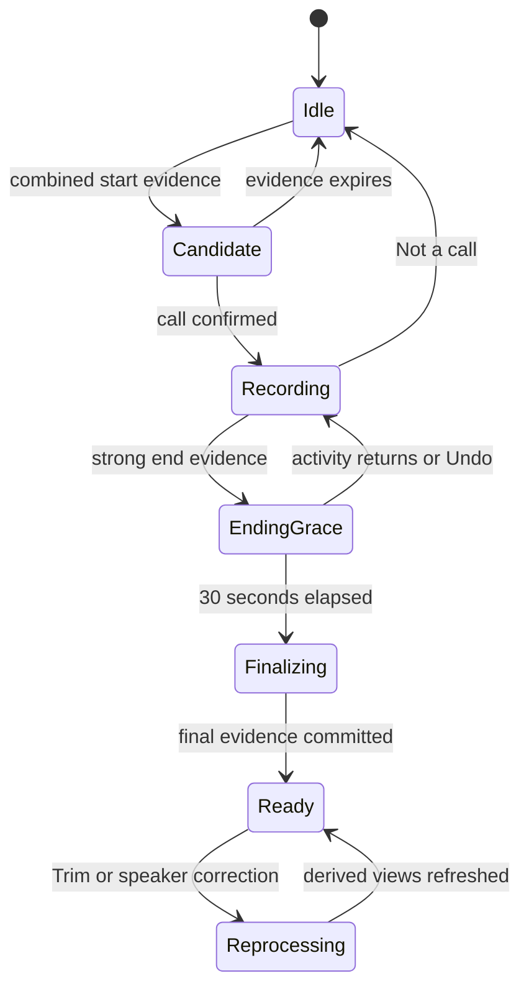
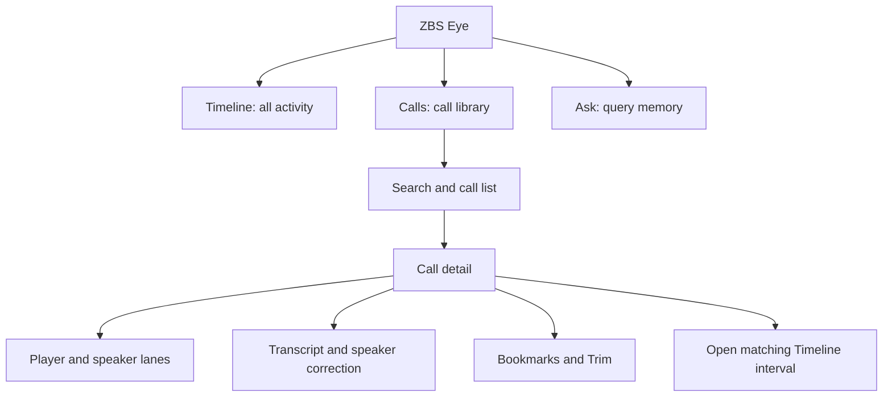
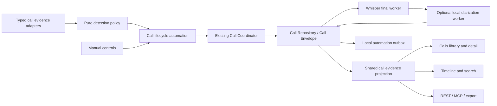
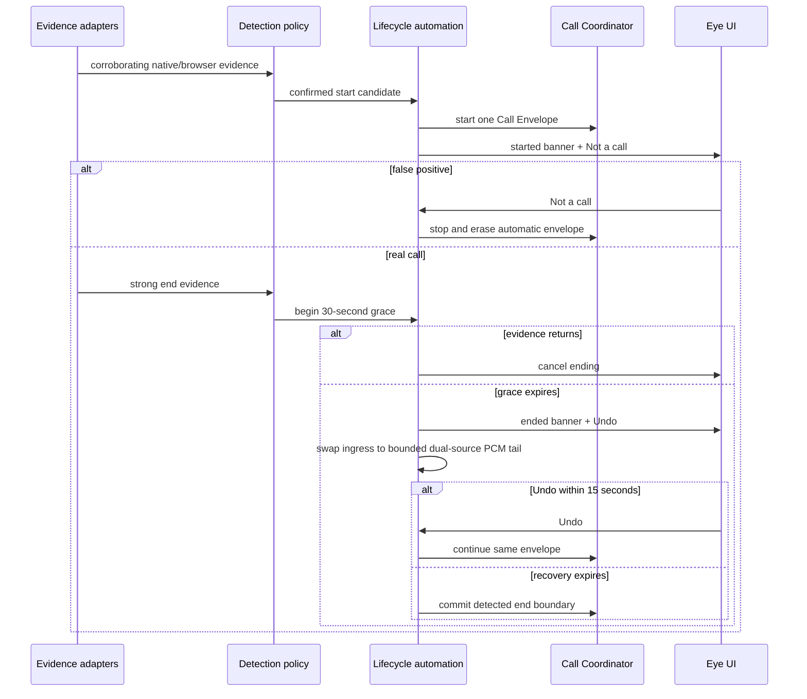
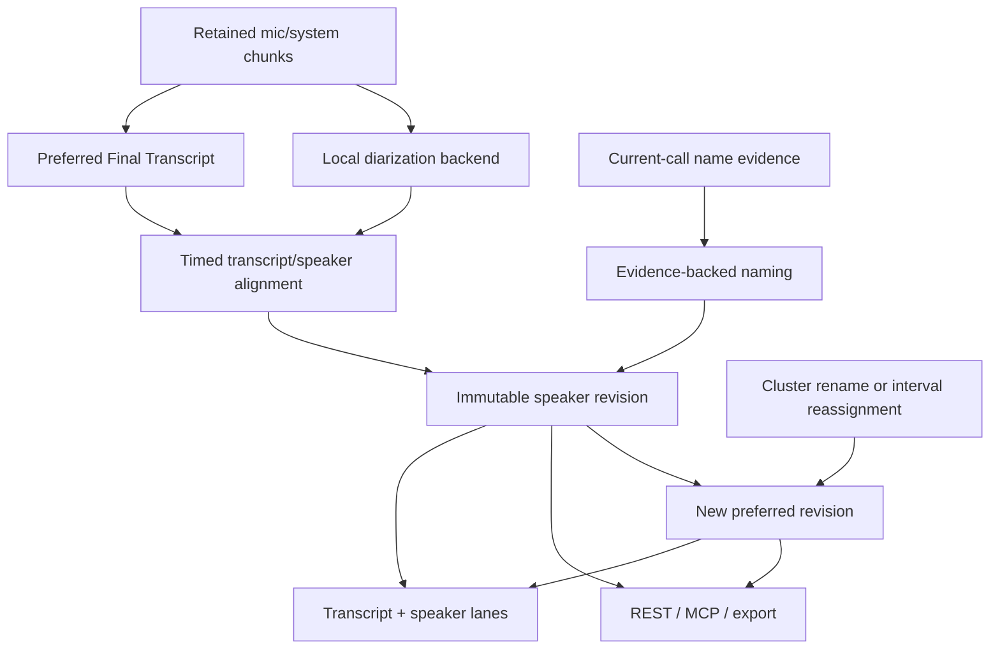
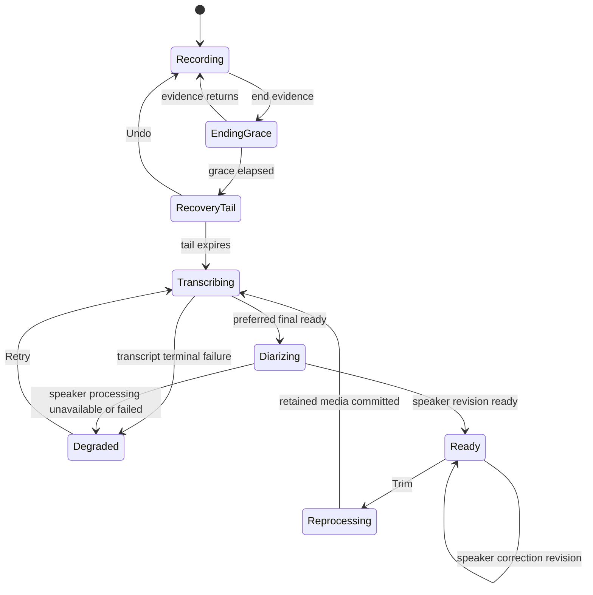
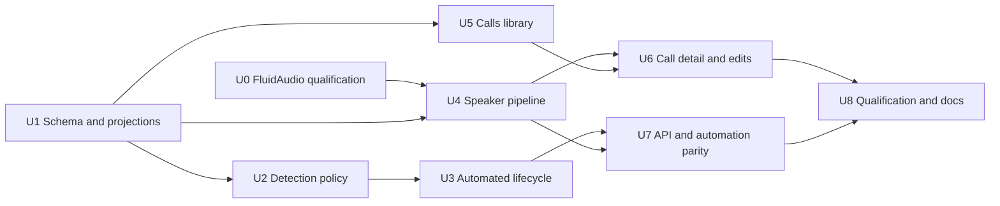

> **Historical plan — superseded.** This file preserves the July 17 design record and is intentionally not
> rewritten to match the product that was later implemented. Do not use its combined-signal start gate,
> generic-microphone rejection, Krisp ownership assumptions, soft-end tail/Undo, or old qualification checklist
> as current authority. The `0.7.0 (21)` candidate instead starts automatic Calls from eligible external
> microphone initiators; treats Krisp as relay-only and `codex_chronicle` as excluded; keeps audio exclusions
> separate from screen privacy; leaves automatic Calls armed during Pause Timeline but disarms them for Audio Off
> and privacy pause; and uses one 30-second End & save/delete window with no post-end Undo. Current product and
> release authority: [`AGENTS.md`](../../AGENTS.md), [`ABOUT.md`](../ABOUT.md), [`ROADMAP.md`](../../ROADMAP.md),
> and [`NOTARIZE.md`](../NOTARIZE.md). Implemented/deterministic verification is complete; physical qualification
> of the exact installed release artifact remains pending.

# Automatic Call Capture, Library, and Diarization - Plan

## Goal Capsule

- **Objective:** Make calls a reliable, automatically captured, locally processed, and easily correctable part of ZBS Eye without turning Eye into a meeting CRM.
- **Product authority:** The confirmed single-user workflow in this brainstorm, the existing Call Envelope contract, and the product principle that Eye stays tiny, local, and focused on recording and exposing evidence.
- **Open blockers:** None before planning. Model choice, confidence fusion, and exact UI composition are planning-owned decisions constrained by this Product Contract.

---

## Product Contract

### Summary

ZBS Eye will recognize real calls on the Mac, record them as durable Call Envelopes, and finish them automatically without requiring the user to babysit recording. A dedicated `Calls` library will make completed calls easy to find, play, trim, transcribe, label by speaker, and hand to local agents.

### Problem Frame

The existing call recorder can preserve microphone and system-audio evidence, bookmarks, and final Whisper transcripts, but its explicit call lifecycle is separate from the current meeting detector. Calls are opened from the all-activity Timeline, while the detail view exposes source labels and text rather than a usable call-management surface.

This creates two failure modes. A real call can be missed because the user forgot to start it, while a detected call can retain a long unrelated tail when end detection fails. Even a correctly recorded call is difficult to review when it is buried inside the complete screen-history Timeline and remote speakers remain a single `System` source.

### Key Decisions

- **Calls get a dedicated library.** `(session-settled: user-directed — chosen over Timeline-only discovery: finding and editing one call inside the complete activity history is too costly.)` The library is another projection of existing Call Envelopes, not another source of truth.
- **Automatic capture is reversible at both boundaries.** `(session-settled: user-directed — chosen over confirmation-only or manual ending: calls should not be missed or retain runaway tails, but detector mistakes must remain recoverable.)`
- **Speaker identity is local to one call.** `(session-settled: user-directed — chosen over cloud diarization and persistent voiceprints: Eye may use current-call evidence but must not build a biometric identity store.)`
- **Speaker correction has two distinct gestures.** `(session-settled: user-directed — chosen over one ambiguous assignment action: renaming a cluster and correcting one mistaken interval are different intents.)`
- **Bookmarks replace live transcription as the in-call affordance.** `(session-settled: user-directed — chosen over a live transcript: a bookmark captures the important moment without turning Eye into an attention-consuming meeting assistant.)`
- **Eye remains an evidence layer, not a CRM.** `(session-settled: user-directed — chosen over notes, action items, contacts, and live meeting intelligence: downstream agents should transform call evidence outside Eye.)`

The new speaker layer extends rather than replaces source provenance: `me` and `system` still describe where audio came from, while per-call speaker annotations describe who appears to speak inside that evidence.

### Actors

- A1. **The person using this Mac** owns recording intent, corrections, retention, and agent handoff.
- A2. **ZBS Eye** detects, captures, transcribes, diarizes, indexes, presents, edits, and exposes call evidence locally.
- A3. **Call surfaces** include native and browser-based applications such as Telegram, Zoom, Google Meet, Microsoft Teams, FaceTime, Slack, Discord, and similar tools.
- A4. **Local agents and harnesses** read authoritative call evidence through Eye and may react to lifecycle webhooks.

### Requirements

**Automatic lifecycle**

- R1. Eye must create a Call Envelope automatically when multiple local signals indicate that a real call has started.
- R2. A calendar event, generic microphone use, or system audio alone must never be sufficient to create a persisted call.
- R3. Native and browser-based call surfaces are coverage requirements of one detection system rather than separate product integrations.
- R4. Automatic start must produce a lightweight notification with an immediate `Not a call` action.
- R5. `Not a call` must stop the automatic Call Envelope and remove evidence created only by that false detection.
- R6. Manual Start, Bookmark, and End controls must remain available regardless of detector support.
- R7. When strong end signals persist for an automatically owned Call Envelope, Eye must wait 30 seconds and then finish it automatically; manual and claimed envelopes require Manual End.
- R8. Automatic end must notify the user and provide Undo backed by a short temporary audio tail so a mistaken end can resume without losing the boundary.
- R9. Continuing call evidence during the end grace period must cancel automatic ending without user action.

**Recording and transcription**

- R10. Each Call Envelope must preserve microphone and system audio as distinct source evidence with honest gaps when either source is unavailable.
- R11. Recording must continue uninterrupted when the user adds a Bookmark.
- R12. A Bookmark must request a provisional Whisper transcript around that moment without becoming the final transcript authority.
- R13. Ending a call must trigger one deterministic full-call Whisper pass whose successful result becomes the Preferred Final Transcript.
- R14. Calls must remain reviewable when transcription is pending, degraded, failed, or waiting for the speech model.

**Per-call speakers**

- R15. Final call processing must partition speech into stable anonymous speaker clusters within that call while preserving microphone/system source provenance; a human identity such as `Me` still requires current-call or manual evidence.
- R16. Eye may attach a human name only when current-call screen, accessibility, calendar, or manual evidence supports that name with sufficient confidence.
- R17. When naming evidence is absent or ambiguous, Eye must show a stable anonymous label rather than guess.
- R18. Speaker clustering and voice features must be discarded as cross-call identity evidence after processing; no persistent voiceprint may be created.
- R19. Clicking a speaker label must rename that entire cluster within the current call.
- R20. Selecting a transcript or speaker-lane interval must allow reassignment of only that interval to an existing or newly named per-call speaker.
- R21. Speaker annotation changes must be revisioned, immediately reflected in transcript and lane colors, and undoable.

**Calls library and detail**

- R22. `Calls` must be a primary product surface alongside `Timeline` and `Ask`.
- R23. `Calls` must list recorded calls by title, known participants, source application, date, duration, processing health, and Bookmark presence when those fields are available.
- R24. The library must search calls by title, participant, transcript text, date range, and source application.
- R25. Opening a library row must show one call-detail surface containing playback, transcript, synchronized speaker lanes, Bookmarks, Trim, processing state, and a link to the corresponding Timeline interval.
- R26. The same Call Envelope must back the Timeline marker, Calls row, call detail, search result, REST response, MCP response, export, and webhook subject.

**Trim, truth, and handoff**

- R27. Trim must allow removal of a head, tail, or arbitrary interior time range from a completed call.
- R28. A trimmed range must disappear from audio, transcript, speaker annotations, Bookmarks, search, export, REST, MCP, and future agent reads.
- R29. Evidence outside the trimmed range must be preserved, while derived transcript and diarization views remain unavailable or visibly stale until rebuilt from retained audio.
- R30. Destructive Trim must require clear confirmation and must not pretend to offer Undo after the selected evidence has been physically removed.
- R31. Eye must expose the final call, speaker annotations, Bookmark transcripts, source health, and processing state through authenticated local REST and MCP surfaces.
- R32. Existing local call automation must retain its lightweight lifecycle hints and expose a post-processing-ready signal only when the Preferred Final Transcript and initial speaker annotation revision are authoritative.
- R33. User-visible state must distinguish recording, end grace, finalizing, transcribing, diarizing, ready, degraded, reprocessing, and failed outcomes without claiming unavailable evidence.

### Key Flows

- F1. Automatic capture with rejection
  - **Trigger:** Combined evidence indicates a call has begun.
  - **Actors:** A1, A2, A3
  - **Steps:** Eye opens a Call Envelope and notifies the user; the user may ignore the notification or choose `Not a call`.
  - **Outcome:** A real call records without preparation, while a false detection is stopped and discarded.
  - **Covered by:** R1-R6

- F2. Automatic completion with recovery
  - **Trigger:** Strong end evidence persists during an automatically owned active call.
  - **Actors:** A1, A2
  - **Steps:** Eye enters a 30-second grace period; resumed evidence cancels it; otherwise Eye finishes and offers Undo while retaining a temporary tail.
  - **Outcome:** Runaway automatic recordings stop without making an early detector mistake irreversible; manual and claimed calls remain under Manual End.
  - **Covered by:** R7-R9, R33

- F3. Review, correct, and trim
  - **Trigger:** The user opens a completed row in `Calls`.
  - **Actors:** A1, A2
  - **Steps:** The user plays the call, reviews speaker lanes, renames a cluster or reassigns one interval, and may select a range to Trim.
  - **Outcome:** Every retained byte and derived label matches the corrected, user-approved call record.
  - **Covered by:** R15-R30

- F4. Agent handoff
  - **Trigger:** A final transcript becomes ready or a configured local webhook fires.
  - **Actors:** A2, A4
  - **Steps:** The harness receives a typed lifecycle hint and fetches the current Call Envelope and transcript through authenticated local interfaces.
  - **Outcome:** Agents can build maps, documents, or automations without those features living inside Eye.
  - **Covered by:** R31-R33

### Acceptance Examples

- AE1. Non-call media playback
  - **Covers:** R1-R5
  - **Given:** Telegram, a browser, or another app plays speech while no call UI or participant evidence exists.
  - **When:** System audio is active without corroborating call signals.
  - **Then:** Eye does not persist a Call Envelope.

- AE2. Telegram call
  - **Covers:** R1-R10, R22-R26
  - **Given:** A Telegram call begins while Eye is running.
  - **When:** Call evidence crosses the start threshold.
  - **Then:** Eye records it automatically, shows a start notification, and exposes the active or completed call in `Calls` and Timeline.

- AE3. Browser meeting
  - **Covers:** R1-R3, R10
  - **Given:** A Google Meet or Zoom web call runs in a supported browser.
  - **When:** Browser microphone use is corroborated by call-surface evidence and two-sided audio activity.
  - **Then:** Eye records the call even though the browser may also use the microphone outside meetings.

- AE4. Correct and mistaken automatic end
  - **Covers:** R7-R9
  - **Given:** An active call loses its call signals.
  - **When:** Signals remain absent for 30 seconds.
  - **Then:** Returning evidence during grace cancels ending; after completion, pressing Undo within the recovery window resumes the same Call Envelope without a missing boundary.

- AE5. Unknown speakers
  - **Covers:** R15-R18
  - **Given:** Three remote voices are present but Eye can support only one participant name from current-call evidence.
  - **When:** Final diarization finishes.
  - **Then:** Eye shows the supported name plus stable anonymous labels for the other two voices and invents no names.

- AE6. Two speaker correction gestures
  - **Covers:** R19-R21
  - **Given:** `Speaker 2` is unnamed and one interval inside `Speaker 3` was clustered incorrectly.
  - **When:** The user renames `Speaker 2` to Olga and reassigns only the mistaken `Speaker 3` interval to Olga.
  - **Then:** Every `Speaker 2` interval becomes Olga, while only the selected `Speaker 3` interval changes.

- AE7. Runaway tail removal
  - **Covers:** R27-R30, R33
  - **Given:** A 59-minute call contains 90 minutes of unrelated trailing audio.
  - **When:** The user trims the trailing range and confirms permanent removal.
  - **Then:** Eye preserves the call, removes the selected evidence from every surface, and rebuilds transcript and speakers from the retained 59 minutes.

- AE8. Completion automation
  - **Covers:** R31-R33
  - **Given:** A loopback call webhook is enabled.
  - **When:** The Preferred Final Transcript and initial speaker annotations become ready.
  - **Then:** The webhook sends a typed post-processing hint, and the receiving agent fetches current authoritative evidence through Eye rather than receiving private transcript text in the webhook.

### Success Criteria

- Supported native and browser call scenarios pass repeatable start, false-positive rejection, end, Undo, restart, and crash-recovery tests.
- A strong detected end cannot leave an unbounded recording tail; normal automatic completion occurs after the 30-second grace plus bounded finalization delay.
- No user-visible speaker name lacks current-call or manual evidence, and ambiguous cases remain anonymous.
- Trimming any tested boundary or interior range leaves no selected audio or derived text accessible through storage, UI, search, export, REST, MCP, or automation.
- A user can find and open a known call from `Calls` without navigating the full Timeline.
- The idle detector does not load transcription or diarization models and preserves Eye's tiny idle resource profile.

### Scope Boundaries

**Deferred for later**

- An upcoming-meetings agenda or calendar-management screen; calendar data is only optional detection and naming evidence here.
- Cross-call contact suggestions that do not rely on voice biometrics.
- Importing an external recording into the Calls library.

**Outside this product's identity**

- A visible meeting bot or recording calls when this Mac is absent.
- Live transcript, live call map, live coaching, automatic summaries, action items, CRM writeback, contact management, team spaces, and sharing workflows.
- Cloud diarization, cloud-required transcription, or a persistent voiceprint database.

### Dependencies and Assumptions

- The existing Call Envelope, separate audio sources, Bookmark checkpoints, Preferred Final Transcript, exact range redaction, search, export, REST, and MCP contracts remain the evidence foundation.
- The planning baseline includes the merged local call-automation work on `origin/main`; the current feature checkout predates that merge and must not reimplement it independently.
- A compact local diarization engine may meet acceptable accuracy, licensing, and resource limits on supported Apple Silicon Macs; U0 must qualify the selected candidate before speaker-pipeline implementation depends on it.
- Accessibility, OCR, calendar, window, process-audio, and audio-activity signals may be incomplete, so confidence fusion and honest fallback are required rather than universal naming claims.

### Outstanding Questions

**Deferred to planning**

- Which local diarization candidate wins the accuracy, speaker-count, model-size, memory, latency, and licensing gate?
- What per-surface evidence adapters and confidence thresholds satisfy R1-R9 without a generic browser microphone false-positive latch?
- How long must the temporary end-Undo tail remain available beyond the required 30-second grace while staying within the storage cap?
- What is the smallest call-detail composition that preserves the Krisp-inspired player, lanes, corrections, Bookmarks, and Trim without importing its CRM chrome?

### Sources and Research

- Existing call contract and prior v1 boundary: `docs/plans/2026-07-16-001-feat-call-recording-whisper-bookmarks-plan.md`.
- Current call detail and Timeline entry point: `ZBSEyeApp/Views/Calls/CallDetailView.swift` and `ZBSEyeApp/Views/Timeline/TimelineView.swift`.
- Current native-app-only detector and 10-second stop grace: `ZBSEyeApp/Meeting/MeetingDetector.swift`.
- Existing exact range-redaction implementation and tests: `ZBSEyeApp/Calls/CallEvidenceDeletionService.swift` and `ZBSEyeTests/CallRedactionTests.swift`.
- Existing local agent evidence surfaces: `ZBSEyeApp/Calls/CallEvidenceQueryService.swift`, `ZBSEyeApp/MCP/ZBSEyeMCPServer.swift`, and `ZBSEyeApp/Server/ZBSEyeHTTPServer.swift`.
- Merged local automation contract: `docs/CALL_AUTOMATION.md` on `origin/main`, introduced by PR #30.
- Screenpipe's hybrid model exposes meeting objects and APIs but directs users to Timeline or search for discovery: [Screenpipe Meeting Intelligence](https://docs.screenpipe.com/meeting-intelligence).
- Dedicated meeting libraries informed the `Calls` surface: [Granola 101](https://docs.granola.ai/help-center/getting-started/granola-101), [Otter conversation recording](https://help.otter.ai/hc/en-us/articles/360048269733-Record-a-conversation), [Limitless meetings](https://help.limitless.ai/en/articles/9118357-how-do-i-find-my-meeting-url-or-id-and-send-logs), and [anarlog](https://github.com/fastrepl/anarlog).
- Timeline-first activity recording informed the separation boundary: [Dayflow](https://github.com/JerryZLiu/Dayflow).
- Local diarization candidates for planning evaluation: [FluidAudio](https://github.com/FluidInference/FluidAudio), [FluidAudio benchmarks](https://github.com/FluidInference/FluidAudio/blob/main/Documentation/Benchmarks.md), [FluidInference speaker diarization Core ML model](https://huggingface.co/FluidInference/speaker-diarization-coreml), [pyannote Community-1](https://huggingface.co/pyannote/speaker-diarization-community-1), and [sherpa-onnx speaker diarization](https://k2-fsa.github.io/sherpa/onnx/c-api/html/speaker_diarization.html).

---

## Planning Contract

### Key Technical Decisions

- **KTD1. Extend Call Envelopes instead of creating a meeting subsystem.** `(session-settled: user-directed — chosen over a parallel meeting store: every UI, search, API, and automation projection must resolve to the same evidence authority.)` Add a one-to-one call context plus speaker revisions beside the existing sources, bookmarks, transcript revisions, and media generations. This implements Product Key Decisions 1 and 6 without rebuilding the constrained `calls` table.
- **KTD2. Fuse typed evidence with a pure policy before opening or ending a call.** `(session-settled: user-directed — chosen over generic microphone detection: ordinary playback and long-lived browser microphone use must not become calls.)` Native-app mic use and browser call-surface evidence are adapters into one detector; no individual signal persists a call. This implements Product Key Decision 2.
- **KTD3. Drive the existing Call Coordinator through one automation owner.** `(session-settled: user-directed — chosen over detector-owned recording: manual and automatic controls must not race or create two active envelopes.)` The automation owner serializes candidate, recording, grace, soft end, finalization, rejection, and manual override transitions; every call records `automatic`, `manual`, or `claimed` ownership.
- **KTD4. Keep automatic boundary recovery bounded and local.** `(session-settled: user-directed — chosen over immediate irreversible end or manual-only end: automatic stopping must prevent runaway tails while remaining recoverable.)` End detection enters the required 30-second grace, then retains a 15-second soft-end recovery tail; Undo resumes the same envelope, while expiry commits the detected boundary and discards the tail before transcript jobs or webhooks exist.
- **KTD5. Select FluidAudio 0.15.5 offline diarization behind a replaceable protocol if U0 passes.** It is the strongest fit for Swift 6/macOS 15 and Core ML/ANE, while its documented streaming path is less accurate and unnecessary here. Pin the package exactly, download only the five required model artifacts at model revision `1ed7a662fdc7109e36d822db793ee6eebdaf8594` through Eye's verified managed-asset path, and start qualification at clustering threshold `0.7`; do not call the library's mutable-revision downloader.
- **KTD6. Store immutable per-call speaker revisions.** `(session-settled: user-directed — chosen over mutable global speaker identities: corrections need Undo while voice features must not survive as cross-call identity.)` A preferred speaker revision owns anonymous clusters and timed assignments for one media generation; each correction creates a new revision and never persists reusable embeddings.
- **KTD7. Treat naming as evidence attachment, not voice recognition.** `(session-settled: user-directed — chosen over guessed names or persistent voiceprints: unsupported identity claims are worse than anonymous labels.)` Current-call application, accessibility/OCR, optional calendar, and manual evidence can name clusters; otherwise the UI renders stable `Speaker N` labels.
- **KTD8. Add Calls as a third primary workspace mode.** `(session-settled: user-directed — chosen over Timeline-only discovery: calls need a compact library and correction surface without restoring the old settings-heavy sidebar.)` The header becomes `Timeline · Calls · Ask`; secondary product features remain under More/Settings.
- **KTD9. Reuse physical range redaction for Trim.** `(session-settled: user-directed — chosen over cosmetic clipping: trimmed evidence must disappear from every surface and future agent read.)` The Calls UI invokes the existing media-mutation journal, invalidates derived revisions, and queues deterministic transcript and speaker rebuilds.
- **KTD10. Extend the merged local automation contract with one readiness event.** `(session-settled: user-directed — chosen over placing maps, notes, or CRM behavior in Eye: agents should fetch authoritative evidence after Eye finishes local processing.)` `call.processing.ready` is the only new event and is emitted only after both preferred final transcript and initial preferred speaker revision are authoritative; failures and later manual corrections remain queryable state.

### Assumptions

- The implementation starts from `origin/main`, which already contains PR #29 call evidence and PR #30 local call automation.
- The 15-second soft-end recovery tail follows the 30-second grace and allows a mistaken automatic end to be reversed without extending every completed call; it is internal and not a retained second recording.
- Automatic detection ships first for explicitly tested native applications and browser call-title patterns. Unknown applications continue to support manual Start/Bookmark/End and may be added through data-driven adapters.
- Call notifications are in-app overlays and menu-bar state. This feature must not request notification permission or add another recurring macOS prompt.
- Diarization runs only after a Preferred Final Transcript exists and the app is not actively capturing a call; it never loads during idle detection.
- Diarization may cluster each finalized source rail independently while preserving `mic` and `system` provenance. A microphone cluster is named `Me` only when current-call or manual evidence supports that identity; nearby or shared-room voices stay anonymous.
- Calendar data may improve a title or participant hint when already available, but this plan adds no calendar account setup or agenda surface.

### High-Level Technical Design

The diagrams communicate ownership and sequencing. They are directional; implementation must preserve the existing one-writer, local-auth, media-generation, and truthful-state invariants.

#### Component topology

#### Automatic lifecycle sequence

#### Persisted speaker data flow

#### Processing and edit state

### Data Model

- Add a one-to-one call-context table with nullable display metadata, detection provenance, automatic/manual/claimed ownership, detected boundary timestamps, effective presentation bounds, preferred speaker revision, and processing status. Existing calls without context remain readable as manual/anonymous records.
- Start schema work after the merged `v11_call_automation_outbox` migration and update the migration manifest; keep the migration schema-only with no launch-time audio backfill.
- Add immutable `call_speaker_revisions` keyed by call and media generation, `call_speaker_clusters` keyed by revision, and `call_speaker_intervals` keyed by revision and retained time range.
- Persist naming and detection provenance as a bounded allowlisted record containing provenance kind, normalized final label, time range, confidence, and an opaque source identifier. Cap labels, reject control characters, and hash ephemeral detector fingerprints. Do not persist or log raw AX/OCR/calendar text, full URLs, window titles, participant lists, detector payloads, diarization embeddings, reusable acoustic fingerprints, or cross-call person identifiers.
- Keep source provenance on transcript segments. Speaker intervals overlay source-labelled segments and never rewrite `me`/`system` into identity fields.
- Add call metadata and participant names to call search without breaking the FTS external-content rule: FTS scoring/snippets remain inside an FTS-only subquery before joins.

### Processing Gates

1. Automatic detection and manual controls may start capture without loading Whisper or diarization assets.
2. Ending durably freezes source boundaries and creates the deterministic final Whisper job.
3. A successful preferred final transcript makes the call eligible for local diarization.
4. Diarization runs only when no call is active, storage maintenance is idle, assets are verified, and the worker has memory/thermal budget.
5. Speaker failure leaves the audio and transcript usable with source labels and an honest degraded state.
6. `call.processing.ready` is enqueued only after the preferred transcript and initial preferred speaker revision match the current media generation.
7. Trim increments media generation, removes selected evidence through the mutation journal, invalidates both derived authorities, and restarts the gates from final transcription.

### Sequencing

### System-Wide Impact

- **Data lifecycle:** Call erasure, retention, relocation, backup, and Trim must include the new speaker tables and optional diarization assets without copying live WAL files or orphaning media generations.
- **Concurrency:** Detection and lifecycle ownership are actors; non-Sendable audio buffers stay inside the existing capture/spool actors. Diarization receives finalized files or Sendable scalar windows only.
- **Privacy:** The diarization backend has no network path. Voice features are transient and speaker names require current-call or manual evidence.
- **Resource posture:** Idle detection remains model-free. The optional diarization asset counts as managed AI bytes, unloads after work, and yields to recording and interactive Ask.
- **Surface parity:** UI, search, REST, MCP, export, Timeline, and webhooks read one preferred transcript revision plus one preferred speaker revision for the current media generation.

### Risks and Dependencies

- **Diarization dependency risk:** FluidAudio is an active `0.x` package with recent breaking downloader changes. Pin code to 0.15.5 and the model commit/hash set, keep its adapter isolated, and do not couple persisted schema to library types.
- **Accuracy risk:** Two-speaker clean audio can look good while overlapping speech, multilingual speech, and low-volume system audio fail. The release gate uses fixtures covering all four and degrades to source labels.
- **Detection risk:** Browser titles and app behavior change. Ship an allowlisted adapter matrix with fixture-driven policy tests and preserve manual controls for unknown surfaces.
- **Boundary risk:** The recovery tail touches source clocks and media generations. Characterize start/end/clock behavior before mutation and test crash recovery at every transition.
- **Migration risk:** Existing store-forever databases can be large. Migrations are schema-only and must not synchronously backfill audio or transcripts at launch.
- **Distribution risk:** The five required FluidAudio model artifacts are about 20.6 MiB and use CC-BY-4.0 while the library uses Apache-2.0. Download them on demand, checksum-verify and relocate them through `StorageLocation`, count them as managed AI bytes, and ship both attributions.

---

## Implementation Units

### U0. Qualify the pinned offline diarization backend

- **Goal:** Turn FluidAudio from a promising dependency into an evidence-backed optional backend before speaker-pipeline code depends on it.
- **Requirements:** R15-R18, R33; KTD5.
- **Dependencies:** None; run from the `origin/main` baseline before U4.
- **Files:** `project.yml`, a minimal adapter/compile fixture under `ZBSEyeTests/`, public or synthetic diarization fixtures, managed-model manifest inputs, third-party notice inputs, and a checked-in aggregate qualification note under `docs/`.
- **Approach:** Pin FluidAudio 0.15.5 and model revision `1ed7a662fdc7109e36d822db793ee6eebdaf8594`, verify the public offline API and licenses, checksum the five required artifacts, and measure 15- and 60-minute public/synthetic fixtures on Apple Silicon at thresholds `0.6` and `0.7`. Record only aggregate results and non-private fixtures. Passing selects FluidAudio for U4; failing preserves the adapter seam and the plan's honest `speaker processing unavailable` path without substituting cloud or a large model.
- **Patterns:** Exact dependency pins, verified managed assets, reproducible public fixtures, aggregate-only benchmark output, explicit go/no-go record.
- **Test scenarios:** Package resolution and the adapter compile at the pin; model hashes match the manifest; no network is needed after assets are present; corrupt/missing artifacts fail closed; offline output is bounded and contains timed anonymous clusters only; model/license/resource failure selects degraded mode without blocking call recording, transcript, or Calls.
- **Verification:** The qualification note records package/model/license identity, artifact bytes, cold/warm load, peak RSS, real-time factor, and speaker error proxy; no personal corpus or raw audio is committed.

### U1. Extend Call Envelope schema and shared projections

- **Goal:** Persist automatic-call metadata and immutable per-call speaker revisions without creating a second call authority.
- **Requirements:** R10, R15-R18, R21-R26, R31, R33; KTD1, KTD6, KTD7.
- **Dependencies:** Merged PR #29 and PR #30 on `origin/main`.
- **Files:** `ZBSEyeApp/Data/ZBSEyeDatabase.swift`, `ZBSEyeApp/Calls/CallModels.swift`, `ZBSEyeApp/Calls/CallRepository.swift`, `ZBSEyeApp/Calls/CallEvidenceQueryService.swift`, `ZBSEyeApp/Calls/CallPresentationState.swift`, `ZBSEyeTests/CallDatabaseTests.swift`, `ZBSEyeTests/CallEvidenceQueryServiceTests.swift`.
- **Approach:** Add schema-only migrations after the merged call-automation migration, a one-to-one context record, repository writes, and bounded read models for call metadata, processing state, speaker revisions, clusters, intervals, and naming provenance. Preserve existing rows and media-generation checks.
- **Patterns:** GRDB migrations, `CallRepository` as sole call writer, bounded evidence DTOs, explicit state enums, FTS-only scoring subqueries.
- **Test scenarios:** An existing pre-feature database opens with unchanged calls; a new call persists metadata and one preferred speaker revision; a stale media-generation revision cannot become preferred; revision replacement preserves the prior revision for Undo; erasing a call cascades every speaker row.
- **Verification:** Focused call database and evidence-query tests pass on a throwaway database, including migration from the last released schema.

### U2. Build typed call-evidence adapters and a pure detection policy

- **Goal:** Detect tested native and browser calls while rejecting media playback, generic microphone use, Eye's own capture, and long-lived browser microphone holders.
- **Requirements:** R1-R3, R7, R9; KTD2.
- **Dependencies:** U1.
- **Files:** `ZBSEyeApp/Meeting/MeetingDetector.swift`, new files under `ZBSEyeApp/Meeting/`, `ZBSEyeTests/MeetingDetectorTests.swift`, new detection-policy fixtures under `ZBSEyeTests/Fixtures/Calls/`.
- **Approach:** Split raw evidence collection from a deterministic policy. Represent mic-holding owner, trusted call surface, normalized browser origin, call-state marker, two-sided audio activity, hashed detector-session fingerprint, and staleness as typed evidence with monotonic timestamps. Browser titles are reinforcement-only: automatic browser start requires microphone ownership plus an allowlisted HTTPS origin obtained from trusted browser chrome or equivalent metadata and an independent supported call-state marker. When origin trust is unavailable, remain manual-only. Rejection suppresses the same hashed fingerprint until it returns to idle.
- **Patterns:** Injected clock, pure state reducer, actor-owned polling, no model load, no persistence from adapters.
- **Test scenarios:** Zoom native evidence starts; Telegram voice-message recording does not; Telegram call-surface evidence starts; verified Meet/Zoom origin plus browser mic and call-state marker starts; browser mic or copied Meet/Zoom title without trusted origin does not start; speech playback without mic does not start; calendar alone does not start; rejection cannot retrigger until idle; brief signal loss does not end; sustained strong end evidence enters grace.
- **Verification:** Deterministic policy tests cover every supported surface and false-positive fixture without accessing real audio hardware.

### U3. Automate start, rejection, grace, recovery tail, and end

- **Goal:** Connect detection decisions to the existing Call Coordinator with one serialized and reversible lifecycle.
- **Requirements:** R4-R9, R10-R14, R33; KTD3, KTD4.
- **Dependencies:** U1, U2.
- **Files:** `ZBSEyeApp/App/AppEnvironment.swift`, `ZBSEyeApp/Calls/CallCoordinator.swift`, `ZBSEyeApp/State/CallRecordingStore.swift`, new lifecycle automation/store files under `ZBSEyeApp/Calls/` and `ZBSEyeApp/State/`, `ZBSEyeApp/Views/Workspace/MemoryWorkspaceView.swift`, `ZBSEyeApp/Views/Workspace/WorkspaceHeader.swift`, `ZBSEyeTests/CallCoordinatorTests.swift`, new lifecycle tests.
- **Approach:** Introduce one actor that consumes detection decisions and manual commands, owns the 30-second grace and 15-second two-phase soft end, and calls the existing coordinator idempotently. At soft end, freeze the canonical boundary and swap both source sinks to a bounded PCM tail while physical capture remains active; Undo replays ordered tail frames into the same spools, while expiry deletes the tail before hard End. Render a persistent in-app banner with `Not a call` or `Undo`; rejection records a rejected disposition, suppresses final jobs/events, and erases the automatic envelope crash-forward. Starting manually during an automatic call claims the same envelope.
- **Patterns:** Existing call idempotency keys, coordinator snapshots, maintenance admission, media-mutation journal, truthful `CallPresentationState`.
- **Test scenarios:** Automatic start creates one call despite duplicate decisions; `Not a call` deletes persisted chunks without final jobs/events; manual Start wins a race with detector start and claims an existing automatic call; detector signals never auto-end manual/claimed calls; evidence return or Bookmark cancels grace; Undo continues the same call ID and preserves the boundary; expiry commits the detected end; restart/crash cannot leave two recording calls or an unbounded tail; disabling mic/system sources preserves honest gaps.
- **Verification:** Coordinator, recovery, media-mutation, and lifecycle tests pass with injected clocks; a live smoke test shows the banner without a notification permission prompt.

### U4. Add optional local diarization and immutable speaker revisions

- **Goal:** Produce stable anonymous per-call speaker lanes after final Whisper without retaining cross-call voice identity.
- **Requirements:** R15-R21, R29, R33; KTD5-KTD7.
- **Dependencies:** U0, U1.
- **Files:** `project.yml`, a pinned diarization package or local adapter package, new files under `ZBSEyeApp/Calls/Diarization/`, `ZBSEyeApp/App/ZBSEyeMain.swift`, `ZBSEyeApp/Calls/CallTranscriptWorker.swift`, `ZBSEyeApp/Connections/AIComputeCoordinator.swift`, managed-asset lifecycle files, new diarization tests and fixtures, `THIRD_PARTY_NOTICES.md` or the repository's equivalent.
- **Approach:** Pin FluidAudio 0.15.5 and isolate `OfflineDiarizerManager` behind a same-signed helper mode that accepts finalized source audio and returns bounded anonymous timed clusters without opening SQLite. Keep embeddings and acoustic fingerprints memory-only and exclude them from the helper result schema. If the backend creates unavoidable scratch, confine it to managed helper scratch and scavenge it before/after every job and at bootstrap. Load the five checksum-pinned local Core ML artifacts through `OfflineDiarizerModels`, begin at threshold `0.7`, align results to preferred transcript segments in the GUI process, and atomically promote one speaker revision for the current media generation. Treat missing assets, resource pressure, or backend failure as degraded but retryable.
- **Patterns:** Optional verified managed assets, helper/worker eligibility gates, immutable revision promotion, no network egress, explicit release qualification.
- **Execution note:** First characterize the pinned backend against repository fixtures; if its license, supported API, or memory ceiling fails the plan's hard constraints, keep the adapter seam and ship honest `speaker processing unavailable` rather than substituting a cloud or large model.
- **Test scenarios:** Two and three anonymous speakers produce stable non-overlapping labels; overlap and silence do not invent names; mixed Russian/English text remains aligned; microphone voices stay anonymous until evidence supports `Me`; helper results contain no embeddings; forced helper kill and crash-relaunch leave no voice-feature scratch; cancellation during a new call leaves a retryable job; stale-generation output cannot promote; backend absence leaves transcript/source labels usable.
- **Verification:** Deterministic fixture tests plus physical Apple Silicon 15- and 60-minute benchmarks record model bytes, cold/warm load, peak RSS, real-time factor, and speaker error proxy at thresholds `0.6` and `0.7`; idle RSS and CPU remain unchanged because assets are unloaded.

### U5. Add the primary Calls library

- **Goal:** Let the user find a call directly without navigating the all-activity Timeline.
- **Requirements:** R22-R26, R33; KTD8.
- **Dependencies:** U1.
- **Files:** `ZBSEyeApp/State/WorkspaceStore.swift`, `ZBSEyeApp/Views/Workspace/MemoryWorkspaceView.swift`, `ZBSEyeApp/Views/Workspace/WorkspaceHeader.swift`, new `ZBSEyeApp/State/CallsStore.swift`, new views under `ZBSEyeApp/Views/Calls/`, `ZBSEyeApp/Calls/CallEvidenceQueryService.swift`, new UI-state and query tests.
- **Approach:** Add `Calls` to the primary segmented workspace. Build a compact searchable list over the shared call projection with title, participants, app, time, duration, Bookmark marker, and truthful processing badge; selecting a row opens the existing call ID.
- **Patterns:** Existing observable stores, async pagination with stale-request cancellation, one workspace navigation authority, native SwiftUI list/empty/error states.
- **Test scenarios:** An empty store explains manual and automatic capture; recent calls sort newest first; title/participant/transcript/app/date searches return the same call IDs as API search; pending and failed calls remain openable; switching Timeline/Calls/Ask preserves each mode's state.
- **Verification:** Store/query tests pass and live UI dogfood confirms the three primary modes remain legible at the minimum window size.

### U6. Build call playback, speaker corrections, Bookmarks, and Trim

- **Goal:** Make one call reviewable and correctable in a focused detail surface without adding meeting-workspace chrome.
- **Requirements:** R19-R21, R25, R27-R30, R33; KTD6, KTD8, KTD9.
- **Dependencies:** U1, U4, U5.
- **Files:** `ZBSEyeApp/Views/Calls/CallDetailView.swift`, new player/lane/correction views under `ZBSEyeApp/Views/Calls/`, new `ZBSEyeApp/State/CallDetailStore.swift`, `ZBSEyeApp/Calls/CallEvidenceDeletionService.swift`, `ZBSEyeApp/Calls/CallMediaMutationJournal.swift`, `ZBSEyeApp/Automations/ExportService.swift`, call redaction/presentation/UI-state tests.
- **Approach:** Use one vertical composition: compact title/status header; sticky playback with speaker lanes and Bookmark ticks; synchronized transcript; then contextual speaker and Trim actions that appear only after a label or time range is selected. Processing failures stay inline with the affected section; add no permanent tabs, sidebar, notes, or document panel. Assemble retained chunks for synchronized playback, support whole-cluster rename and interval reassignment as separate actions, and create revision Undo. Range selection reuses exact physical redaction with permanent confirmation, then shows reprocessing until current-generation transcript and speaker authorities return.
- **Patterns:** Existing audio-window assembler, journaled media mutation, immutable preferred revisions, cancellation-safe observable store, explicit destructive confirmation.
- **Test scenarios:** Play/pause/seek stays synchronized with transcript and lanes; opening Timeline returns to the matching interval; cluster rename changes all and only its intervals; interval reassignment changes only the selection; Undo restores the previous preferred revision; head/tail/interior Trim removes selected audio/text/speaker/bookmark/search/API evidence; Trim crash recovery resolves staged/reference-swapped states; unavailable audio shows an honest gap rather than a playable control; keyboard and VoiceOver can operate transport, Bookmark, speaker reassignment, range selection, and permanent confirmation without lane dragging.
- **Verification:** Existing redaction suite remains green, new speaker-correction tests pass, and live dogfood covers the Krisp-inspired actions without notes, summaries, contacts, or sharing UI.

### U7. Keep search, REST, MCP, export, and automation authoritative

- **Goal:** Expose current call metadata and speaker annotations to local agents and emit readiness only when both derived authorities are current.
- **Requirements:** R26, R28-R33; KTD1, KTD10.
- **Dependencies:** U1, U3, U4.
- **Files:** `ZBSEyeApp/Calls/CallEvidenceQueryService.swift`, `ZBSEyeApp/Search/SearchService.swift`, `ZBSEyeApp/Server/ZBSEyeAPIDTO.swift`, `ZBSEyeApp/Server/ZBSEyeHTTPServer.swift`, `ZBSEyeApp/MCP/MCPCallEvidenceRouting.swift`, `ZBSEyeApp/MCP/ZBSEyeMCPServer.swift`, `ZBSEyeApp/Automations/ExportService.swift`, call automation model/payload/repository files, `docs/CALL_AUTOMATION.md`, API/MCP/export/automation tests.
- **Approach:** Extend bounded DTOs with call metadata, processing status, preferred speaker revision, anonymous/name labels, and timed assignments. Add only `call.processing.ready` when transcript and speaker revisions share the current generation; keep failure and correction state on authoritative query surfaces and webhook payloads hint-only.
- **Patterns:** Localhost Bearer auth, typed opaque IDs, shared evidence projection, CloudEvents-shaped outbox, no private text in webhooks, at-least-once delivery.
- **Test scenarios:** REST and MCP return equivalent speaker/timing data; unauthenticated REST remains rejected; erased/trimmed intervals cannot be fetched or searched; export matches the preferred revisions; ready event is absent while either job is pending/degraded/stale; duplicate transitions enqueue one event; retries preserve the event ID and leak no transcript, title, name, or path; failure and manual correction create no new webhook type.
- **Verification:** Call API, MCP, search, export, and call-automation suites pass; reference receiver accepts the new signed event and fetches the current call through authenticated evidence surfaces.

### U8. Qualify supported surfaces, resource limits, migration, and recovery

- **Goal:** Prove the feature is release-safe on a real Mac and document its honest coverage.
- **Requirements:** R1-R33 and all Success Criteria.
- **Dependencies:** U2-U7.
- **Files:** `scripts/verify-call-recording.sh`, `scripts/verify-call-automation.sh`, new call-detection/diarization verification scripts or fixtures, `BUILD.md`, `README.md`, `docs/CALL_AUTOMATION.md`, release notes and support matrix.
- **Approach:** Extend deterministic verification first, then run physical native/browser calls, false-positive media playback, automatic end/Undo, speaker correction, Trim, restart, storage relocation, low-disk, and agent-fetch dogfood. Record resource metrics and supported app/browser evidence rather than claiming universal detection.
- **Patterns:** Unhosted unit tests to protect TCC, fixture mode before physical capture, stable installed signature for live permission tests, local verification as authoritative when GitHub checks are absent.
- **Test scenarios:** Fresh and migrated stores pass; supported call matrix starts/ends correctly; media playback and browser mic false positives do not create calls; screen/mic/system permission state does not loop; a new call preempts diarization safely; 5 GB retention and Keep Forever behave unchanged; release build includes only approved optional assets and notices.
- **Verification:** The complete test scheme, call recording/automation fixture gates, debug build, and physical dogfood checklist pass; measured idle CPU/RSS and capture latency remain within the existing release baseline, and peak diarization cost is documented.

---

## Verification Contract

### Automated gates

- Regenerate the Xcode project from `project.yml` before building so all new sources and pinned packages are represented.
- Run the unhosted `ZBSEyeUnitTests` scheme with code signing disabled. All existing and new tests must pass without launching an ad-hoc app or changing TCC state.
- Run `scripts/verify-call-recording.sh --fixtures` and the merged `scripts/verify-call-automation.sh` gate.
- Run `scripts/verify.sh` for the full debug build and signing sanity check.
- Run the Eye database-validation protocol against migration, trim, cascade, FTS, and preferred-revision SQL on a throwaway store.
- Run the focused diarization qualification fixtures without network access and persist only aggregate metrics plus synthetic/public fixtures.

### Behavioral gates

- **Detection matrix:** Telegram, Zoom, Meet, Teams, FaceTime, Slack, and Discord are marked supported, manual-only, or unverified from real evidence; no generic claim replaces the matrix.
- **False-positive matrix:** video/podcast playback, dictation, Eye recording, browser assistant mic hold, and calendar event alone create no persisted call.
- **Boundary recovery:** Signal return or Bookmark during 30-second grace cancels end; Undo during the 15-second soft end preserves one call ID and continuous retained evidence; expiry cannot create an unbounded tail or enqueue final work before the soft end closes.
- **Speaker truth:** Every visible human name has current-call or manual provenance; unknown speakers remain stable anonymous labels; no cross-call acoustic identifier or helper scratch survives processing, forced kill, or relaunch.
- **Accessibility:** Calls and Call Detail have logical keyboard focus, standard transport/Bookmark shortcuts, VoiceOver-labelled adjustable lanes, transcript-based non-visual range selection, announced processing state, and an accessible permanent-removal confirmation.
- **Trim truth:** Selected head, tail, and interior ranges are inaccessible through files, database, UI, search, export, REST, MCP, and pending webhook data after completion and restart.
- **Agent handoff:** The loopback receiver gets one signed hint and fetches authoritative current-generation evidence through auth; webhook bodies contain no transcript, title, participant name, or local path.
- **Resource posture:** Idle detection adds no resident model. Diarization yields to capture, unloads after work, and stays within the recorded model-size, peak-RSS, and real-time-factor release thresholds established by U4 before release.

### Release stop conditions

- Stop rather than ship if automatic rejection can delete a manually started call, if Undo can split one call into two envelopes, or if Trim leaves selected evidence reachable anywhere.
- Stop rather than ship if diarization requires cloud egress, persistent voiceprints, an unapproved license, or a large always-resident model.
- Stop rather than ship if the feature introduces a new recurring screen, microphone, accessibility, notification, or Keychain permission prompt.
- A degraded but honest transcript/source-only call is acceptable; fabricated names, fabricated readiness, or silent evidence loss are not.

---

## Definition of Done

- [ ] U0-U8 are implemented from `origin/main` and every cited requirement has a passing automated or physical acceptance path.
- [ ] `Timeline · Calls · Ask` is the primary workspace shape, and a completed call can be found, opened, played, corrected, trimmed, and returned to its Timeline interval.
- [ ] Automatic start rejects non-call playback and generic mic use; `Not a call` removes only automatically created evidence.
- [ ] Automatic end uses the 30-second grace plus bounded recovery tail; resumed evidence or Undo preserves one Call Envelope without a missing boundary.
- [ ] Preferred Final Transcript and preferred speaker revision are versioned against the current media generation; degraded states remain reviewable and truthful.
- [ ] Speaker naming is per-call and evidence-backed, correction is undoable, and no persistent voiceprint or reusable speaker embedding exists.
- [ ] Trim physically removes selected evidence and rebuilds every derived projection from retained media after crash-safe mutation recovery.
- [ ] REST, MCP, export, search, Timeline, Calls, and automation expose one authoritative current-generation record with unchanged localhost authentication.
- [ ] The deterministic suites, full unhosted test scheme, debug build, database validation, live call matrix, false-positive matrix, agent handoff, and resource measurements pass.
- [ ] README, build/automation docs, third-party notices, support matrix, and user-facing processing copy describe the shipped behavior and its limits.
- [ ] Experimental adapters, abandoned model code, duplicate stores, temporary fixtures containing private corpus data, and dead-end UI paths are removed before commit.
