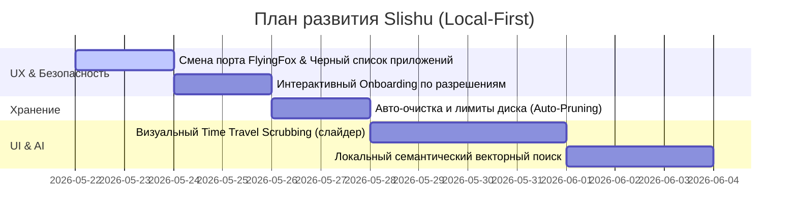

# Slishu: Стратегия развития и продуктовое видение (Local-First Capture)

Проект **Slishu** — это нативный, 100% локальный и приватный ассистент памяти для macOS. В отличие от других решений (например, Screenpipe), Slishu ориентирован исключительно на экосистему Apple, максимальную интеграцию с аппаратным обеспечением (Neural Engine, Metal, CoreImage) и абсолютную конфиденциальность (Offline-First).

---

## 🎨 Новый концепт иконки приложения

Для Slishu мы создали премиальный нативный дизайн иконки в стиле macOS (Big Sur / Sonoma). 

Идея дизайна: **Obsidian Acoustic Sphere** (Обсидиановая акустическая сфера).
* **Стеклянная сфера** символизирует визуальный захват экрана, линзу, отражение и кристальную чистоту собираемой информации.
* **Неоновые волны (фиолетовый и бирюзовый градиенты)**, обвивающие сферу, отражают улавливание звука (микрофон и системное аудио), визуализируя само название «Слышу».
* **Металлическая хромированная рамка-сквиркл** подчеркивает нативность для macOS, монолитность и премиальное качество.
* **Отсутствие облачных элементов**: никаких облаков, стрелок вверх/вниз или сторонних логотипов. Все процессы замкнуты внутри устройства.

> [!NOTE]
> Эту иконку мы можем экспортировать в `AppIcon.icns` и встроить прямо в ресурсы приложения для финальной полировки внешнего вида.

---

## 🛑 Что мешает прямо сейчас? (Архитектурные и UX барьеры)

При создании локального приложения такого типа есть несколько скрытых «подводных камней», которые могут ухудшить пользовательский опыт:

1. **Конфликт портов FlyingFox (`8080`):**
   * Порт `8080` — самый популярный порт для веб-разработки (React, Node.js, Python API). Если разработчик запустит Slishu, а затем запустит свой локальный проект, возникнет конфликт портов, и сервер упадет.
   * **Решение:** Пересадить встроенный сервер на специфический свободный порт (например, `11435` или `8088`), либо реализовать динамический поиск свободного порта с уведомлением в трее.

2. **Запутанный UX системных разрешений (Permissions):**
   * macOS требует три разных разрешения: *Screen Recording* (для ScreenCaptureKit), *Accessibility* (для AXUIElement) и *Microphone* (для AVAudioEngine).
   * Если пользователь не даст одно из них, Slishu будет работать частично (например, писать звук, но выдавать черный экран). Сейчас нет наглядного онбординга.
   * **Решение:** Добавить в SwiftUI интерактивный экран «Onboarding / Welcome Screen» с наглядными чекбоксами и кнопками «Открыть Системные настройки» для каждого разрешения.

3. **Сложность развертывания MCP-сервера:**
   * В конфигах Claude Desktop используется запуск через `curl -s -X POST -d @- http://localhost:8080/mcp`. Это рабочий хак, но он не выглядит профессионально и может приводить к задержкам.
   * **Решение:** Использовать стандартные потоки `stdin`/`stdout` через вспомогательную мини-утилиту командной строки (CLI helper) или научить основное приложение поддерживать запуск в режиме CLI (например, `Slishu.app/Contents/MacOS/Slishu --mcp`).

---

## ✨ Чего критически не хватает? (Продуктовый бэклог)

Чтобы сделать продукт по-настоящему выдающимся и полезным каждый день, необходимо реализовать следующий функционал:

### 1. Чёрный список приложений (Blacklist / Incognito)
* **Проблема:** Пользователи работают с паролями (1Password), банковскими приложениями или личными чатами (Telegram, Signal). Никто не хочет, чтобы конфиденциальные данные OCR-ились и сохранялись в базу данных, даже если она локальная.
* **Решение:** Добавить в настройки раздел «Исключенные приложения». Во время захвата кадра ScreenCaptureKit должен определять Bundle ID активного окна (`NSWorkspace.shared.frontmostApplication`) и, если оно в черном списке, полностью пропускать кадр и очищать буфер.

### 2. Умное управление дисковым пространством (Auto-Pruning)
* **Проблема:** Запись HEIC кадров каждые 2 секунды и 30-секундных CAF файлов быстро заполнит SSD (около 1.5–3 ГБ в день активной работы).
* **Решение:** 
  * Настройка «Срок хранения данных» (например, 7 дней, 30 дней, без ограничений).
  * Настройка «Максимальный размер хранилища» (например, не более 10 ГБ).
  * Фоновый таймер (раз в час), удаляющий старые записи медиа и каскадно очищающий SQLite строки в WAL-базе.

### 3. Интерактивный Скруббер Времени (Time Travel Scrubbing)
* **Проблема:** Текстовый поиск — это здорово, но память человека часто ассоциативна и визуальна («я помню, что читал какую-то статью вчера после обеда, там была красивая оранжевая картинка»).
* **Решение:** Создать в UI визуальный горизонтальный скруббер (таймлайн), позволяющий плавно перемещаться назад во времени. При перетаскивании ползунка на экране плавно (через View Transitions или CoreAnimation) сменяются HEIC-кадры вашего экрана, создавая эффект киноленты вашей жизни.

### 4. Локальный семантический поиск (Local Embeddings / Vector Search)
* **Проблема:** Обычный поиск по ключевым словам (FTS5) ищет точные совпадения («xcodebuild»). Если вы ищете «ошибки компиляции swift», а на экране было написано только «build failed», поиск ничего не найдет.
* **Решение:** Использовать встроенный фреймворк Apple **NaturalLanguage** (`NLEmbedding`) для генерации векторных представлений предложений OCR и аудио на Neural Engine. Это позволит делать локальный семантический поиск прямо на Mac без отправки байта данных в интернет!

### 5. Умная пауза захвата (Smart Capturing)
* **Проблема:** Бессмысленная трата батареи и диска, когда пользователь отошел от компьютера или смотрит YouTube/играет.
* **Решение:**
  * Авто-пауза при неактивности пользователя (отсутствие ввода клавиатуры/мыши более 3 минут через `CGEventSource.secondsSinceLastEventType`).
  * Пауза при блокировке экрана (`NSWorkspace.screensDidSleepNotification`).
  * Детекция полноэкранных игр или просмотра видео для снижения FPS захвата до 0.1 (1 кадр в 10 секунд).

---

## 🔮 Roadmap реализации

Если мы решим развивать проект дальше, идеальный план шагов выглядит так:

---

> **Идея на подумать:** Slishu может стать идеальным «Экзокортексом» для разработчиков, поскольку он полностью нативен для macOS. Он работает без тормозов, не греет процессор и хранит всё в супер-оптимизированной SQLite.
