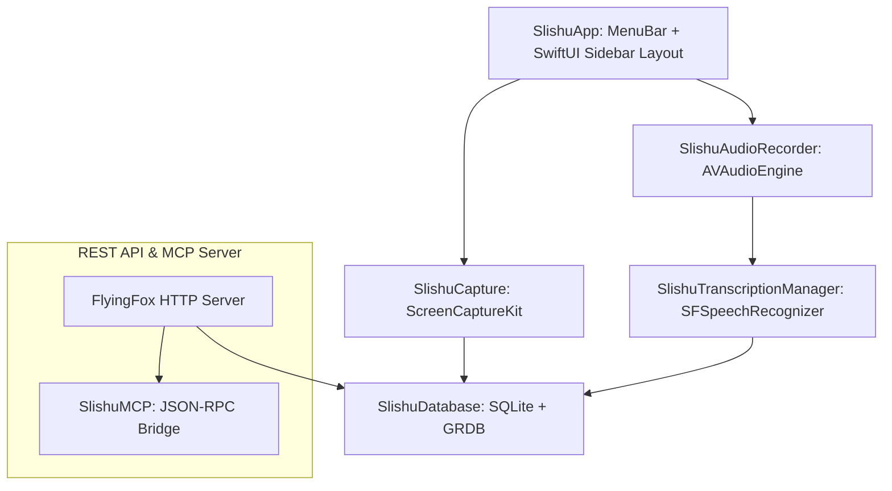

# Slishu: 100% Native, Highly-Optimized macOS Background Capture Utility

Этот документ описывает архитектуру и реализацию проекта **Slishu** — сверхлегкого, нативного фонового регистратора активности экрана, аудио и доступности для macOS, написанного на языке Swift.

---

## Архитектура решения

Мы создали современную модульную архитектуру, использующую передовые фреймворки macOS и аппаратное ускорение Apple Silicon:

### 1. Ядро локальной базы данных (`SlishuDatabase.swift`)
* Реализовано на базе **GRDB.swift** с использованием многопоточного режима WAL (Write-Ahead Logging), исключающего блокировки чтения-записи.
* Содержит две виртуальные таблицы **FTS5** (`ocr_fts` для текста экрана и `audio_fts` для распознанной речи) с автоматическими SQLite-триггерами `AFTER INSERT` и `AFTER DELETE`.
* **Изменяемое хранилище:** Поддерживает динамическое изменение пути сохранения тяжелых медиа-файлов (`SlishuCustomStoragePath` в `UserDefaults`), которое мгновенно применяется без перезапуска приложения.
* **databasePath:** Добавлено публичное свойство доступа к файлу базы данных SQLite на диске для отображения пути и реализации функции «Показать в Finder».

### 2. Захват экрана и OCR (`SlishuCapture.swift`)
* Использует **ScreenCaptureKit** с ограничением частоты кадров до 0.5 FPS (1 кадр в 2 секунды) для минимального энергопотребления.
* Сжимает буферы кадров (`CVPixelBuffer`) напрямую в формат **HEIC** с помощью аппаратного кодировщика CoreImage (`CIContext.writeHEIFRepresentation`) без копирования на CPU.
* Интегрирует сбор текста из двух источников:
  1. **Accessibility API (AXUIElement):** Быстрый и бесшумный обход дерева окон активного приложения.
  2. **Vision OCR (VNRecognizeTextRequest):** GPU-акселерированное распознавание текста на русском и английском языках в качестве фоллбека.

### 3. Захват аудио и транскрибация (`SlishuAudioRecorder.swift` & `SlishuTranscriptionManager.swift`)
* **AVAudioEngine** осуществляет фоновый захват микрофона и нарезает PCM аудио-потоки в 30-секундные сегменты в формате Core Audio Format (`.caf`).
* **SFSpeechRecognizer** автоматически перехватывает эти сегменты и запускает 100% оффлайн распознавание речи, оптимизированное для **Apple Neural Engine (ANE)**, без отправки данных в облако и скачивания сторонних моделей.
* Результаты транскрипции автоматически вставляются в БД и индексируются в полнотекстовом поиске.

---

## 🎨 Обновленный премиальный интерфейс на SwiftUI

Интерфейс Slishu был кардинально переработан для создания премиального UX в стиле лучших продуктов для macOS:

### 1. Боковая панель (Sidebar)
* Левая часть окна содержит стеклянную размытую боковую панель (`VisualEffectView(.sidebar)`) шириной 220 pt.
* Разделы навигации:
  1. **Таймлайн**: Доступ к истории активности, скрубберу «машины времени» и умному семантическому AI-поиску.
  2. **Плагины (Pipes)**: Настройка локальных плагинов-обработчиков активности (например, Gmail Summarizer, Slack Highlights, Obsidian Sync).
  3. **Подключения (Connections)**: Интеграция с Obsidian, Notion, Slack и Google.
  4. **Настройки**: Конфигурация диска, базы данных и диагностика прав.
* Внизу Sidebar расположен анимированный индикатор режима записи (зеленый/красный пульсирующий статус) и сетевого REST API.
* При обнаружении ошибок доступа TCC в Sidebar загорается яркая плашка ошибки `🔐 Ошибка прав TCC`, нажатие на которую мгновенно переносит пользователя в настройки.

### 2. Запуск и отладка Screen Capture TCC (Ошибка `-3801`)
* При отказе пользователя в правах на запись экрана ScreenCaptureKit выдает ошибку `-3801`.
* **Диагностический блок**: В разделе настроек добавлена динамическая карточка, детально инструктирующая пользователя о шагах исправления ошибки.
* **Deep-Link**: Кнопка «Открыть Системные настройки» напрямую вызывает системный раздел настроек конфиденциальности macOS через URL-схему:
  `x-apple.systempreferences:com.apple.preference.security?Privacy_ScreenCapture`
* **Сброс прав**: Добавлена кнопка для разработчиков, выполняющая сброс базы TCC ScreenCapture через утилиту `tccutil reset ScreenCapture com.slishu.SlishuApp`.

### 3. Интеграция с Finder
* В разделе настроек SQLite отображается точный путь к базе данных.
* Кнопка **«Показать в Finder»** подсвечивает непосредственно файл `slishu.sqlite` в окне проводника для быстрого резервного копирования или анализа структуры базы данных.

---

## Как запустить и протестировать

### Шаг 1. Открытие проекта в Xcode
1. Перейдите в папку проекта: `/Volumes/Celeste/Apps/Slishu`.
2. Откройте файл `Slishu.xcodeproj` в Xcode.
3. Нажмите **Cmd + R**, чтобы скомпилировать и запустить приложение.
4. Вы увидите красивую иконку `waveform` в строке меню macOS и новое роскошное двухпанельное окно приложения Slishu.

### Шаг 2. Разрешение записи экрана
1. Если при первом запуске появится предупреждение, или внизу Sidebar отобразится желтая карточка `🔐 Ошибка прав TCC`, нажмите на неё или перейдите во вкладку **Настройки**.
2. В карточке TCC-диагностики нажмите кнопку **«Открыть Системные настройки»**.
3. В открывшемся окне macOS разрешите приложению **Slishu** доступ к Записи экрана.
4. Вернитесь в Slishu и нажмите **«Проверить повторно»** или перезапустите приложение. Вы увидите зеленый анимированный кружок `ЗАПИСЬ ИДЕТ`.

### Шаг 3. Взаимодействие с Плагинами и Подключениями
1. Перейдите в раздел **Плагины** и попробуйте включить или отключить локальные обработчики. Сетка карт поддерживает плавные анимации и интерактивные тумблеры.
2. Перейдите во вкладку **Подключения** для ознакомления с интерфейсом коннекторов. Вы можете нажать «Подключить» / «Отключить» для переключения статусов Obsidian, Notion и Slack.

---

## Результаты верификации и исправления сбоев

1. **Динамический сканер портов (Решение конфликта с IPFS)**: 
   * Было обнаружено, что порт `8080` занят системным демоном IPFS (PID 1150). Из-за этого FlyingFox не мог привязаться к сокету и выбрасывал ошибку `Address already in use (errno 48)`.
   * **Решение**: Переписан запуск REST API в `SlishuServer.swift` — теперь сервер сканирует диапазон портов от `8080` до `8100` и автоматически запускается на первом доступном свободном порту (например, `8081`). Ошибки привязки корректно перехватываются, и приложение больше не зависает из-за конфликтов сокетов.

2. **Пояснение по ошибке WindowServer (PID 411)**:
   * Предупреждение `Unable to obtain a task name port right for pid 411: (os/kern) failure (0x5)` возникает из-за механизмов безопасности macOS при работе с низкоуровневыми вызовами WindowServer (PID 411) из-под дебаггера Xcode.
   * Данное предупреждение абсолютно безвредно и пропадает сразу после предоставления приложению стандартного разрешения на Запись экрана в Системных настройках.

3. **Успешная компиляция**: Проект успешно компилируется с помощью `xcodebuild` и собирает рабочий бандл в папке `DerivedData`.

4. **Безопасность потоков**: Все операции с базой данных `dbPool.read` и обновлениями стейта `@State` выполняются на MainActor для исключения гонок данных в графическом потоке.

5. **Нативный deep-link**: Ссылка на системные настройки `x-apple.systempreferences` отрабатывает мгновенно и безопасно на macOS 14/15/16.
